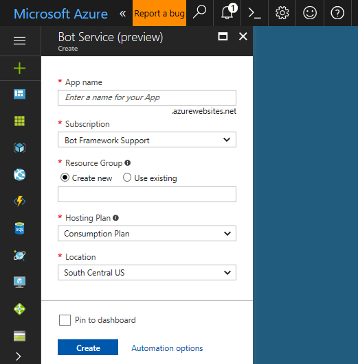
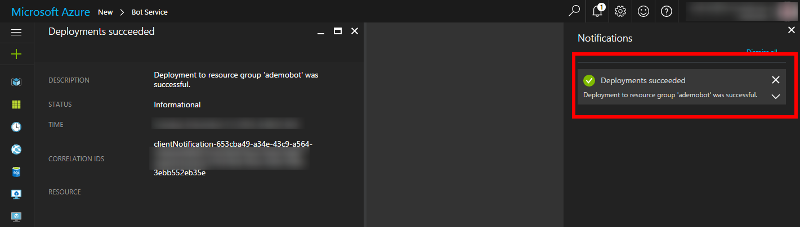
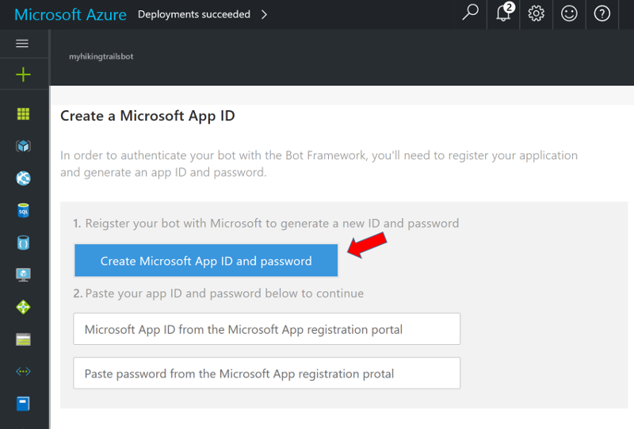
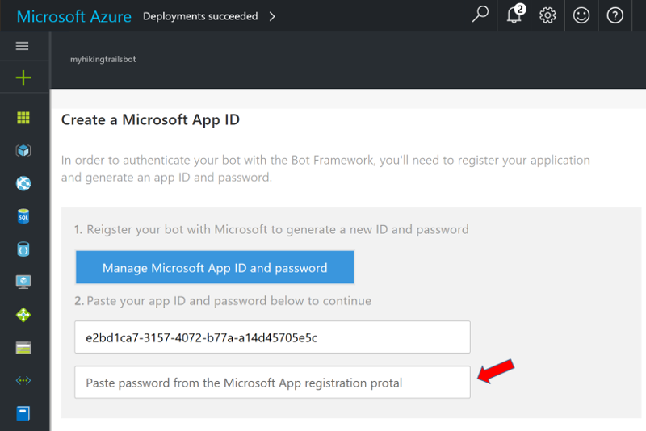
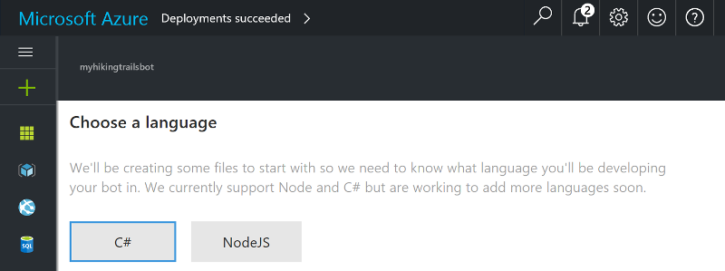
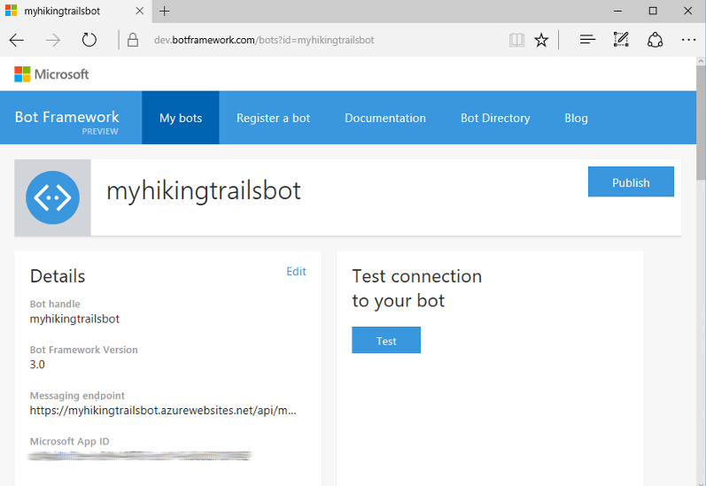
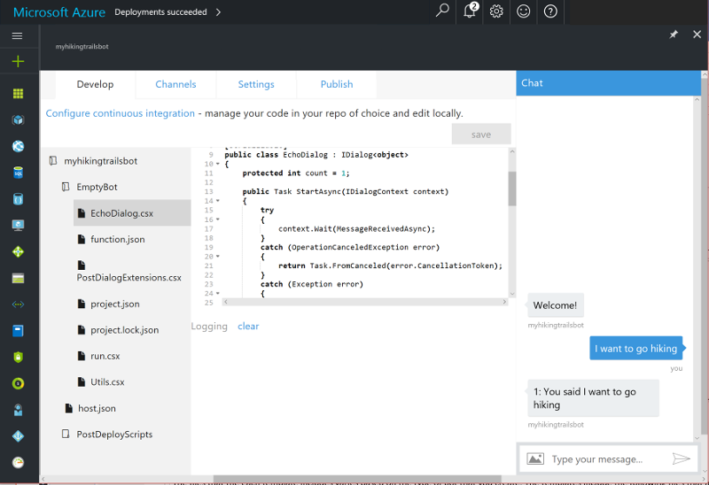

# 用Azure Bot Service創建一個機器人
> [!div class="op_single_selector"]
> - [.NET](./dotnet/bot-builder-dotnet-quickstart.md)
> - [Node.js](./nodejs/bot-builder-nodejs-quickstart.md)
> - [Azure Bot Service](azure-bot-service-quickstart.md)
> - [REST](rest-api/bot-framework-rest-connector-quickstart.md)

Azure Bot Service 的集成環境，可以加速開發機器人的過程， 
從預設五個模板選一個進行開發設計在發佈到虛擬主機中。 
本教程將引導您使用Azure Bot Service創建和測試機器人的過程。

## 先決條件

您必須使用Microsoft Azure訂閱，然後才能使用Azure Bot Service。 
如果你尚未訂閱，你可以在此註冊 <a href="https://azure.microsoft.com/en-us/free/" target="_blank">免費試用</a>.

## 建立你的機器人

要通過使用Azure Bot服務來創建機器人，
登入 <a href="https://portal.azure.com" target="_blank">Azure</a> ， 並遵循下列步驟。

### 建立新的bot服務

1. 選擇 menu 選單的 **New**。 

2. 在 **New** 欄中， 導覽至 Data + Analytics category，並選擇 **Bot Service**。 

3. 在 Bot Service blade 中，提供所需的資訊，點擊 **Create** 來建立機器人服務並部署到雲端。 

    - 設置 **App name** 為你的機器人命名。 此名稱將用來作為你的 Bot 的子網域 (例如： *mybasicbot*.azurewebsites.net)。 
    - 選擇要使用的訂閱。
    - 選擇 <a href="https://azure.microsoft.com/en-us/documentation/articles/resource-group-overview/" target="_blank">資源群組</a>, [部署方案](azure-bot-service-hosting-plan.md)， 及 <a href="https://azure.microsoft.com/en-us/regions/" target="_blank">位置</a>。   

    

4. 確認已經部署了機器人服務。
    - 點選 **Notifications** (位於Azure Portal 頂部的鈴鐺圖標)。 通知將會由 **Deployment started** 轉變為 **Deployment succeeded**。 
    - 當通知變換為 **Deployment succeeded**， 點選該通知.  
    

### 建立應用程式 ID 及金鑰

接下來，為您的機器人創建一個應用程序ID和金鑰，以便它能夠使用Bot框架進行身份驗證。

1. 點選 **Create Microsoft App ID and password**.  

      

2. 將會開啟新頁面，點選 **Generate an app password to continue**。

3. 顯示後複製並確定儲存金鑰，點選 **Ok**.

4. 點選 **Finish and go back to Bot Framework**.

5. 回到 Azure Portal，確定 **app ID** 欄已經自動填入，貼上在先前複製的金鑰 (在步驟3) 在金鑰欄中。
> [!TIP]
> 如果 **app ID** 欄並未自動填入，你可以找回他在 
> <a href="https://apps.dev.microsoft.com" target="_blank">Microsoft Application Registration Portal</a> 
> 從應用程序的註冊設置複製應用程序ID。

      

### 選擇您的編程語言 

選擇您要用於開發機器人的編程語言。  

  

### 選擇模板並建立機器人

選擇要用作開發機器人的起點的模板。 
在本教程中，使用 **Basic** 模板 。

  

然後，點選 **Create bot** 將會根據您選擇的編程語言和模板創建機器人。

> [!IMPORTANT]
> 當您點擊 **創建機器人** 後，可能會有一個輕微的延遲，系統將在背景為你建立機器人。 *請勿* 再次點選 **Create bot** 。等候頁面重新出現。

當機器人服務完成生成機器人時，Azure 編輯器將包含機器人的源文件。
在這時，機器人已經被創建，使用 Bot Framework，部署到雲端，並具備完整功能。
當你登入 <a href="https://dev.botframework.com" target="_blank">Bot Framework Portal</a>，
你將看到你的機器人位於 **My bots** 下。 
恭喜！ 您已經通過使用Azure Bot服務成功創建了機器人！

## 測試你的機器人

現在，您的機器人在雲端中運行，通過在Azure代碼編輯器右側的內置聊天視窗中輸入一些消息來嘗試。
你將會看到機器人回應你發送的每條消息，重複你的訊息前方加上的 *You said*。 

  

## 更改你的Web app bot部署

如果您選擇App Service計劃，請按照以下步驟修改 bot 文件並重新部署更改。

1. 在 Azure 中， 選擇 Bot 的 **BUILD** ，然後點選 **Open online code editor**.
2. 打開 Dialogs 文件夾， 點選 `EchoDialog.cs`。
3. 更改 line 22 從 `You said` 替換為 `You just said`。
4. 要部署更改的源，請單擊打開控制台圖標。
    
2. 在控制台窗口中，輸入 **build.cmd** ，然後按確定鍵。

控制台窗口顯示部署的進度，直到完成。

  
> [!NOTE]
> 在線編輯器中修改源文件時，儲存後將會自動部署。

## 下一步

在本教程中，您使用Azure Bot Service創建了一個簡單的機器人，並通過在Azure中的內置的聊天視窗來測試機器人的功能。 
此時，您可能希望為您的機器人[添加更多功能](bot-design-principles.md)或設置[持續部署](azure-bot-service-continuous-deployment.md)。
您還可以配置您的機器人在一個或多個平台上運行，並發布您的機器人，而不用離開Azure Portal。
