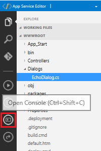
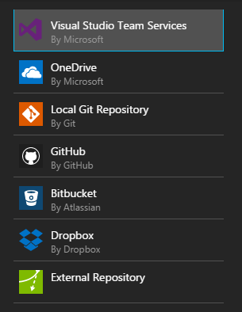

# Publish a bot to Azure Bot Service

After you update your C# bot source code, you can publish it into a running bot in Azure Bot Service using Visual Studio. You can also publish either C# or Node.js bot source code written in any integrated development environment (IDE) automatically each time you check a source file into a source control service.

## Publish a bot on App Service plan from the online code editor

If you have not configured continuous deployment, you can modify your source files in the online code editor. To deploy your modified source, follow these steps.

4. Click the Open Console icon.  
    
2. In the Console window, type **deploy.cmd**, and press the enter key.

## Publish C# bot on App Service plan from Visual Studio 

To set up publishing from Visual Studio using the `.PublishSettings` file, perform the following steps:

1. In the Azure Portal, click your Bot Service, click the **BUILD** tab, and click **Download zip file**.
3. Extract the contents of the downloaded zip file to a local folder.
4. In Explorer, find the Visual Studio Solution (.sln) file for your bot, and double-click it.
4. In Visual Studio, click **View**, and click **Solution Explorer**.
5. In the Solution Explorer pane, right-click your project, and click **Publish...** The Publish window opens. 
6. In the Publish window, click **Create new profile**, click **Import profile**, and click **OK**.
7. Navigate to your project folder, navigate to the **PostDeployScripts** folder, select the file that ends in `.PublishSettings`, and click **Open**.

You have now configured publishing for this project. To publish your local source code to Azure Bot Service, right-click your project, click **Publish...**, and click the **Publish** button. 

## Set up continuous deployment

By default, Azure Bot Service enables you to develop your bot directly in the browser using the Azure editor, without any need for a local editor or source control. However, Azure editor does not allow you to manage files within your application (e.g., add files, rename files, or delete files). If you want the ability to manage files within your application, you can set up continuous deployment and use the integrated development environment (IDE) and source control system of your choice (e.g., Visual Studio Team, GitHub, Bitbucket). With continuous deployment configured, any code changes that you commit to source control will automatically be deployed to Azure. After you configure continuous deployment, you can [debug your bot locally](azure-bot-service-debug-bot.md).

> [!NOTE]
> If you enable continuous deployment for your bot, you must check in code changes to your source control service. If you want to edit your code in Azure editor once again, 
> you must [disable continuous deployment](#disable-continuous-deployment).

You can enable continuous deployment for your bot app by completing the following steps.

## Set up continuous deployment for a bot on an App Service plan

This section describes how to enable continuous deployment for a bot that you created using Azure Bot Service that has an App Service hosting plan.

1. Within the Azure Portal, find your Azure bot, click the **BUILD** tab and find the **Continuous deployment from source control** section.
2. For Visual Studio Online or GitHub, provide an access token issued to you on those web sites. Your source will be pulled from Azure into your source repository.
3. For other source control systems, select **other** and follow the steps that appear. 
3. Click **Enable**.  

### Create an empty repository and download bot source code

Follow these steps if you want to use a source control service *other than* Visual Studio Online or Github. Visual Studio Online and Github will pull the source code for your bot from Azure, so users of those two services can skip these steps.

3. For a bot on an App Service plan, find your bot page on Azure, click the **BUILD** tab, find the **Download source code** section, and click **Download zip file**.
1. Create an empty repository within one of the source control systems that Azure supports.

    

3. Extract the contents of the downloaded zip file to the local folder where you are planning to sync your deployment source.
4. Click **Configure** and follow the steps that appear. 

## Set up continuous deployment for a bot on a consumption plan 

Choose the deployment source for your bot and connect your repository. 

1. Within the Azure Poral, in your Azure bot, click the **SETTINGS** tab and click **Configure** to expand the **Continuous deployment** section.  
2. Follow the steps and click the checkbox to confirm you're ready. 
3. Click **Configure**, select the deployment source that corresponds to the source control system where you previously created the empty repository, and complete the steps to connect it.   

## Disable continuous deployment 

When you disable continuous deployment, your source control service continues functioning, but changes you check in are not automatically published to Azure. To disable continuous deployment, perform the following steps:

1. If your bot has an App Service hosting plan, within the Azure Portal, find your Azure bot, click the **BUILD** tab and find the **Continuous deployment from source control** section, *or...* 
2. if your bot has a consumption plan, click the **Settings** tab, expand the **Continuous deployment** section, and click **Configure**.
3. In the **Deployments** pane, select the source control service where continuous deployment is enabled, and click **Disconnect**.  

## Additional resources

To learn how to debug your bot locally after you have configured continuous deployment, see 
[Debug an Azure Bot Service bot](azure-bot-service-debug-bot.md).

This article has highlighted the specific continuous deployment features of Azure Bot Service. For information about continuous deployment as it relates to Azure App Services, see <a href="https://azure.microsoft.com/en-us/documentation/articles/app-service-continuous-deployment/" target="_blank">Continuous Deployment to Azure App Service</a>.
