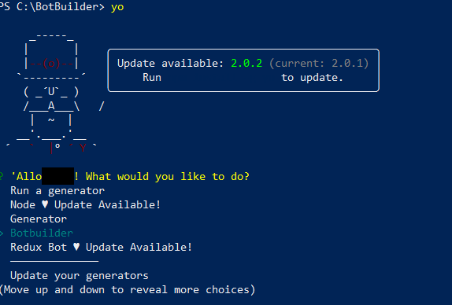
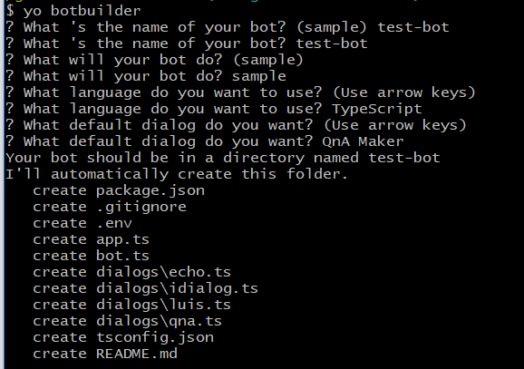
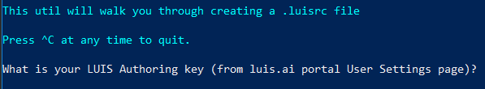
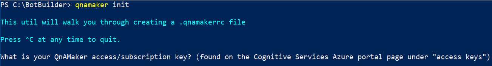

# Create bots with Botbuilder Templates

Templates are now available to create bots in each of the Botbuilder SDK platforms: 

- Node.js
- Python
- Java
- .NET

## Prerequisites

The Node.js, Java and Python templates all create a simple echo bot, and are all made available through [Yeoman](http://yeoman.io/).

- [Node.js](https://nodejs.org/en/) v 8.5 or greater
- [Yeoman](http://yeoman.io/)

If you haven't already installed Yeoman, it needs to be installed globally.

```shell
npm install -g yo
```

## Node.js, Python, Java templates
From the command line, cd into a new folder of your choosing. There are two available versions of the Botbuilder Node.js templates, targetting the **v3** and **v4** versions of the SDK respectively. The Python and Java templates are only available in v4. 

To install the **Node.js v3 Botbuilder** template generator:

```shell
npm install generator-botbuilder
```

To install the **Node.js v4 Botbuilder** template generator:
```shell
npm install generator-botbuilder@preview
```

The Python and Java templates are **only available in v4**. 

For **Python**:
```shell
npm install generator-botbuilder-python
```

For **Java**:
```shell
npm install generator-botbuilder-java
```

After a generator is installed, you can simply run the **yo** command in your CLI to view a list of generators available in Yeoman.



Switch to a working directory of your choice, and select the generator to use. You will be prompted for various options to create your bot, such as name and description. When all prompts are completed, your echo bot template will be created in the same working folder.




## .NET

Two templates are available for .NET, targetting the **v3** and **v4** versions of the SDK respectively. Both are available as [VSIX](https://docs.microsoft.com/en-us/visualstudio/extensibility/anatomy-of-a-vsix-package) packages,  to download click one of the following links on the [Visual Studio Marketplace](https://marketplace.visualstudio.com/).

- [BotBuilder V3 Template](https://marketplace.visualstudio.com/items?itemName=BotBuilder.BotBuilderV3)
- [BotBuilder V4 Template](https://aka.ms/Ylcwxk)

#### Prerequisites

- [Visual Studio 2015 or greater](https://www.visualstudio.com/downloads/)
- [Azure account](https://azure.microsoft.com/en-us/free/)

### Install the templates

From the saved directory, simply open the VSIX package and the bot builder template will be installed to Visual Studio and made available the next time you open it.


To create a new bot project using the template, simply open Visual Studio, and select **File** > **new** > **Project**, and from Visual C#, select **Bot Framework** > Simple Echo Bot Application. This will create a new echo bot project locally which you can edit as you wish. 


## Store your bot information with MSBot

The new [MSBot](https://github.com/Microsoft/botbuilder-tools/tree/master/MSBot) tool allows you to create a **.bot** file, which stores metadata about different services your bot consumes, all in one location. This file also enables your bot to connect to these services from the CLI. The tool is available as an npm module, to install it run:

```shell
npm install -g msbot 
```

To create a bot file, from your CLI enter **msbot init** followed by the name of your bot, and the target URL endpoint, for example:

```shell
msbot init --name TestBot --endpoint http://localhost:9499/api/messages
```
To connect your bot to a service, in your CLI enter **msbot connect** followed by the appropriate service:

```shell
msbot connect [Service]
```

| Service | Description |
| ------ | ----------- |
| azure  |connect your bot to an Azure Bot Service registration|
|localhost| connect your bot to a localhost endpoint|
|luis     | connect your bot to a LUIS application |
| qna     |connect your bot to a QnA Knowledgebase|
|help [cmd]  |display help for [cmd]|

### Connect your bot to ABS with the .bot file

With the MSBot tool installed, you can easily connect your bot to an existing resource group in the Azure Bot Service by running the az bot **show** command. 

```azurecli
az bot show -n <botname> -g <resourcegroup> --msbot | msbot connect azure --stdin
```

This will take the current endpoint, MSA appID and password from the target resource group, and update the information accordingly in your .bot file. 


## Manage, Update or Create LUIS and QnA services with  new botbuilder-tools

[Bot builder tools](https://github.com/microsoft/botbuilder-tools) is a new toolset which allows you to manage and interact with your bot resources directly from the command line. 

>[!TIP]
> Every bot builder tool includes a global help command, accessible from the command line by entering **-h** or **--help**. This command is available at any time from any action, which will provide a helpful display of the options available to you along with their descriptions 

### LUDown
[LUDown](https://github.com/Microsoft/botbuilder-tools/tree/master/ludown) allows you to describe and create powerful language components for bots using **.lu** files. The new .lu file is a type of markdown format which the LUDown tool consumes and outputs .json files specific to the target service. Currently, you can use .lu files to create a new [LUIS](https://docs.microsoft.com/en-us/azure/cognitive-services/luis/luis-get-started-create-app) application or [QnA](https://qnamaker.ai/Documentation/CreateKb) knowledge base, using different formats for each. LUDown is available as an npm module, and can be used by installing globally to your machine:

```shell
npm install -g ludown
```
The LUDown tool can be used to create new .json models for both LUIS and QnA.  


### Creating a LUIS application with LUDown

You can define [intents](https://docs.microsoft.com/en-us/azure/cognitive-services/luis/add-intents) and [entities](https://docs.microsoft.com/en-us/azure/cognitive-services/luis/add-entities) for a LUIS application just like you would from the LUIS portal. 

'#\<intent-name\>' describes a new intent definition section. Each line afterwards lists the [utterances](https://docs.microsoft.com/en-us/azure/cognitive-services/luis/add-example-utterances) which describe that intent.

For example, you can create multiple LUIS intents in a single .lu file as follows: 

```LUDown
# Greeting
- Hi
- Hello
- Good morning
- Good evening

# Help
- help
- I need help
- please help
```

### QnA pairs with LUDown

The .lu file format supports also QnA pairs using the following notation: 

```LUDown
> comment
### ? question ?
  ```markdown
    answer
  ```

The LUDown tool will automatically separate question and answers into a qnamaker JSON file that you can then use to create your new [QnaMaker.ai](http://qnamaker.ai) knowledge base.

```LUDown
### ? How do I change the default message for QnA Maker?
  ```markdown
  You can change the default message if you use the QnAMakerDialog. 
  See [this link](https://docs.botframework.com/en-us/azure-bot-service/templates/qnamaker/#navtitle) for details. 
  ```

You can also add multiple questions to the same answer by simply adding new lines of variations of questions for a single answer. 

```LUDown
### ? What is your name?
- What should I call you?
  ```markdown
    I'm the echoBot! Nice to meet you.
  ```

### Generating .json models with LUDown

After you've defined LUIS or QnA language components in the .lu format, you can publish out to a LUIS .json, QnA .json, or QnA .tsv file. When run, the LUDown tool will look for any .lu files within the same working directory to parse. Since the LUDown tool can target both LUIS or QnA with .lu files, we simply need to specify which language service to generate for, using the general command **ludown parse <Service> -- in <luFile>**. 

In our sample working directory, we have two .lu files to parse, '1.lu' to create LUIS model, and 'qna1.lu' to create a QnA knowledge base.

#### Generate LUIS .json models

To generate a LUIS model using LUDown, in your current working directory simply enter the following:

```shell
ludown parse ToLuis --in <luFile> 
```

#### Generate QnA Knowledge Base .json

Similarly, to create a QnA knowledge base, you only need to change the parse target. 

```shell
ludown parse ToQna --in <luFile> 
```

The resulting JSON files can be consumed by LUIS and QnA either through their respective portals, or via the new CLI tools. 

## Connect to LUIS an QnA maker services from the CLI

### Connect to LUIS from the CLI 

Included in the new tool set is a [LUIS extension](https://github.com/Microsoft/botbuilder-tools/tree/master/LUIS) which allows you to independently manage your LUIS resources. It is available as an npm module which you can download:

```shell
npm install -g luis-apis
```
The basic command usage for the LUIS tool from the CLI is:

```shell
luis <action> <resource> <args...>
```
To connect your bot to LUIS, you will need to create a **.luisrc** file. This is a configuration file which provisions your LUIS appID and password to the service endpoint when your application makes outbound calls. You can create this file by running **luis init** as follows:

```shell
luis init
```
You will be prompted in the terminal to enter your LUIS authoring key, region, and appID before the tool will generate the file.  

 


Once this file is generated, your application will be able to consume the LUIS .json file (generated from LUDown) using the following command from the CLI.

```shell
luis import application --in luis-app.json | msbot connect luis --stdin
```

### Connect to QnA from the CLI

Included in the new tool set is a [QnA extension](https://github.com/Microsoft/botbuilder-tools/tree/master/QnAMaker) which allows you to independently manage your LUIS resources. It is available as an npm module which you can download.

```shell
npm install -g qnamaker
```
With the QnA maker tool, you can create, update, publish, delete, and train your knowledge base. To get started, you need to create a **.qnamakerrc** file is required to enable the endpoint to your service. You can easily create this file by running **qnamaker init** and following the prompts and provision your QnA Maker knowledge base ID. 

```shell
qnamaker init 
```


Once your .qnamakerrc file is generated, you can now connect to your QnA knowledge base to consume the knowledge base .json/.tsv file (generated from LUDown) using the following command.

```shell
qnamaker create --in qnaKB.json --msbot | msbot connect qna --stdin
```

## References
- [BotBuilder Tools Source Code](https://github.com/Microsoft/botbuilder-tools)
- [MSBot](https://github.com/Microsoft/botbuilder-tools/tree/master/MSBot)
- [ChatDown](https://github.com/Microsoft/botbuilder-tools/tree/master/Chatdown)
- [LUDown](https://github.com/Microsoft/botbuilder-tools/tree/master/ludown)
- [Azure CLI](https://docs.microsoft.com/en-us/cli/azure/install-azure-cli?view=azure-cli-latest)
