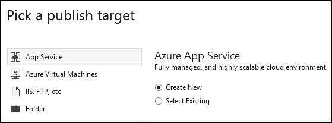
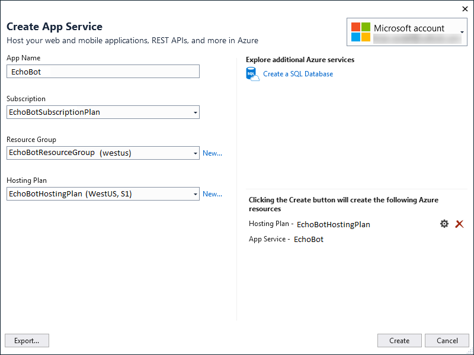
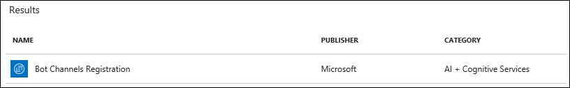
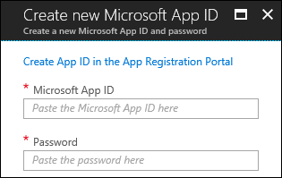
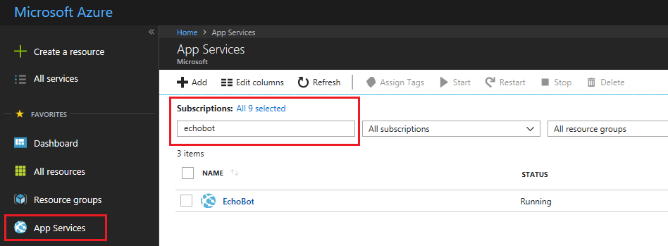
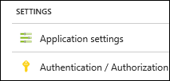
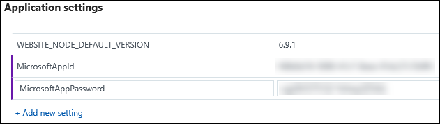
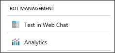

# Deploy your bot to Azure

[!INCLUDE [pre-release-label](./includes/pre-release-label-v3.md)]

Once you have created your bot and verified it locally, you can push it to Azure to make it accessible from anywhere. To do so, you will first deploy the bot to Azure in an App Service then you’ll configure your bot with the Azure Bot Service using the Bot Channels Registration item.

## Publish from Visual Studio

Use Visual Studio to create your resources in Azure and publish your code.

In the Solution Explorer window, right click on your project’s node and select Publish.

2. In the Pick a publish target dialog, ensure **App Service** is selected on the left and **Create New** is selected on the right.

3. Click the Publish button.

4. In upper right of the dialog, ensure the dialog is showing the correct user ID for your Azure subscription.

5. Enter App Name, Subscription, Resource Group, and Hosting Plan information.

6. When ready, click Create. It can take a few minutes to complete the process.

7. Once complete, a web browser will open showing your bot’s public URL.

8. Make a copy of this URL (it will be something like https://<yourbotname>.azurewebsites.net/).

> [!NOTE] 
> You’ll need to use the HTTPS version of the URL when registering your bot. Azure provides SSL support with Azure App Service.

## Create your bot channels registration
With your bot deployed in Azure you need to register it with the Azure Bot Service.

1. Access the Azure Portal at https://portal.azure.com.

2. Log in using the same identity you used earlier from Visual Studio to publish your bot.

3. Click Create a resource.

4. In the Search the Marketplace field type Bot Channels Registration and press Enter.

5. In the returned list, choose Bot Channels Registration:

6. Click create in the blade that opens.

7. Provide a Name for your bot.

8. Choose the same Subscription where you deployed your bot’s code.

9. Pick your existing Resource group which will set the location.

10. You can choose the F0 Pricing tier for development and testing.

11. Enter your bot’s URL. Make sure you start with HTTPS and that you add the /api/messages For example
https://yourbotname.azurewebsites.net/api/messages

12. Turn off Application Insights for now.

13. Click the Microsoft App ID and password

14. In the new blade click Create New.

15. In the new blade that opens to the right, click the "Create App ID in the App Registration Portal" which will open in a new browser tab.

16. In the new tab, make a copy of the App ID and save it somewhere. 

17. Click the Generate an app password to continue button.

18. A browser dialog opens and provides you with your app’s password, which will be the only time you get it. Copy and save this password somewhere you can get to later.

19. Click OK once you’ve got the password saved.

20. Just close the browser tab and return to the Azure Portal tab.

21. Paste in your App ID and Password in the correct fields and click OK.

22. Now click Create to set up your channel registration. This can take a few seconds to a few minutes.

## Update your bot’s Application Settings
In order for your bot to authenticate with the Azure Bot Service, you need to add two settings to your Bot’s Application Settings in Azure App Service. 

1. Click App Services. Type your bot’s name in the Subscriptions text box. Then click on your bot's name in the list.

2. In the list of options on the left within your bot's options, locate Application Settings in the Settings section and click it.

3. Scroll until you find the Application settings section.

4. Click Add new setting.

5. Type **MicrosoftAppId** for the name and your App ID for the value.

6. Click Add new setting

7. Type **MicrosoftAppPassword** for the name and your password for the value.

8. Click the Save button up top.

## Test Your Bot in Production
At this point, you can test your bot from Azure using the built-in Web Chat client.

1. Go back to your Resource group in the portal

2. Open your bot registration.

3. Under Bot management, select Test in Web Chat.

4. Type a message like `Hi` and press Enter. The bot will echo back `Turn 1: You sent Hi`.

