# Debug your bot

The Azure Bot Service bots are built on Azure. Even though your bot’s code starts out in Azure, you’ll typically set up continuous integration to work with the code locally in your favorite tool chain. This article demonstrates how to debug your bot locally after setting up continuous integration.

## Debug Node.js bots

First, you need to set up your environment. You’ll need:
- A local copy of your Azure Bot Service code for  [continuous integration](bot-framework-azure-continuous-integration.md))
- The <a href="https://docs.botframework.com/en-us/downloads/" target="_blank">Bot Framework Emulator</a> for Mac, Linux, or Windows</a>
- Node or other code editor such as <a href="https://code.visualstudio.com/" target="_blank">Mac, Linux, Windows</a>Visual Studio Code for  for Mac, Linux, or Windows

After setting up your environment, the simplest way to run the bot locally is to start your bot in Node, and then connect to it from Bot Framework Emulator. 

First, set the NODE_ENV environment variable. This Node terminal window example shows how you would set the environment variable and start running the bot on a Mac.

At this point, the bot is running locally. Copy the endpoint that the bot is running on (in this example, **http://localhost:3978/api/messages**), start the framework’s emulator, and then paste the endpoint into the address bar as shown below.

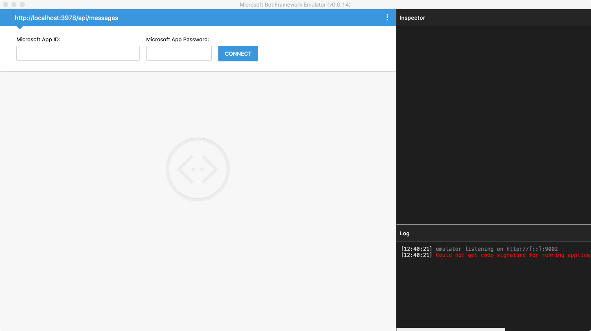

You can leave the `Microsoft App Id` and `Microsoft App Password` fields blank because you don’t need security for local debugging. Click **Connect** and start playing with the bot by typing a message to your bot in the lower left corner.

You can use the emulator’s **Log** and the **Inspector** windows on the right to get a detailed understanding of the message traffic. You can also see the logs from the Node runtime in the terminal window.

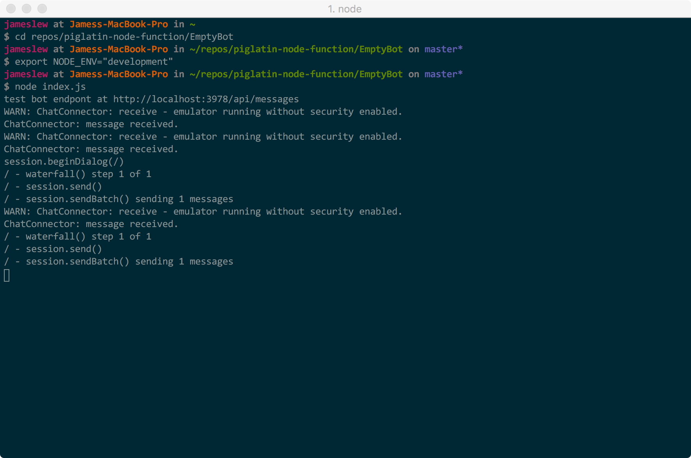

## Debug Node.js bots using Visual Studio Code

If you need more than visual inspection and logs to diagnose your bot, you can use a local debugger such as Visual Studio Code. All of the steps are the same, but instead of running the Node runtime, you’ll start the Visual Studio Code debugger.

Visual Studio Code allows you to make changes locally within the editor while debugging. When you’re using Azure Bot Service with continuous integration turned on, when you update the repo, your bot in the cloud will automatically pick up and start showing your changes. 

To get started, in Visual Studio Code, open the folder your repo is in.

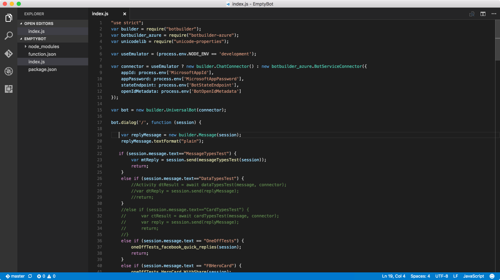

Switch to the debugging view, and then click **Go**. The first time it will ask you to pick a runtime engine to run your code (this example uses Node).

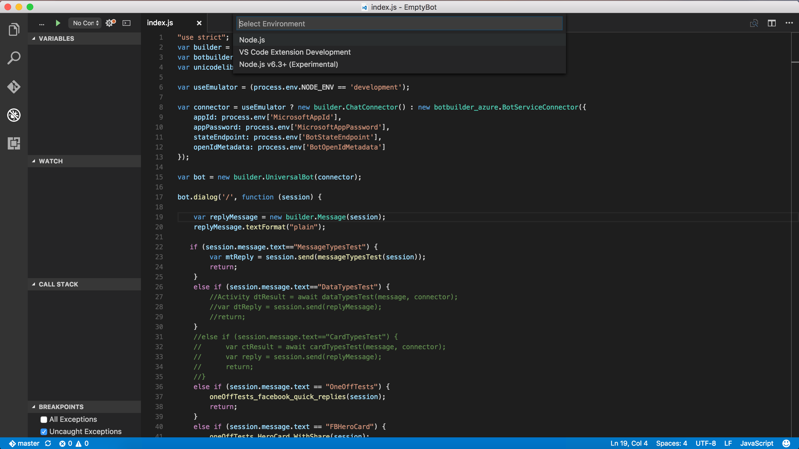

Next, depending on whether you’ve synced the repo or changed any of it, you may be prompted to configure **launch.json**. If you do, you’ll need to add code to **launch.json**, which tells the template to work with the emulator.

[!code-JavaScript[emulator](../includes/code/azure-bot-debug.js#emulator)]

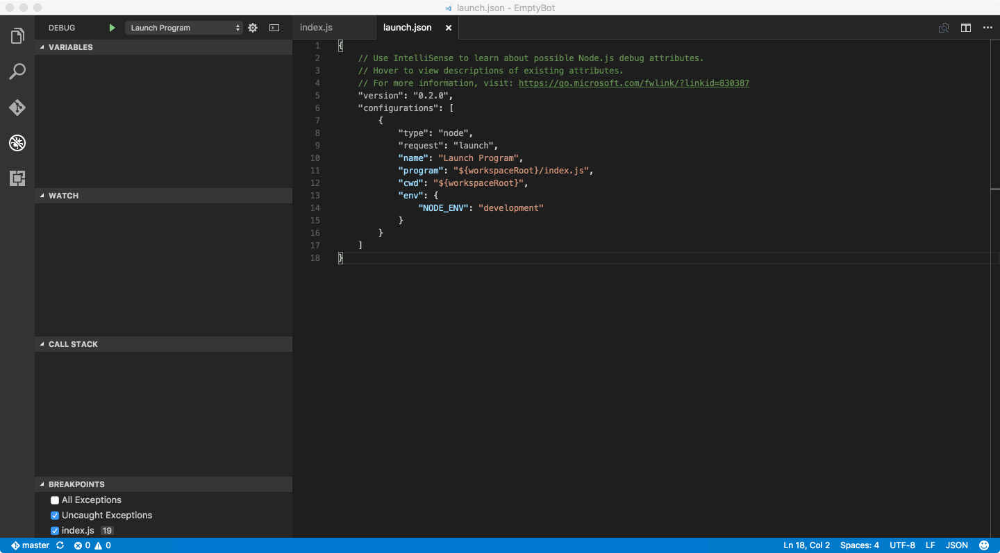

Save your changes to **launch.json** and then click **Go** again. Your bot should now be running in the Visual Studio Code environment with Node. You can open the debug console to see logging output and set breakpoints as needed.

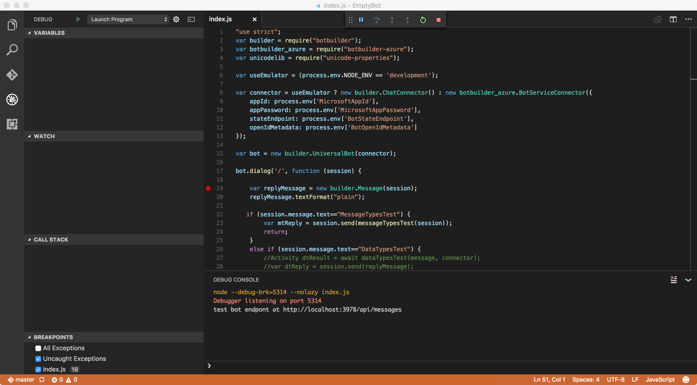

To interact with the bot, use the framework’s emulator again. Copy the endpoint from the debug console in Visual Studio Code and connect to it in the emulator. Start chatting with your bot and you will start hitting your breakpoints.

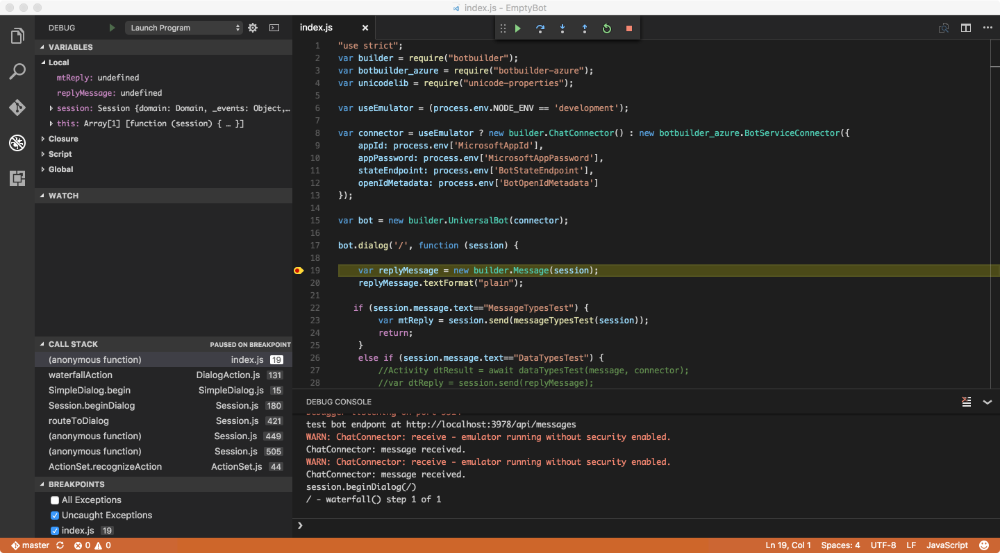

## Debugging C&#35; bots built using the Azure Bot Service on Windows

The C# environment in Azure Bot Service has more in common with Node.js than a typical C# app because it requires a runtime host, much like the Node engine. In Azure, the runtime is part of the hosting environment is in the cloud, but you’ll need to replicate that environment locally on your desktop.

First, you need to set up your environment. You’ll need:

- A local copy of your Azure Bot Service code for  [continuous integration](bot-framework-azure-continuous-integration.md))
- The <a href="https://docs.botframework.com/en-us/downloads/" target="_blank">Bot Framework Emulator</a> for Mac, Linux, or Windows</a>
- The <a href="https://www.npmjs.com/package/azure-functions-cli" target="_blank">Azure Functions CLI</a> from npm.  
- The <a href="https://github.com/dotnet/cli" target="_blank">DotNet CLI</a> from Github.

If you want breakpoint debugging in Visual Studio 15, you'll need:

- <a href="https://www.visualstudio.com/downloads/" target="_blank">Visual Studio 15, Community Edition</a>
- <a href="https://marketplace.visualstudio.com/items?itemName=MadsKristensen.CommandTaskRunner" target="_blank">Command Task Runner Visual Studio Extension</a>.

>[!NOTE]
>Visual Studio Code is not currently supported.

After installing the tools above, you can begin to debug your C# bot locally.

Open a command prompt and navigate to the folder for **project.json**. Type "Dotnet restore". This will restore the packages referenced in your bot.

>[!NOTE]
>Visual Studio 2017 RC is changing how it handles dependencies from a **project.json** to a **.csproj** model when loading in Visual Studio. As a result, you will need to download the **.csproj** and save the **.csproj** into your /repo/messages folder before running the .NET restore command.

Next, run **debughost.cmd** to load and run your bot.

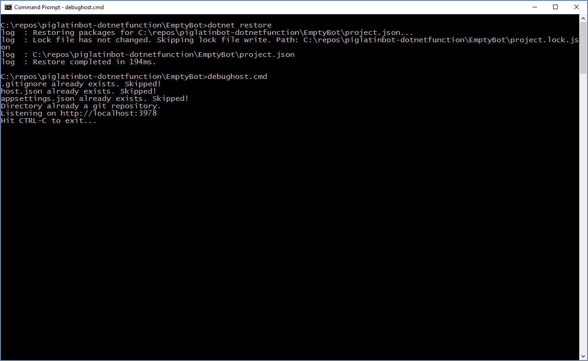

After it’s running, copy the endpoint that debughost is listening on (in this example, http://localhost:3978). Then start the framework’s emulator and paste the endpoint into the address bar as shown below. For this example, you’ll need to append **/api/messages** to the endpoint. Leave the `Microsoft App Id` and `Microsoft App Password` fields blank because you don't need security for local debugging. Click **Connect** and start playing with the bot by typing a message to your bot.

You can see the logs in the console window.

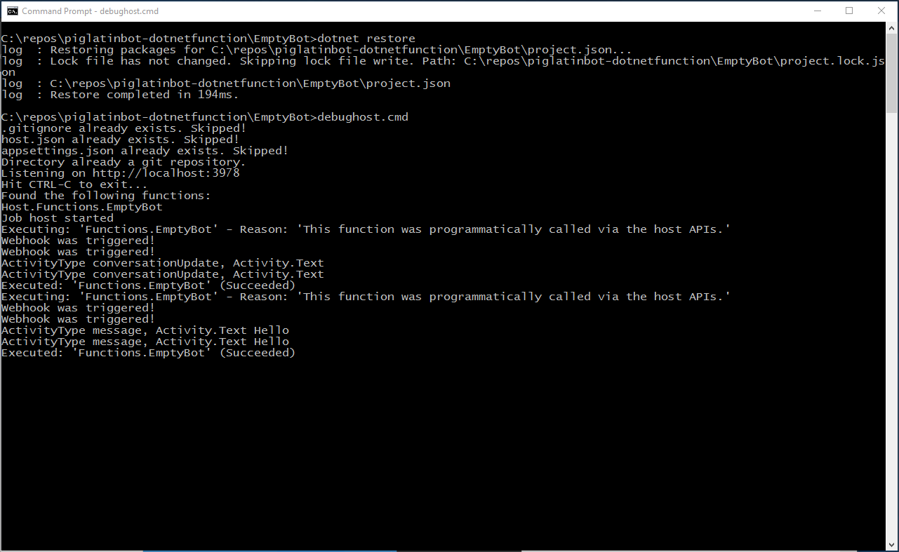

If wou want to do breakpoint debugging in Visual Studio 2015, stop the **DebugHost.cmd** script, and load the solution for your project (included as part of the repo) in Visual Studio. Then click **Task Runner Explorer**.

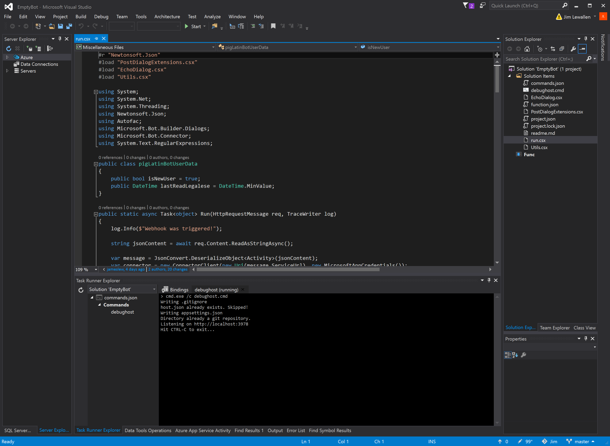

You will see the bot loading up in the debug host environment in the Task Runner Explorer window. Your bot is now live. If you switch to the emulator and talk to your bot, you’ll see the responses and logged output in Task Runner Explorer.

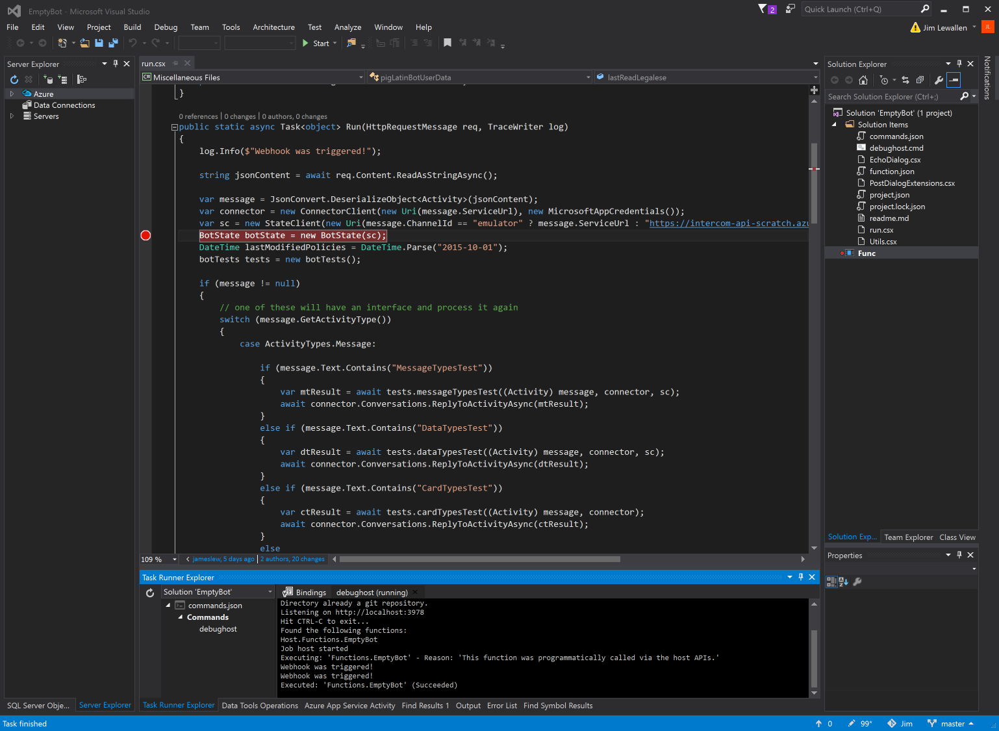

You can also set breakpoints for your bot. The breakpoints are hit only after clicking **Start** in the Visual Studio environment, which will attach to the Azure Function host (**func** command from Azure Functions CLI). Chat with your bot again in the emulator and you should hit your breakpoint.

>[!NOTE]
> If you can't successfully set your breakpoint, you likely have a syntax error in your code. Look for compile errors in the Task Runner Explorer window after trying to talk to your bot.

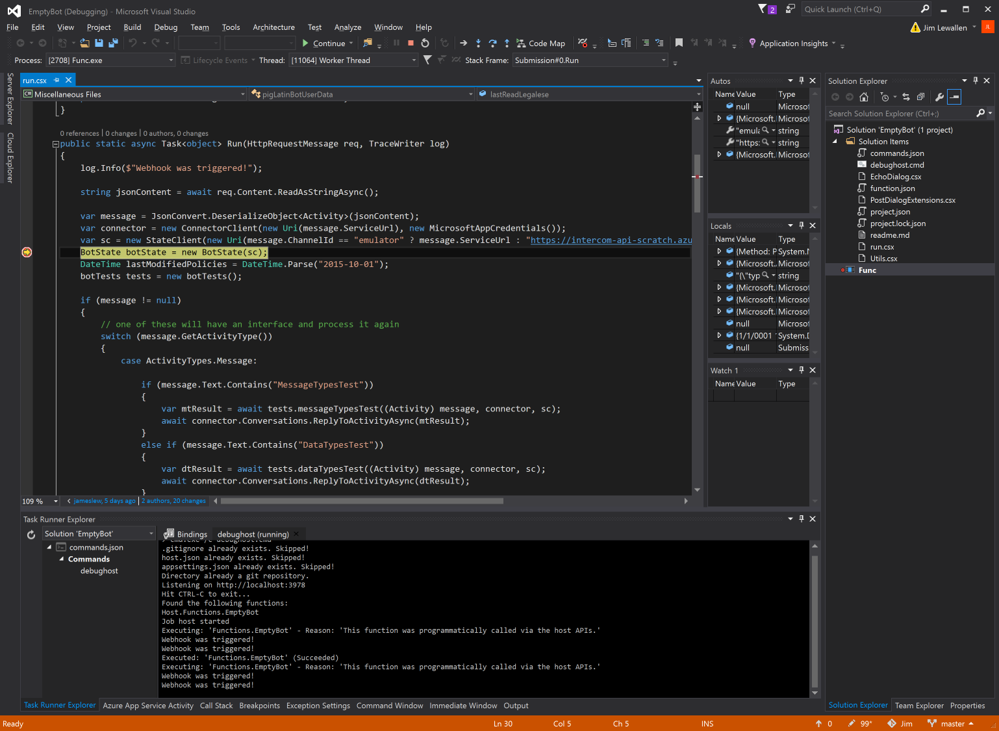

The steps above will cover most scenarios. However, if you use the [proactive template](bot-framework-azure-proactive-bot.md), these steps will enable debugging the bot, but you’ll have to do some additional work to enable queue storage that’s used between the trigger function and the bot function. 