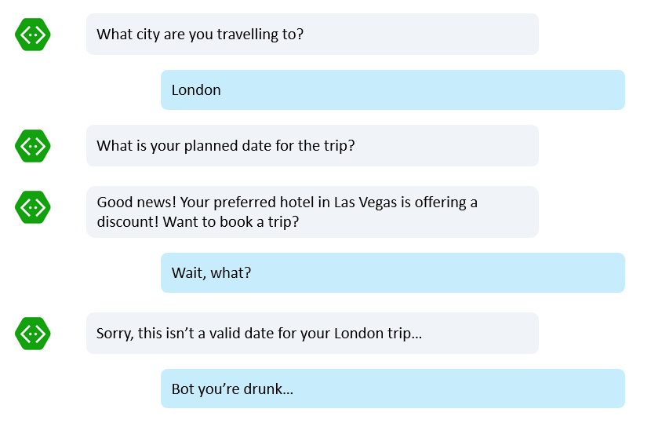

# Bot Capabilities

[intro goes here...]:

- Message logging - Basic concepts around intercepting messages between bots and users
- Proactive Messages - When bots need to initiate a message to the user 
- Global Message Handlers - Preparing bots for when users change topics in the conversation 
- Calling and IVR bots - Bots that work as IVR solutions

## Message logging

###We don't keep data, but you may

It is a common scenario for bot developers to save conversation logs in some sort of store. This is not done by default in the Microsoft Bot Framework and there is a good reason: In the conversation between the user and the bot, very personal and sensitive details about the user may be included and automatically saving that could have implications, for example around privacy.

Therefore it is up to the bot developer to make the decision whether to store that data and how, and also to communicate this to their users.

This article discusses how we can intercept all messages between bots and users so we can not only save them but also inspect them globally if needed.

###The middleware

The Bot Builder SDK offers a concept named *middleware*, which addresses the need of intercepting all messages so we can run tasks such as logging. 

How to set it up in C#:

	//Global.asax.cs code:
	public class WebApiApplication : System.Web.HttpApplication
	{
        protected void Application_Start()
        {
            var builder = new ContainerBuilder();
			//Node: Here is where we hook up our DebugActivityLogger
            builder.RegisterType<DebugActivityLogger>().AsImplementedInterfaces().InstancePerDependency();
            builder.Update(Conversation.Container);

            GlobalConfiguration.Configure(WebApiConfig.Register);
        }
    }

	//DebugActivityLogger.cs code
	public class DebugActivityLogger : IActivityLogger
    {
        public async Task LogAsync(IActivity activity)
        {
            Debug.WriteLine($"From:{activity.From.Id} - To:{activity.Recipient.Id} - Message:{activity.AsMessageActivity()?.Text}");
        }
    }

This is all that it is needed: We start by registering with the bot builder our created activity logger class and implementing it from the IActivityLogger. From that point, every message being sent or received to/from the user will trigger the LogAsync method and from there we can use whatever mechanism needed to store/inspect these.

Now in Node:

	server.post('/api/messages', connector.listen());
	var bot = new builder.UniversalBot(connector);
	// Middleware for logging
	bot.use({
    	botbuilder: function (session, next) {
        	myMiddleware.logIncomingMessage(session, next);
    	},
    	send: function (event, next) {
        	myMiddleware.logOutgoingMessage(event, next);
    	}
	})

We start by setting up handlers for incoming (botbuilder) and outgoing (send) handlers, and then implement them:

	module.exports = {
    	logIncomingMessage: function (session, next) {
        	console.log(session.message.text);
        	next();
    	},
    	logOutgoingMessage: function (event, next) {
        	console.log(event.text);
        	next();
    	}
	}

###Show me the code!

You can read [the detailed readme here](https://trpp24botsamples.visualstudio.com/_git/Code?path=%2FNode%2Fcapability-middlewareLogging%2FREADME.md&version=GBmaster&_a=contents) and see the [full C# code mentioned above here](https://trpp24botsamples.visualstudio.com/_git/Code?path=%2FCSharp%2Fcore-Middleware&version=GBmaster&_a=contents) and [the full Node sample here](https://trpp24botsamples.visualstudio.com/_git/Code?path=%2FNode%2Fcapability-middlewareLogging&version=GBmaster&_a=contents).

## Proactive messages

###When the bot needs to take the first step

In the most typical scenario, the bot is usually reacting to a message received from the user. So the controller from the REST Service that hosts the bot receives a notification with the user's message and immediately creates a response from it.

But there are cases where what causes the bot to send a message to the user is something else, other than a message from the given user. Some examples are:

- A timed event, such as a timer: Maybe the bot had a reminder set and that time has arrived. 
- An external event: A notification from an external system or service needs to make its way to the user via the conversation between the user and the bot. For example, the price of a product that the bot has been monitoring based on a previous request from the user has been cut in 20%, so the bot needs to notify the user that such event occurred
- A question from the user may take too long to be answered, so the bot replies saying it will work on it and come back when it has the answer. Minutes, maybe days later, the bot initiates a message with the response obtained. 

 
It is important to note that although being able to initiate a message to the user is extremely useful, there are constraints to be noted:

- How often the bot sends messages to the user is something to be kept in mind. Different channels enforce different rules on that, but most of them will dislike a bot that spams users too frequently and will likely shut it down. Even if they don't, one has to be careful about the [captain obvious bot scenario discussed previously](bot-framework-design-core-navigation.md#the-captain-obvious-bot): Notifications can become annoying very quickly.
- Many channels will only allow a bot to initiate a message to a user that has already had a previous conversation with the bot. In other words, at some point in the past the user launched that same bot and the bot took note of the user ID, channel ID and conversation ID. That way, the bot now is capable of reaching back to the user. The bot won't, though, be allowed to reach to a user who never user that bot. There are exceptions to this rule, specifically with e-mail and SMS.

###Not all proactive messages are the same

Before explaining this topic in too much detail, it is important to review [what we discussed about dialogs previously](bot-framework-design-core-dialogs.md) and remember that dialogs stack on top of each other during a conversation.

When the bot decides to initiate a proactive message to the user, it is hard to tell whether such user is in the middle of a conversation or task with that same bot. This can become very confusing very quickly:

In the example above, the bot has been previously requested to monitor prices of a given hotel in Las Vegas. That generated a background monitoring task that has been continuously running for the past several days. Right now, the user is actively booking a trip to London. It turns out that exactly at that moment, the previously configured background task triggered a notification message about a discount for the Las Vegas hotel. But that caused an interruption to the existing conversation. When the user answered, the bot was back to the original dialog, awaiting for a date input for the London Trip. Confusing...

What would be the right solution here? 

- One option would be for the bot to wait for the current travel booking to finish, but the downside could be the user missing out the low price opportunity for the Las Vegas hotel. 
- Another option could be the bot to just cancel the current travel booking flow and tell the user that a more important thing came up. The downside in this case is that it could be frustrating for the user in the middle of a trip booking to have to start all over again.
- A third option could be for the bot to interrupt the current booking, change the conversation to the hotel in Las Vegas and once it gets a response from the user, switch back to the previous travel booking flow and continue from where it stopped. The downside in this case is complexity, both for the developer as well as to the user.

In other words, there is no "right answer". It really depends on what kind of notifications and what kind of flows the bot executes that might be interrupted because of such notifications.

So we will discuss basically two kinds of proactive messages that allow us to control and decide on any of the 3 cases discussed above:

###Ad-hoc and dialog-based proactive messages

For the sake of simplicity, we will explore two main kinds of proactive messages: Ad-hoc and dialog based:

####Ad-hoc proactive messages

**Ad-hoc** are the simplest kind of proactive messages: They make no assumptions about whether the user is currently having a separate conversation with the bot and won't try to change that conversation in any way. So essentially ad-hoc messages will be injected into the chat at whatever point they happen to occur, regardless whether this will be confusing to the user or not. Like simple notifications, they just "happen". 

The steps for an ad-hoc message to work start by collecting data about the user and the current conversation.

In C#, this is in a high level how we would do it:

	public virtual async Task MessageReceivedAsync(IDialogContext context, IAwaitable<IMessageActivity> result)
	{
    	var message = await result;
		
		//We received a message and we will extract some key addressing info form it
		//We will store it into a custom class (not shown here) called "ConversationStarter"

		ConversationStarter.toId = message.From.Id;
        ConversationStarter.toName = message.From.Name;
        ConversationStarter.fromId = message.Recipient.Id;
        ConversationStarter.fromName = message.Recipient.Name;
        ConversationStarter.serviceUrl = message.ServiceUrl;
        ConversationStarter.channelId = message.ChannelId;
        ConversationStarter.conversationId = message.Conversation.Id;

		//Assume the information above is saved somewhere, such as a database

		await context.PostAsync("Hello user, good to meet you! I now know your address and can send you notifications in the future.");
		context.Wait(MessageReceivedAsync);
	}

For simplicity, we are not discussing how to store those values. This is up to the bot developer to decide and quite honestly doesn't matter much to the flow discussed here.

In Node, a similar approach is taken:

	bot.dialog('/', function(session, args) {
		var savedAddress = session.message.address;

		//Assume the information above is saved somewhere, such as a database

		var message = 'Hello user, good to meet you! I now know your address and can send you notifications in the future.';
		session.send(message);
	})

Note that in Node we have a property named *address* which includes all the information needed so there is no need to walk properties one by one like in C#. But effectively both snippets above are doing the same thing: They are remembering the user for future notifications.

With those values in mind, the ad-hoc proactive message can be sent at any time by retrieving these values and constructing a message. 

So in C#:

	//Use the values previously stored to create a account and connector objects
	var userAccount = new ChannelAccount(toId,toName);
	var botAccount = new ChannelAccount(fromId, fromName);
	var connector = new ConnectorClient(new Uri(serviceUrl));

	//Create a new message
	IMessageActivity message = Activity.CreateMessageActivity();
	if (!string.IsNullOrEmpty(conversationId) && !string.IsNullOrEmpty(channelId))	
	{
		//If we do have conversation and channel IDs stored, we will use them
		message.ChannelId = channelId;
	}
	else
	{
		//We don't have a conversation ID so we will create one
		//Note: If the user has an existing conversation in a channel, this will likely
		//create a new conversation window
		conversationId = (await connector.Conversations.CreateDirectConversationAsync( botAccount, userAccount)).Id;
	}

	//Set the addressing data in the message and send it
	message.From = botAccount;
	message.Recipient = userAccount;
	message.Conversation = new ConversationAccount(id: conversationId);
	message.Text = "Hello, this is a notification";
	message.Locale = "en-Us";
	await connector.Conversations.SendToConversationAsync((Activity)message);

One key aspect to note is the conversation ID: If we reuse a conversation ID, we will likely make the bot use the existing conversation window on the client. By generating a different conversation ID, we're telling the bot to not interfere with existing conversation windows and create a new one, assuming the given client (the chat application the user is using with this bot) supports multiple conversation windows that way.

Same in Node:

	var bot = new builder.UniversalBot(connector);

	function sendProactiveMessage(address) {
		var msg = new builder.Message().address(address);
		msg.text('Hello, this is a notification');
		msg.textLocale('en-US');
		bot.send(msg);
	}

Again, due to the fact that Node offers the address property, we just need to construct the message and assign the address. We do, like in C#, have control over conversation IDs like described above.

Note these notification events can be called virtually anywhere, from asynchronous triggers such as http requests, timers, queues or anything else the developer decides to use.

For more complete examples of ad-hoc proactive messages:

- [End to end C# sample](https://trpp24botsamples.visualstudio.com/_git/Code?path=%2FCSharp%2Fcore-proactiveMessages%2FsimpleSendMessage&version=GBmaster&_a=contents)
- [End to end Node sample](https://trpp24botsamples.visualstudio.com/_git/Code?path=%2FNode%2Fcore-proactiveMessages%2FsimpleSendMessage&version=GBmaster&_a=contents)

####Dialog-based proactive messages

**Dialog-based** proactive messages adds more complexity to the examples above: The bot now needs to be aware of the existing conversation and what it wants to do with it before deciding on how to inject a proactive message.

A theoretical example: Imagine a bot that needs to trigger a survey at a given time. When such time event occurs, the bot needs to stop any existing conversation with the user, if any, and then redirect the user to a "SurveyDialog". The user will stay at the SurveyDialog for as long as it is needed and when such dialog is done, it will be removed from the stack, leaving the user back to where he/she was before.

So effectively this is more than just a notification: The bot is changing the topic of the existing conversation. It may, in fact, even decide to completely reset the existing conversation as well as part of this notification so the bot, as a result, will interrupt whatever the user is doing, forget completely about it and start a whole new topic from there.

This flow starts in a similar way to the previous one: The user starts a conversation with the bot, which then record information from the user so it can start a proactive message.

In C#:

	public virtual async Task MessageReceivedAsync(IDialogContext context, IAwaitable<IMessageActivity> result)
	{
            var message = await result;
			//We need to store the resumption cooke so we can get back to this conversation
			var resumptionCookie = new ResumptionCookie(message).GZipSerialize();

            await context.PostAsync("Greetings, user! I now know how to start a proactive message to you."); 
            context.Wait(MessageReceivedAsync);
	}

This time we are using the Resumption Cookie. It is very similar to the address property discussed previously, but it will be more useful when we decide to add a new dialog as part of the proactive message.

In Node:

	var bot = new builder.UniversalBot(connector);

	function sendProactiveMessage(address) {
		var msg = new builder.Message().address(address);
		msg.text('Hello, this is a notification');
		msg.textLocale('en-US');
		bot.send(msg);
	}

In the Node case, nothing really changed to this point, but will further below.

Now the real change happens on how we trigger the proactive message: This time we are not just sending a message, but creating a whole dialog and adding it to the current stack of dialogs. In other words, we will take the existing conversation, no matter how many dialogs are currently involved and we will add one more, making it the one in control. That new dialog is not only going to carry the notification but also decide when to get back to the original one.

In C#:

	public static async Task Resume() 
	{
		//Recreate the message from the resumption cookie we've had stored previously
		var message = ResumptionCookie.GZipDeserialize(resumptionCookie).GetMessage();
		var client = new ConnectorClient(new Uri(message.ServiceUrl));

		//Create a scope so we can work with state from bot framework
		using (var scope = DialogModule.BeginLifetimeScope(Conversation.Container, message))
		{
			var botData = scope.Resolve<IBotData>();
			await botData.LoadAsync(CancellationToken.None);

			//This is our dialog stack
			var stack = scope.Resolve<IDialogStack>();
                
			//interrupt the stack. This means that we're stopping whatever conversation that is currently happening with the user
			//Then adding this stack to run and once it's finished, we will be back to the original conversation
			
			//This is the new dialog we will be injecting into the stack.
			var dialog =new SurveyDialog();
			//Note here we could have very well decided to reset the stack.
			//So it would "forget" the current conversation
			stack.Call(dialog.Void<object, IMessageActivity>(), null);
			await stack.PollAsync(CancellationToken.None);

			//flush dialog stack back to its state store
			await botData.FlushAsync(CancellationToken.None);
           
		}
	}

This is evidently more complex than the first example: We are not gaining access to the bot framework's store where the dialog stack is saved and changing it by adding our new "SurveyDialog" on top. The resumption cookie gives us a simple way of serializing and deserializing the entire message we received from the user.

In Node:

	function startProactiveDialog(addr) {
		// set resume:false to resume at the root dialog
		// else true to resume the previous dialog
		bot.beginDialog(savedAddress, "*:/survey", {}, { resume: true });  
	}

Although the code for Node is much simpler, it does require a custom file implemented with it, not listed here. [A copy of this botadapter.js file can be found here instead](https://trpp24botsamples.visualstudio.com/_git/Code?path=%2FNode%2Fcore-proactiveMessages%2FstartNewDialog%2Fbotadapter.js&version=GBmaster&_a=contents).

Despite of the implementation differences in Node and C#, they are both achieving the same: Taking the stored data from the message, creating a new dialog and injecting into the dialog stack stored in the Bot Framework, directing the user to that new dialog.

Now how does that SurveyDialog manages the exit back to the original conversation?

In C#:

	[Serializable]
    public class SurveyDialog : IDialog<object>
    {
        public async Task StartAsync(IDialogContext context)
        {
            await context.PostAsync("Hello, I'm the survey dialog. I'm interrupting your conversation to ask you a question. Type \"done\" to resume");

            context.Wait(this.MessageReceivedAsync);
        }
        public virtual async Task MessageReceivedAsync(IDialogContext context, IAwaitable<IMessageActivity> result)
        {
            if ((await result).Text == "done")
            {
                await context.PostAsync("Great, back to the original conversation!");
                context.Done(String.Empty); //Finish this dialog
            }
            else
            {
                await context.PostAsync("I'm still on the survey until you type \"done\"");
                context.Wait(MessageReceivedAsync); //Not done yet
            }
        }
    }

Note this dialog is very simplified for the sake of demonstrating the concept: The key point is how it has its own logic and decides when it is finished by calling context.Done(). This is in no way different than [what discussed previously about how dialogs work](bot-framework-design-core-dialogs.md). When a dialog is finished and ready to be removed from the stack, it calls context.Done()

Now in Node:

	bot.dialog('/survey', [
		function (session, args, next) {
    		if (session.message.text=="done"){
      			session.send("Great, back to the original conversation");
      			session.endDialog();
    		}else{
          		session.send('Hello, I\'m the survey dialog. I\'m interrupting your conversation to ask you a question. Type "done" to resume');
    		}
		},
		function (session, results) {
		}
	]);

Similarly, in Node we have the same control by using session.endDialog().

###Show me the code!

The full examples of what has been discussed above are here:

- [C# sample of ad-hoc proactive message](https://trpp24botsamples.visualstudio.com/_git/Code?path=%2FCSharp%2Fcore-proactiveMessages%2FsimpleSendMessage&version=GBmaster&_a=contents)
- [C# sample of dialog-based proactive message](https://trpp24botsamples.visualstudio.com/_git/Code?path=%2FCSharp%2Fcore-proactiveMessages%2FstartNewDialog&version=GBmaster&_a=contents)
- [Node sample of ad-hoc proactive message](https://trpp24botsamples.visualstudio.com/_git/Code?path=%2FNode%2Fcore-proactiveMessages%2FsimpleSendMessage&version=GBmaster&_a=contents)
- [Node sample of dialog-based proactive message](https://trpp24botsamples.visualstudio.com/_git/Code?path=%2FNode%2Fcore-proactiveMessages%2FstartNewDialog&version=GBmaster&_a=contents)

## Global Message handlers

###When users change the topic of the conversation

We discussed [earlier on the topic of dialogs](bot-framework-design-core-dialogs.md#dialogs-stacks-and-humans) about the challenges of detecting when the user doesn't answer what the bot is expecting but instead asks for something else, outside the flow.

In the scenario above, the bot had a simple yes/no question. That dialog is not expecting for any answer other than that. But suddenly the user switches topics or asks for more help. That "help" message could have happened anywhere along the conversation, in any dialog. How do we build a "catch all" handler for it?

###Scorables and triggerActions

The C# and Node libraries differ on how these global message handlers can be implemented today. We will discuss how each does it.

First, in C#. The Global.asax.cs registers a GlobalMessageHandlersBotModule, implemented as below:

	public class GlobalMessageHandlersBotModule : Module
    {
        protected override void Load(ContainerBuilder builder)
        {
            base.Load(builder);

            builder
                .Register(c => new SettingsScorable(c.Resolve<IDialogStack>()))
                .As<IScorable<IActivity, double>>()
                .InstancePerLifetimeScope();

            builder
                .Register(c => new CancelScorable(c.Resolve<IDialogStack>()))
                .As<IScorable<IActivity, double>>()
                .InstancePerLifetimeScope();
        }
    }

This module registers two scorables, one for managing the request for changing settings and another for managing the requests to cancel.

The CancelScorable has a PrepareAsync method where the trigger is defined. Here we are saying that if the message text is "cancel", this scorable will be triggered:

	protected override async Task<string> PrepareAsync(IActivity activity, CancellationToken token)
    {
    	var message = activity as IMessageActivity;
        if (message != null && !string.IsNullOrWhiteSpace(message.Text))
        {
			if (message.Text.Equals("cancel", StringComparison.InvariantCultureIgnoreCase))
            {
            	return message.Text;
            }
        }
        return null;
	}

In this particular scenario, we want "cancel" to cause the dialog stack to be reset:

	protected override async Task PostAsync(IActivity item, string state, CancellationToken token)
    {
    	this.stack.Reset();
    }

Note this is different than the SettingsScorable, which directs the command to a different Dialog:

	protected override async Task PostAsync(IActivity item, string state, CancellationToken token)
    {
    	var message = item as IMessageActivity;
        if (message != null)
        {
        	var settingsDialog = new SettingsDialog();
            var interruption = settingsDialog.Void<object, IMessageActivity>();
            this.stack.Call(interruption, null);
            await this.stack.PollAsync(token);
        }
	}

So in this second scenario we don't reset the dialog stack but instead just add the SettingsDialog on top of it. 

This is the essence of how global handlers can be wired up in C#.

Now let us see the case with Node:

On Node we will be using triggerActions in order to tell the framework what are the triggers that will lead to the activation of certain dialogs.

For example, for the cancel dialog:

	bot.dialog('cancel', (session, args, next) => {
    	// end the conversation to cancel the operation
    	session.endConversation('Operation canceled');
	}).triggerAction({
    	matches: /^cancel$/
	});

Note how the dialog has a triggerAction that defines that if the user says 'cancel', which causes the conversation to be finished. Note that the behavior with the help dialog is different:

	bot.dialog('help', (session, args, next) => {
	    // send help message to the user and end this dialog
	    session.endDialog('This is a simple bot that collects a name and age.');
	}).triggerAction({
	    matches: /^help$/,
	    onSelectAction: (session, args, next) => {
	        // overrides default behavior of replacing the dialog stack
	        // This will add the help dialog to the stack
	        session.beginDialog(args.action, args);
	    }
	});

In this case, the triggerAction will have a onSelectAction that begins the help dialog, on top of the existing conversation. When the help dialog is finished, it is then removed from the stack bringing the user back to the dialog they were interacting with earlier.

###Show me the code!

Follow [this link for a complete implementation in C#](https://trpp24botsamples.visualstudio.com/_git/Code?path=%2FCSharp%2Fcore-GlobalMessageHandlers&version=GBmaster&_a=contents)

Follow [this link for a complete implementation in Node](https://trpp24botsamples.visualstudio.com/_git/Code?path=%2FNode%2Fcore-globalMessageHandlers&version=GBmaster&_a=contents)

## Calling and IVR Bots

###Bots that answer the phone

When building bots for Skype, an additional capability that can be explored is the ability to make audio calls: A bot may, either exclusively or also in additional to other UI elements such as text and rich UIs, establish audio calls with the user.

This becomes particularly useful when the user does not want to - or simply can't - type or click at buttons.

The architecture for a calling bot is not too different from a typical bot. In fact, they can be the same code and leverage the same web service deployment. 

It all starts with an API controller.

In C#:

	[BotAuthentication]
    [RoutePrefix("api/calling")]
    public class CallingController : ApiController
    {
        public CallingController() : base()
        {
            CallingConversation.RegisterCallingBot(callingBotService => new IVRBot(callingBotService));
        }

        [Route("callback")]
        public async Task<HttpResponseMessage> ProcessCallingEventAsync()
        {
            return await CallingConversation.SendAsync(this.Request, CallRequestType.CallingEvent);
        }

        [Route("call")]
        public async Task<HttpResponseMessage> ProcessIncomingCallAsync()
        {
            return await CallingConversation.SendAsync(this.Request, CallRequestType.IncomingCall);
        }
    }

Note that this bot may have the MessagesControler **as well** as this. So it becomes capable of both messages and calls. This is generally recommended so users can interact with it the way that is more convenient to them.

While the constructor registers the IVRBot class, the ProcessIncomingCallAsync will execute whenever the user places a call to this bot from Skype. The IVRBot has a predefined handler for that event:

	private Task OnIncomingCallReceived(IncomingCallEvent incomingCallEvent)
    {
    	this.callStateMap[incomingCallEvent.IncomingCall.Id] = new CallState(incomingCallEvent.IncomingCall.Participants);

        incomingCallEvent.ResultingWorkflow.Actions = new List<ActionBase>
        {
        	new Answer { OperationId = Guid.NewGuid().ToString() },
            GetPromptForText(WelcomeMessage)
        };

        return Task.FromResult(true);
	}

In the first action of the workflow the bot should decide if it’s interested in answering or rejecting the call. Should the bot decide to answer the call, the subsequent actions instruct the Skype Bot Platform for Calling to either play prompt, record audio, recognize speech, or collect digits from a dial pad. The last action of the workflow could be to hang up the voice call. Skype Bot Platform for Calling then takes the workflow and attempts to execute actions in order given by bot.

In the code above, we are instructing the bot to answer and play a welcome message. Once that message if finished, we will have a handler, which will setup a menu to be presented:

	private Task OnPlayPromptCompleted(PlayPromptOutcomeEvent playPromptOutcomeEvent)
	{
    	var callState = this.callStateMap[playPromptOutcomeEvent.ConversationResult.Id];
    	SetupInitialMenu(playPromptOutcomeEvent.ResultingWorkflow);
    	return Task.FromResult(true);
	}

The menu will be defined later on by the CreateIvrOptions method:

	private static Recognize CreateIvrOptions(string textToBeRead, int numberOfOptions, bool includeBack)
    {
    	if (numberOfOptions > 9)
        {
        	throw new Exception("too many options specified");
		}

        var choices = new List<RecognitionOption>();

        for (int i = 1; i <= numberOfOptions; i++)
        {
        	choices.Add(new RecognitionOption { Name = Convert.ToString(i), DtmfVariation = (char)('0' + i) });
		}

        if (includeBack)
        {
        	choices.Add(new RecognitionOption { Name = "#", DtmfVariation = '#' });
		}

        var recognize = new Recognize
        {
        	OperationId = Guid.NewGuid().ToString(),
            PlayPrompt = GetPromptForText(textToBeRead),
            BargeInAllowed = true,
            Choices = choices
		};

        return recognize;
	}

The RecognitionOption class allows us to define both the spoken answer as well as the corresponding Dtmf variation (the user may just type the corresponding digit on the keypad).

The user's selection is handled by the OnRecognizeCompleted method, where the recognizeOutcomeEvent contains the selection from the user:

	private Task OnRecognizeCompleted(RecognizeOutcomeEvent recognizeOutcomeEvent)
	{
    	var callState = this.callStateMap[recognizeOutcomeEvent.ConversationResult.Id];
    	ProcessMainMenuSelection(recognizeOutcomeEvent, callState);
    	return Task.FromResult(true);
	}

Note the bot can also allow free natural language, leaving the user to speak freely and handling the input with Bing Speech API:

	private async Task OnRecordCompleted(RecordOutcomeEvent recordOutcomeEvent)
    {
    	recordOutcomeEvent.ResultingWorkflow.Actions = new List<ActionBase>
        {
        	GetPromptForText(EndingMessage),
            new Hangup { OperationId = Guid.NewGuid().ToString() }
        };

        // Convert the audio to text
        if (recordOutcomeEvent.RecordOutcome.Outcome == Outcome.Success)
        {
        	var record = await recordOutcomeEvent.RecordedContent;
            string text = await this.GetTextFromAudioAsync(record);

            var callState = this.callStateMap[recordOutcomeEvent.ConversationResult.Id];

            await this.SendSTTResultToUser("We detected the following audio: " + text, callState.Participants);
		}

        recordOutcomeEvent.ResultingWorkflow.Links = null;
        this.callStateMap.Remove(recordOutcomeEvent.ConversationResult.Id);
}

###Show me the code!

You can read [the detailed readme here](https://trpp24botsamples.visualstudio.com/_git/Code?path=%2FCSharp%2Fskype-CallingBot%2FREADME.md&version=GBmaster&_a=contents) and see the [full C# code mentioned above here](https://trpp24botsamples.visualstudio.com/_git/Code?path=%2FCSharp%2Fskype-CallingBot&version=GBmaster&_a=contents).

