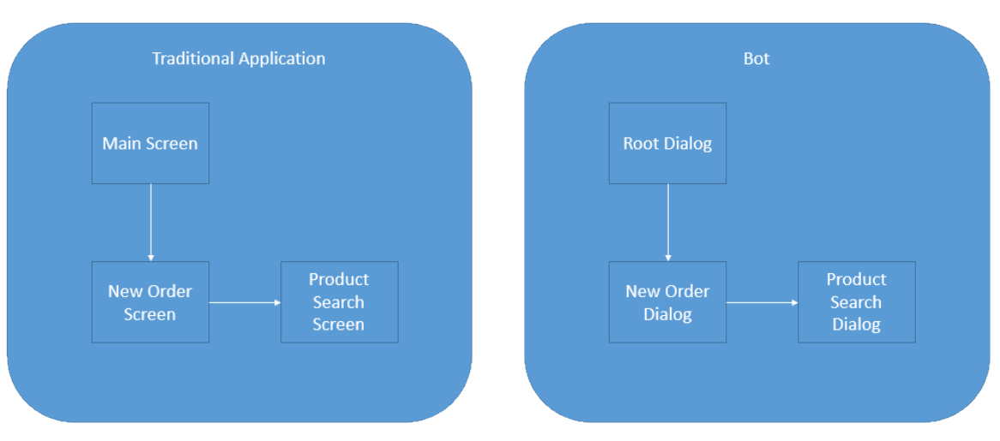

# Designing conversation flow using dialogs

##UI: Apps have them, so do bots 

In a traditional application, UI is typically represented as screens. A single app can use one or more screens as needed in order to exchange information with the user. You would likely have a main screen where all navigation starts from and then different screens for things such as browsing products, looking for help and so on. And of course, same principles apply to websites.

Again, bots are no different: You will have a UI. It just may look… different. As your bot grows in complexity, you will need to separate concerns. The place where you help the user browse for products will be different than the place where the user creates a new order or browses for help. We break those things into what we call “dialogs”. 

Dialogs may or may not have graphical interfaces. They may have buttons, text or they may even be completely speech based. One dialog can call another, just like screens in apps.

Developers are used to the concept of screens that "stack" on top of each other: The "main screen" invokes the "new order screen" as a modal dialog. At that point, "new order screen" takes over, as if it was on top of the main screen. The experience now is controlled by "new order screen" until it closes. Before that it may even call other screens, which will then take over as well. But at some point, "new order screen" will be done with whatever it had to do so it will close, sending the user back to the main screen.

Let us switch to bots now: Our controller invokes the "main screen", which in this case we typically call the "root dialog".

In other words, in C#:

	public class MessagesController : ApiController
	{
        public async Task<HttpResponseMessage> Post([FromBody]Activity activity)
        {
				//controller redirects to RootDialog
                await Conversation.SendAsync(activity, () => new RootDialog()); 

And in Node:

	var server = restify.createServer();
	server.listen(process.env.port || process.env.PORT || 3978, function () { });

	var connector = new builder.ChatConnector({
    	appId: process.env.MICROSOFT_APP_ID,
		appPassword: process.env.MICROSOFT_APP_PASSWORD
	});

	var bot = new builder.UniversalBot(connector);
	server.post('/api/messages', connector.listen());

	// Root dialog
	bot.dialog('/', ...

Despite of the obvious differences due to the nature of every language, both snippets above show how we wire the basic HTTP GET call to a controller and then hook it to our root dialog.

Then, from root dialog we can invoke the New Order dialog:

In C#:

    [Serializable]
    public class RootDialog : IDialog<object>
    {
        public async Task StartAsync(IDialogContext context)
        {
			//Root Dialog initiates and now waits for the next message from the user. 
			//When that arrives we will fall into MessageReceivedAsync
            context.Wait(this.MessageReceivedAsync); 
        }

        public virtual async Task MessageReceivedAsync(IDialogContext context, IAwaitable<IMessageActivity> result)
        {
            var message = await result; //We've got a message!
            if (message.Text.ToLower().Contains("order"))
            {
				//User said 'order'. Let's invoke the New Order Dialog and wait for it to finish
				//Then, we will call the ResumeAfterNewOrderDialog
                await context.Forward(new NewOrderDialog(), this.ResumeAfterNewOrderDialog, message, CancellationToken.None);
            }
			//User typed something else so for simplicity we will just ignore 
			//and keep waiting for the next message
            context.Wait(this.MessageReceivedAsync);
        }

        private async Task ResumeAfterNewOrderDialog(IDialogContext context, IAwaitable<string> result)
        {
			//This will get us whatever the NewOrderDialog decided to return to us. 
			//At this point, new order dialog finished and gave us back some value to work with
			//on the root dialog
            var resultFromNewOrder = await result;

            await context.PostAsync($"New order dialog just told me this: {resultFromNewOrder}");

			//Again, we will now just wait for the next message from the user
            context.Wait(this.MessageReceivedAsync);

        }

Now in Node:

	bot.dialog('/', new builder.IntentDialog()
	//Did the user type 'order'?
    .matchesAny([/order/i], [ 
        function (session) {
			//Let's invoke then the new order dialog
            session.beginDialog('/newOrder');
        },

        function (session, result) {
			//This will get us whatever the new order dialog decided to return to us
			var resultFromNewOrder = result.response;

            session.send('New order dialog just told me this: %s', resultFromNewOrder');
            //We are now done with the root dialog
			session.endDialog(); 
        }
    ])

##Dialogs wait for you

Once a dialog is invoked, it will be in control of the flow. Every new message will automatically fall again at that dialog until it tells us it is done. 

In C# you control that by saying context.Wait(). That tells us what is the callback that will be invoked in the next time the user sends us anything. In fact, in C# you must always finish the code either with context.Wait(), context.Fail() or some new redirection such as context.Forward() or context.Call(). Not doing so will cause an error, because your code is confusing the framework by not telling it what it should do the next time the user sends us a message.

In Node, these flows have a little more automation built in: A dialog invokes another by doing session.beginDialog(). And when a dialog is "done", it tells us by saying session.endDialog(). So session.endDialog() in Node is similar to context.Done() in C#. They basically remove the dialog from the Stack, sending the user to whatever dialog is now on top of that stack.

##Hang on: Stack? What Stack??

Whenever one Dialog invokes another, the bot builder will "stack" them up. Whenever a dialog "finishes", the bot builder will then remove it from the stack. This is one of the most important concepts developers need to keep in mind: Stacks are how we control which dialogs invoked other dialogs in a given order. They are all there waiting for the thing they called to finish, so they can gain control again and continue. Just like modal screens in typical apps or websites.

## Dialogs, Stacks and Humans

It is natural to expect that users navigate across dialogs and such dialogs stack up, at some point they will navigate "back" and "un-stack" these dialogs one by one: User starts from root dialog, invokes the new order dialog and from there, invokes the product search dialog. Then, user picks a product, confirms, goes back to the order, completes it and now we're back at the root dialog.

This normally works well, except for one little detail: Humans

Humans do not communicate in "stacks": They change their minds, a lot. Your bot may be deep down a sequence of dialogs, all stacked up waiting for a final confirmation so you can submit the order and suddenly the user decides to do something else, or has a question. In the example above our dialog explicitly waits for a yes/no answer and the user gives it a totally random answer, which is in fact a follow up question. What should your dialog do?

- Insist that the user should answer the question first?
- Cancel everything the user was doing, reset the whole stack and start over trying to answer that question?
- Try to answer that question and then try to go back to that yes/no question and resume from where it left?

The answer, of course, is: It depends. It will depend on your scenario, how likely this would happen, and what the user would expect the bot to do next. Managing this navigation across dialogs and helping users not getting lost is a fundamental component of bot design and also one of its most challenging parts.

Which leads us to the [next topic](bot-framework-design-core-navigation.md)...
