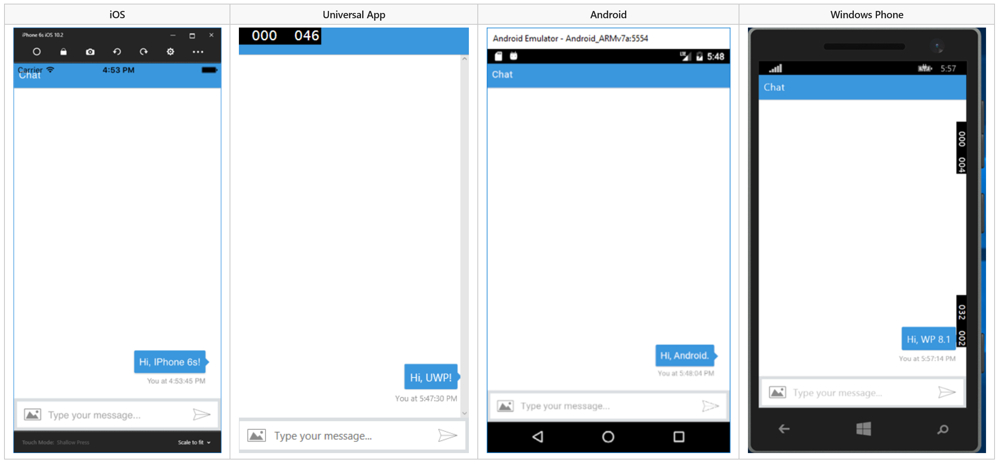

# Bot embedded within an app 

## Introduction 

Although bots most commonly exist outside of apps, they can also be embedded within an app. 
For example, you may embed a [knowledge bot](bot-framework-design-patterns-knowledge-base.md) within an app 
to enable users to quickly find information that might otherwise be challenging to locate within complex app structures. 
Or, you might embed a bot within a help desk app to act as the first responder to incoming user requests; 
it could independently resolve simple issues and [handoff](bot-framework-design-patterns-human-handoff.md) more complex issues to a human agent. 

In this article, we'll discuss various means of integrating bots with apps 
and explore the process of creating a cross-platform mobile app that runs a bot. 

## Integrating bot with app

The means of integrating a bot with an app may vary depending on the type of app. 

- **Native mobile app**: 
An app that is created in native code can communicate with the Bot Framework by using 
the [DirectLine API](https://docs.botframework.com/en-us/restapi/directline3/#navtitle), 
either via REST or websockets.

- **Web-based mobile app**: 
A mobile app that is built by using web language and frameworks such as <a href="https://cordova.apache.org/" target="_blank">Cordova</a> 
may communicate with the Bot Framework by using the same components that a 
[bot embedded within a website](bot-framework-design-patterns-bot-in-website.md) would use, 
just encapsulated within a native app's shell.

- **IoT app**: 
An IoT app can communicate with the Bot Framework by using 
the [DirectLine API](https://docs.botframework.com/en-us/restapi/directline3/#navtitle). 
In some scenarios, it may also use <a href="https://www.microsoft.com/cognitive-services/" target="_blank">Microsoft Cognitive Services</a> 
to enable capabilities such as vision and speech.

- **Other types of apps and games**: 
Other types of apps and games can communicate with the Bot Framework by using 
the [DirectLine API](https://docs.botframework.com/en-us/restapi/directline3/#navtitle). 

## Creating a cross-platform mobile app that runs a bot

Let's explore the process of creating a mobile app that runs a bot, 
by using <a href="https://www.xamarin.com/" target="_blank">Xamarin</a>, a popular tool 
for building cross-platform mobile applications. 

First, you'll create a simple web view component and use it to host a 
<a href="https://github.com/Microsoft/BotFramework-WebChat" target="_blank">web chat control</a>. 
Then, using the Bot Framework Portal, [configure the bot](bot-framework-publish-configure.md) to 
enable the Web Chat channel. 


Next, specify the registered web chat URL as the source for the web view control in the Xamarin app:

```cs
public class WebPage : ContentPage
{
	public WebPage()
	{
		var browser = new WebView();
		browser.Source = "https://webchat.botframework.com/embed/<YOUR SECRET KEY HERE>";
		this.Content = browser;
	}
}
```

By configuring things in this manner, you've created a cross-platform mobile application 
that renders the embedded web view with the web chat control:



## Additional resources

In this article, we discussed various means of integrating bots with apps and 
explored the process of creating a cross-platform mobile app that runs a bot.
To see the complete sample code (and step-by-step implementation guidance) for the example discussed above, 
review the following resources: 

> [!NOTE]
> To do: Add links to the code sample (and readme) that Mat refers to.
 