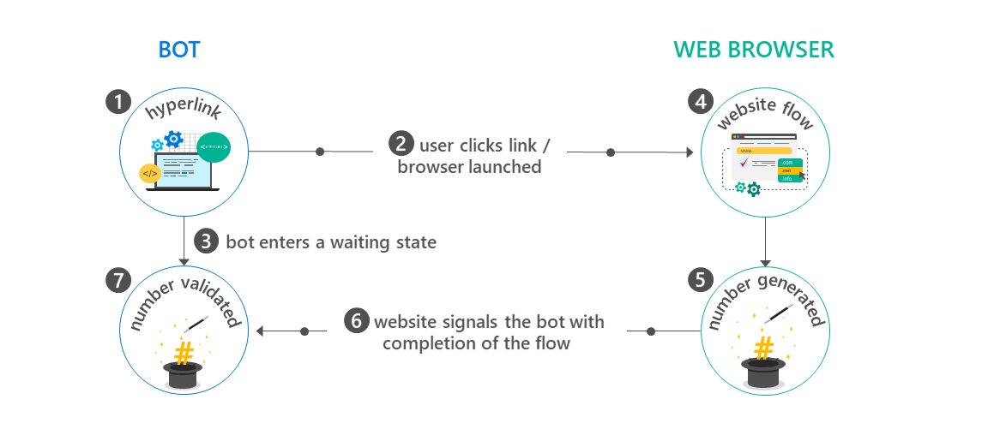

# Integration between bot and web browser

##When bots and web browsers need to work together 

Sometimes an application requires more than just a bot to fulfill a requirement: At some point during the conversation flow with the bot, the user needs to be sent to a web browser to execute some additional flow and then back to the bot.

There good are reasons why this might be needed:

- The user may need to be authenticated on an existing web browser so the bot can link that identity with the identity it has received from the bot. For example, a bot may want to authenticate the user against Microsoft Azure Active Directory so it can acquire an access token in order to read the user's calendar in Office 365 or even create new appointments on behalf of that user
- Due to security requirements, at some point during the flow it becomes important to send/receive data outside the channel. For example, the user may want to execute a payment using a third party payment provider, in which case information such as credit card shouldn't be provided within the chat itself. Remember: Different channels have different levels of security and compliance, therefore the developer may be forced to rely on other ways of communicating sensitive data outside the bot

Unfortunately, the experience of being sent outside the chat application, to a web browser and then back isn't ideal and can be confusing to the user. Many chat applications are aware of this and are building ways so they can offer built in HTML windows so the user doesn't have to ever be redirected to places outside that application. This is not too different to how mobile applications manage authorization flows via OAuth, for example, by using embedded web views so once again, apps and bots don't need to look or do things too differently from each other.

##Bot to web, and back: The flow 

Let us look at a high level flow of how a bot and a website can interact with each other:

1. When the bot decides it needs to redirect the user to a website, it generates a hyperlink. Generally this hyperlink will include identification values that will tell the website enough information about the context of such flow. Those may include the user ID in the channel, conversation ID, channel ID and/or other values that will help keeping the user in the context of the flow.
2. The hyperlink is then presented to the user. Once the user clicks at it, a web browser is then launched, loading the website
3. At that point the bot is put in a waiting state. It is now waiting for some sort of signal or variable that will be set by the website in order to complete the flow. It is suggested here that the bot also has an exit route: The user may never launch the web browser or may never finish the expected web flow. Therefore, it is important to design this flow in a way so it doesn't leave the bot in [the "mysterious bot" situation discussed earlier](bot-framework-design-core-navigation.md#the-mysterious-bot).
4. Website launches and runs whatever flow it needs to run. It may be a OAuth flow, or any custom sequence of events needed in that particular scenario.
5. Website decides that the flow has been completed with the user. It then generates a magic number and asks the user to copy it and paste it back into the chat with the bot. 
6. The website also signals the bot with the magic number and any additional data the bot may need (e.g. if this is an OAuth flow, then perhaps the website will want to also disclose the access token obtained back to the bot)
7. The user comes back to the bot which is now awaiting for the magic number and pastes it back into the chat. The bot validate that this is indeed the magic number expected for that same user and that this is the same user who has received the original hyperlink. The flow is now complete.

##Ugh! A magic number? What a terrible experience! I'll just remove that... 

The reason for the magic number is to reinforce additional security. Remember: The bot may be chatting with a group of users in that same window. The hyperlink was intended to one specific user, but any other user may have clicked at it instead. Without the magic number validation, we simply can't tell, nor the bot code can. One user could be authenticating and injecting access tokens in some other user's session. This isn't just a risk for group chats: Without the magic number, basically any user who obtains that hyperlink in any ways is now capable of spoofing other users identities. This can quickly escalate into all sorts of security breaches. 

The magic number should be a random number generated using a strong cryptography library. For an example of that, see how [AuthBot does it in C# here](https://github.com/MicrosoftDX/AuthBot/blob/master/AuthBot/Controllers/OAuthCallbackController.cs#L138). [AuthBot](https://github.com/MicrosoftDX/AuthBot) is a library that enables bots built in Microsoft Bot Framework to use the flow described in this article in order to authenticate users in websites and then allow the bot code to use the access tokens generated from it. AuthBot does not make assumptions about different channels capabilities so the idea is that such flows such work across all kinds of channels. There may be exceptions: For example, speech only channels would require more specific flows, to be discussed in the future.

The need for mitigating the flow with a magic number should go away as channels build their own embedded web views. Again, lessons learned from the app world apply here.

##How does the website "signal" back the bot?

The plumbing used for a website to signal back the bot and make it interact again with users is [the same discussed earlier in the bot capabilities article](bot-framework-design-capabilities.md#proactiveMsg): Given a user ID, a channel ID and a conversation ID, any code, even if outside the bot, can not only generate a message to the user on behalf of the bot but also read/write state variables for that user or conversation. These are all APIs provided by the Microsoft Bot Framework in both C# and Node. 

##Show me examples!

Some examples of the Bot to Web flows are:

- A bot that leverages PayPal payments, both in [C#](https://trpp24botsamples.visualstudio.com/_git/Code?path=%2FCSharp%2Fcapability-botToWeb&version=GBmaster&_a=contents) and in [Node](https://trpp24botsamples.visualstudio.com/_git/Code?path=%2FNode%2Fcapability-botToWeb&version=GBmaster&_a=contents).
- [AuthBot](https://github.com/MicrosoftDX/AuthBot/), discussed above in this article, allows OAuth flows to be bound to bots built in Microsoft Bot Framework
 