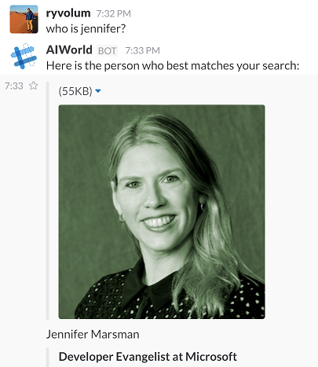

# Knowledge base bots

##Teaching bots to answer questions about any topic

We're frequently seeing the value of bots that can reason over a corpus of data to find and return a piece of information - we call these knowledge bots. Knowledge bots can be used in several scenarios:

* Event bot that answers questions like, "What bot events are there at this conference?", "When is the next Reggae show?" or "Who is Tame Impala?"
* Help desk bot that answers questions from help articles like "How do I update my operating system?" or "Where do I go to reset my password?"
* Contact bot that provides information about relevant contacts, answering questions like, "Who is John Doe?" or "What is Jane Doe's email address?"

In all cases, knowledge bots are informing their answer on some underlying data, be it relational data in a SQL database, JSON data in a non-relational store or PDFs in a document store. 

In building several of these bots we've stumbled upon some best practices, which we will delve into here. 

# Use existing services to build your knowledge bot

Bots are new user interfaces, but they can still leverage the same services we've used in app development. Knowledge bots necessarily require a data store, so storage services (relational or non-relational) are a necessary consideration. We might need to build an API to access that data, or analytics services to process it. Further, we may consider leveraging cognitive services, like the Knowledge Exploration Service to inform our bot. 

## Search 
A particularly valuable tool to build bots with is search. Search algorithms enable a few interesting things for us:

For one, fuzzy search keeps users from having to type exact matches (e.g. "who is jennifer?" instead of "jennifer marsman", "impala" instead of "Tame Impala")

Search scores allow us to determine the confidence that we have about a specific search - allowing us to decide whether a piece of data is what a user is looking, order results based on our confidence, and curb our bot output based on confidence (e.g. "Hmm... were you looking for any of these events?" vs "Here is the event that best matches your search:") 

### A good knowledge bot should be more than just a search engine! 
I know, we just said that search is a great tool for building bots, but this doesn't mean that a bot should JUST be a search engine. Often we are approached by partners who wish to replace an ineffective search with a bot. Our response is generally that if their current search is ineffective, then their bot will probably be ineffective as well. A bot is just a new interface to existing data and services - that data needs to be massaged, indexed and organized to be effectively searched, regardless of the interface. 

If the primary motivation for building a bot is to perform a basic search, then you probably don't need a bot. Why use a conversational interface when a text bar on a website can perform the same functionality? Instead of using bots to perform basic searches, we can use them to guide a user to the data they are looking for. 

### Using Search to Guide a Conversation
Knowledge bots are generally most effective when they guide the conversation. Conversations are made up of a back-and-forth between a user and a bot. This enables bots to ask clarifying questions, present options, and validate outcomes in a way that a basic search is incapable of doing. In the following example we guide a user through a conversation that facets and filters a dataset until it finds what a user is looking for:

This bot clearly gives users information about the optional categories and guides them through the data. This is a considerably better experience than leaving the chat entirely open ended and having to accept any user input. Once users find the information that they are looking for, we can train them on the most efficient way to find that answer using natural language:

## Azure Search
We can use Azure search to create an efficient search index that we can easily search, facet and filter over. Full details on pushing data into a data source and creating a search index can be found [here](https://github.com/ryanvolum/AzureSearchBot), but let's briefly take a look at what a search index looks like and how we can query it to create a powerful knowledge bot. Indeces can be created programatically, but for the sake of simplicity this demonstrates how to set up a search index in the portal:

Let's assume we want to be able to access all properties of our data store - in order to accomplish this we set all properties as "retrievable". We want to be able to search over the names of the musicans in our data store, so we set "Name" as searchable. Finally, we want to be able to facet and filter over musician's eras, so we mark "Eras" as both facetable and filterable. Faceting allows us to determine what types of a specific property there are (basically finding all the distinct examples), along with their magnitudes:

Filtering in turn allows us to pick out instances of the specific property selected.

## QnA Maker
For simple FAQ bots that accept a question and just give an answer, QnA Maker is a very powerful tool. QnA Maker has a built in crawler to scrape questions and answers from an existing FAQ site; you can also manually enter questions and answers into your bot. Behind the scenes QnA Maker is using NLP tools, so answers can be triggered to questions that were worded in a different way. It's important to note that for now QnA Maker does not have any semantic language understanging. This is to say that on its own it neither knows that a puppy is a kind of dog nor that vodka is a kind of liquor. I'll give an example. Through the web interface we train our knowledge base with three QnA pairs:

When testing in the GUI we see that our bot correctly answers the questions we trained it with:

But we notice that when we ask, "can I bring my rum?" we get the answer about bringing dogs. This is because the two questions are very similarly formed, so given that QnA Maker doesn't know what individual words mean it chose the wrong answer. It is then important to create your QnA pairs and then test your bot and retrain it as you go (note the menu on the left of the conversation that allows you to select an alternative action). 

## LUIS
NLP is a powerful tool for picking out the intent of a message and parsing out the entities in that message. When working with huge datasets though, it is infeasible to train an NLP model with every example of an entity. In a music player bot for example, a user might message "Play Reggae", "Play Bob Marley", or "Play One Love". These would all map to the intent "playMusic", but without being trained with every artist, genre and song name, a natural language processing model will not be able to pick out whether the entity is a genre, artist or song. We can instead use the NLP model to give us back a generic entity of type "music" and search our data store for the entity to determine how to proceed. 

## Azure Search and QnA Maker, and LUIS, oh my!
We've noted that Search, QnA Maker and LUIS are all powerful tools in building knowledge bots, but how do we choose which one to use? Can we use them together?

The answer, of course, is that it depends on the use case. If your bot is a simple question-answer bot that only needs to answer questions from an existing FAQ, then QnA Maker should have you covered. If your bot needs to have a dialog (more of a back-and-forth) based on an inputted utterance, then you can use LUIS model (or several) to identify an intent that kicks off that dialog. And of course, if your bot relies on a large data store then you will need to generate queries and/or perform searches. Of course real world bots will often need a combination of these abilities, so let's discuss how you might combine some of these tools.

### LUIS and Search
In our music festival bot example we completely guide the conversation by showing buttons that represent the lineup, but it's entirely conceivable that we would want to find information using natural language, asking questions like "what kind of music does Romit Girdhar play?". We can of course train a model with the intent, "answerGenre" and the entity "musicianName" with trained examples like the former. Our bot web service can then take the musician name and perform a search against our Azure Search index. Given that there are so many potential musician names we can't train our model with every possible musician, so we have to give enough representative examples for LUIS to properly make an assertion of the entity at hand. Let's take a look at an example.

We train our model with a few examples of musicians: 

When testing this model with new utterances like, "what kind of music do the beatles play?", we find that LUIS successfully picks out the intent "answerGenre" and the entity "the beatles", but if we try a longer example like, "what kind of music does the devil makes three play?" this model picks out the entity as "the devil":

It is then important to train our model with example entities that are representative of the underlying dataset. In general, it is better for our model to err by picking out too much in its entity recognition (like "John Smith please" from the utterance "Call John Smith please"), then to pick out too little (just "John"). This is because our search index will be able to weed out irrelevant words like, "please"

### LUIS and QnA Maker
Oftentimes we find scenarios where we can leverage QnA Maker to answer basic questions, but still need LUIS to determine intents, extract entities and kick off more elaborate dialogs. Envision a simple IT Help desk bot. This bot might be able to answer questions about Windows builds or Outlook, but it might also need to be able to handle password reset, which requires intent recognition and a back-and-forth conversation. There are a few ways we can handle this hybrid approach:

1. Call both at once - the first to return a score of a specific threshold gets to respond. 
2. Call LUIS first. If no intent meets a specific threshold score ("None" intent is triggered), then call QnA Maker. Alternatively, create a LUIS intent for QnA Maker, feeding your LUIS model with example QnA questions that map to "QnAIntent". 
3. Call QnA Maker first. If no answer meets a specific threshold score then call LUIS. 

Regardless of your approach, both LUIS and QnA Maker are supported as built in dialogs in both SDKs. So without having to make custom calls to either tool you can trigger dialogs or automatically answer questions using these two tools. As an example, if LUIS has allowed you to narrow down intent, you can trigger a "BasicQnAMakerDialog", as in [this doc](https://docs.botframework.com/en-us/azure-bot-service/templates/qnamaker/#navtitle) to kick off the process of answering a Q&A question.

### Choosing a threshold score
Given that scores returned by LUIS and QnA Maker are normalized, determining what a threshold score should be will largely be based on heuristics. This is to say that a score of .6 from a LUIS model may be pretty good in one model and not on another. Scores in different models (LUIS, QnA Maker, Azure Search indeces, etc.) are not comporable, as each are based on their own scoring criteria. So when using a hybrid approach test different inputs to determine what a good score is in each of your models.

# Show me examples!

* Basic knowledge base music explorer bot in [C#](https://trpp24botsamples.visualstudio.com/_git/Code?path=%2FCSharp%2Fsample-KnowledgeBot&version=GBmaster&_a=contents)
* Basic knowldege base music explorer bot in [Node](https://trpp24botsamples.visualstudio.com/_git/Code?path=%2FNode&version=GBmaster&_a=contents)
* Complex knowledge base real estate and job listing bots in [C#](https://github.com/Microsoft/BotBuilder/tree/master/CSharp/Samples/SearchPoweredBots)

