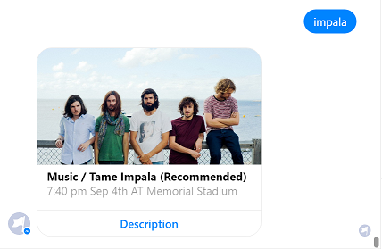
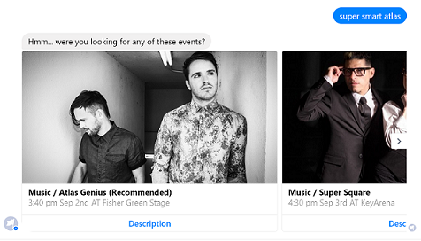
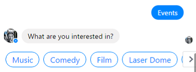
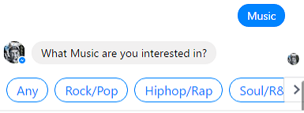
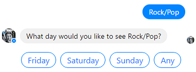
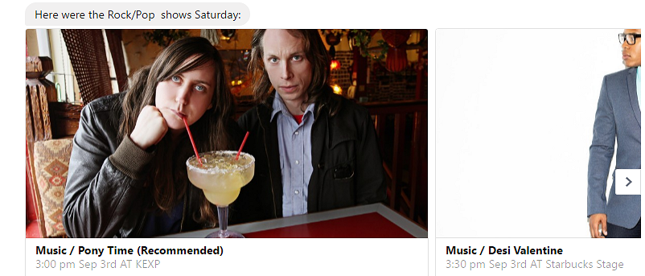

# Knowledge bots

## Introduction 

A knowledge bot can be designed to provide information about virtually any topic. 
For example, one knowledge bot might answer questions about events such as "What bot events are there at this conference?", "When is the next Reggae show?", or "Who is Tame Impala?" 
Another might answer IT-related questions such as "How do I update my operating system?" or "Where do I go to reset my password?" 
Yet another might answer questions about contacts such as "Who is John Doe?" or "What is Jane Doe's email address?" 

Regardless of the use case for which a knowledge bot is designed, its basic objective is always the same: 
find and return the information that the user has requested, 
by leveraging a body of data (relational data in a SQL database, 
JSON data in a non-relational store, PDFs in a document store, etc.). 
In this article, we'll explore some commonly-implemented knowledge bot capabilities and discuss related technologies. 

## Search

Search functionality can be a valuable tool within a bot. 

First, "fuzzy search" enables a bot to return information that's likely to be relevant to the user's question, 
without requiring that the user provide precise input. 
For example, if the user asks a music knowledge bot for information about "impala" (instead of "Tame Impala"), 
the bot can still respond with information that's most likely to be relevant to that input.

Additionally, search scores indicate the level of confidence for the results of a specific search, 
enabling a bot to order its results accordingly, or even tailor its communication based upon confidence level. 
For example, if confidence level is high, the bot may respond with "Here is the event that best matches your search:"

If confidence level is low, the bot may respond with "Hmm... were you looking for any of these events?"

### Using Search to Guide a Conversation

If your sole motivation for building a bot is to enable basic search engine functionality, 
then you may not need a bot at all. 
After all, why would users prefer a conversational interface when they can easily achieve their goal by using a typical search engine in a web browser? 

Knowledge bots are generally most effective when they are designed to guide the conversation. 
A conversation is composed of a back-and-forth exchange between user and bot, which presents the bot 
with opportunities to ask clarifying questions, present options, and validate outcomes 
in a way that a basic search is incapable of doing. 
For example, the following bot guides a user through a conversation that facets and filters a dataset until it 
locates the information that the user is seeking.

By leveraging the user's input in each step and presenting the relevant options, the bot guides the user to the information that they're seeking. 
Once the bot delivers that information, it can even provide guidance about the most efficient way to find similar information in the future: 

## Azure Search

By using <a href="https://azure.microsoft.com/en-us/services/search/" target="_blank">Azure Search</a>, 
you can create an efficient search index that a bot can easily search, facet, and filter over. 
Let's briefly examine a search index that is created using the Azure portal: 

We want to be able to access all properties of our data store, so we set each property as "retrievable." 
We want to be able to find musicians by name, so we set the **Name** property as "searchable." 
Finally, we want to be able to facet and filter over musicians' eras, so we mark the **Eras** property as both "facetable" and "filterable." 

Faceting determines the values that exist in the data store for given property, along with the magnitude of each value. 
The following screenshot shows that there are 5 distinct eras in this data store:

Filtering, in turn, selects only the specified instances of a certain property. 
For example, we could filter the result set above to contain only items where **Era** is equal to "Romantic." 

> [!NOTE]
> See <a href="https://github.com/ryanvolum/AzureSearchBot" target="_blank">here</a> 
> for a complete example of a knowledge bot that is created using Azure Document DB, Azure Search, and the 
> Microsoft Bot Framework.
> 
> For the sake of simplicity, the example above shows a search index that is created using the Azure portal. 
> Indeces can also be created programatically.

## QnA Maker

Some knowledge bots may simply aim to answer frequently asked questions (FAQs). 
<a href="https://www.microsoft.com/cognitive-services/en-us/qnamaker" target="_blank">QnA Maker</a> 
is a powerful tool that's designed specifically for this use case. 
QnA Maker has the built-in ability to scrape questions and answers from an existing FAQ site, 
and also allows you to manually configure your own custom list of questions and answers. 
It has natural languaging processing (NLP) abilities, enabling it to even provide answers to questions that are worded 
(slightly) differently than expected. 
However, it does not have semantic language understanding abilities. 
That is, on it's own, it cannot determine that a puppy is a type of dog, nor that vodka is a type of liquor. 

Let's review an example. Using the QnA Maker web interface, we configure a knowledge base with three question and answer pairs: 

Then, we test it by asking a series of questions: 

The bot correctly answers the questions that directly map to the ones that were configured in the knowledge base. 
However, it incorrectly responds to the question "can I bring my rum?". 
Because this question is most similar in structure to the question "can I bring my dog?", and 
because QnA Maker does not inherently understand the meaning of words 
(i.e., it does not know that "rum" is a type of liquor), it answers "Dogs are not allowed." 

> [!TIP]
> Create your QnA pairs and then test and re-train your bot, by using 
> the menu on the left side of the conversation to select an alternative answer for each 
> incorrect answer that is given. 

## LUIS
NLP is a powerful tool for picking out the intent of a message and parsing out the entities in that message. When working with huge datasets though, it is infeasible to train an NLP model with every example of an entity. In a music player bot for example, a user might message "Play Reggae", "Play Bob Marley", or "Play One Love". These would all map to the intent "playMusic", but without being trained with every artist, genre and song name, a natural language processing model will not be able to pick out whether the entity is a genre, artist or song. We can instead use the NLP model to give us back a generic entity of type "music" and search our data store for the entity to determine how to proceed. 

## Azure Search and QnA Maker, and LUIS, oh my!
We've noted that Search, QnA Maker and LUIS are all powerful tools in building knowledge bots, but how do we choose which one to use? Can we use them together?

The answer, of course, is that it depends on the use case. If your bot is a simple question-answer bot that only needs to answer questions from an existing FAQ, then QnA Maker should have you covered. If your bot needs to have a dialog (more of a back-and-forth) based on an inputted utterance, then you can use LUIS model (or several) to identify an intent that kicks off that dialog. And of course, if your bot relies on a large data store then you will need to generate queries and/or perform searches. Of course real world bots will often need a combination of these abilities, so let's discuss how you might combine some of these tools.

### LUIS and Search
In our music festival bot example we completely guide the conversation by showing buttons that represent the lineup, but it's entirely conceivable that we would want to find information using natural language, asking questions like "what kind of music does Romit Girdhar play?". We can of course train a model with the intent, "answerGenre" and the entity "musicianName" with trained examples like the former. Our bot web service can then take the musician name and perform a search against our Azure Search index. Given that there are so many potential musician names we can't train our model with every possible musician, so we have to give enough representative examples for LUIS to properly make an assertion of the entity at hand. Let's take a look at an example.

We train our model with a few examples of musicians: 

When testing this model with new utterances like, "what kind of music do the beatles play?", we find that LUIS successfully picks out the intent "answerGenre" and the entity "the beatles", but if we try a longer example like, "what kind of music does the devil makes three play?" this model picks out the entity as "the devil":

It is then important to train our model with example entities that are representative of the underlying dataset. In general, it is better for our model to err by picking out too much in its entity recognition (like "John Smith please" from the utterance "Call John Smith please"), then to pick out too little (just "John"). This is because our search index will be able to weed out irrelevant words like, "please"

### LUIS and QnA Maker
Oftentimes we find scenarios where we can leverage QnA Maker to answer basic questions, but still need LUIS to determine intents, extract entities and kick off more elaborate dialogs. Envision a simple IT Help desk bot. This bot might be able to answer questions about Windows builds or Outlook, but it might also need to be able to handle password reset, which requires intent recognition and a back-and-forth conversation. There are a few ways we can handle this hybrid approach:

1. Call both at once - the first to return a score of a specific threshold gets to respond. 
2. Call LUIS first. If no intent meets a specific threshold score ("None" intent is triggered), then call QnA Maker. Alternatively, create a LUIS intent for QnA Maker, feeding your LUIS model with example QnA questions that map to "QnAIntent". 
3. Call QnA Maker first. If no answer meets a specific threshold score then call LUIS. 

Regardless of your approach, both LUIS and QnA Maker are supported as built in dialogs in both SDKs. So without having to make custom calls to either tool you can trigger dialogs or automatically answer questions using these two tools. As an example, if LUIS has allowed you to narrow down intent, you can trigger a "BasicQnAMakerDialog", as in [this doc](https://docs.botframework.com/en-us/azure-bot-service/templates/qnamaker/#navtitle) to kick off the process of answering a Q&A question.

### Choosing a threshold score
Given that scores returned by LUIS and QnA Maker are normalized, determining what a threshold score should be will largely be based on heuristics. This is to say that a score of .6 from a LUIS model may be pretty good in one model and not on another. Scores in different models (LUIS, QnA Maker, Azure Search indeces, etc.) are not comporable, as each are based on their own scoring criteria. So when using a hybrid approach test different inputs to determine what a good score is in each of your models.

## Use existing services to build your knowledge bot

Bots are new user interfaces, but they can still leverage the same services we've used in app development. 
Knowledge bots necessarily require a data store, so storage services (relational or non-relational) are a necessary consideration. 
We might need to build an API to access that data, or analytics services to process it. 
Further, we may consider leveraging cognitive services, like the Knowledge Exploration Service to inform our bot. 

## Additional resources

In this article, we explored how a task automation bot can be designed to enable users
to complete a specific task or set of tasks. To access the sample code for the password-reset bot 
described in this article, see: 

> [!NOTE]
> To do: Add links to the C# and Node.js code samples that Mat refers to.

