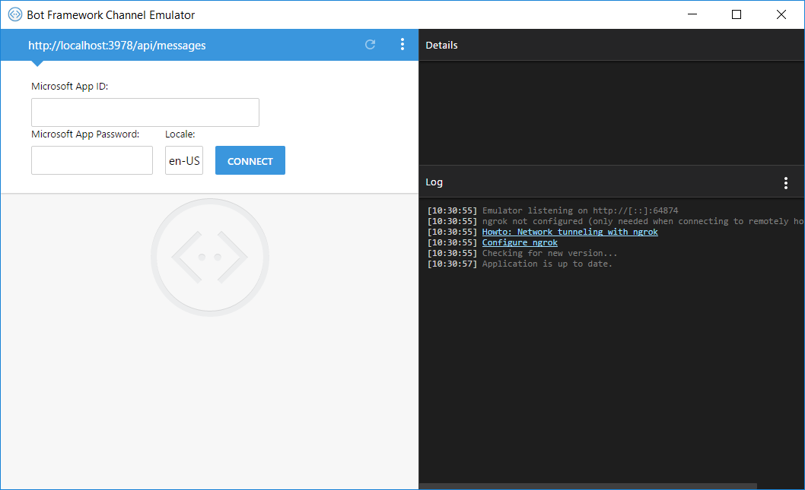
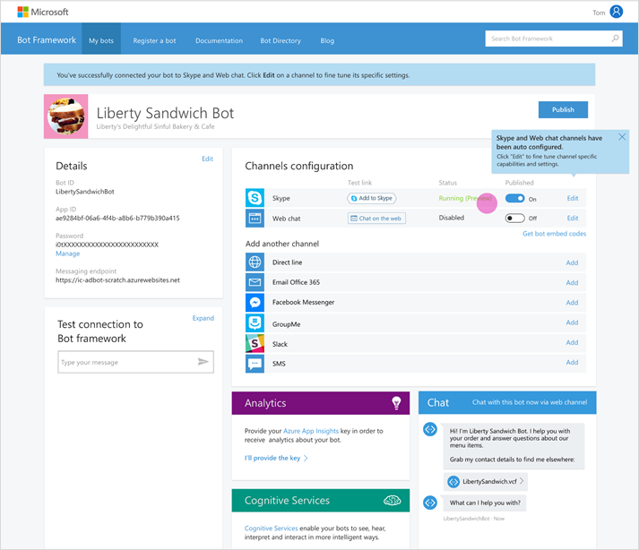
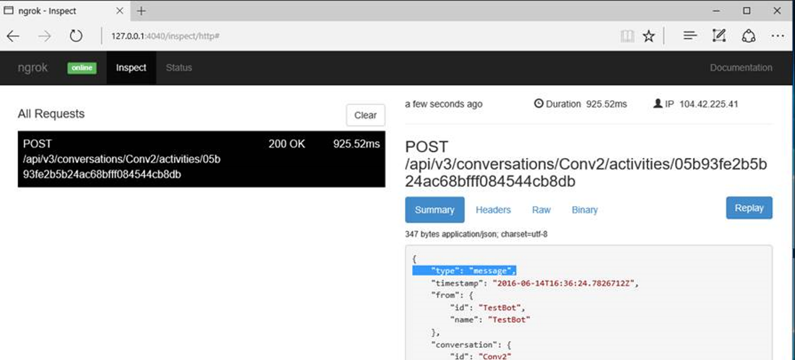

# Bot Framework Emulator
The Bot Framework Emulator is a desktop application that allows bot developers to test and debug their bots, either locally or remotely. 
It's one of your most powerful tools in building your bot, including the following features:

* Support for Mac, Linux and Windows
* Support for all the Bot Framework card types
* Multiple profiles for when you’re working locally or remotely
* Simplifies configuration for working with ngrok
* Uses the webchat control for higher fidelity layout and consistency with the webchat experience
* Send requests and receive responses to/from your bot endpoint on localhost
* Inspect the JSON response from the bot
* Emulate a specific user and/or conversation
<!-- end section to remove -->

When you develop your bot, try your Bot's web service in the emulator first. The emulator allows local debugging of your Bot logic, before deploying to the cloud.

## Before you get started
* Download and run the Bot Framework Emulator. The latest setup.exe is available from the [emulator download page](https://emulator.botframework.com) (download starts immediately), or from the [GitHub releases page](https://github.com/Microsoft/BotFramework-Emulator/releases).
* Know what to enter for your bot's endpoint into the emulator's address bar. This value differs based on whether your bot is [running on localhost](#localhost), [hosted remotely](#remotehost), or [running as an Azure Bot service](#azurehost).
* If your bot is running with Microsoft Account (MSA) credentials, have those credentials ready too.
* If your bot is hosted remotely, ensure that [ngrok tunneling software](#ngrok) is installed and configured. The Bot Framework Emulator is tightly integrated with ngrok and can launch it for you when needed. 
<!-- Learn more about what ngrok is, how the emulator utilizes ngrok, and how to configure it. -->

##  Connect to a bot running on localhost
When developing a bot using the BotBuilder SDK, the default endpoint for local debugging is http://localhost:3978/api/messages. This is where the bot will be listening for messages when hosted locally.

For localhost debugging you will not typically need to enter MSA appId or password, although it is supported if your bot requires it.

To connect, enter your bot's endpoint into the address bar and click on the Connect button:

##  Connect to a bot hosted remotely
This scenario is similar to the localhost scenario, but with two additional requirements:
* You will need to enter your bot's MSA appId and password.
* You must run tunneling software [(ngrok)](#ngrok) so that the remotely hosted bot can reply to you.  
<!-- TODO: Add link to Register, Deploy, Configure -->

If you registered your bot with the Bot Framework, you can retrieve endpoint and MSA appId from its registration page. If you do not already know the MSA password of your bot, 
a new one can be generated from the <a href="https://dev.botframework.com/" target="_blank">registration page</a>.

##  Connect to an Azure Bot service
This scenario is similar to the remotely hosted scenario, but there are extra steps involved in discovering your bot's endpoint. <!-- is this true? -->
When you create an Azure Bot Service, a registration for it is created with the Bot Framework. 
Your endpoint can be found on your bot's registration page on the <a href="https://dev.botframework.com/" target="_blank">Bot Framework Dev Portal</a>.

<!--
 -->

Learn more about [Azure Bot Services][AzureBotServices].

## ngrok
If you're running the Bot Framework Emulator behind a firewall or other network boundary and want to connect to a bot hosted remotely, you will need to install and configure tunneling software.
Computers running behind firewalls and home routers are not able to accept ad-hoc incoming requests from the outside world. 
Tunneling software provides a way around this by creating a bridge from outside the firewall to your local machine. The [ngrok][ngrokDownload] tool, developed by [inconshreveable][inconshreveable], is an example of such tunneling software.

The Bot Framework Emulator integrates tightly with ngrok and can launch it for you when it is needed.

### Insalling & Configuring ngrok

1. Download the [ngrok][ngrokDownload] executable to your local machine
2. Configure the path to ngrok in the emulator's App Settings dialog

1. Verify that the emulator is able to successfully launch ngrok.

If you've followed these steps but the emulator is not able to launch ngrok, ensure you have ngrok version 2.1.18 or later. Earlier versions have been known to be incompatible.
To check ngrok's version, from the command line:

<code>ngrok -v</code>

## Debugging your bot

* **Try a blank ID and password**. Using a blank "Microsoft App Id" and "Microsoft App Password" in the emulator and web.config (while keeping the BotAuthentication attribute) will allow you to rule out authentication as a possible issue.
* **Inspect HTTPS method calls**. Since the exchange of chat messages will likely result in several HTTPS method calls, it's important to make sure that they all succeed.  You can see the result of every HTTPS method call by selecting the different items in the list view on the left-hand side of the emulator window.

## Troubleshooting

### How can I reset the Bot Framework Emulator's settings?

You can remove the emulator.service file in `%temp%` with `erase %temp%\emulator.service`.

### What is the difference between the "Bot Url" and "Emulator Url" in the emulator?

The "Bot Url" is the web service url that executes your Bot's code.  The "Emulator Url" is a *different* web service url that emulates the Bot Framework Connector service.  They should not be the same.  Generally, you will want to leave the "Emulator Url" as the default value, and update the "Bot Url" to the url for your Bot web service.

> [!NOTE]
> More content coming soon.

## Next Steps
> [!NOTE]
> Content coming soon.

<!-- Links -->
[EmulatorGithub]: https://github.com/Microsoft/BotFramework-Emulator

[ngrokDownload]: https://ngrok.com/
[inconshreveable]: https://inconshreveable.com/
[BotFrameworkDevPortal]: https://dev.botframework.com/
[AzureBotServices]: https://docs.botframework.com/en-us/azure-bot-service/

[EmulatorConnectPicture]: media/emulator/emulator-connect_localhost_credentials.png
[EmulatorNgrokPath]: media/emulator/emulator-configure_ngrok_path.png
[EmulatorNgrokMonitor]: media/emulator/emulator-testbot-ngrok-monitoring.png

