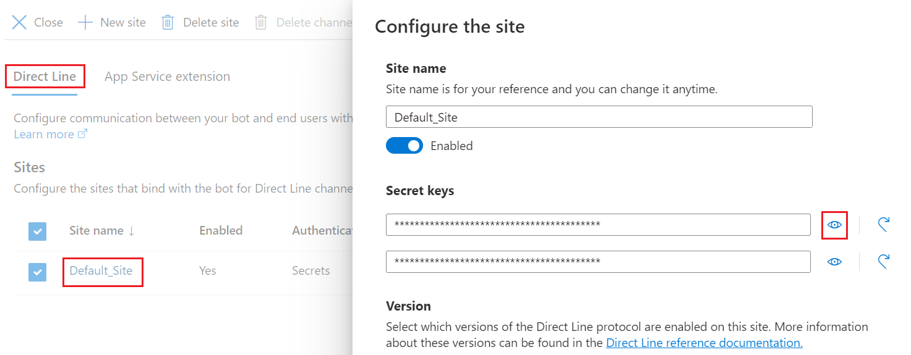

# Connect a bot to Direct Line

This article describes the **Direct Line channel**. You use it to allow your own client application to communicate with a bot.

## Add the Direct Line channel

The first thing you must do is to add the Direct Line channel to the bot.

1. In your browser, navigate to the [Azure Portal](https://portal.azure.com/).
1. In the left panel, click the **Channels** item.
1. In the right panel, under *Add a featured channel*, click the **Direct Line** icon (marked in red in the picture below).

    

1. The **Configure Direct Line** page is displayed. Click the **Done** button at the bottom of the page.

     

    This adds the Direct Line channel to the bot, as shown in the picture below.

    

## Add new site

1. In the *Connect to channels*, click the **Edit** link by the Direct Line.
1. In the *Configure Direct Line*, click **Add new site** and enter a name for your site. This represents the client application that you want to connect to the bot.
1. Click **Done**.

## Manage secret keys

When your site is created, the Bot Framework generates secret keys that your client application can use to [authenticate](~/rest-api/bot-framework-rest-direct-line-3-0-authentication.md) the Direct Line API requests that it issues to communicate with your bot.

1. To view a key in plain text, click **Show** for the corresponding key.

    

1. Copy and securely store the key that is shown. Then use the key to [authenticate](~/rest-api/bot-framework-rest-direct-line-3-0-authentication.md) the Direct Line API requests that your client issues to communicate with your bot.

    

1. Alternatively, use the Direct Line API to [exchange the key for a token](~/rest-api/bot-framework-rest-direct-line-3-0-authentication.md#generate-token) that your client can use to authenticate its subsequent requests within the scope of a single conversation.

## Configure settings

Finally, configure settings for the site.

1. Select the Direct Line protocol version that your client application will use to communicate with your bot.

    > [!TIP]
    > If you are creating a new connection between your client application and bot, use Direct Line API 3.0.

1. When finished, click **Done** to save the site configuration. You can repeat this process, beginning with [Add new site](#add-new-site), for each client application that you want to connect to your bot.

When you have the **enhanced authentication enabled**, you will see the following behavior for which trusted origins are used:

- If you configure trusted origins as part of the configuration UI page, then these will **always** be used as the only set. Sending no or additional trusted origins when generating a token or starting a conversation will be ignored (i.e. they are **not appended** to the list or cross validated).
- If you have not configured trusted origins as part of the configuration UI, then any value you send as part of the API calls will be used.