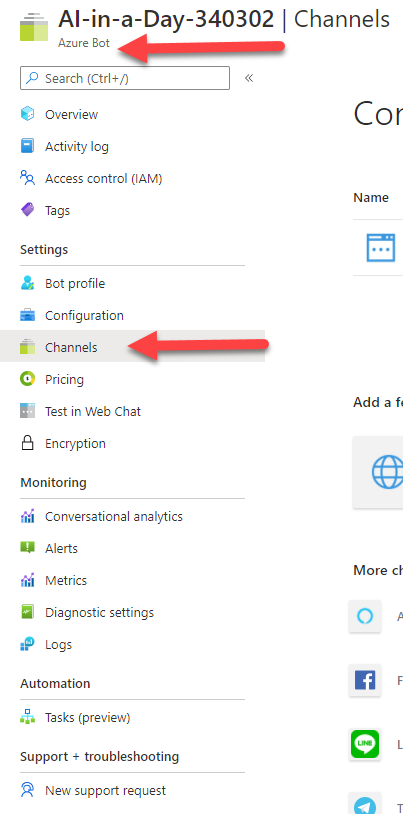
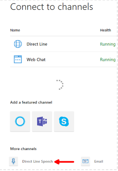
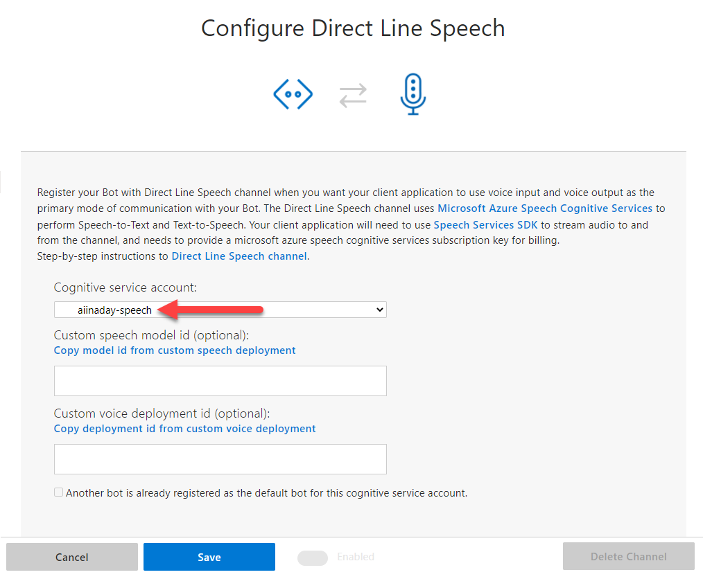
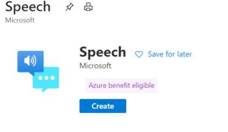
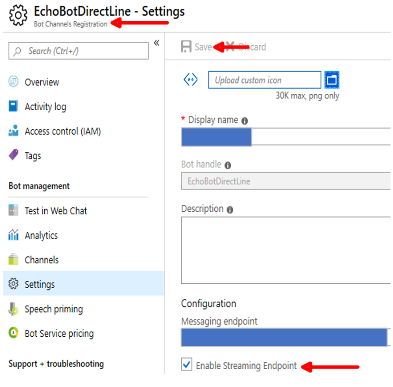
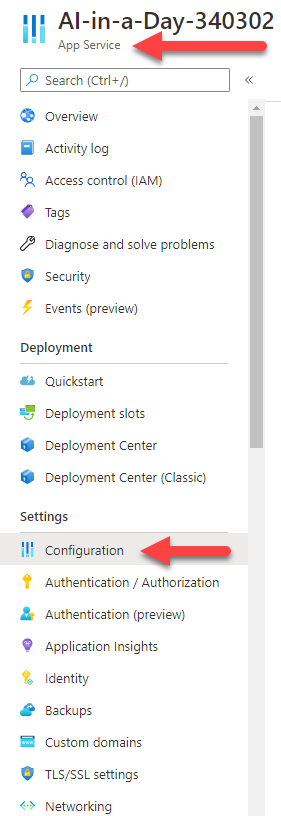
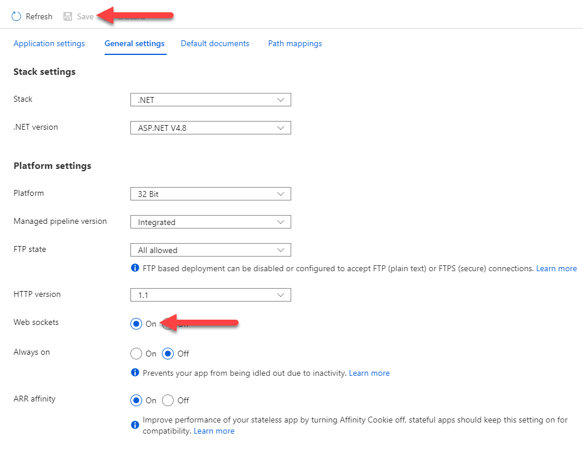

# Connect a bot to Direct Line Speech

[!INCLUDE[applies-to-v4](includes/applies-to.md)]

You can configure your bot to allow client applications to communicate with it through the Direct Line Speech channel.

Once you have built your bot, onboarding it with Direct Line Speech will enable low latency, high reliability connection with client applications using the [Speech SDK](https://aka.ms/speech/sdk). These connections are optimized for voice in, voice out conversational experiences. For more information on Direct Line Speech and how to build client applications, visit the [custom voice-first virtual assistant](https://aka.ms/bots/speech/va) page.

## Add the Direct Line Speech channel

1. To add the Direct Line Speech Channel, first open the bot in the [Azure Portal](https://portal.azure.com), From your resources, select your **Bot Channel Registration** resource. Click on **Channels** in the configuration blade.

    

1. In the channel selection page, find and click `Direct Line Speech` to choose the channel.

    

1. Direct Line Speech Channel requires a Cognitive Services resource, specifically a **speech** cognitive service resource. You can either use an existing resource or create a new one.

    

    To create a new speech resource follow these steps:

    - Go to the [Azure portal create resources](https://ms.portal.azure.com/#create/hub).
    - Search for *Speech* and select it from the drop-down list. The following is displayed:

        

    - Follow the wizard steps.

    For additional information, see [Create a Cognitive Services resource](https://docs.microsoft.com/azure/cognitive-services/cognitive-services-apis-create-account).

1. Once you've reviewed the terms of use, click `Save` to confirm your channel selection.

    

## Enable the Bot Framework Protocol Streaming Extensions

With the Direct Line Speech channel connected to your bot, you now need to enable Bot Framework Protocol Streaming Extensions support for optimal, low-latency interaction.

1. If you haven't already, open the blade for your bot in the [Azure Portal](https://portal.azure.com).

1. Click on **Settings** under the **Bot Management** category (right below **Channels**). Click the checkbox for **Enable Streaming Endpoint**.

    

1. At the top of the page, click **Save**.

1. On the same blade, under the **App Service Settings** category, click **Configuration**.

    

1. Click on `General settings` and then select the option to enable `Web socket` support.

    

1. Click `Save` at the top of the configuration page.

1. The Bot Framework Protocol Streaming Extensions are now enabled for your bot. You are now ready to update your bot code and [integrate Streaming Extensions support](https://aka.ms/botframework/addstreamingprotocolsupport) to an existing bot project.

## Adding protocol support to your bot

With the Direct Line Speech channel connected and support for the Bot Framework Protocol Streaming Extensions enabled, all that's left is to add code to your bot to support the optimized communication. Follow the instructions on [adding Streaming Extensions support to your bot](https://aka.ms/botframework/addstreamingprotocolsupport) to ensure full compatibility with Direct Line Speech.

