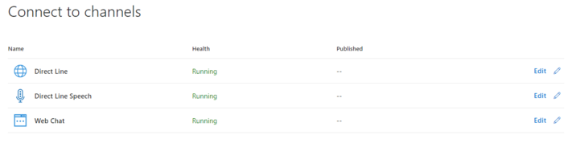
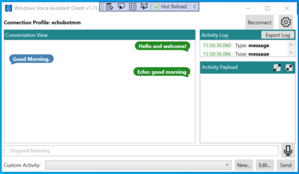

# Connect a bot to Direct Line Speech

[!INCLUDE [applies-to-v4](includes/applies-to-v4-current.md)]

This article describes how to connect a bot to the **Direct Line Speech channel**. Use this channel to allow users to interact with a bot via voice.

Once you've built your bot, onboarding it with Direct Line Speech will enable low latency, high reliability connection with client applications using the [Speech SDK](/azure/cognitive-services/speech-service/). These connections are optimized for voice in and voice out conversational experiences. For more information on Direct Line Speech and how to build client applications, visit the [custom voice-first virtual assistant](/azure/cognitive-services/Speech-Service/voice-assistants) page.

## Prerequisites

 The Direct Line Speech channel requires a **Cognitive Services** resource, specifically a **speech** cognitive service resource. You can either use an existing resource or create a new one. To create a new speech resource follow these steps:

1. In your browser, navigate to the [Azure portal](https://ms.portal.azure.com/#create/hub) to create resources.
1. In the left panel, click **Create a resource**.
1. In the right panel, enter **speech** in the search box.
1. In the the drop-down list select **Speech** as displayed in the following image:

    

1. Click **Create** and follow the wizard steps.

    For additional information, see [Create a Cognitive Services resource](/azure/cognitive-services/cognitive-services-apis-create-account).

## Add the Direct Line Speech channel

1. In your browser, navigate to the [Azure Portal](https://portal.azure.com).
1. From your resources, select the **Bot Channel Registration** or **Web App Bot** resource, depending on how you deployed the bot.
1. In the left panel, select  **Channels**.

    

1. In right panel, click the **Direct Line Speech** icon.

    

1. Configure the Direct Line Speech as shown in the picture below. Specifically, add the Cognitive service account (**speech service**) mentioned in the [Prerequisites](#prerequisites) section.

    

1. Once you've reviewed the terms of use, click `Save` to confirm your channel selection. This will add the channel to the bot.

    

## Enable the Bot Framework Protocol Streaming Extensions

With the Direct Line Speech channel connected to your bot, you now need to enable Bot Framework Protocol Streaming Extensions support for optimal, low-latency interaction.

1. In the left panel, select **Settings**.
1. In the right panel, check the box by the **Enable Streaming Endpoint**.

    

1. At the top of the page, click **Save**.

1. Navigate to the bot app service.
1. In the left panel, in the **App Service Settings** category, select **Configuration**.

    

1. In the right panel, select the `General settings` tab.
1. Set `Web sockets` to **On**.

    

1. Click `Save` at the top of the configuration page.

1. The Bot Framework Protocol Streaming Extensions are now enabled for your bot. You are now ready to update your bot code and [integrate Streaming Extensions support](directline-speech-bot.md) to an existing bot project.

## Example

If you have followed all the steps described, you can talk to the bot using the client application downloadable at this location: [Windows Voice Assistant Client](https://github.com/Azure-Samples/Cognitive-Services-Voice-Assistant/blob/master/clients/csharp-wpf/README.md#windows-voice-assistant-client).

The following picture shows the client application interface when communicating with a simple echo bot. See also [Voice-enable your bot using the Speech SDK](https://docs.microsoft.com/azure/cognitive-services/speech-service/tutorial-voice-enable-your-bot-speech-sdk).

## Adding protocol support to your bot

> [!NOTE]
> The following step is only needed for bots built before the release of the 4.8 SDKs.

With the Direct Line Speech channel connected and support for the Bot Framework Protocol Streaming Extensions enabled, all that's left is to add code to your bot to support the optimized communication. Follow the instructions on [adding Streaming Extensions support to your bot](directline-speech-bot.md) to ensure full compatibility with Direct Line Speech.
