# Connect a bot to Facebook

Your bot can be connected to both Facebook Messenger and Facebook Workplace, so that it can communicate with users on both platforms. The following tutorial shows how to connect a bot to these two channels.

> [!NOTE]
> The Facebook UI may appear slightly different depending on which version you are using.

## Connect a bot to Facebook Messenger

> [!NOTE]
> Starting December 16, 2019, Workplace by Facebook is changing security model for custom integrations.  Current integrations built with Microsoft Bot Framework need to be updated to use Bot Framework Adapter (available in JavaScript/Node.js) and deployed using a Web App on Azure.  New Workplace bots that are developed using Microsoft Bot Framework should also use the JavaScript Facebook adapter. Learn more about [using Facebook adapter](https://aka.ms/botframework-workplace-adapter). Instructions below will work only until December 16, 2019.

To learn more about developing for Facebook Messenger, see the [Messenger platform documentation](https://developers.facebook.com/docs/messenger-platform). You may wish to review Facebook's [pre-launch guidelines](https://developers.facebook.com/docs/messenger-platform/product-overview/launch#app_public), [quick start](https://developers.facebook.com/docs/messenger-platform/guides/quick-start), and [setup guide](https://developers.facebook.com/docs/messenger-platform/guides/setup).

To configure a bot to communicate using Facebook Messenger, enable Facebook Messenger on a Facebook page and then connect the bot.

### Copy the Page ID

The bot is accessed through a Facebook Page.

1. [Create a new Facebook Page](https://www.facebook.com/bookmarks/pages) or go to an existing Page.

1. Open the Facebook Page's **About** page and then copy and save the **Page ID**.

### Create a Facebook app

1. In your browser, navigate to [Create a new Facebook App](https://developers.facebook.com/quickstarts/?platform=web).
1. Enter the name of your app and click  the **Create New Facebook App ID** button.

    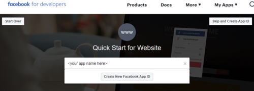

1. In the displayed dialog, enter your email address and click the **Create App ID** button.

    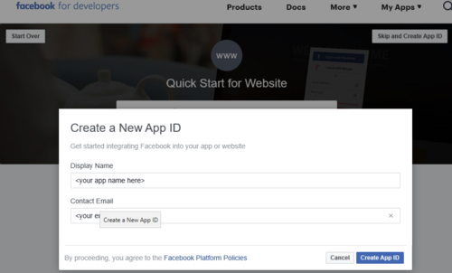

1. Go through the wizard steps.

1. Enter the required check information, then click the **Skip Quick Start** button in the upper right.

1. In the left pane of the next displayed window, expand *Settings* and click **Basic**.

1. In the right pane, copy and save the **App ID** and **App Secret**.

    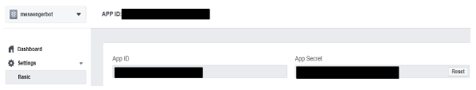

1. In the left pane, under *Settings*, click **Advanced**.

1. In the right pane, set **Allow API Access to App Settings** slider to **Yes**.

    

1. In the page bottom right, click the **Save Changes** button.

### Enable messenger

1. In the left pane, click **Dashboard**.
1. In the right pane, scroll down and in the **Messenger** box, click the **Set Up** button. The Messenger entry is displayed under the *PRODUCTS* section in the left pane.  

    

### Generate a Page Access Token

1. In the left pane, under the Messenger entry, click **Settings**.
1. In the right pane, scroll down and in the **Token Generation** section, select the target page.

    

1. Click the **Edit Permissions** button to grant the app pages_messaging in order to generate an access token.
1. Follow the wizard steps. In the last step accept the default settings and click the **Done** button. At the end a **page access token** is generated.

    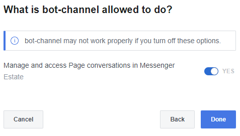

1. Copy and save the **Page Access Token**.

### Enable webhooks

In order to send messages and other events from your bot to Facebook Messenger, you must enable webhooks integration. At this point, let's leave the Facebook setting steps pending; will come back to them.

1. In your browser open a new window and navigate to the [Azure portal](https://portal.azure.com/). 

1. In the Resource list, click on the bot resource registration and in the related blade click **Channels**.

1. In the right pane, click the **Facebook** icon.

1. In the wizard enter the Facebook information stored in the previous steps. If the information is correct, at the bottom of the wizard, you should see the **callback URL** and the **verify token**. Copy and store them.  

    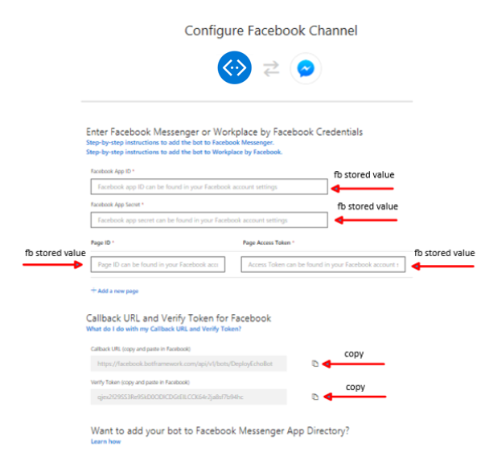

1. Click the **Save** button.

1. Let's go back to the Facebook settings. In the right pane, scroll down and in the **Webhooks** section, click the **Subscribe To Events** button. This is to forward messaging events from Facebook Messenger to the bot.

    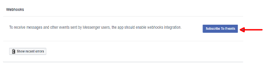

1. In the displayed dialog, enter the **Callback URL** and **Verify Token** values stored previously. Under **Subscription Fields**, select *message\_deliveries*, *messages*, *messaging\_optins*, and *messaging\_postbacks*.

    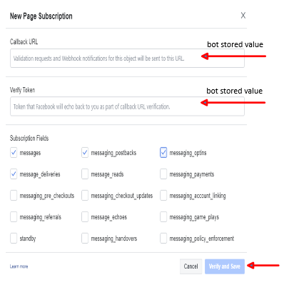

1. Click the **Verify and Save** button.
1. Select the Facebook page to subscribe the webhook. Click the **Subscribe** button.

    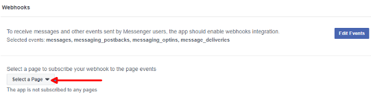

### Submit for review

Facebook requires a Privacy Policy URL and Terms of Service URL on its basic app settings page. The [Code of Conduct](https://investor.fb.com/corporate-governance/code-of-conduct/default.aspx) page contains third party resource links to help create a privacy policy. The [Terms of Use](https://www.facebook.com/terms.php) page contains sample terms to help create an appropriate Terms of Service document.

After the bot is finished, Facebook has its own [review process](https://developers.facebook.com/docs/messenger-platform/app-review) for apps that are published to Messenger. The bot will be tested to ensure it is compliant with Facebook's [Platform Policies](https://developers.facebook.com/docs/messenger-platform/policy-overview).

### Make the App public and publish the Page

> [!NOTE]
> Until an app is published, it is in [Development Mode](https://developers.facebook.com/docs/apps/managing-development-cycle). Plugin and API functionality will only work for admins, developers, and testers.

After the review is successful, in the App Dashboard under App Review, set the app to Public.
Ensure that the Facebook Page associated with this bot is published. Status appears in Pages settings.

## Connect a bot to Facebook Workplace

> [!NOTE]
> Starting December 16, 2019, Workplace by Facebook is changing security model for custom integrations.  Current integrations built using Microsoft Bot Framework v4 on JavaScript/Node.js need to be updated to use the Bot Framework [Facebook for Workplace Adapter](https://aka.ms/botframework-workplace-adapter) and deployed using Azure Web App to continue working past that date. New Microsoft Bot Framework bots that are targeting Workplace should also be developed using that adapter.

Facebook Workplace is a business-oriented version of Facebook, which allows employees to easily connect and collaborate. It contains live videos, news feeds, groups, messenger, reactions, search, and trending posts. It also supports:

- Analytics and integrations. A dashboard with analytics, integration, single sign-on, and identity providers that companies use to integrate Workplace with their existing IT systems.
- Multi-company groups. Shared spaces in which employees from different organizations can work together and collaborate.

See the [Workplace Help Center](https://workplace.facebook.com/help/work/) to learn more about Facebook Workplace and [Workplace Developer Documentation](https://developers.facebook.com/docs/workplace) for guidelines about developing for Facebook Workplace.

To use Facebook Workplace with your bot, you must create a Workplace account and a custom integration to connect the bot.

### Create a Workplace Premium account

1. Submit an application to [workplace](https://www.facebook.com/workplace) on  behalf of your company.
1. Once your application has been approved, you will receive an email inviting you to join. The response may take a while.
1. From the e-mail invitation, click **Get Started**.
1. Enter your profile information.
    > [!TIP]
    > Set yourself as the system administrator. Remember that only system administrators can create custom integrations.
1. Click **Preview Profile** and verify the information is correct.
1. Access *Free Trial*.
1. Create **password**.
1. Click **Invite Coworkers** to invite employees to sign-in. The employees you invited will become members as soon as they sign. They will go through a similar sign-in process as described in these steps.

### Create a custom integration

Create a [custom integration](https://developers.facebook.com/docs/workplace/custom-integrations-new) for your Workplace following the steps described below. When you create a custom integration, an app with defined permissions and a page of type 'Bot' only visible within your Workplace community are created.

1. In the **Admin Panel**, open the **Integrations** tab.
1. Click on the **Create your own custom App** button.

    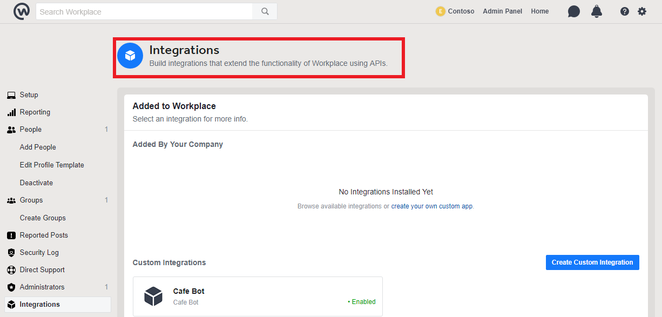

1. Choose a display name and a profile picture for the app. Such information will be shared with the page of type 'Bot'.
1. Set the **Allow API Access to App Settings** to "Yes".
1. Copy and safely store the App ID, App Secret and App Token that's shown to you.

    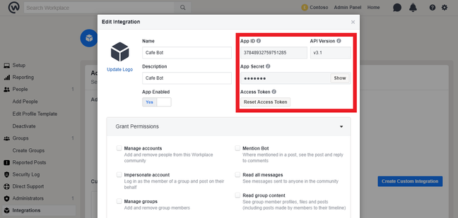

1. Now you have finished creating a custom integration. You can find the page of type 'Bot' in your Workplace community,as shown below.

    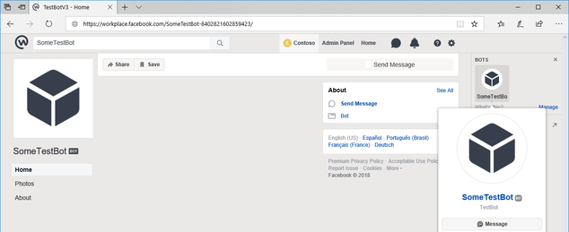

### Provide Facebook credentials

In Azure portal, paste the **Facebook App ID**, **Facebook App Secret** and **Page Access Token** values copied from the Facebook Workplace previously. Instead of a traditional pageID, use the numbers following the integrations name on its **About** page. Similar to connecting a bot to Facebook Messenger, the webhooks can be connected with the credentials shown in Azure.

### Submit for review
Please refer to the **Connect a bot to Facebook Messenger** section and [Workplace Developer Documentation](https://developers.facebook.com/docs/workplace) for details.

### Make the App public and publish the Page
Please refer to the **Connect a bot to Facebook Messenger** section for details.

## Setting the API version

If you receive a notification from Facebook about deprecation of a certain version of the Graph API, go to [Facebook developers page](https://developers.facebook.com). Navigate to your bot’s **App Settings** and go to **Settings > Advanced > Upgrade API version**, then switch **Upgrade All Calls** to 3.0.

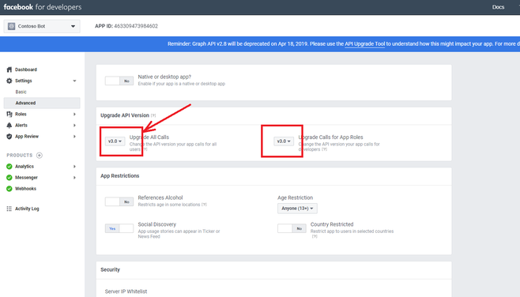

## See also

- **Sample code**. Use the <a href="https://aka.ms/facebook-events" target="_blank">Facebook-events</a> sample bot to explore the bot communication with Facebook Messenger.

- **Available as an adapter**. This channel is also [available as an adapter](https://botkit.ai/docs/v4/platforms/facebook.html). To help you choose between an adapter and a channel, see [Currently available adapters](bot-service-channel-additional-channels.md#currently-available-adapters).
