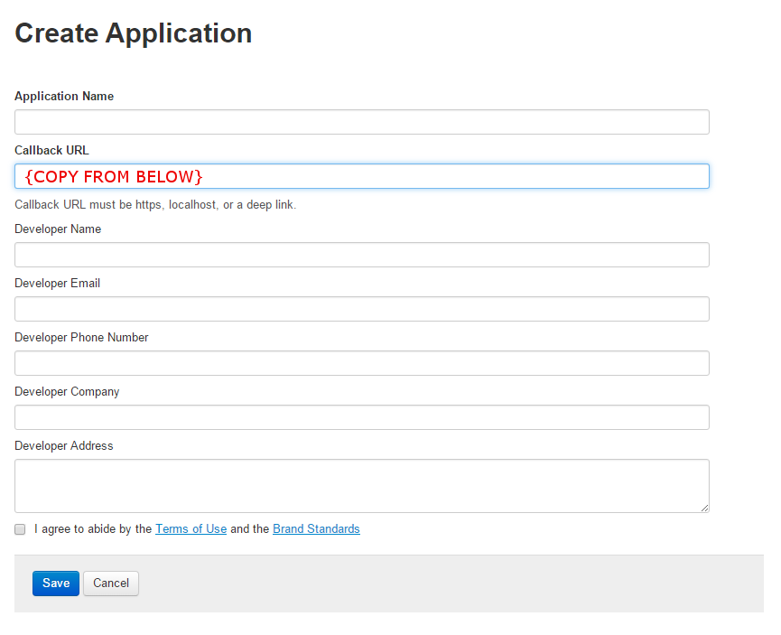
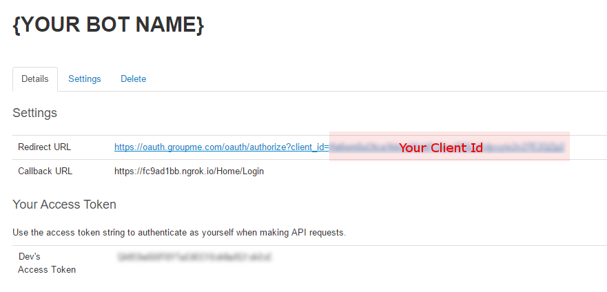
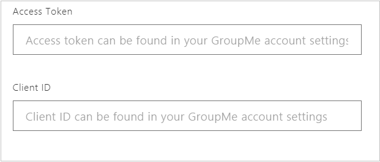

# Connect a bot to GroupMe

[!INCLUDE [applies-to-v4](includes/applies-to-v4-current.md)]

You can configure a bot to communicate with people using the GroupMe group messaging app.

[!INCLUDE [Channel Inspector intro](includes/snippet-channel-inspector.md)]

## Sign up for a GroupMe account

If you don't have a GroupMe account, [sign up for a new account](https://web.groupme.com/signup).

## Create a GroupMe application

[Create a GroupMe application](https://dev.groupme.com/applications/new) for your bot.

Use this callback URL: `https://groupme.botframework.com/Home/Login`

## Gather credentials

1. In the **Redirect URL** field, copy the value after **client_id=**.
1. Copy the **Access Token** value.

## Submit credentials

1. On dev.botframework.com, paste the **client_id** value you just copied into the **Client ID** field.
1. Paste the **Access Token** value into the **Access Token** field.
1. Click **Save**.

