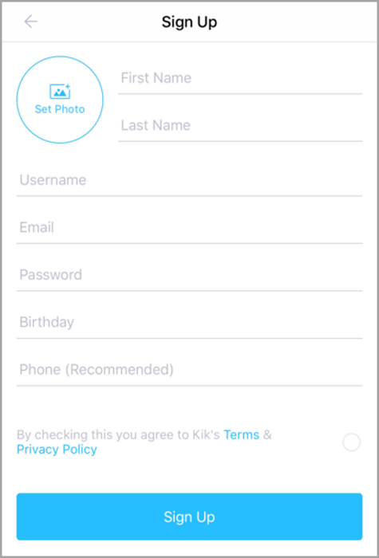
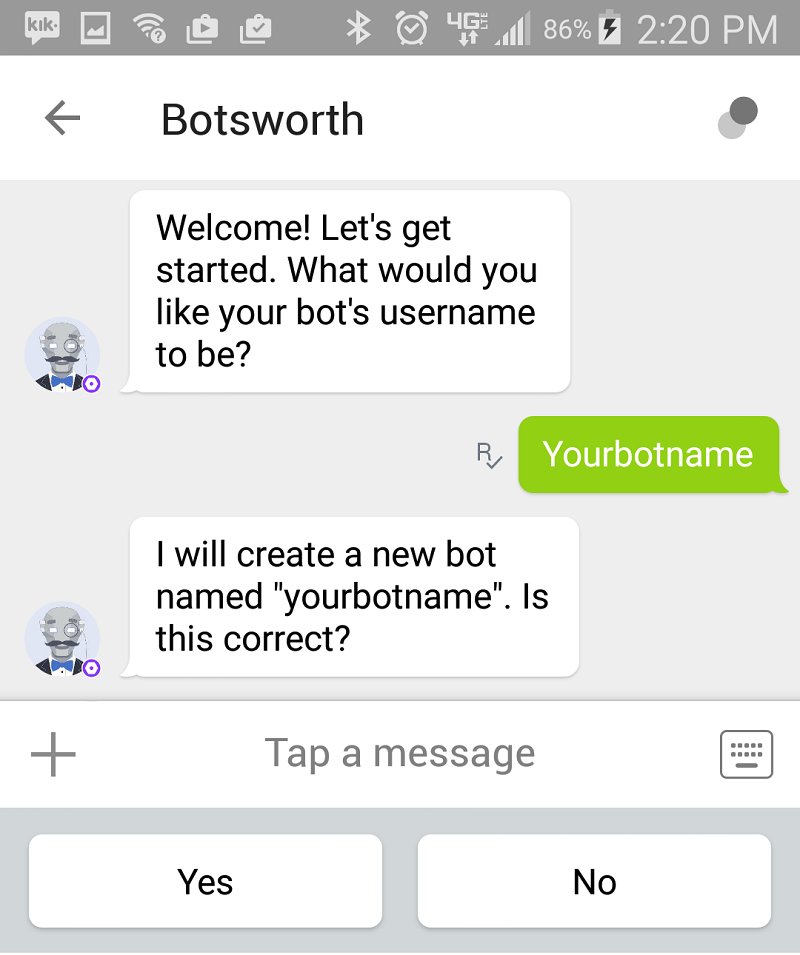
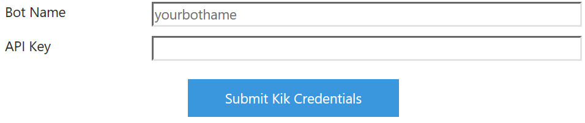

# Connect a bot to Kik

You can configure your bot to communicate with people using the Kik messaging app.

## Install Kik on your phone

If you don't have Kik installed on your phone, install it via your phone's app store or at <a href="https://www.kik.com/" target="_blank">the Kik website</a>. You'll need to use an existing Kik user account or sign up for an new account.

## Log into the dev portal with your mobile phone

Use your mobile phone to <a href="https://dev.kik.com" target="_blank">log into the Kik portal</a>. When prompted, _Open this page in "Kik"?_ select **Open**. 

## Follow the bot setup process

Give your bot a name.

## Gather credentials

On the Configuration tab, copy the **Name** and **API key**.

## Submit credentials

Click **Submit Kik Credentials**.

## Enable the bot

Check **Enable this bot on Kik**. Then click **I'm done configuring Kik**.

When you have completed these steps, your bot will be successfully configured to communicate with users in Kik.
