# Connect a bot to LINE

You can configure your bot to communicate with people through the LINE app.

## Log into the LINE console

Log into the [LINE developer console](https://developers.line.biz/console/register/messaging-api/provider/) of your LINE account, using *Log in with Line*. 

> [!NOTE]
> If you haven't already, [download LINE](https://line.me/), then go to your settings to register your email address.

### Register as a developer

If this is your first time on the LINE developer console, enter your name and email address to create a developer account.

## Create a new provider

First, create a provider for your bot if you don't already have one set up. The provider is the entity (individual or company) that offers your app.

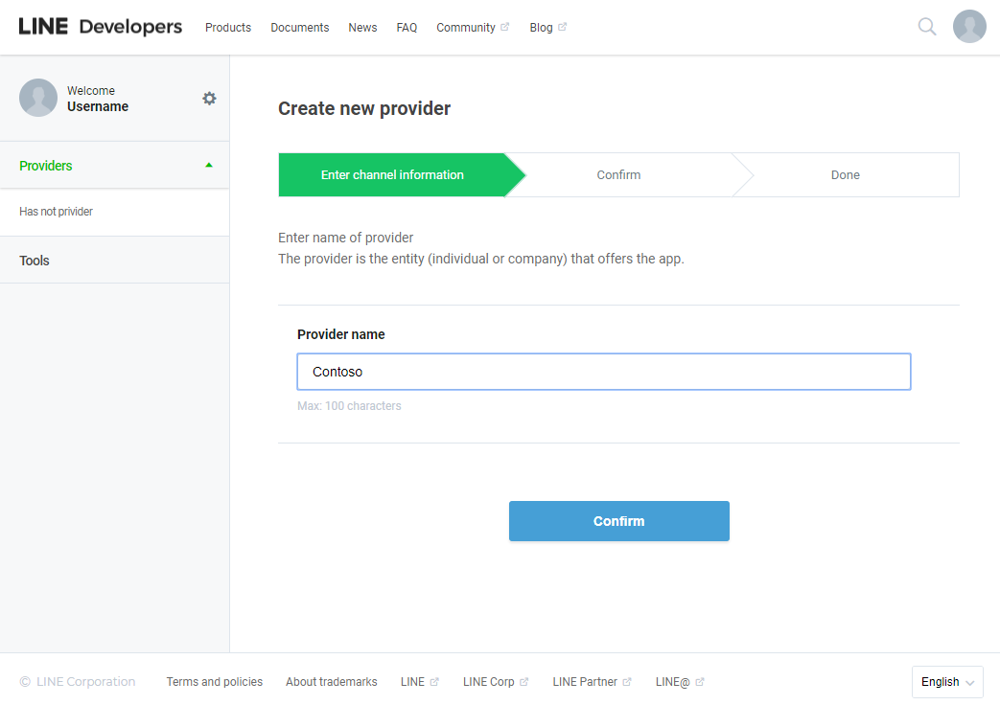

## Create a Messaging API channel

Next, create a new Messaging API channel. 

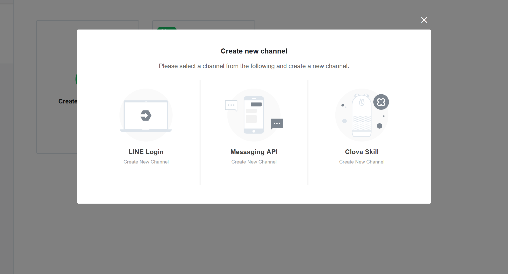

Create a new Messaging API channel by clicking on the green square.

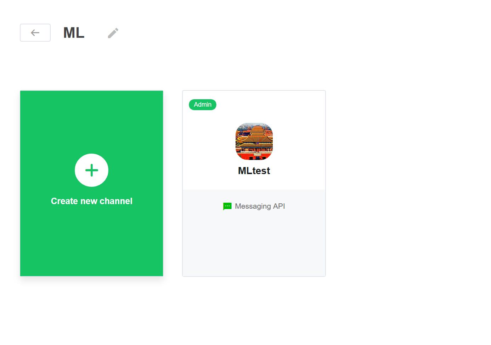

The name cannot include "LINE" or some similar string. Fill out the required fields and confirm your channel settings.

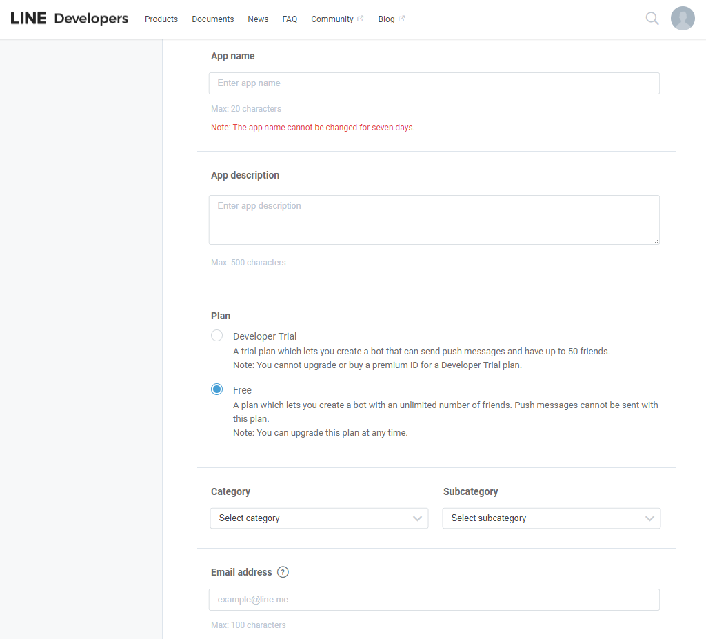

## Get necessary values from your channel settings

Once you've confirmed your channel settings, you'll be directed to a page similar to this.

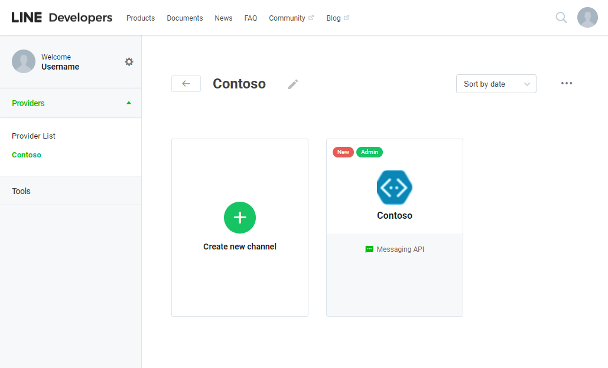

Click on the channel you created to access your channel settings, and scroll down to find the **Basic information > Channel secret**. Save that somewhere for a moment. Verify the Available features include `PUSH_MESSAGE`.

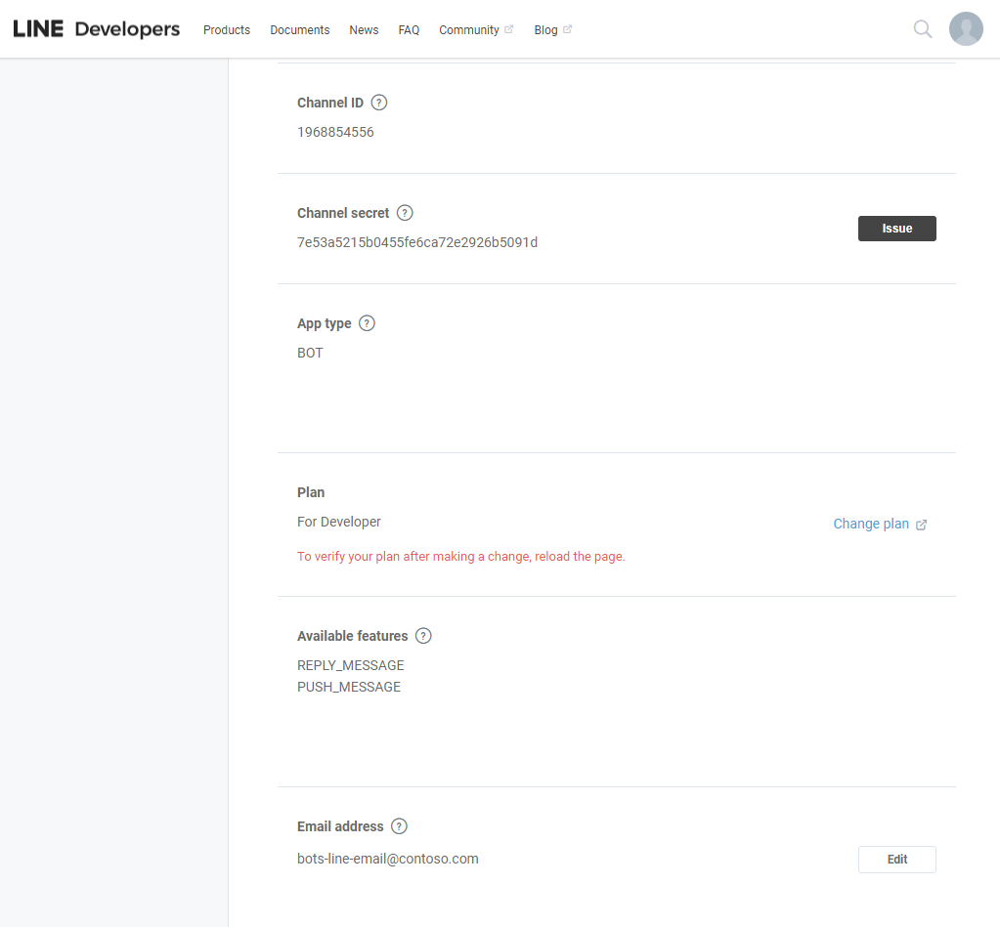

Then, scroll farther to **Messaging settings**. There, you will see a **Channel access token** field, with an *issue* button. Click that button to get your access token, and save that for the moment as well.

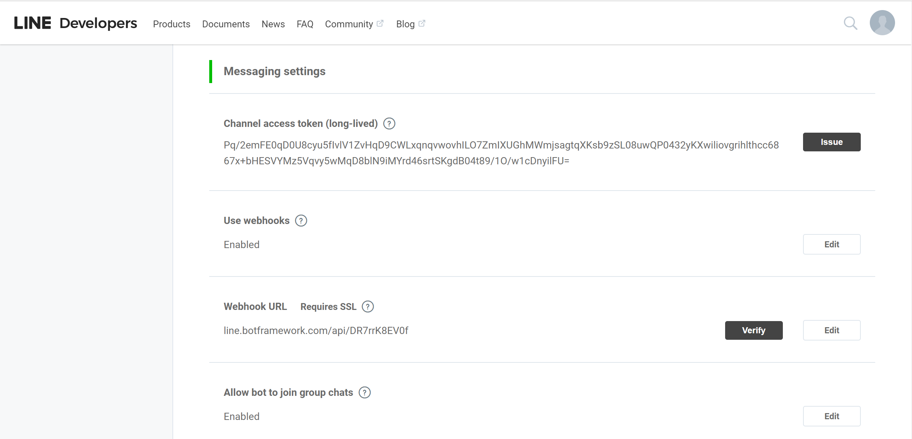

## Connect your LINE channel to your Azure bot

Log in to the [Azure portal](https://portal.azure.com/) and find your bot, and click on **Channels**. 

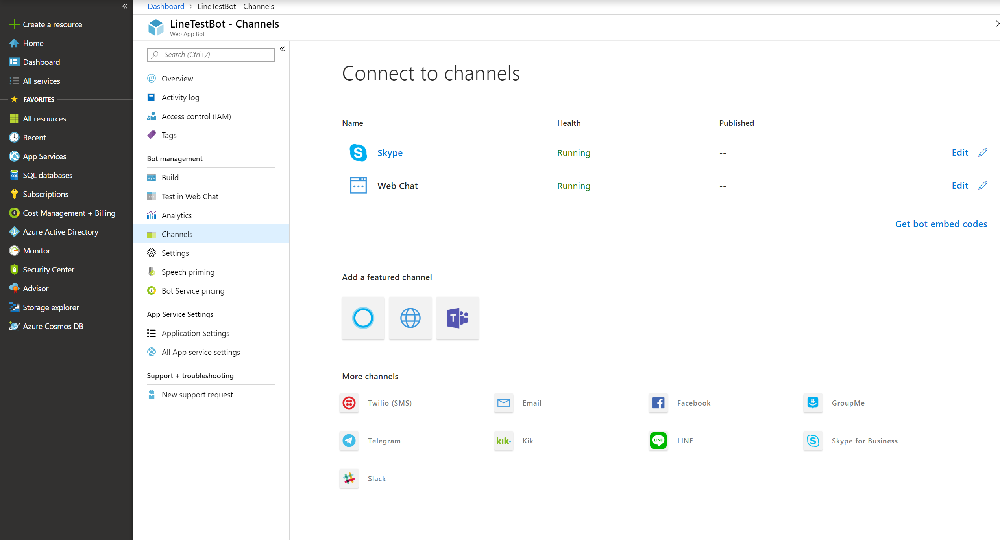

There, select the LINE channel and paste the channel secret and access token from above into the appropriate fields. Be sure to save your changes.

Copy the custom webhook URL that Azure gives you.

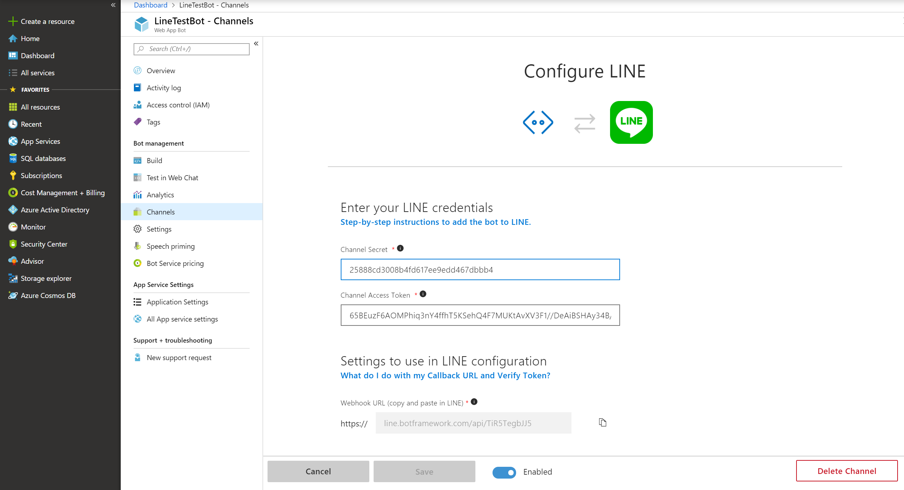

## Configure LINE webhook settings

Next, go back to the LINE developer console and paste the webhook URL from Azure into the **Message settings > Webhook URL**, and click **Verify** to verify the connection. If you just created the channel in Azure, it may take a few minutes to take effect.

Then, enable **Message settings > Use webhooks**.

> [!IMPORTANT]
> In LINE Developer Console, you must first set the webhook URL, and only then set **Use webhooks = Enabled**. First enabling webhooks with an empty URL will not set the enabled status, even though the UI may say otherwise.

After you added a webhook URL and then enabled webhooks, make sure to reload this page and verify that these changes were set correctly.

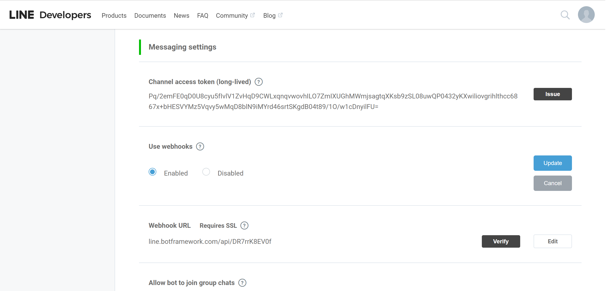

## Test your bot

Once you have completed these steps, your bot will be successfully configured to communicate with users on LINE and is ready to test.

### Add your bot to your LINE mobile app

In the LINE developer console, navigate to the settings page and you will see a QR code of your bot. 

In the Mobile LINE app, go to the right most navigation tab with three dots [**...**] and tap on the QR code icon. 

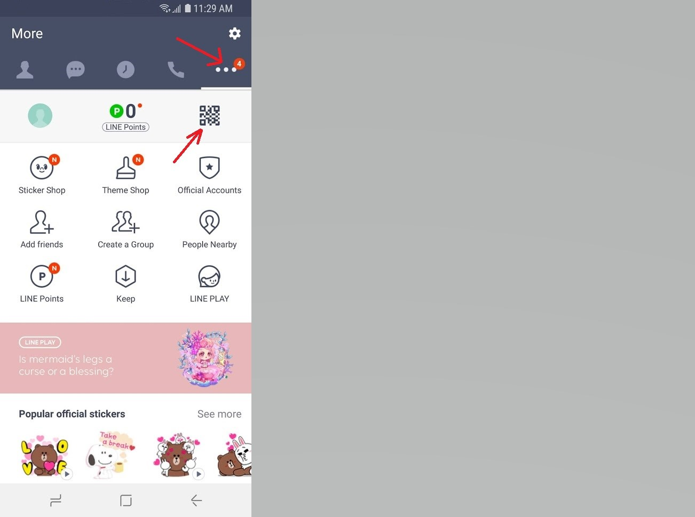

Point the QR code reader at the QR code in your developer console. You should now be able to interact with your bot in your mobile LINE app and test your bot.

### Automatic messages

When you start testing your bot, you may notice the bot sends unexpected messages that are not the ones you specified in the `conversationUpdate` activity.  Your dialog may look something like this:

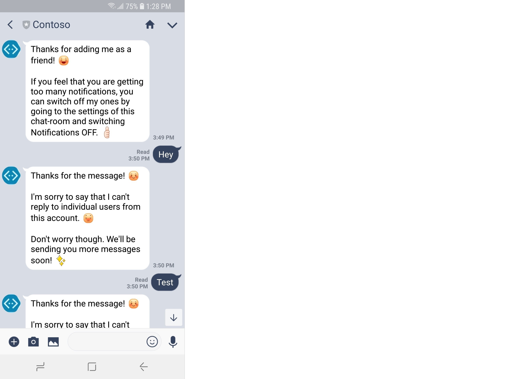

To avoid sending these messages, you need to switch off the Auto-response messages.

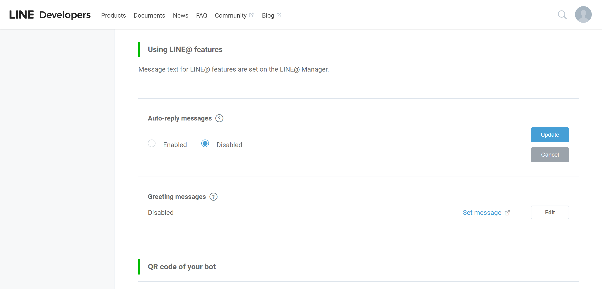

Alternatively, you can choose to keep these messages. In this case, it may be a good idea to click “Set message” and edit it.

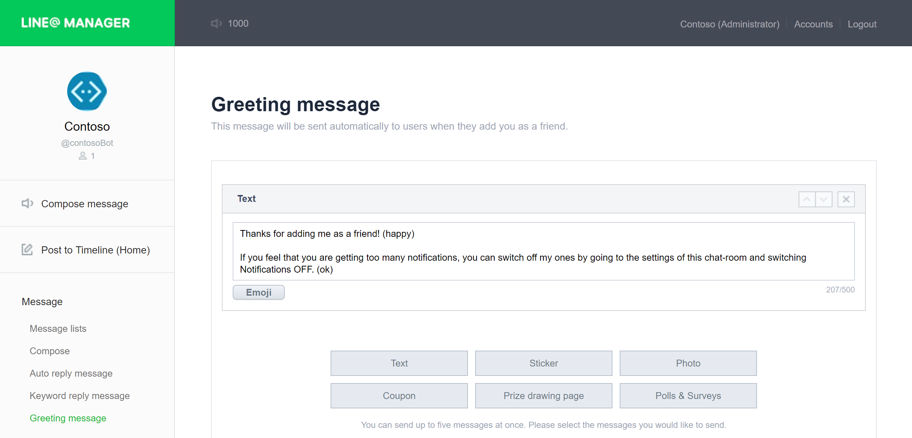

## Troubleshooting

* In case your bot is not responding to any of your messages at all, navigate to your bot in Azure portal, and choose Test in Web Chat.  
    * If the bot works there, but does not respond in LINE, reload your LINE Developer Console page and repeat the webhook instructinos above. Be sure you set the **Webhook URL** before enabling webhooks.
    * If the bot doesn't work in Web Chat, debug the issue for your bot then come back and finish configuring your LINE channel.

