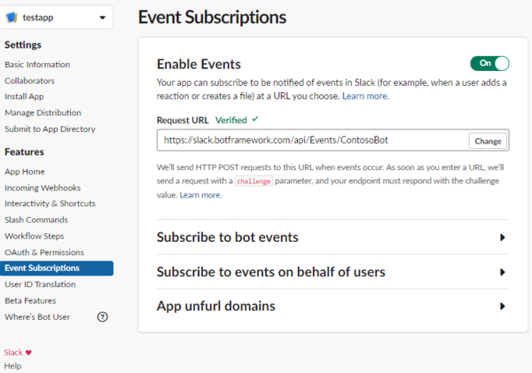

# Connect a bot to Slack

[!INCLUDE [applies-to-v4](includes/applies-to-v4-current.md)]

This article shows how to add a Slack channel to a bot using one the following approaches:

- [Create a Slack application using the Azure portal](#create-a-slack-application-using-the-azure-portal). It describes how to connect your bot to Slack using the Azure portal.  
- [Create a Slack application using the Slack adapter](#create-a-slack-application-using-the-slack-adapter). It describes how to connect your bot to Slack using the adapter.

## Create a Slack application using the Azure portal

### Prerequisites

- A bot deployed to Azure. Refer to [Create a bot with the Bot Framework SDK](bot-service-quickstart-create-bot.md) and [Deploy a basic bot](v4sdk/bot-builder-tutorial-deploy-basic-bot.md).

- Access to a Slack workspace with sufficient permissions to create and manage applications at [https://api.slack.com/apps](https://api.slack.com/apps). If you do not have access to a Slack environment you can [create a workspace](https://www.slack.com).

### Create a Slack application

1. In your browser, sign in [Slack](https://slack.com/signin).
1. Navigate to [Your Apps](https://api.slack.com/apps) panel.
1. Select **Create New App**, or **Create App** if this is your first application.
1. In the **App Name** box, enter the name of your Slack application.
1. In the **Development Slack Team** box, enter the name of your development team. If you are not already a member of a Development Slack Team, [create or join one](https://slack.com/).

    :::image type="content" source="media/channels/slack-CreateApp.png" alt-text="create Slack app":::

1. Select **Create App**.

### Add a new redirect URL

1. In the left pane, select **OAuth & Permissions**.
1. In the right pane, select **Add a new Redirect URL**.
1. In the input box, enter `https://slack.botframework.com/`.
1. Select **Add**.
1. Select **Save URLs**.

    :::image type="content" source="media/channels/slack-RedirectURL.png" alt-text="add redirect URL":::

### Subscribe to bot events

Follow these steps to subscribe to six specific bot events. By subscribing to bot events, your app will be notified of user activities at the URL you specify.

1. In the left pane, select **Event Subscriptions**.
1. In the right pane, set **Enable Events** to **On**.
1. In **Request URL**, enter `https://slack.botframework.com/api/Events/{YourBotHandle}`, where `{YourBotHandle}` is your bot handle, without the braces. This handle is the name you specified when deploying the bot to Azure. You can find it by going to the Azure portal.

   

1. In **Subscribe to Bot Events**, click **Add Bot User Event**.
1. In the list of events, select these six event types:
    - `member_joined_channel`
    - `member_left_channel`
    - `message.channels`
    - `message.groups`
    - `message.im`
    - `message.mpim`

    :::image type="content" source="media/channels/slack-subscribed-events.png" alt-text="subscribed events list":::

1. Select **Save Changes**.

As you add events in Slack, it lists the scopes you need to request. The scopes you need will depend on the events you subscribe to and how you intend to respond to them.
For Slack supported scopes, refer to [Scopes and permissions](https://api.slack.com/scopes). See also [Understanding OAuth scopes for Bots](https://api.slack.com/tutorials/understanding-oauth-scopes-bot).

> [!NOTE]
> As of June 2020 Slack channel supports Slack V2 permission scopes which allow the bot to specify its capabilities and permissions in a more granular way. All newly configured Slack channels will use the V2 scopes. To switch your bot to the V2 scopes, delete and recreate the Slack channel configuration in the Azure portal Channels blade.

### Enable sending messages to the bot by the users

1. In the left pane, select **App Home**.
1. In the right pane, in the **Show Tabs** section under the **Messages Tab**, check *Allow users to send Slash commands and messages from the messages tab*.

    :::image type="content" source="media/channels/slack-user-messages.png" alt-text="enable user messages":::

### Add and configure interactive messages (optional)

1. In the left pane, select **Interactivity & Shortcuts**.
1. In the right pane, enter `https://slack.botframework.com/api/Actions` as the **Request URL**.
1. Select **Save changes**.

### Configure your bot Slack channel

Two steps are rquired to configure your bot Slack channel. First you gather the Slack application credentials, then you use these credenatials to configure the Slcak channel in Azure.

#### Gather Slack app credentials

1. In the left pane, select **Basic Information**.
1. In the right pane, scroll to the **App Credentials** section. The **Client ID**, **Client Secret**, and **Signing Secret** required for configuring your Slack bot channel are displayed. Copy and store these credentials in a safe place.

    :::image type="content" source="media/channels/slack-AppCredentials.png" alt-text="gather credentials]":::

#### Configure Slack channel in Azure

1. Select your Azure bot resource in the [Azure portal](https://portal.azure.com/).
1. In the left panel, select **Channels**,
1. In the right panel, select the **Slack** icon.
1. Paste the Slack app credentials you saved in the previous steps into the appropriate fields.
1. The **Landing Page URL** is optional. You may omit or change it.

    :::image type="content" source="media/channels/slack-SubmitCredentials.png" alt-text="submit credentials":::

1. Select **Save**.
    Follow the instructions to authorize your Slack app's access to your Development Slack Team.
1. On the Configure Slack page, confirm that the slider by the Save button is set to **Enabled**.
Your bot is now configured to communicate with the users in Slack.

### Create a Slack button

Slack provides HTML you can use to help Slack users find your bot in the
*Add the Slack button* section of [this page](https://api.slack.com/docs/slack-button).
To use this HTML with your bot, replace the href value (begins with `https://`) with the URL found in your bot's Slack channel settings.
Follow the steps below to get the replacement URL.

1. Go to the Azure portal.
1. Select your Azure bot resource.
1. In the left pane, select **Channels**.
1. In the right pane, right-click on the Slack channel name.
1. In the drop-down menu, select **Copy link**.  
1. Paste this URL from your clipboard into the HTML provided for the Slack button.

Authorized users can click the **Add to Slack** button provided by this modified HTML to reach your bot on Slack.

> [!NOTE]
> The link you pasted into the href value of the HTML contains scopes that can be refined as needed. See [Scopes and permissions](https://api.slack.com/scopes) for the full list of available scopes.

## Create a Slack application using the Slack adapter

As well as the channel available in the Azure Bot Service to connect your bot with Slack, you can also use the Slack adapter. In this article you will learn how to connect a bot to Slack using the adapter. This article will walk you through modifying the EchoBot sample to connect it to a Slack app.

> [!NOTE]
> The instructions below cover the C# implementation of the Slack adapter. For instructions on using the JS adapter, part of the BotKit libraries, [see the BotKit Slack documentation](https://botkit.ai/docs/v4/platforms/slack.html).

### Adapter prerequisites

- The [EchoBot C# sample code](https://github.com/microsoft/BotBuilder-Samples/tree/master/samples/csharp_dotnetcore/02.echo-bot). You can use the sample [slack adapter](https://github.com/microsoft/BotBuilder-Samples/tree/main/samples/csharp_dotnetcore/60.slack-adapter) as an alternative to the modification of the echo bot sample, shown in the section [Wiring up the Slack adapter in your bot](#wiring-up-the-slack-adapter-in-your-bot).
- Access to a Slack workspace with sufficient permissions to create and manage applications at  [https://api.slack.com/apps](https://api.slack.com/apps). If you do not have access to a Slack environment you can create a workspace for [free](https://www.slack.com).

### Create a Slack application when using the adapter

1. In your browser, sign in [Slack](https://slack.com/signin).
1. Navigate to [Your Apps](https://api.slack.com/apps) panel.
1. Select **Create New App**, or **Create App** if this is your first application.
1. In the **App Name** box, enter the name of your Slack application.
1. In the **Development Slack Team** box, enter the name of your development team. If you are not already a member of a Development Slack Team, [create or join one](https://slack.com/).

    :::image type="content" source="media/channels/slack-CreateApp.png" alt-text="create Slack app":::

### Gather required configuration settings for your bot

Once your app is created, collect the following information. You will need this to connect your bot to Slack.

1. In the left pane, select **Basic Information**.
1. In the right pane, scroll to the **App Credentials** section. The **Verification Token**, **Client Secret**, and **Signing Secret** required for configuring your Slack bot channel are displayed. Copy and store these credentials in a safe place.

    :::image type="content" source="media/bot-service-adapter-connect-slack/slack-tokens.png" alt-text="slack tokens":::

1. Navigate to the **Install App** page under the **Settings** menu and follow the instructions to install your app into a Slack team.  Once installed, copy the **Bot User OAuth Access Token** and, again, keep this for later to configure your bot settings.

### Wiring up the Slack adapter in your bot

If you use the sample [slack adapter](https://github.com/microsoft/BotBuilder-Samples/tree/main/samples/csharp_dotnetcore/60.slack-adapter), as an alternative to the modification of the echo bot sample, go directly to [Complete configuration of your Slack app](#complete-configuration-of-your-slack-app).

#### Install the Slack adapter NuGet package

Add  the [Microsoft.Bot.Builder.Adapters.Slack](https://www.nuget.org/packages/Microsoft.Bot.Builder.Adapters.Slack/) NuGet package. For more information on using NuGet, see [Install and manage packages in Visual Studio](/nuget/tools/package-manager-ui)

#### Create a Slack adapter class

Create a new class that inherits from the ***SlackAdapter*** class. This class will act as our adapter for the Slack channel and include error handling capabilities (similar to the ***BotFrameworkAdapterWithErrorHandler*** class already in the sample, used for handling other requests from Azure Bot Service).

```csharp
public class SlackAdapterWithErrorHandler : SlackAdapter
{
    public SlackAdapterWithErrorHandler(IConfiguration configuration, ILogger<BotFrameworkHttpAdapter> logger)
    : base(configuration, logger)
    {
        OnTurnError = async (turnContext, exception) =>
        {
            // Log any leaked exception from the application.
            logger.LogError(exception, $"[OnTurnError] unhandled error : {exception.Message}");

            // Send a message to the user
            await turnContext.SendActivityAsync("The bot encountered an error or bug.");
            await turnContext.SendActivityAsync("To continue to run this bot, please fix the bot source code.");

            // Send a trace activity, which will be displayed in the Bot Framework Emulator
            await turnContext.TraceActivityAsync("OnTurnError Trace", exception.Message, "https://www.botframework.com/schemas/error", "TurnError");
        };
    }
}
```

#### Create a new controller for handling Slack requests

We create a new controller which will handle requests from your slack app, on a new endpoint `api/slack` instead of the default `api/messages` used for requests from Azure Bot Service Channels.  By adding an additional endpoint to your bot, you can accept requests from Bot Service channels, as well as from Slack, using the same bot.

```csharp
[Route("api/slack")]
[ApiController]
public class SlackController : ControllerBase
{
    private readonly SlackAdapter _adapter;
    private readonly IBot _bot;

    public SlackController(SlackAdapter adapter, IBot bot)
    {
        _adapter = adapter;
        _bot = bot;
    }

    [HttpPost]
    [HttpGet]
    public async Task PostAsync()
    {
        // Delegate the processing of the HTTP POST to the adapter.
        // The adapter will invoke the bot.
        await _adapter.ProcessAsync(Request, Response, _bot);
    }
}
```

#### Add Slack app settings to your bot's configuration file

Add the 3 settings shown below to your appSettings.json file in your bot project, populating each one with the values gathered earlier when creating your Slack app.

```json
  "SlackVerificationToken": "",
  "SlackBotToken": "",
  "SlackClientSigningSecret": ""
```

#### Inject the Slack adapter In your bot startup.cs

Add the following line to the ***ConfigureServices*** method within your startup.cs file. This will register your Slack adapter and make it available for your new controller class.  The configuration settings you added in the previous step will be automatically used by the adapter.

```csharp
services.AddSingleton<SlackAdapter, SlackAdapterWithErrorHandler>();
```

Once added, your ***ConfigureServices*** method should look like this.

```csharp
public void ConfigureServices(IServiceCollection services)
{
    services.AddMvc().SetCompatibilityVersion(CompatibilityVersion.Version_2_1);

    // Create the default Bot Framework Adapter (used for Azure Bot Service channels and Emulator).
    services.AddSingleton<IBotFrameworkHttpAdapter, BotFrameworkAdapterWithErrorHandler>();

    // Create the Slack Adapter
    services.AddSingleton<SlackAdapter, SlackAdapterWithErrorHandler>();

    // Create the bot as a transient. In this case the ASP Controller is expecting an IBot.
    services.AddTransient<IBot, EchoBot>();
}
```

### Complete configuration of your Slack app

#### Obtain a URL for your bot

This section shows how to point your Slack app to the correct endpoint on your bot and how to subscribe the app to bot events to ensure your bot receives the related messages.  To do this your bot must be running, so that Slack can verify the endpoint is valid.
Also, for testing purposes, this section assumes that the bot is running locally on your machine and your Slack app communicates with it using [ngrok](https://www.ngrok.com).

> [!NOTE]
> If you are not ready to deploy your bot to Azure, or wish to debug your bot when using the Slack adapter, you can use a tool such as [ngrok](https://www.ngrok.com) (which you will likely already have installed if you have used the Bot Framework Emulator previously) to tunnel through to your bot running locally and provide you with a publicly accessible URL for this.
>
> If you wish create an ngrok tunnel and obtain a URL to your bot, use the following command in a terminal window. This command assumes your local bot is running on port 3978, otherwise change the port number to the correct value.
>
> ```console
> ngrok.exe http 3978 -host-header="localhost:3978"
> ```

#### Update your Slack app

Navigate back to the [Slack API dashboard](https://api.slack.com/apps) and select your app.  You now need to configure 2 URLs for your app and subscribe to the appropriate events.

1. In the left pane, select **OAuth & Permissions**. In the right pane, enter the  **Redirect URL** vlaue. It is your bot's URL, plus the `api/slack` endpoint you specified in your newly created controller. For example, `https://yyyy.ngrok.io/api/slack`.

    :::image type="content" source="media/channels/slack-redirect-url-adapter.png" alt-text="redirect url":::

1. In the left pane, select **Subscribe to Bot Events**. In the right pane, enable events using the toggle at the top of the page. Then fill in the **Request URL** with the same URL you used in step 1.

    :::image type="content" source="media/channels/slack-request-url-adapter.png" alt-text="request url":::

1. Select **Subsribe to bot events**. Select **Add Bot User Event**. In the list of events, select these six event types:

    - `member_joined_channel`
    - `member_left_channel`
    - `message.channels`
    - `message.groups`
    - `message.im`
    - `message.mpim`

    :::image type="content" source="media/channels/slack-subscribed-events.png" alt-text="subscribed events list":::

1. Select **Save Changes**.

#### Enable sending messages to the bot by the users

1. In the left pane, select **App Home**.
1. In the right pane, in the **Show Tabs** section under the **Messages Tab**, check *Allow users to send Slash commands and messages from the messages tab*.

    :::image type="content" source="media/channels/slack-user-messages.png" alt-text="enable user messages":::

## Test your application in Slack

1. Log in the Slack work space where you installed your app (`http://<your work space>-group.slack.com/`). You will see it listed under the **Apps** section in the left panel.
1. In the left panel, select your app.
1. In the right panel, write e message and send it to the application. If you used an echo bot, the application echoes back the message as shown in the figure below.

    :::image type="content" source="media/channels/slack-echobotapp-test.png" alt-text="app testing":::

You can also test this feature using the [sample bot for the Slack adapter](https://github.com/microsoft/BotBuilder-Samples/tree/master/samples/csharp_dotnetcore/60.slack-adapter) by populating the appSettings.json file with the same values described in the steps above. This sample has additional steps described in the `README` file to show examples of link sharing, receiving attachments, and sending interactive messages.
