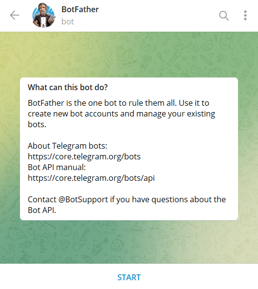
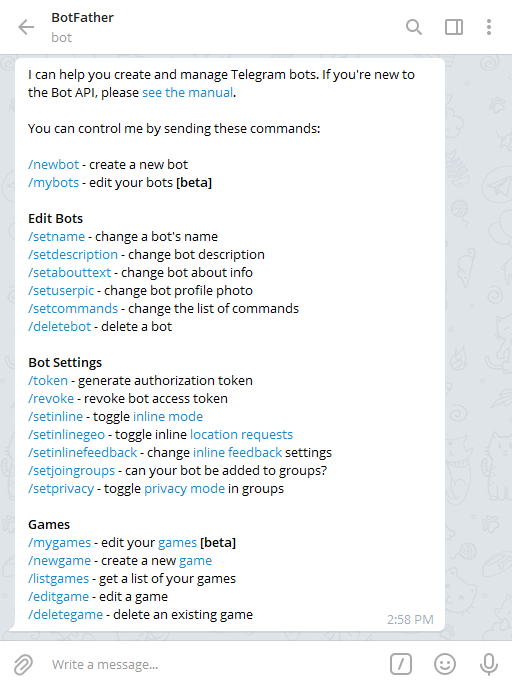
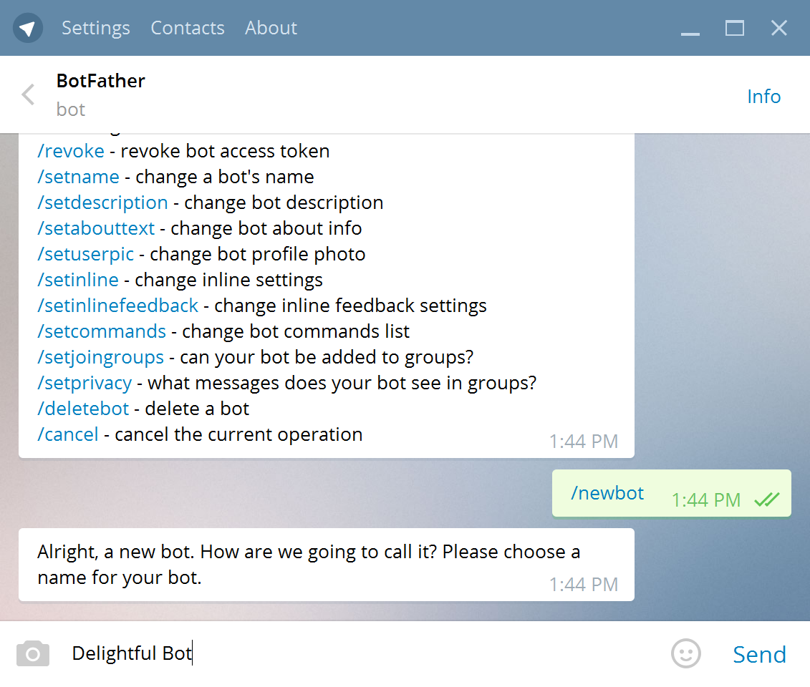
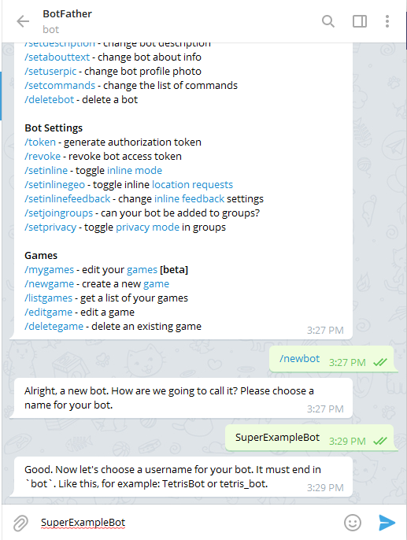
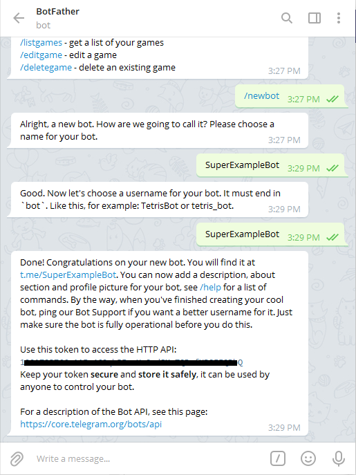
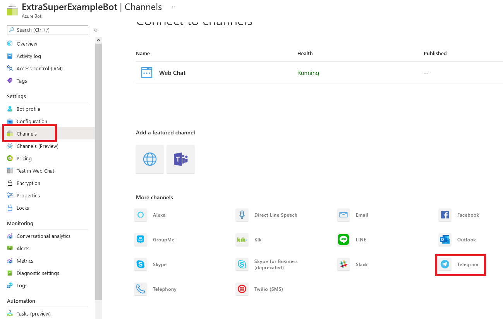
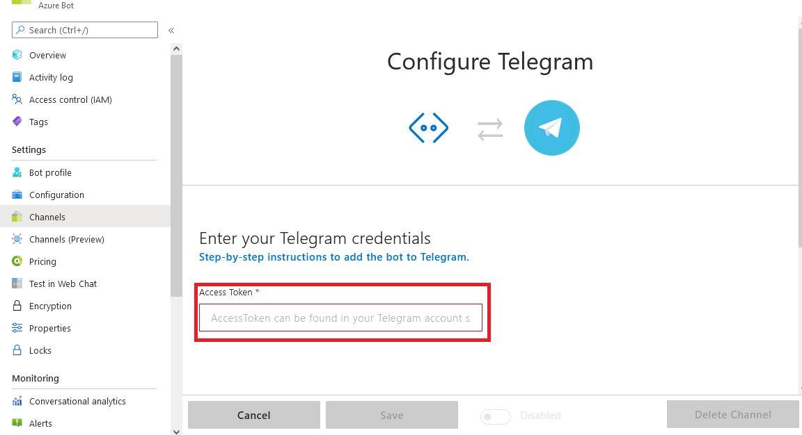
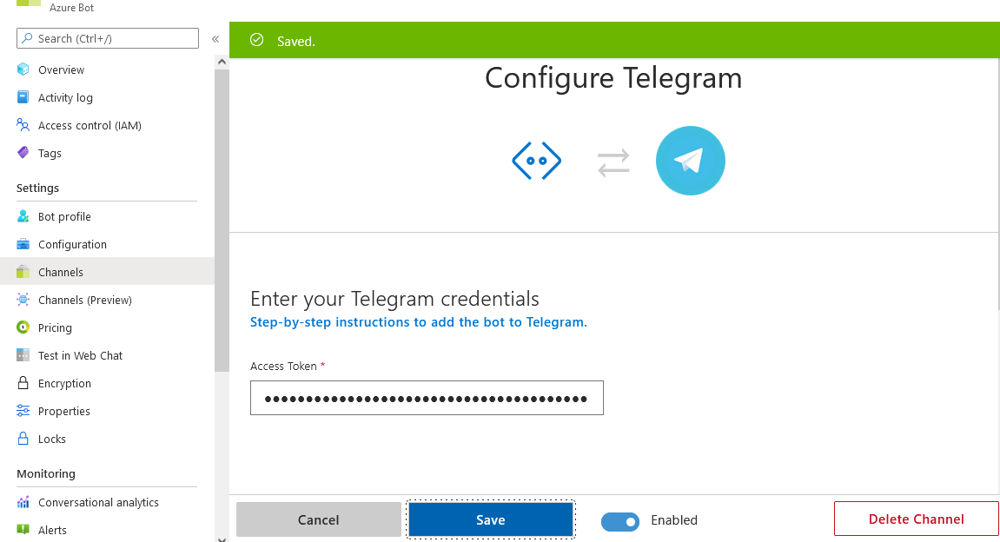

# Connect a bot to Telegram

[!INCLUDE [applies-to-v4](includes/applies-to-v4-current.md)]

You can configure your bot to communicate with people using the Telegram messaging app.

[!INCLUDE [Channel Inspector intro](includes/snippet-channel-inspector.md)]

## Visit the Bot Father to create a new Telegram bot

Create a new [Telegram bot](https://telegram.me/botfather) using the Bot Father.

## Create a new Telegram bot

To create a new Telegram bot, send command `/newbot`.

### Specify a friendly name

Give the Telegram bot a friendly name.

### Specify a username

Give the Telegram bot a unique username.

### Copy the access token

Copy the Telegram bot's access token.

## Enter the Telegram bot's access token

Login to the Azure Portal.  Go to your bot or [create a new Azure Bot](/quickstart-create-bot-with-azure).

Go to your bot's **Channels** section in the Azure portal and select **Telegram**.

> [!NOTE]
> The Azure portal UI will look slightly different if you have already connected your bot to Telegram.

Paste the token you copied previously into the **Access Token** field and click **Save**.

Your bot is now successfully configured to communicate with users in Telegram.

