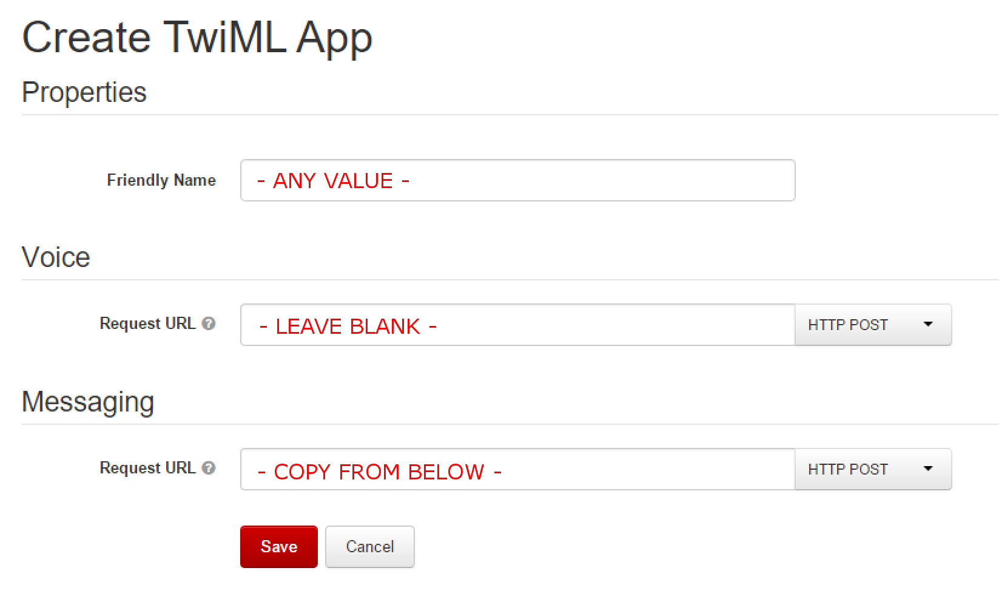
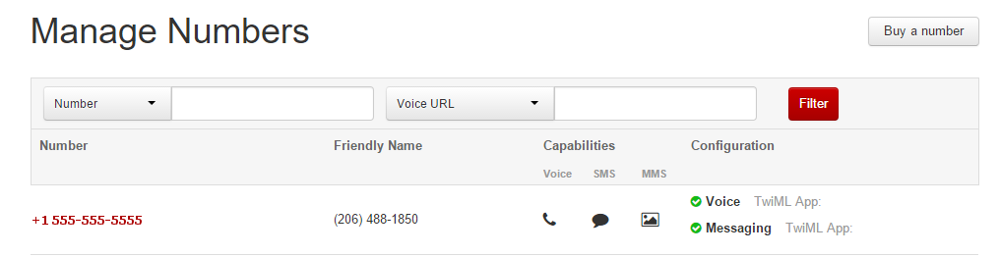
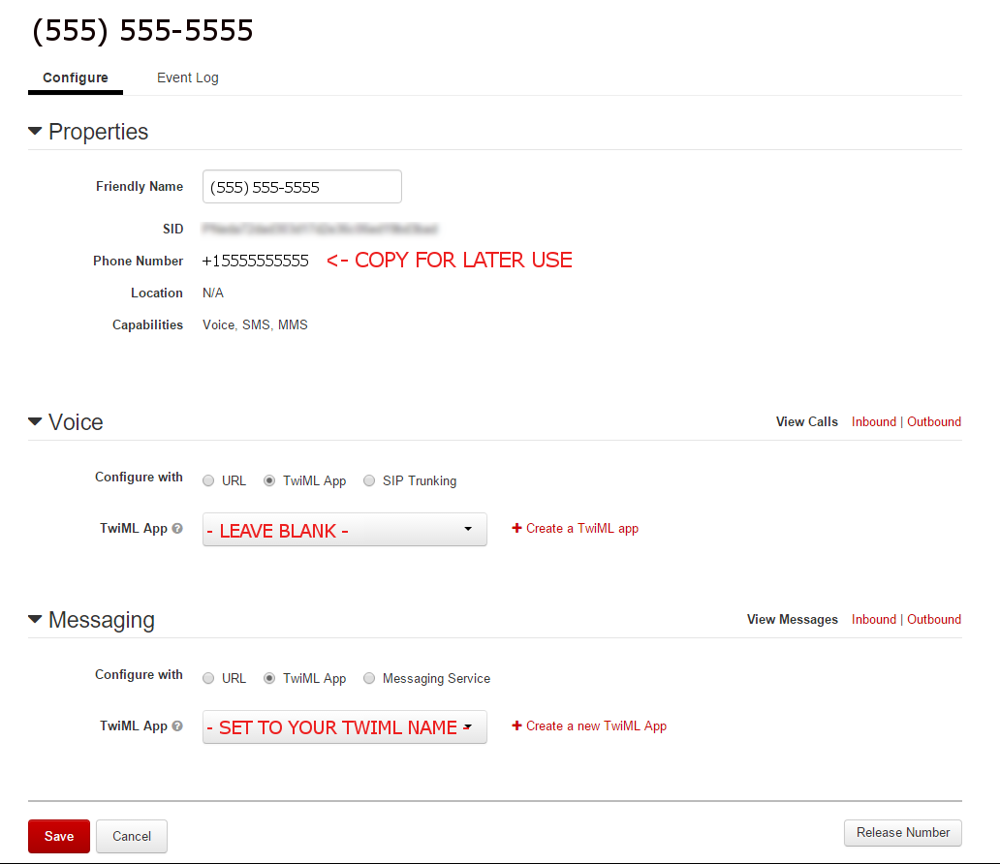
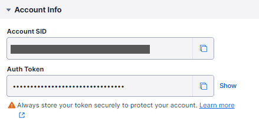
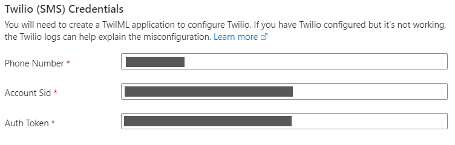
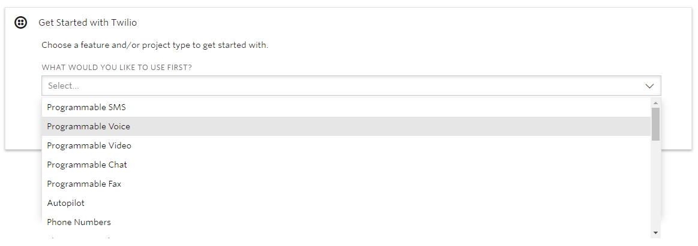

# Connect a bot to Twilio

[!INCLUDE [applies-to-v4](includes/applies-to-v4-current.md)]

You can configure your bot to communicate with people using the Twilio cloud communication platform.

## Connect a bot to Twilio using the Azure portal

To configure a bot to communicate using Twilio, create a TwilML application and then connect the bot.

To learn more about developing for Twilio, see the [Twilio SMS](https://www.twilio.com/docs/sms) documentation.

### Create a TwiML application

If you don't have a Twilio account, create a [new account](https://www.twilio.com/try-twilio).

Create a [TwiML application](https://support.twilio.com/hc/articles/223180928-How-Do-I-Create-a-TwiML-App-) following the instructions.



Under **Properties**, enter a **FRIENDLY NAME**. In this tutorial, "My TwiML app" is an example. The **REQUEST URL** under **Voice** can be left empty. Under **Messaging**, the **Request URL** should be `https://sms.botframework.com/api/sms`.

### Select or add a phone number

Follow the instruction in the [Twilio documentation](https://support.twilio.com/hc/articles/223180048-Adding-a-Verified-Phone-Number-or-Caller-ID-with-Twilio) to add a verified caller ID via the console site. After you finish, you will see your verified number in **Active Numbers** under **Manage Numbers**.



### Specify application to use for voice and messaging

Click the number and go to **Configure**. Under both Voice and Messaging, set **CONFIGURE WITH** to be TwiML App and set **TWIML APP** to be My TwiML app. After you finish, click **Save**.



Go back to **Manage Numbers**, you will see the configuration of both Voice and Messaging are changed to TwiML App.


### Gather credentials

Go back to the [console homepage](https://www.twilio.com/console/), you will see your Account SID and Auth Token on the project dashboard, as shown below.



### Submit credentials

In a separate window, return to the [Bot Framework](https://dev.botframework.com/) site.

- Select **My bots** and choose the Bot that you want to connect to Twilio. This will direct you to the Azure portal.
- Select **Channels** under **Bot Management**. Click the Twilio (SMS) icon.
- Enter the Phone Number, Account SID, and Auth Token you record earlier. After you finish, click **Save**.



When you have completed these steps, your bot will be successfully configured to communicate with users using Twilio.

## Connect a bot to Twilio using the Twilio adapter

As well as the channel available in the Azure Bot Service to connect your bot with Twilio, you can also use the Twilio adapter. In this article you will learn how to connect a bot to Twilio using the adapter. This article describes the parts of the Twilio sample bot that allow it to connect to Twilio through the custom adapter.

> [!NOTE]
> The instructions below cover the C# implementation of the Twilio adapter. For instructions on using the JS adapter, part of the BotKit libraries, [see the BotKit Twilio documentation](https://botkit.ai/docs/v4/platforms/twilio-sms.html).

### Prerequisites

- The [Twilio Adapter sample code](https://github.com/microsoft/BotBuilder-Samples/tree/main/samples/csharp_dotnetcore/63.twilio-adapter)
- A Twilio account. If you do not have a Twilio account, you can [create one here](https://www.twilio.com/try-twilio).

### Get a Twilio number and gather account credentials

1. Log into [Twilio](https://twilio.com/console). On the right-hand side of the page, you will see the **ACCOUNT SID** and **AUTH TOKEN** for your account. Make a note of these as you will need them later when configuring your bot application.
1. Choose **Programmable Voice** from the options under **Get Started with Twilio**.

    

1. On the next page, click the **Get your first Twilio number** button. A pop-up window will show you a new number, which you can accept by clicking **Choose this number**. (Alternatively, you can search for a different number by following the on-screen instructions.)
1. Once you have chosen your number, make a note of it, as you will need this when configuring your bot application in a later step.

### Wiring up the Twilio adapter in your bot

Now that you have your Twilio number and account credentials, you need to configure your bot application.

#### Install the Twilio adapter NuGet package

The Twilio custom adapter is contained in the [Microsoft.Bot.Builder.Adapters.Twilio](https://www.nuget.org/packages/Microsoft.Bot.Builder.Adapters.Twilio/) NuGet package. For more information on using NuGet, see [Install and manage packages in Visual Studio](/nuget/tools/package-manager-ui).

#### Create a Twilio adapter class

Define a new class that derives from the `TwilioAdapter` class&mdash;the class in the sample is named `TwilioAdapterWithErrorHandler`.

This class connects to the Twilio channel and includes error handling capabilities (similar to the `BotFrameworkAdapterWithErrorHandler` class that you would use for connecting through the Azure Bot Service).

[!code-csharp[TwilioAdapterWithErrorHandler definition](~/../botbuilder-samples/samples/csharp_dotnetcore/63.twilio-adapter/Adapters/TwilioAdapterWithErrorHandler.cs?range=11-29)]

#### Create a new controller for handling Twilio requests

Create a new controller to handle requests from Twilio, on a new endpoint `api/twilio` instead of the default `api/messages` used for requests from Azure Bot Service Channels.  By adding an additional endpoint to your bot, you can accept requests from Bot Service channels, as well as from Twilio, using the same bot.

[!code-csharp[TwilioController definition](~/../botbuilder-samples/samples/csharp_dotnetcore/63.twilio-adapter/Controllers/TwilioController.cs?range=12-42)]

#### Inject the Twilio adapter in your startup file

In `Startup.cs`, add your Twilio adapter as a service in the `ConfigureServices` method. For example:

[!code-csharp[Configure adapter in startup](~/../botbuilder-samples/samples/csharp_dotnetcore/63.twilio-adapter/Startup.cs?range=19-31&highlight=9)]

#### Obtain a URL for your bot

Now that you have wired up the adapter in your bot project, you need to identify the correct endpoint to provide to Twilio in order to ensure your bot receives messages. You also require this URL to complete configuration of your bot application.

To complete this step, [deploy your bot to Azure](bot-builder-deploy-az-cli.md) and make a note of the URL of your deployed bot.

> [!NOTE]
> If you're not ready to deploy your bot to Azure, or wish to debug your bot when using the Twilio adapter, you can use a tool such as [ngrok](https://www.ngrok.com) to tunnel through to your bot running locally and provide you with a publicly accessible URL for this.
>
> If you wish create an ngrok tunnel and obtain a URL to your bot, use the following command in a command prompt. (This assumes your local bot is running on port 3978. Change the port numbers in the command if your bot is not running on port 3978.)
>
> ```console
> ngrok.exe http 3978 -host-header="localhost:3978"
> ```

#### Add Twilio app settings to your bot's configuration file

Add the settings shown below to your `appSettings.json` file in your bot project. You populate **TwilioNumber**, **TwilioAccountSid** and **TwilioAuthToken** using the values you gathered when creating your Twilio number. **TwilioValidationUrl** should be your bot's URL, plus the `api/twilio` endpoint you specified in your newly created controller. For example, `https://yourboturl.com/api/twilio`.

[!code-json[appSettings](~/../botbuilder-samples/samples/csharp_dotnetcore/63.twilio-adapter/appsettings.json)]

Once you have populated the settings above, you should redeploy (or restart if running locally with ngrok) your bot.

### Complete configuration of your Twilio number

The final step is to configure your new Twilio number's messaging endpoint, to ensure your bot receives messages.

1. Navigate to the Twilio [Active Numbers page](https://www.twilio.com/console/phone-numbers/incoming).
1. Select the phone number you created in the earlier step.
1. Within the **Messaging** section, complete the **A MESSAGE COMES IN** section by choosing **Webhook** from the drop-down and populating the text box with your bot's endpoint that you used to populate the **TwilioValidationUrl** setting in the previous step, such as `https://yourboturl.com/api/twilio`.

    

1. Select **Save**.

## Test your bot in Twilio

You can now test whether your bot is connected to Twilio correctly by sending an SMS message to your Twilio number.  Once the message is received by your bot it will send a message back to you, echoing the text from your message.

You can also test this feature using the [sample bot for the Twilio adapter](https://github.com/microsoft/BotBuilder-Samples/tree/master/samples/csharp_dotnetcore/63.twilio-adapter) by populating the appSettings.json with the same values described in the steps above.
