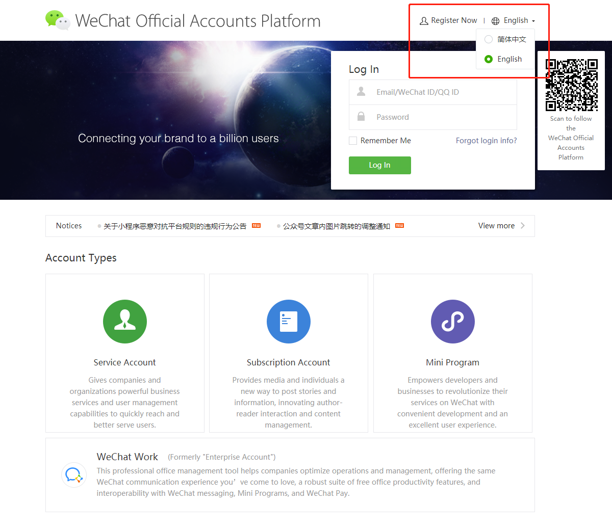
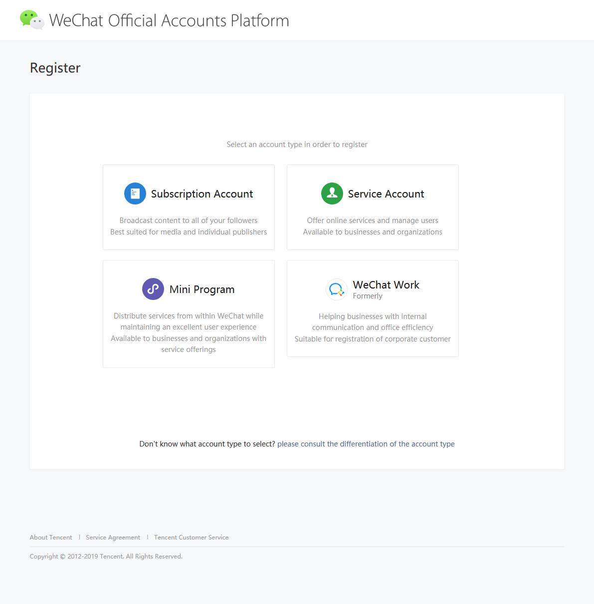
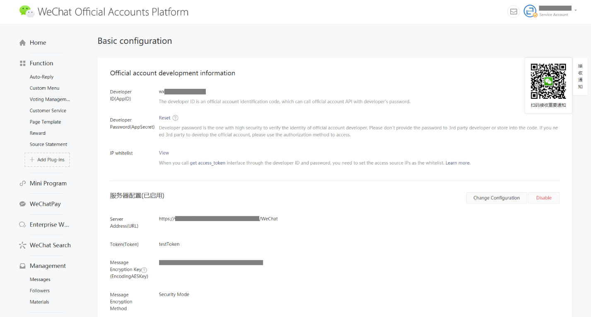
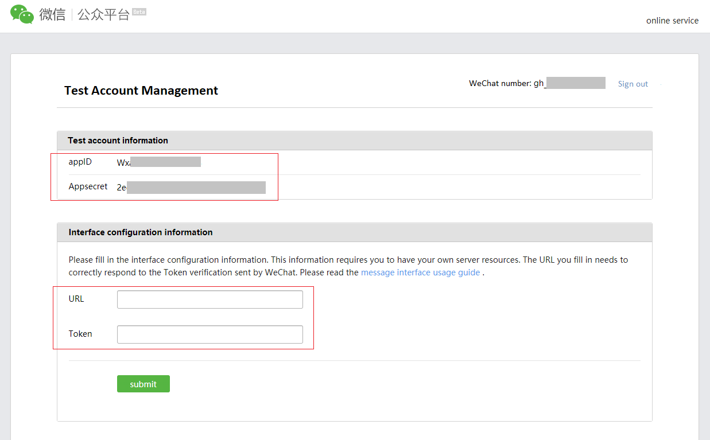
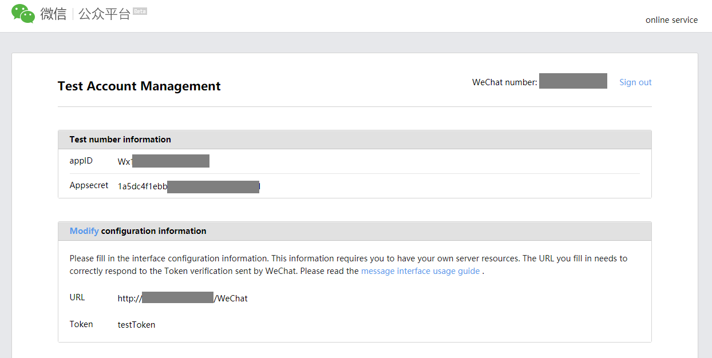
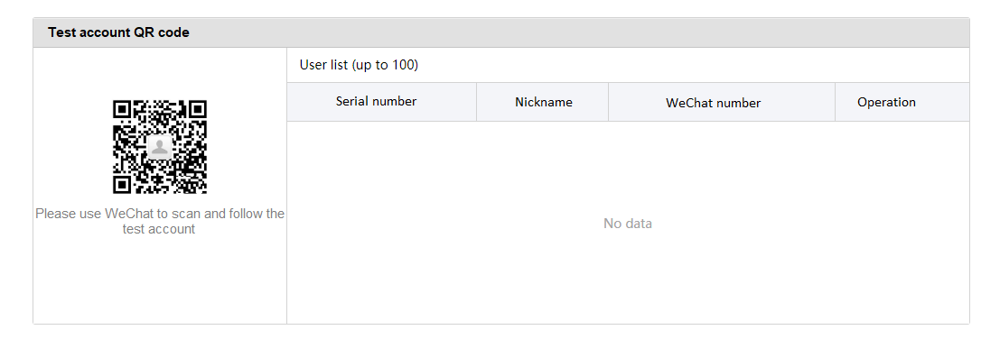
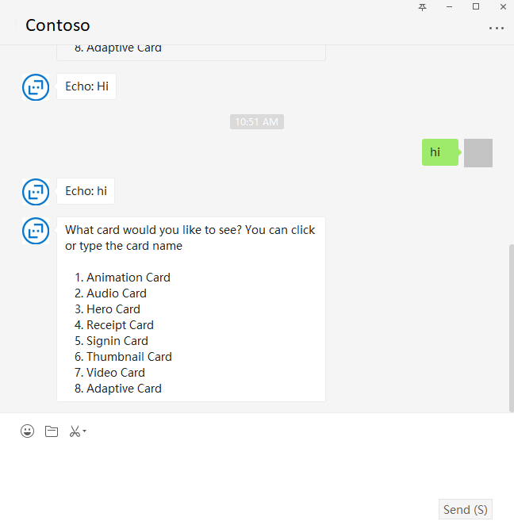

# Connect a bot to WeChat

You can configure your bot to communicate with people using the WeChat Official Accounts Platform.

## Download WeChat Adapter for Bot Framework

WeChat adapter for Microsoft Bot Framework is an open source adapter on GitHub. [Download WeChat Adapter for Bot Framework](https://github.com/microsoft/BotFramework-WeChat/).

## Create a WeChat Account

To configure a bot to communicate using WeChat, you need to create a WeChat official account on [WeChat Official Account Platform](https://mp.weixin.qq.com/?lang=en_US) and then connect the bot to the app. Currently we only support Service Account.

### Change Your Prefer Language

You can change the display language you prefer before login.

 

### Register A Service Account

A real service account must be verified by WeChat, you can’t enable webhook before account is verified. To create your own service account, please follow the instruction [Here](https://kf.qq.com/product/weixinmp.html#hid=87).
For short, just click the Register Now on the top, select the Service Account and follow the instruction.

 

### Sandbox Account

If you just want to test the WeChat and bot integration, you can use a sandbox account instead of creating the service account. Learn more about creating a [sandbox account](https://mp.weixin.qq.com/debug/cgi-bin/sandbox?t=sandbox/login).

## Enable WeChat Adapter To Bot

The Bot Project is a regular Bot Framework SDK V4 project. Before you can launch it, you need to make sure you can run the bot. Download [WeChat Adapter for Bot Framework](https://github.com/microsoft/BotFramework-WeChat/).

### Prerequisites

    .NET Core SDK (version 2.2.x)

### Add Reference To WeChat Adapter Source

Please directly reference the WeChat adapter project or add ~/BotFramework-WeChat/libraries/csharp_dotnetcore/outputpackages as local NuGet source.

### Inject WeChat Adapter In Your Bot Startup.cs

```csharp
public void ConfigureServices(IServiceCollection services)
{
    services.AddMvc().SetCompatibilityVersion(CompatibilityVersion.Version_2_2);

    // Create the storage we'll be using for User and Conversation state. (Memory is great for testing purposes.)
    services.AddSingleton<IStorage, MemoryStorage>();

    // Create the User state. (Used in this bot's Dialog implementation.)
    services.AddSingleton<UserState>();

    // Create the Conversation state. (Used by the Dialog system itself.)
    services.AddSingleton<ConversationState>();

    // Load WeChat settings.
    var wechatSettings = new WeChatSettings();
    Configuration.Bind("WeChatSettings", wechatSettings);
    services.AddSingleton<WeChatSettings>(wechatSettings);

    // Configure hosted serivce.
    services.AddSingleton<IBackgroundTaskQueue, BackgroundTaskQueue>();
    services.AddHostedService<QueuedHostedService>();
    services.AddSingleton<WeChatHttpAdapter>();

    // The Dialog that will be run by the bot.
    services.AddSingleton<MainDialog>();

    // Create the bot as a transient. In this case the ASP Controller is expecting an IBot.
    services.AddTransient<IBot, EchoBot>();
}
```

### Update Your Bot Controller

```csharp
[Route("api/messages")]
[ApiController]
public class BotController : ControllerBase
{  
    private readonly IBot _bot;
    private readonly WeChatHttpAdapter _weChatHttpAdapter;
    private readonly string Token;
    public BotController(IBot bot, WeChatHttpAdapter weChatAdapter)
    {
        _bot = bot;
        _weChatHttpAdapter = weChatAdapter;
    }

    [HttpPost("/WeChat")]
    [HttpGet("/WeChat")]
    public async Task PostWeChatAsync([FromQuery] SecretInfo secretInfo)
    {
        // Delegate the processing of the HTTP POST to the adapter.
        // The adapter will invoke the bot.
        await _weChatHttpAdapter.ProcessAsync(Request, Response, _bot, secretInfo);
    }
}
```

### Setup appsettings.json

You will need to set up appsettings.json before start up the bot, you can find what you need below.

```json
"WeChatSettings": {
    "UploadTemporaryMedia": true,
    "PassiveResponseMode": false,
    "Token": "",
    "EncodingAESKey": "",
    "AppId": "",
    "AppSecret": ""
}
```

#### Service Account

If you already have a service account and ready to deploy, then you can find **AppID** , **AppSecret** , **EncodingAESKey** and **Token** in the basic configurations on the left nav bar, like below.

Don't forgot you need to set up the IP white list, otherwise WeChat won't accept your request.

 

#### Sandbox Account

Sandbox account don't have **EncodingAESKey** , message from WeChat was not encrypted just leave EncodingAESKey blank. You only have three parameters here, **appID** , **appsecret** and **Token**.

 

### Start Bot And Set Endpoint URL

Now you can set your bot backend. Before you are doing this, you have to start the bot before you save the settings, WeChat will send you a request to verify the URL.
Please set the endpoint in such pattern: **https://your_end_point/WeChat**, or set your personal settings the same with what you have done in BotController.cs

 

### Subscribe Your Official Account

You can find a QR code to subscribe your test account as in WeChat.

 

## Test Through WeChat

Everything is done, you can try it in your WeChat client. You can try our sample bot under tests folder. This sample bot includes wechat adapter and integrated with echo bot and Cards bot.

 
