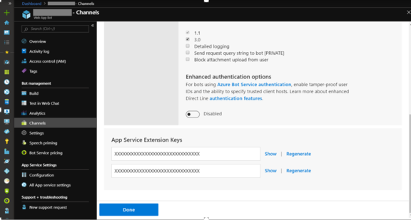

# Configure .NET bot for extension

[!INCLUDE[applies-to-v4](includes/applies-to.md)]

This article describes how to update a bot to work with **named pipes**, and how to enable the direct line app service extension in the **Azure App Service** resource where the bot is hosted.

## Prerequisites

In order to perform the steps described next, you must have **Azure App Service** resource and related **App Service** in Azure.

## Enable Direct Line App Service Extension

This section describes how to enable the direct line app service extension using keys from your bot’s channel configuration and the **Azure App Service** resource where your bot is hosted.

## Update .NET Bot to use Direct Line App Service Extension

> [!NOTE]
> `Microsoft.Bot.Builder.StreamingExtensions` are preview packages and will not be updated. The SDK v4.7 contains the [streaming code](https://github.com/microsoft/botbuilder-dotnet/tree/master/libraries/Microsoft.Bot.Builder/Streaming) and you do not need to install the Streaming Packages separately.

1. In Visual Studio, open your bot project.
2. Add the **Streaming Extension NuGet** package to your project:
    1. In your project, right click on **Dependencies** and select **Manage NuGet Packages**.
    2. Under the *Browse* tab, click **Include prerelease** to show the preview packages.
    3. Select the package **Microsoft.Bot.Builder.StreamingExtensions**.
    4. Click the **Install** button to install the package; read and agree to the license agreement.
3. Allow your app to use the **Bot Framework NamedPipe**:
    - Open the `Startup.cs` file.
    - In the ``Configure`` method, add code to ``UseBotFrameworkNamedPipe``

    ```csharp

    public void Configure(IApplicationBuilder app, IHostingEnvironment env)
    {
        if (env.IsDevelopment())
        {
            app.UseDeveloperExceptionPage();
        }
        else
        {
            app.UseHsts();
        }

        app.UseDefaultFiles();
        app.UseStaticFiles();

        // Allow the bot to use named pipes.
        app.UseNamedPipes();

        app.UseMvc();
    }
    ```

4. Save the `Startup.cs` file.
5. Open the `appsettings.json` file and enter the following values:
    1. `"MicrosoftAppId": "<secret Id>"`
    2. `"MicrosoftAppPassword": "<secret password>"`

    The values are the **appid** and the **appSecret** associated with the service registration group.

6. **Publish** the bot to your Azure App Service.

### Gather your Direct Line Extension keys

1. In your browser, navigate to the [Azure portal](https://portal.azure.com/)
1. In the Azure portal, locate your **Azure Bot Service** resource
1. Click on **Channels** to configure the bot’s channels
1. If it is not already enabled, click on the **Direct Line** channel to enable it.
1. If it is already enabled, in the Connect to channels table click on the **Edit** link on the Direct Line row.
1. Scroll down to the App Service Extension Keys section.
1. Click on the **Show link** to reveal one of the keys, then copy its value.



### Enable the Direct Line App Service Extension

1. In your browser, navigate to the [Azure portal](https://portal.azure.com/)
1. In the Azure portal, locate the **Azure App Service** resource page for the Web App where your bot is or will be hosted
1. Click on **Configuration**. Under the *Application settings* section, add the following new settings:

    |Name|Value|
    |---|---|
    |DirectLineExtensionKey|<App_Service_Extension_Key_From_Section_1>|
    |DIRECTLINE_EXTENSION_VERSION|latest|

1. Within the *Configuration* section, click on the **General** settings section and turn on **Web sockets**
1. Click on **Save** to save the settings. This restarts the Azure App Service.

## Confirm Direct Line App Extension and the Bot are Initialized

In your browser, navigate to https://<your_app_service>.azurewebsites.net/.bot.
If everything is correct, the page will return this JSON content: `{"k":true,"ib":true,"ob":true,"initialized":true}`. This is the information you obtain when **everything works correctly**, where

- **k** determines whether Direct Line App Service Extension (ASE) can read an App Service Extension Key from its configuration.
- **initialized** determines whether Direct Line ASE can use the App Service Extension Key to download the bot metadata from Azure Bot Service
- **ib** determines whether Direct Line ASE can establish an inbound connection with the bot.
- **ob** determines whether Direct Line ASE can establish an outbound connection with the bot.
