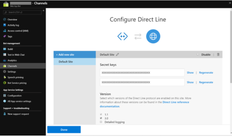

# Create .NET Client to Connect to Direct Line App Service Extension

This article describes how to create a .NET client in C# which connects to the direct line app service extension.

## Gather your Direct Line Extension keys

1. In your browser, navigate to the [Azure portal](https://portal.azure.com/)
1. In the Azure portal, locate your **Azure Bot Service** resource
1. Click on **Channels** to configure the bot’s channels
1. If it is not already enabled, click on the **Direct Line** channel to enable it. 
1. If it is already enabled, in the Connect to channels table click on the **Edit** link on the Direct Line row.
1. Scroll to the Sites section. There is typically a Default Site unless you have deleted or renamed it.
1. Click on the **Show link** to reveal one of the keys, then copy its value.

    

> [!NOTE]
> This value is your direct line client secret used to connect to direct
line app service extension. You can create additional sites if you’d like and use
those secret values as well.

## Add the Preview Nuget Package Source

The preview NuGet packages needed to create a C# Direct line client can be found in a NuGet feed.

1. In Visual Studio navigate to the **Tools->Options** menu item.
1. Select the **NuGet Package Manager->Package Sources** item.
1. Click on the + button to add a new package source with these values:
    - Name: DL ASE Preview
    - Source: https://botbuilder.myget.org/F/experimental/api/v3/index.json
1. Click on the **Update** button to save the values.
1. Click **OK** to exit the Package Sources configuration.

## Create a C# Direct Line Client

Interactions with the direct line app service extension happen differently than traditional Direct Line becuase most communication happens over a *WebSocket*. The updated direct line client includes helper classes for opening and closing a *WebSocket*, sending commands through the WebSocket, and receiving Activities back from the bot. This section describes how to create a simple C# client to interact with a bot.

1. Create a new .NET Core 2.2 console application project in Visual Studio.
1. Add the **DirectLine client NuGet** to your project
    - Click on Dependencies in the Solution tree
    - Select **Manage Nuget Packages...**
    - Change the Package source to the one you defined from above (DL ASE Preview)
    - Find the package *Microsoft.Bot.Connector.Directline* version v3.0.3-Preview1 or later.
    - Click on **Install Package**.
1. Create a client and generate a token using a secret. This step is the same as building any other C# Direct Line client except the endpoint you need use in your bot,appended with the **.bot/** path as shown next. Do not forget the ending **/**.

    ```csharp
    string endpoint = "https://<YOUR_BOT_HOST>.azurewebsites.net/.bot/";
    string secret = "<YOUR_BOT_SECRET>";

    var tokenClient = new DirectLineClient(
        new Uri(endpoint),
        new DirectLineClientCredentials(secret));
    var conversation = await tokenClient.Tokens.GenerateTokenForNewConversationAsync();
    ```

1. Once you have a conversation reference from generating a token, you can use this conversation ID to open a WebSocket with the new `StreamingConversations` property on the `DirectLineClient`. To do this you need to create a callback that will be invoked when the bot wants to send `ActivitySets` to the client:

    ```csharp
    public static void ReceiveActivities(ActivitySet activitySet)
    {
        if (activitySet != null)
        {
            foreach (var a in activitySet.Activities)
            {
                if (a.Type == ActivityTypes.Message && a.From.Id.Contains("bot"))
                {
                    Console.WriteLine($"<Bot>: {a.Text}");
                }
            }
        }
    }
    ```

1. Now you are ready to open the WebSocket on the `StreamingConversations` property using the conversation’s token, `conversationId`, and your `ReceiveActivities` callback:

    ```csharp
    var client = new DirectLineClient(
        new Uri(endpoint),
        new DirectLineClientCredentials(conversation.Token));

    await client.StreamingConversations.ConnectAsync(
        conversation.ConversationId,
        ReceiveActivities);
    ```

1. The client can now be used to start a conversation and send `Activities` to the bot:

    ```csharp

    var startConversation = await client.StreamingConversations.StartConversationAsync();
    var from = new ChannelAccount() { Id = "123", Name = "Fred" };
    var message = Console.ReadLine();

    while (message != "end")
    {
        try
        {
            var response = await client.StreamingConversations.PostActivityAsync(
                startConversation.ConversationId,
                new Activity()
                {
                    Type = "message",
                    Text = message,
                    From = from
                });
        }
        catch (OperationException ex)
        {
            Console.WriteLine(
                $"OperationException when calling PostActivityAsync: ({ex.StatusCode})");
        }
        message = Console.ReadLine();
    }
    ```
