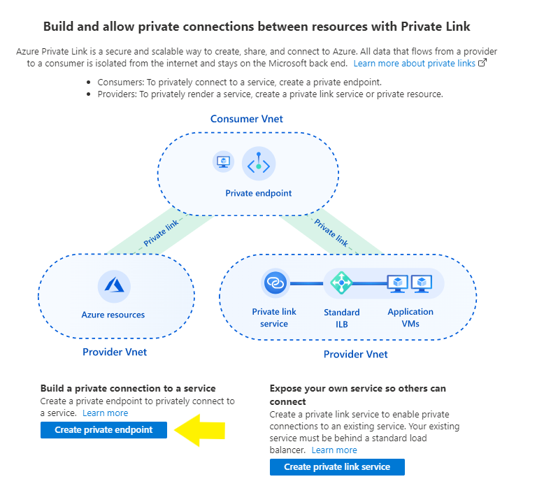
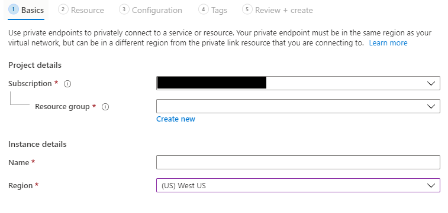
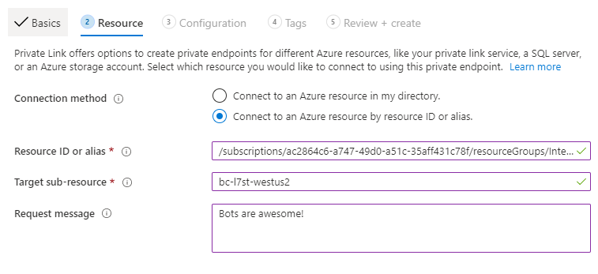

# Network Isolation with the Direct Line App Service Extension and Private Links

> [!NOTE]
> The usage of Private Links as described in this documentation is current offered in a **preview** capacity.

[!INCLUDE[applies-to-v4](includes/applies-to.md)]

This article describes how to combine the [Direct Line App Service Extension](./bot-service-channel-directline-extension.md) and [Azure Private Links](https://azure.microsoft.com/en-us/services/private-link/) to isolate your bot from the public internet.

The [Direct Line App Service Extension](./bot-service-channel-directline-extension.md) makes calls to the **Direct Line API** in order to verify security tokens and report usage metrics. In order to allow these outbound calls from within your [Virtual Network](https://docs.microsoft.com/en-us/azure/virtual-network/virtual-networks-overview) and ensure this traffic remains isolated within **Azure** and is never routed through the public internet you will need to setup a [Private Endpoint](https://azure.microsoft.com/en-us/services/private-link/) and a [Private DNS Zone](https://docs.microsoft.com/en-us/azure/dns/private-dns-privatednszone).

## Prerequisites

To perform the steps described next you will need to have a **Bot Channel Registration** resource and related **Bot App Service** (your bot) with the **Direct Line App Service Extension** enabled deployed to **Azure** inside of a **Virtual Network** or **App Service Environment**. Guides for creating these resources may be found from the [Direct Line App Service Extension document hub.](./bot-service-channel-directline-extension.md)

## Restrictions

1. **Private Links** as used here are only able compatible with the **Direct Line App Service Extension** channel. All other channels require incoming traffic to the bot.
1. **Private Links** require a **Virtual Network** be present in the resource group the **Private Link** is being added to.
1. During the preview period the **Private Link** must be in the same Azure region as the **App Gateway** it is targeting.
1. The below regions are supported during the preview period:

    |Region|Gateway Resource ID|Sub-Resource Name|
    |---|---|---|
    |WestUS|/subscriptions/ac2864c6-a747-49d0-a51c-35aff431c78f/resourceGroups/Intercom-directline-westus2/providers/Microsoft.Network/applicationGateways/bc-l7st-westus2|bc-l7st-westus2|
    |NorthEurope2|/subscriptions/ac2864c6-a747-49d0-a51c-35aff431c78f/resourceGroups/Intercom-directline-northeurope2/providers/Microsoft.Network/applicationGateways/bc-l7st-northeurope2|bc-l7st-northeurope2|
    |USGov Virginia|placeholder|placeholder|

## Create a Private Link via the Azure Portal

1. From the **Azure** portal click ***Create a Resource*** and begin the process of creating a **Private Link**.
1. When presented with the option to ***Create a Private Endpoint*** or ***Create a Private Link Service***, select **Create a Private Endpoint**.

    
1. Supply details of your **Subscription** and **Resource Group** then supply a name for your **Private Link** and be sure to select a **region** from the list in the **Restrictions** section above.

    
1. For **Connection Method** select to **Connect to an Azure resource by resource ID or alias**.
1. Provide the **Resource ID** and **Sub-Resource** from the table provided in the **Restrictions** section above.

    
1. Finish configuration and deployment of your **Private Link** as normal.
1. If after deployment your **Private Link** reports a status of "approval pending" it will require a manual sign off from the Azure Bot Service team. This is normally completed within 1 work day.

## Configure DNS

1. Once your **Private Endpoint** has been approved you will need to configure your **Virtual Network** internal DNS to resolve the appropriate domain names to the IP of your **Private Endpoint**.
1. From the **Azure** portal click **Create a Resource** and begin the process of creating a [Private DNS Zone](https://docs.microsoft.com/en-us/azure/dns/private-dns-privatednszone).
1. The name of your **Private DNS Zone** must match the URL the **Direct Line App Service Extension** uses to contact the service, in commercial Azure this value is **botframework.com**, in **USGov** clouds **botframework.azure.us**.
1. Once your **Private DNS Zone** has been deployed you will need to add a **Rule Set** to direct outbound traffic to the **Private Endpoint** created in the earlier steps.
1. Navigate to your **Private DNS Zone** in the **Azure** portal and from the **Overview** blade click on ***+ Record Set*** to create a new **Record Set**.
1. Name your **Record Set** "directline" and set the **IP address** to the internal IP of your **Private Endpoint**. This will create a DNS mapping that resolves directline.botframework.com or directline.botframework.azure.us to the IP address of your **Private Endpoint**.
1. Finally, while still viewing your **Private DNS Zone** in the **Azure** portal, from the left menu under **Settings**, click on ***Virtual network links***.
1. Click ***+ Add*** to create a new **Virtual Network Link**.
1. Select an appropriate name and subscription for your **Virtual Network Link** then supply the name of the **Virtual Network** you created earlier and click ***Ok***.

## Next steps

> [!div class="nextstepaction"]
> [Continue developing with the Direct Line Extension](./bot-service-channel-directline-extension.md)
