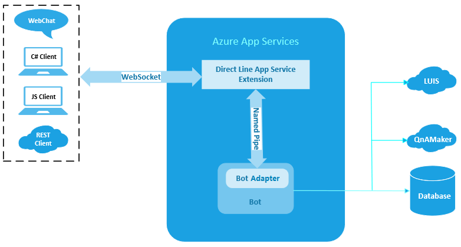

## Direct Line App Service Extension

[!INCLUDE[applies-to-v4](includes/applies-to.md)]

The Direct line app service extension establishes a set of **persistent named pipes** to connect to a bot through a **BotAdapter** that the customer can add.

It adds a new set of streaming extensions to the Bot Framework protocol. These extensions replace HTTP as the transport for exchanging messages with a transport that allows bidirectional requests to be sent over a **persistent WebSocket**. This increases performance and allows for more isolation during information exchange.

Before streaming extensions, the Direct Line API offered one way for a client to send Activities to Direct Line and two ways for a client to retrieve Activities from Direct Line. mThe messages were sent via an HTTP POST, and received by either an HTTP GET (polling) or by opening a WebSocket to receive ActivitySets.
Streaming extensions expand on the use of the WebSocket an allows **all messaging communication** to be sent on that WebSocket. Streaming extensions can also be used between channel services and the bot.

The Direct line app service extension is pre-installed on all instances of Azure App Services in every data center around the world. It is maintained and managed by Microsoft without additional deployment work for the customer.
It is disabled on Azure App Services by default, but it can be easily turned on so that it can connect to your hosted bot.

The following picture shows the overall architecture:

## See Also

|Name|Description|
|---|---|
|[.NET bot with extension](bot-service-channel-directline-extension-net-bot.md)|Update a bot to work with **named pipes**, and enable the direct line app service extension in the **Azure App Service** resource where the bot is hosted.  |
|[.NET client with extension](bot-service-channel-directline-extension-net-client.md)|Create a .NET client in C# which connects to the Direct Line App Service Extension|
|[WebChat with extension](bot-service-channel-directline-extension-webchat-client.md)|Use WebChat with the direct line app service extension|
|[Use extension within VNET](bot-service-channel-directline-extension-vnet.md)|Use the Direct Line App Service Extension with an Azure Virtual Network (VNET)|

## Addtional resources

- [Connect a bot to Direct Line](bot-service-channel-connect-directline.md)
- [Connect a bot to Direct Line Speech](bot-service-channel-connect-directlinespeech.md)
