# Debug an SDK-first bot

[!INCLUDE [applies-to-v4](includes/applies-to-v4-current.md)]

This article describes how to debug your bot using an integrated development environment (IDE) such as Visual Studio or Visual Studio Code and the Bot Framework Emulator. While you can use these methods to debug any bot locally, this article uses an echo bot, such as the one created in the [Create a bot](bot-service-quickstart-create-bot.md) quickstart.

> [!NOTE]
> In this article, we use the Bot Framework Emulator to send and receive messages from the bot during debugging. If you are looking for other ways to debug your bot using the Bot Framework Emulator, please read the [Debug with the Bot Framework Emulator](bot-service-debug-emulator.md) article.

## Prerequisites

- Download and install the [Bot Framework Emulator](https://github.com/Microsoft/BotFramework-Emulator/blob/master/README.md).
- Download and install [Visual Studio Code](https://code.visualstudio.com) or [Visual Studio](https://www.visualstudio.com/downloads) (Community Edition or above).

<!-- ### Debug a JavaScript bot using command-line and Emulator

To run a JavaScript bot using the command line and testing the bot with the Emulator, do the following:
1. From the command line, change directory to your bot project directory.
1. Start the bot by running the command **node app.js**.
1. Start the Emulator and connect to the bot's endpoint (e.g.: **http://localhost:3978/api/messages**). If this is the first time you are running
the bot then click **File > New Bot** and follow the instructions on screen. Otherwise, click **File > Open Bot** to open an existing bot.
Since this bot is running locally on your computer, you can leave the **MicrosoftAppId** and **MicrosoftAppPassword** fields blank.
For more information, see [Debug with the Emulator](bot-service-debug-emulator.md).
1. From the Emulator, send your bot a message (e.g.: send the message "Hi").
1. Use the **Inspector** and **Log** panels on the right side of the Emulator window to debug your bot. For example, clicking on any of the messages bubble (e.g.: the "Hi" message bubble in the screenshot below) will show you the detail of that message in the **Inspector** panel. You can use it to view requests and responses as messages are exchanged between the Emulator and the bot. Alternatively, you can click on any of the linked text in the **Log** panel to view the details in the **Inspector** panel.

   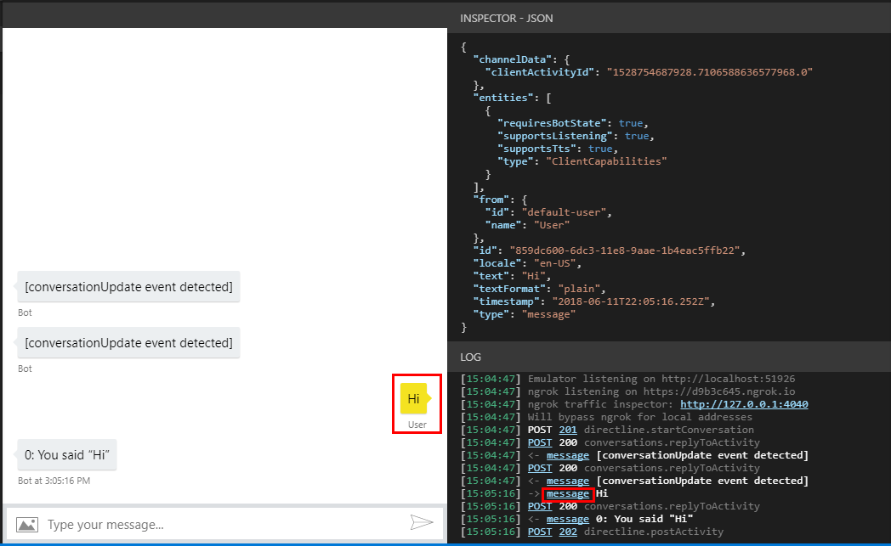 -->

## [C#](#tab/csharp)

### Set C# breakpoints in Visual Studio Code

In Visual Studio Code, you can set breakpoints and run the bot in debug mode to step through your code. To set breakpoints in VS Code, do the following:

1. Launch VS Code and open your bot project folder.
1. Set breakpoints as necessary. You can set breakpoints by hovering your mouse over the column to the left of the line numbers. A small red dot will appear. If you click on the dot, the breakpoint is set. If you click the dot again, the breakpoint is removed.
1. From the menu bar, click **Run** and then click **Start Debugging**. Your bot will start running in debugging mode from the Terminal in Visual Studio Code.

   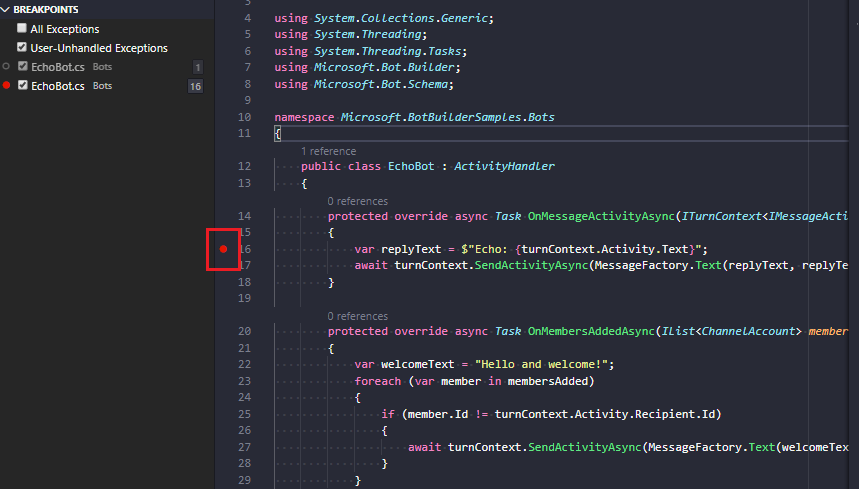

1. Start the Bot Framework Emulator and connect to your bot as described in the [Debug with the Bot Framework Emulator](/azure/bot-service/bot-service-debug-emulator) article.
1. From the Emulator, send your bot a message (for example, send the message "Hi"). Execution will stop at the line where you place the breakpoint.

   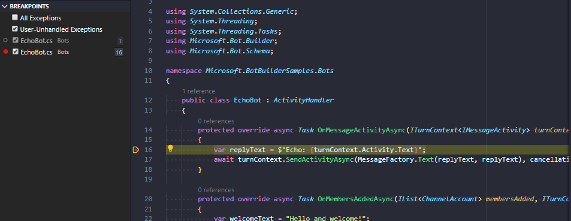

### Set C# breakpoints in Visual Studio

In Visual Studio (VS), you can set breakpoints and run the bot in debug mode to step through your code. To set breakpoints in VS, do the following:

1. Navigate to your bot folder and open the **.sln** file. This will open the solution in VS.
1. From the menu bar, click **Build** and click **Build Solution**.
1. In the **Solution Explorer**, click the **.cs** file and set breakpoints as necessary. This file defines your main bot logic. In VS, you can set breakpoints by hovering your mouse over the column to the left of the line numbers. A small red dot will appear. If you click on the dot, the breakpoint is set. If you click the dot again, the breakpoint is removed.
1. From the menu, click **Debug** and click **Start Debugging**. At this point, the bot is running locally.

   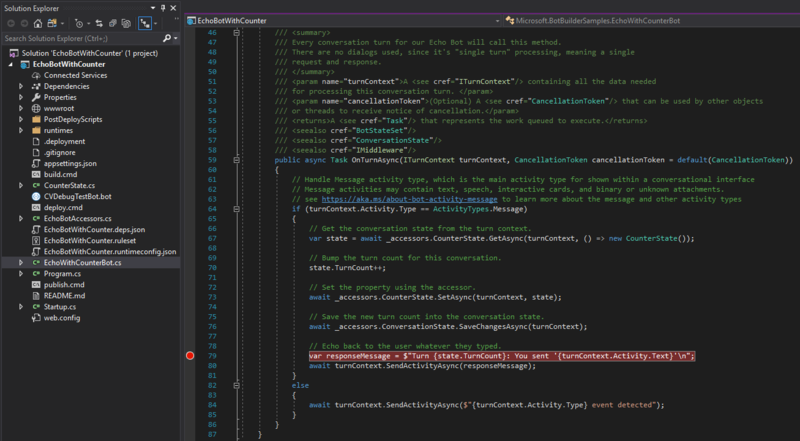

<!--
   > [!NOTE]
   > If you get the "Value cannot be null" error, check to make sure your **Table Storage** setting is valid.
   > The **EchoBot** is default to using **Table Storage**. To use Table Storage in your bot, you need the table *name* and *key*. If you do not have a Table Storage instance ready, you can create one or for testing purposes, you can comment out the code that uses **TableBotDataStore** and uncomment the line of code that uses **InMemoryDataStore**. The **InMemoryDataStore** is intended for testing and prototyping only.
-->

1. Start the Bot Framework Emulator and connect to your bot as described in the section above.
1. From the Emulator, send your bot a message, such as "Hi". Execution will stop at the line where you place the breakpoint.

   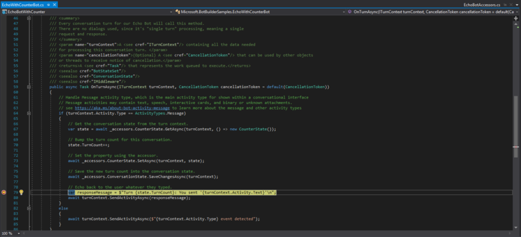

## [JavaScript](#tab/javascript)

### Set JavaScript breakpoints in Visual Studio Code

In Visual Studio Code, you can set breakpoints and run the bot in debug mode to step through your code. To set breakpoints in VS Code, do the following:

1. Launch VS Code and open your bot project folder.
2. From the menu bar, click **Debug** and click **Start Debugging**. If you are prompted to select a runtime engine to run your code, select **Node.js**. At this point, the bot is running locally.
3. Click the **.js** file and set breakpoints as necessary. In VS Code, you can set breakpoints by hovering your mouse over the column to the left of the line numbers. A small red dot will appear. If you click on the dot, the breakpoint is set. If you click the dot again, the breakpoint is removed.

   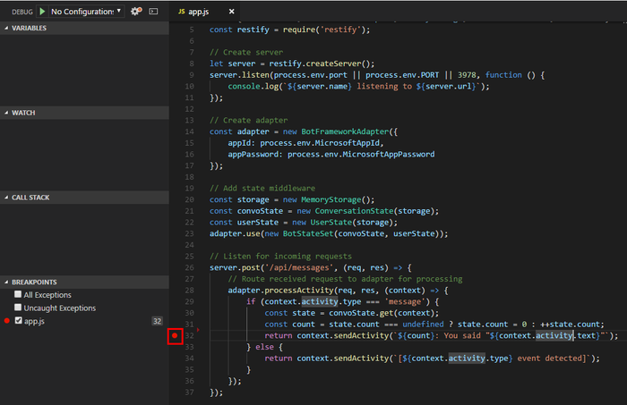

4. Start the Bot Framework Emulator and connect to your bot as described in the [Debug with the Bot Framework Emulator](/azure/bot-service/bot-service-debug-emulator) article.
5. From the Emulator, send your bot a message (for example, send the message "Hi"). Execution will stop at the line where you place the breakpoint.

   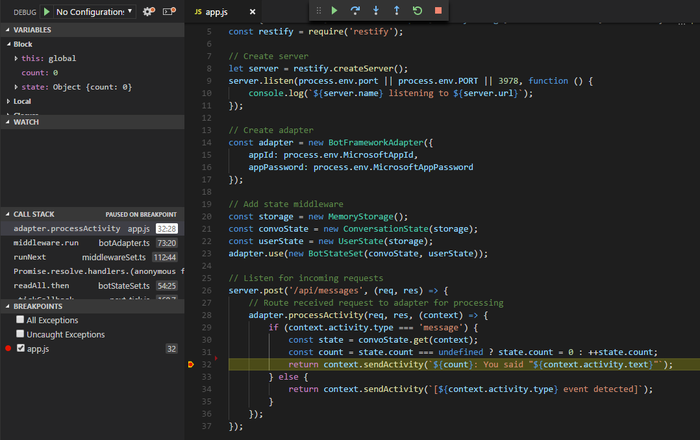

## [Java](#tab/java)

### Set Java breakpoints in Visual Studio Code

In Visual Studio Code, you can set breakpoints and run the bot in debug mode to step through your code. See also [Create a bot with the Bot Framework SDK for Java](~/java/bot-builder-java-quickstart.md).

1. Install the [Java Extension Pack](https://marketplace.visualstudio.com/items?itemName=vscjava.vscode-java-pack) in VS Code, if you have not already done so. This extension provides rich support for Java in VS Code, including debugging.
1. Launch VS Code and open your bot project folder.
1. Set breakpoints as necessary. You can set breakpoints by hovering your mouse over the column to the left of the line numbers. A small red dot will appear. If you click on the dot, the breakpoint is set. If you click the dot again, the breakpoint is removed.
1. Select the `EchoBot.java` file and add a breakpoint to a desired location.
1. From the menu bar, click **Run** and click **Start Debugging**.
1. Select **Java** if prompted to debug the currently selected file.

   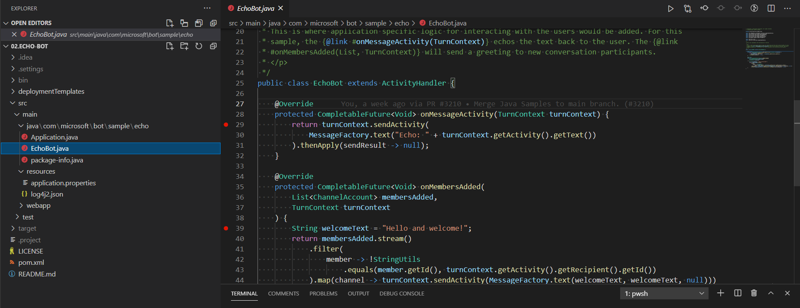

1. Start the Bot Framework Emulator and connect to your bot as described in the [Debug with the Bot Framework Emulator](/azure/bot-service/bot-service-debug-emulator) article.
1. From the Emulator, send your bot a message (for example, send the message "Hi"). Execution will stop at the line where you place the breakpoint.

   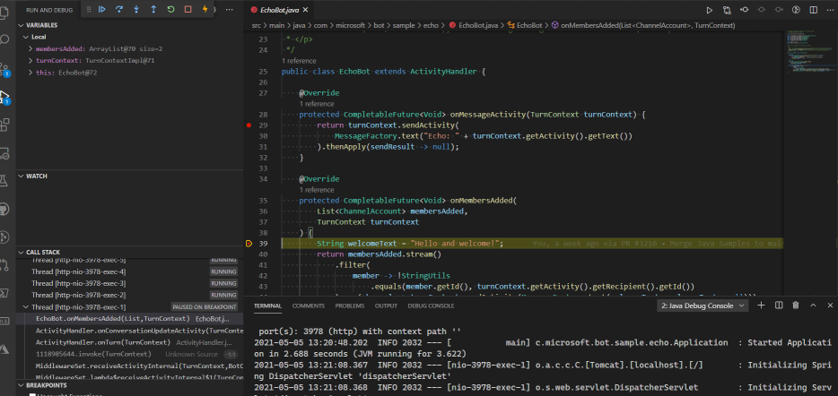

For more information, see [Running and debugging Java](https://code.visualstudio.com/docs/java/java-debugging).

## [Python](#tab/python)

### Set Python breakpoints in Visual Studio Code

In Visual Studio Code, you can set breakpoints and run the bot in debug mode to step through your code. See also [Create a bot with the Bot Framework SDK for Python](~/python/bot-builder-python-quickstart.md).

1. Install the [Python extension](https://marketplace.visualstudio.com/items?itemName=ms-python.python) in VS Code, if you have not already done so. This extension provides rich support for Python in VS Code, including debugging.
1. Launch VS Code and open your bot project folder.
1. Set breakpoints as necessary. You can set breakpoints by hovering your mouse over the column to the left of the line numbers. A small red dot will appear. If you click on the dot, the breakpoint is set. If you click the dot again, the breakpoint is removed.
1. Select the `app.py`.
1. From the menu bar, click **Debug** and click **Start Debugging**.
1. Select **Python File** to debug the currently selected file.

   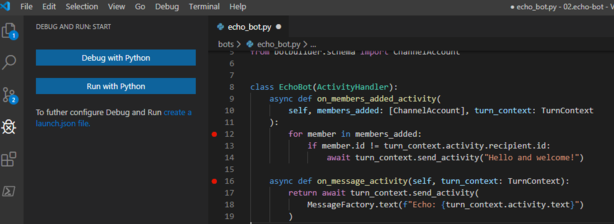

1. Start the Bot Framework Emulator and connect to your bot as described in the [Debug with the Bot Framework Emulator](/azure/bot-service/bot-service-debug-emulator) article.
1. From the Emulator, send your bot a message (for example, send the message "Hi"). Execution will stop at the line where you place the breakpoint.

   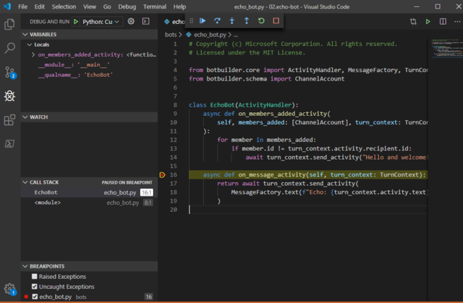

For more information, see [Debug your Python code](/visualstudio/python/debugging-python-in-visual-studio).

---

## Additional resources

- See [troubleshoot general problems](bot-service-troubleshoot-bot-configuration.md) and the other troubleshooting articles in that section.
- See the how to [Debug with the Emulator](bot-service-debug-emulator.md).

## Next steps

> [!div class="nextstepaction"]
> [Debug your bot using transcript files](v4sdk/bot-builder-debug-transcript.md).
