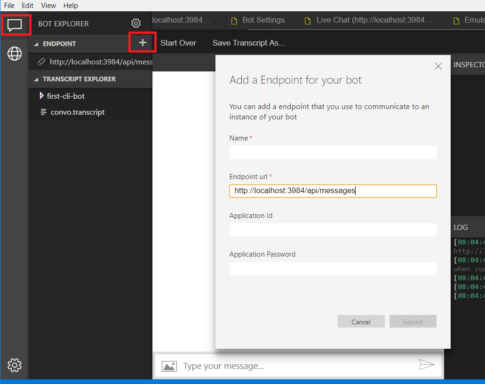
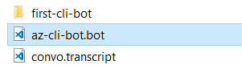
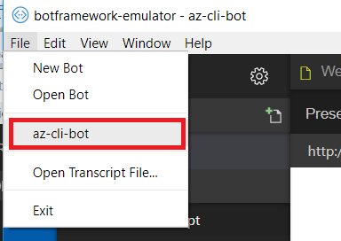

# Debug with the Bot Framework Emulator

The Bot Framework Emulator is a desktop application that allows bot developers to test and debug their bots, either locally or remotely. Using the emulator, you can chat with your bot and inspect the messages that your bot sends and receives. The emulator displays messages as they would appear in a web chat UI and logs JSON requests and responses as you exchange messages with your bot. 

> [!TIP] 
> Before you deploy your bot to the cloud, run it locally and test it using the emulator. 
> You can test your bot using the emulator even if you have not yet [registered](~/bot-service-quickstart-registration.md) it with the Bot Framework or configured it to run on any channels.


## Download the Bot Framework Emulator

Download packages for Mac, Windows, and Linux are available via the [GitHub releases page](https://github.com/Microsoft/BotFramework-Emulator/releases).

## Connect to a bot running on local host



To connect to a bot running locally, select the Bot Explorer tab on the upper left. Click on the **+** icon under the  **Endpoint** tab. Here you can specify your endpoint to the same port your bot is running on locally in order to connect to it. Click **Submit**, and you will redirected to a live chat window where you can interact with your bot.

## View detailed Message Activity with the Inspector


You can click on any message bubble within the conversation window and inspect the raw JSON activity using the **INSPECTOR** feature to the right of the window. When selected, the message bubble will turn yellow and the activity JSON object will be displayed to the left of the chat window. This JSON information includes key metadata including channelID, activity type, conversation id, the text message, endpoint URL, etc. You can view inspect activities sent from the user, as well as activities the bot responds with. 

You can also use the [Channel Inspector](bot-service-channel-inspector.md) to preview supported features on specific channels.


## Save and load conversations with bot transcripts

Message activity in the emulator can be saved as transcripts. From an open live chat window, you can select **Save Transcript As** to name and select the location of the output transacript file. 

>[!TIP]
> The **Start Over** button can be used any time to clear a conversation and restart a connection to the bot.  


To load transcripts, simply select **File** --> **Open Tranascript File** and select the transcript. A new Transcript window will open and render the message activity to the output window. 


## Author transcripts with Chatdown

The [Chatdown](https://github.com/Microsoft/botbuilder-tools/tree/master/Chatdown) tool is a transcript generator which consumes a [markdown](https://daringfireball.net/projects/markdown/syntax) file to generate activity transcripts. You can author your own transcripts completely in markdown format, and save them as a **.chat** file to generate transcripts. This is useful for quickly creating mock conversation scenarios during bot development.  

### Prerequisites

- [Bot Framework Emulator](https://github.com/Microsoft/BotFramework-Emulator/releases) v.4 or greater 
- [Node.js](https://nodejs.org/en/)
 
Chatdown is available as an npm module which requires Node.js. To install Chatdown, globally install it to your machine. 

```
npm install -g chatdown
```
### Create and load transcript Transcript files ###

The following is an example of a how to author a **.chat** file. These files are markdown which contain 2 parts:
- Header which defines the conversation participants (user, bot)
- The back and forth conversation between the participants

```
user=John Doe
bot=Bot

bot: Hello!
user: hey
bot: [Typing][Delay=3000]
What can I do for you?
user: Actually nevermind, goodbye.
bot: bye!
```
[Click here](https://github.com/Microsoft/botbuilder-tools/tree/master/Chatdown/Examples) to view more samples of .chat files. 

To generate the transcript file, using the **chatdown** command in your CLI, enter the name of the .chat file, followed by '>' and the name of the output transcript file. 

```
chatdown sample.chat > sample.transcript
```
## Manage bot resources with the MSBot tool

The new [MSBot](https://github.com/Microsoft/botbuilder-tools/tree/master/MSBot) tool allows you to create a **.bot** file, which stores metadata about different services your bot consumes, all in one location. This file also enables your bot to connect to these services from the CLI.The tool is available as an npm module, to install it run:

```
npm install -g msbot 
```


To create a bot file, from your CLI enter **msbot init** followed by the name of your bot, and the target URL endpoint, for example:

```shell
msbot init --name az-cli-bot --endpoint http://localhost:3984/api/messages
```


>**Note:** The bot used for this guide is a simple echo bot, generated from the Azure CLI bot extension. [Click here](https://github.com/Microsoft/botbuilder-tools/tree/master/AzureCli) to learn more about building bots with Azure CLI. 

With the .bot file, you can now easily load your bot to the emulator. The .bot file is also required to register different endpoints and language components to your bot. 



## Add Language Services 

You can easily register a LUIS app or QnA knowledge base to your .bot file directly from the emulator. When the .bot file is loaded, select the services button on the far left of the emulator window. You will see options under the **Services** menu to add LUIS, QnA Maker, Dispatch, endpoints, and the Azure Bot Service. 

To add a LUIS app, simply click on the **+** button on the LUIS menu, enter your LUIS app credentials, and click **Submit**. This will register the LUIS application to the .bot file, and connect the service to your bot application. 


Similarly, to add a QnA knowledge base, simply click on the **+** button on the QnA menu, enter your QnA Maker knowledge base credentials, and click **Submit**. Your knowledge base will now be registered to the .bot file, and ready for use. 


When either service is connected, you can go back to a live chat window and verify that your services are connected and working. 


## Inspect Language Services

With the new v4 emulator you can also inspect the JSON responses from LUIS and QnA. Using a bot with a connected language service, you can select **trace** in the LOG window to the bottom right. This new tool also provides features to update your language services directly from the emulator. 


With a connected LUIS service, you'll notice that the trace link specifies **Luis Trace**. When selected, you'll see the raw response from your LUIS service, which includes intents, entities along with their specified scores. You also have the option to re-assign intents for your user utterances. 


With a connected QnA service, the log will display **QnA Trace**, and when selected you can preview the question and answer pair associated with that activity, along with a confidence score. From here, you can add alternative question phrasing for an answer.

[!TIP]
> These features are only available to v4 SDK bots 


## Speech Recognition
The Bot Framework Emulator supports speech recognition via the [Cognitive Services Speech API](/azure/cognitive-services/Speech/home). This allows you to exercise your speech-enabled bot, or Cortana skill, via speech in the emulator during development. The Bot Framework Emulator provides speech recognition free of charge for up to three hours per bot per day. 

## <a id="ngrok"></a> Install and configure ngrok

If you are using Windows and you are running the Bot Framework Emulator behind a firewall or other network boundary and want to connect to a bot that is hosted remotely, you must install and configure **ngrok** tunneling software. The Bot Framework Emulator integrates tightly with [ngrok][ngrokDownload] tunnelling software (developed by [inconshreveable][inconshreveable]), and can launch it automatically when it is needed.

To install **ngrok** on Windows and configure the emulator to use it, complete these steps: 

1. Download the [ngrok][ngrokDownload] executable to your local machine.

2. Open the emulator's App Settings dialog, enter the path to ngrok, select whether or not to bypass ngrok for local addresses, and click **Save**.


## Additional resources

The Bot Framework Emulator is open source. You can [contribute][EmulatorGithubContribute] to the development and [submit bugs and suggestions][EmulatorGithubBugs].


[EmulatorGithub]: https://github.com/Microsoft/BotFramework-Emulator
[EmulatorGithubContribute]: https://github.com/Microsoft/BotFramework-Emulator/wiki/How-to-Contribute
[EmulatorGithubBugs]: https://github.com/Microsoft/BotFramework-Emulator/wiki/Submitting-Bugs-%26-Suggestions

[ngrokDownload]: https://ngrok.com/
[inconshreveable]: https://inconshreveable.com/
[BotFrameworkDevPortal]: https://dev.botframework.com/


[EmulatorConnectPicture]: ~/media/emulator/emulator-connect_localhost_credentials.png
[EmulatorNgrokPath]: ~/media/emulator/emulator-configure_ngrok_path.png
[EmulatorNgrokMonitor]: ~/media/emulator/emulator-testbot-ngrok-monitoring.png
[EmulatorUI]: ~/media/emulator/emulator-ui-new.png

[TroubleshootingGuide]: ~/bot-service-troubleshoot-general-problems.md
[TroubleshootingAuth]: ~/bot-service-troubleshoot-authentication-problems.md
[NodeGetStarted]: ~/nodejs/bot-builder-nodejs-quickstart.md
[CSGetStarted]: ~/dotnet/bot-builder-dotnet-quickstart.md
