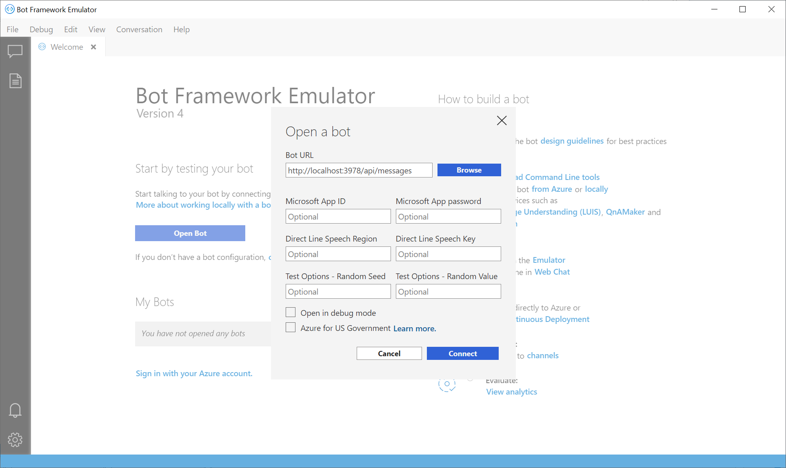

# Debug with the emulator

The Bot Framework Emulator is a desktop application that allows bot developers to test and debug their bots, either locally or remotely. Using the emulator, you can chat with your bot and inspect the messages that your bot sends and receives. The emulator displays messages as they would appear in a web chat UI and logs JSON requests and responses as you exchange messages with your bot. Before you deploy your bot to the cloud, run it locally and test it using the emulator. You can test your bot using the emulator even if you have not yet [created](./bot-service-quickstart.md) it with Azure Bot Service or configured it to run on any channels.

## Prerequisites
- Install [Bot Framework Emulator](https://aka.ms/Emulator-wiki-getting-started)

## Run a bot locally
Before connecting your bot to the Bot Framework Emulator, you need to run your bot locally. You can use Visual Studio or Visual Studio Code to run your bot, or use command line. 
To run a bot using command line, do the following:


# [C#](#tab/csharp)

* Go to the command prompt and change directory to your bot project directory.
* Start the bot by running the following command: 
    ```
    dotnet run
    ```
* Copy the port number in the line before *Application started. Press CTRL+C to shut down.*

    


# [JavaScript](#tab/javascript)

* Go to the command prompt and change directory to your bot project directory.
* Start the bot by running the following command:
    ```
    node index.js
    ```
* Copy the port number that restify is listening on.

    
---

At this point, your bot should be running locally. 


## Connect to a bot running on localhost


To connect to a bot running locally and click **Open bot**. Add the port number your copied earlier into the following URL and paste the updated URL in the Bot URL bar:

*http://localhost:**port number**/api/messages*



If your bot is running with [Microsoft Account (MSA) credentials](#use-bot-credentials), enter these credentials too.


### Use bot credentials

When you open the bot, set the **Microsoft App ID** and **Microsoft App password** if your bot is running with credentials. If you created your bot with the Azure Bot Service, the credentials are available on the bot's App Service, under the **Settings -> Configuration** section. If you do not know the values, you can remove those from the locally running bot's configuration file, then run the bot in the Emulator. If the bot isn't running with these settings, you don't need to run the emulator with the settings either. 

## View detailed Message Activity with the Inspector

Send a message to your bot and the bot should respond back. You can click on the message bubble within the conversation window and inspect the raw JSON activity using the **INSPECTOR** feature to the right side of the window. When selected, the message bubble will turn yellow and the activity JSON object will be displayed to the left of the chat window. The JSON information includes key metadata, including the channel ID, activity type, conversation ID, the text message, endpoint URL, and so on. You can inspect activities sent from the user, as well as activities the bot responds with.


> [!TIP]
> You can debug state changes in a bot connected to a channel by adding [Inspection Middleware](bot-service-debug-inspection-middleware.md) to the bot.

<!--
## Save and load conversations with bot transcripts

Activities in the emulator can be saved as transcripts. From an open live chat window, select **Save Transcript As** to the transcript file. The **Start Over** button can be used any time to clear a conversation and restart a connection to the bot.  


To load transcripts, simply select **File > Open Transcript File** and select the transcript. A new Transcript window will open and render the message activity to the output window. 


--->
<!---
## Add services 

You can easily add a LUIS app, QnA knowledge base, or dispatch model to your bot directly from the emulator. When the bot is loaded, select the services button on the far left of the emulator window. You will see options under the **Services** menu to add LUIS, QnA Maker, and Dispatch. 

To add a service app, simply click on the **+** button and select the service you want to add. You will be prompted to sign in to the Azure portal to add the service to the bot file, and connect the service to your bot application. 

> [!IMPORTANT]
> Adding services only works if you're using a `.bot` configuration file. Services will need to be added independently. For details on that, see [Manage bot resources](v4sdk/bot-file-basics.md) or the individual how to articles for the service you're trying to add.
>
> If you are not using a `.bot` file, the left pane won't have your services listed (even if your bot uses services) and will display *Services not available*.


When either service is connected, you can go back to a live chat window and verify that your services are connected and working. 


--->

## Inspect services

With the new v4 emulator you can also inspect the JSON responses from LUIS and QnA. Using a bot with a connected language service, you can select **trace** in the LOG window to the bottom right. This new tool also provides features to update your language services directly from the emulator. 


With a connected LUIS service, you'll notice that the trace link specifies **Luis Trace**. When selected, you'll see the raw response from your LUIS service, which includes intents, entities along with their specified scores. You also have the option to re-assign intents for your user utterances. 


With a connected QnA service, the log will display **QnA Trace**, and when selected you can preview the question and answer pair associated with that activity, along with a confidence score. From here, you can add alternative question phrasing for an answer.

<!--## Configure ngrok

If you are using Windows and you are running the Bot Framework Emulator behind a firewall or other network boundary and want to connect to a bot that is hosted remotely, you must install and configure **ngrok** tunneling software. The Bot Framework Emulator integrates tightly with ngrok tunnelling software (developed by [inconshreveable][inconshreveable]), and can launch it automatically when it is needed.

Open the **Emulator Settings**, enter the path to ngrok, select whether or not to bypass ngrok for local addresses, and click **Save**.


-->

<!---## Login to Azure

You can use Emulator to login in to your Azure account. This is particularly helpful for you to add and manage services your bot depends on. 
See [above](#add-services) to learn more about services you can manage using the Emulator.
-->

### Login to Azure
You can use Emulator to login in to your Azure account. This is particularly helpful for you to add and manage services your bot depends on. Log into Azure by following these steps:
- Click on File -> Sign in with Azure

- On the welcome screen click on Sign in with your Azure account
You can optionally have Emulator keep you signed in across Emulator application restarts.


## Disabling data collection

If you decide that you no longer want to allow the Emulator to collect usage data, you can easily disable data collection by following these steps:

1. Navigate to the Emulator's settings page by clicking on the Settings button (gear icon) in the nav bar on the left side.

    

2. Uncheck the checkbox labeled *Help improve the Emulator by allowing us to collect usage data* under the **Data Collection** section.

    

3. Click the "Save" button.

    
    
If you change your mind, you can always enable it by re-checking the checkbox.

## Additional resources

The Bot Framework Emulator is open source. You can [contribute][EmulatorGithubContribute] to the development and [submit bugs and suggestions][EmulatorGithubBugs].

For troubleshooting, see [troubleshoot general problems](bot-service-troubleshoot-bot-configuration.md) and the other troubleshooting articles in that section.

## Next steps

Use inspection middleware to debug a bot connected to a channel.

> [!div class="nextstepaction"]
> [Debug your bot using transcript files](bot-service-debug-inspection-middleware.md)

<!--
Saving a conversation to a transcript file allows you to quickly draft and replay a certain set of interactions for debugging.

> [!div class="nextstepaction"]
> [Debug your bot using transcript files](~/v4sdk/bot-builder-debug-transcript.md)
-->

<!-- Footnote-style URLs -->

[EmulatorGithubContribute]: https://github.com/Microsoft/BotFramework-Emulator/wiki/How-to-Contribute
[EmulatorGithubBugs]: https://github.com/Microsoft/BotFramework-Emulator/wiki/Submitting-Bugs-%26-Suggestions

[ngrokDownload]: https://ngrok.com/
[inconshreveable]: https://inconshreveable.com/
