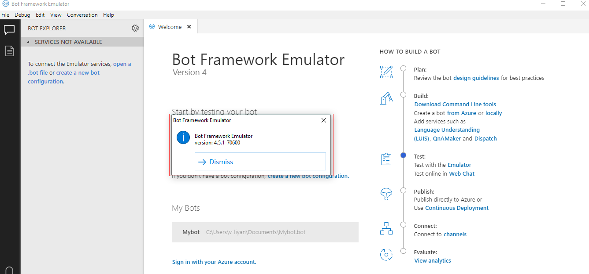
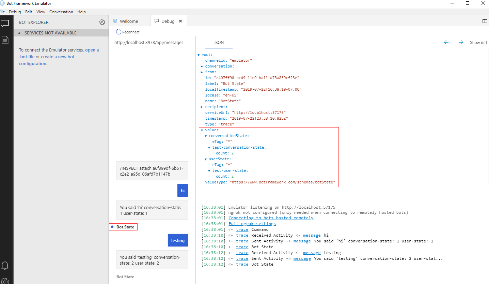
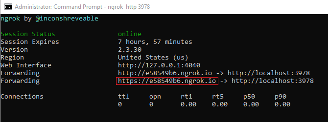
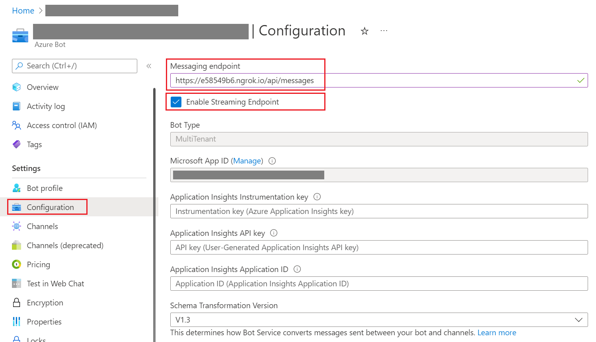
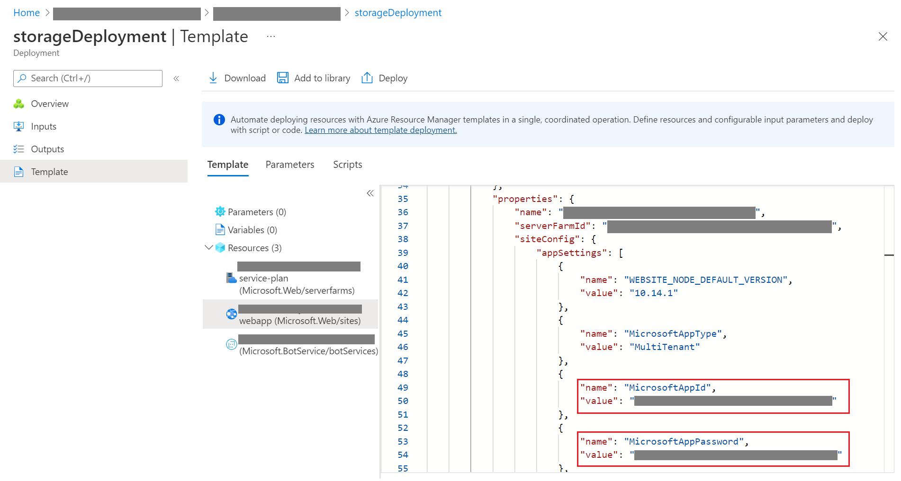
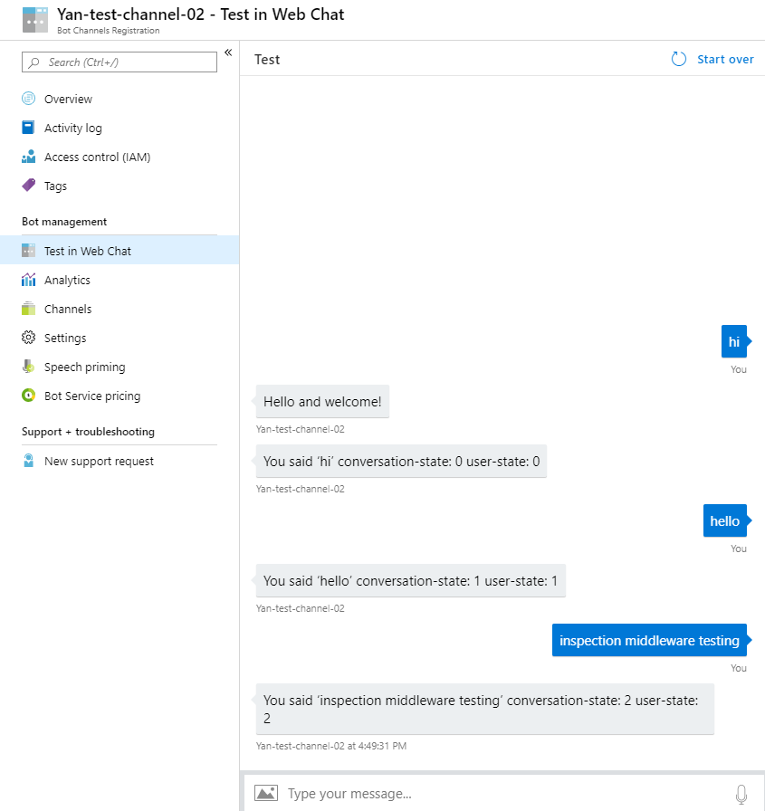
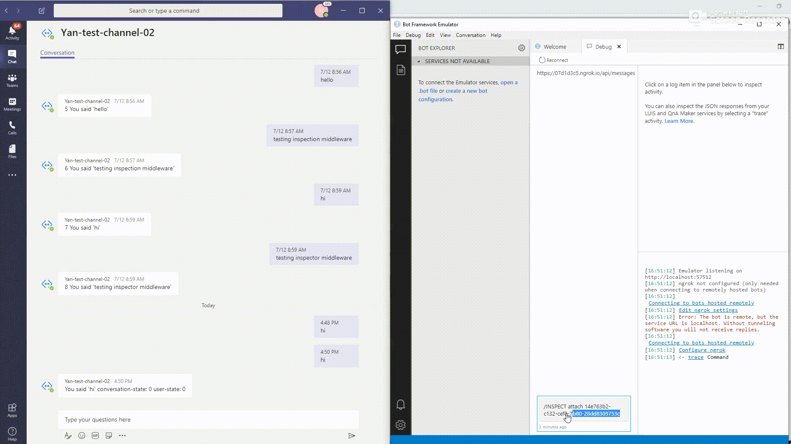

# Debug a bot with inspection middleware
This article describes how to debug your bot using inspection middleware. This feature allows the Bot Framework Emulator to debug traffic into and out of the bot in addition to looking at the current state of the bot. You can use a trace message to send data to the emulator and then inspect the state of your bot in any given turn of the conversation. 

We use an EchoBot built locally using the Bot Framework v4 ([C#](https://docs.microsoft.com/azure/bot-service/dotnet/bot-builder-dotnet-sdk-quickstart?view=azure-bot-service-4.0) | [JavaScript](https://docs.microsoft.com/azure/bot-service/javascript/bot-builder-javascript-quickstart?view=azure-bot-service-4.0)) to show how to debug and inspect the bot's message state. You can also [Debug a bot using IDE](./bot-service-debug-bot.md) or [Debug with the Bot Framework Emulator](./bot-service-debug-emulator.md), but to debug state you need to add inspection middleware to your bot. The Inspection bot samples are available here: [C#](https://github.com/microsoft/BotBuilder-Samples/tree/master/samples/csharp_dotnetcore/47.inspection) and [JavaScript](https://github.com/microsoft/BotBuilder-Samples/tree/master/samples/javascript_nodejs/47.inspection). 

## Prerequisites
- Download and install the [Bot Framework Emulator](https://aka.ms/Emulator-wiki-getting-started)
- Knowledge of bot [Middleware](https://docs.microsoft.com/azure/bot-service/bot-builder-concept-middleware?view=azure-bot-service-4.0)
- knowledge of bot [Managing state](https://docs.microsoft.com/azure/bot-service/bot-builder-concept-state?view=azure-bot-service-4.0)
- Download and install [ngrok](https://ngrok.com/) (if you want to debug a bot configured in Azure to use additional channels)

## Update your emulator to the latest version 
Before using the bot inspection middleware to debug your bot, you need to update your emulator to be version 4.5 or newer. Check the [latest version](https://github.com/Microsoft/BotFramework-Emulator/releases) for updates. 

To check the version of your emulator, select **Help** -> **About** in the menu. You will see the current version of your emulator. 

 

## Update your bot's code

# [C#](#tab/csharp)
Set up the inspection state in the **Startup** file. Add the inspection middleware to the adapter. The inspection state is provided through dependency injection. See the code update below or refer to the inspection sample here: [C#](https://github.com/microsoft/BotBuilder-Samples/tree/master/samples/csharp_dotnetcore/47.inspection). 

**Startup.cs**  
[!code-csharp [inspection bot sample](~/../botbuilder-samples/samples/csharp_dotnetcore/47.inspection/Startup.cs?range=17-37)]

**AdapterWithInspection.cs**  
[!code-csharp [inspection bot sample](~/../botbuilder-samples/samples/csharp_dotnetcore/47.inspection/AdapterwithInspection.cs?range=11-37)]

**EchoBot.cs**  
[!code-csharp [inspection bot sample](~/../botbuilder-samples/samples/csharp_dotnetcore/47.inspection/Bots/EchoBot.cs?range=14-43)]

# [JavaScript](#tab/javascript)
Before updating your bot's code you should update its packages to the latest versions by executing the following command in your terminal: 
```cmd
npm install --save botbuilder@latest 
```  
Then you need to update the code of your JavaScript bot as follows. You can read more here: [Update your bot's code](https://github.com/Microsoft/BotFramework-Emulator/blob/master/content/CHANNELS.md#1-update-your-bots-code) or refer to the inspection sample here: [JavaScript](https://github.com/microsoft/BotBuilder-Samples/tree/master/samples/javascript_nodejs/47.inspection). 

**index.js**

Set up the inspection state and add the inspection middleware to the adapter in the **index.js** file. 

[!code-javascript [inspection bot sample](~/../botbuilder-samples/samples/javascript_nodejs/47.inspection/index.js?range=10-43)]

**bot.js**

Update the bot class in the **bot.js** file. 

[!code-javascript [inspection bot sample](~/../botbuilder-samples/samples/javascript_nodejs/47.inspection/bot.js?range=6-50)]

---

## Test your bot locally 
After updating the code you can run your bot locally and test the debugging feature using two emulators: one to send and receive messages, and the other to inspect the state of messages in debugging mode. To test your bot locally take the following steps: 

1. Navigate to your bot's directory in a terminal and execute the following command to run your bot locally: 

# [C#](#tab/csharp)

```cmd
dotnet run
```

# [JavaScript](#tab/javascript)

```cmd
npm start 
```

---

2. Open your emulator. Click **Open Bot**. Fill in Bot URL with http://localhost:3978/api/messages and the **MicrosoftAppId** and **MicrosoftAppPassword** values. If you have a JavaScript bot you can find these values in your bot's **.env** file. If you have a C# bot you can find these values in the **appsettings.json** file. Click **Connect**. 

3. Now open another emulator. This second emulator will work as a debugger. Follow the instructions as described in the previous step. Check **Open in debug mode** and then click **Connect**. 

4. At this point you will see a UUID (`/INSPECT attach <identifier>`) in your debugging emulator. Copy the UUID and paste it to the chat box of the first emulator. 

> [!NOTE]
> A universally unique identifier (UUID) is a unique ID for identifying information. A UUID is generated every time when the emulator is launched in debug mode after you add the inspection middleware in your bot's code. 

5. Now you can send messages in the chat box of your first emulator and inspect the messages in the debugging emulator. To inspect the state of the messages click **Bot State** in the debugging emulator and unfold **values** on the right **JSON** window. You will be able to see the state of your bot as follows: 


## Inspect the state of a bot configured in Azure 
If you want to inspect the state of your bot configured in Azure and connected to channels (like Teams) you will need to install and run [ngrok](https://ngrok.com/).

### Run ngrok
At this point you have updated your emulator to the latest version and added the inspection middleware in your bot's code. The next step is to run ngrok and configure your local bot to your Azure Bot Channels Registration. Before running ngrok you need to run your bot locally. 

To run your bot locally do the following: 
1. Navigate to your bot's folder in a terminal and set your npm registration to use the [latest builds](https://botbuilder.myget.org/feed/botbuilder-v4-js-daily/package/npm/botbuilder-azure)

2. Run your bot locally. You will see your bot expose a port number like 3978. 

3. Open another command prompt and navigate to your bot's project folder. Run the following command:
```
ngrok http 3978
```
4. ngrok is now connected to your locally running bot. Copy the public IP address. 


### Update channel registrations for your bot
Now that your local bot is connected to ngrok you can configure your local bot to your Bot Channels Registration in Azure.

1. Go to your Bot Channels Registration in Azure. Click **Settings** on the left menu and set the **Messaging endpoint** with your ngrok IP. If necessary add **/api/messages** after the IP address. (For example, https://e58549b6.ngrok.io/api/messages). Check **Enable Streaming Endpoint** and **Save**.

> [!TIP]
> If **Save** is not enabled, you can uncheck **Enable Streaming Endpoint** and click **Save**, then check **Enable Streaming Endpoint** and click **Save** again. You need to make sure that **Enable Streaming Endpoint** is checked and the configuration of the endpoint is saved. 

2. Go to your bot's resource group, click **Deployment**, and select your Bot Channels Registration that previously deployed successfully. Click **Inputs** on the left side to get the **appId** and **appSecret**. Update your bot's **.env** file (or **appsettings.json** file if you have a C# bot) with the **appId** and **appSecret**. 


3. Start your emulator, click **Open Bot**, and put http://localhost:3978/api/messages in the **Bot URL**. Fill **Microsoft App ID** and **Microsoft App password** with the same **appId** and **appSecret** you added to our bot's **.env** (**appsettings.json**) file. Then click **Connect**. 

4. Your running bot is now connected to your Bot Channels Registration in Azure. You can test the web chat by clicking **Test in Web Chat** and sending messages in the chat box. 


5. Now let's enable the debugging mode in the emulator. In your emulator select **Debug** -> **Start Debugging**. Fill the ngrok IP address (don't forget to add **/api/messages**) in the **Bot URL** (for example, https://e58549b6.ngrok.io/api/messages). Fill **Microsoft App ID** with **appId** and **Microsoft App password** with **appSecret**. Make sure **Open in debug mode** is checked as well. Click **Connect**. 

6. When the debugging mode is enabled a UUID will be generated in your emulator. A UUID is a unique ID generated every time you start the debugging mode in your emulator. Copy and paste the UUID to the **Test in Web Chat** chat box or your channel's chat box. You will see the message "Attached to session, all traffic is being replicated for inspection" in the chat box. 

 You can start debugging your bot by sending messages in the configured channel's chat box. Your local emulator will automatically update the messages with all the details for debugging. To inspect your bot's state of messages click **Bot State** and unfold the **values** in the right JSON window. 

 

## Additional resources
- Try the new inspection bot samples here: [C#](https://github.com/microsoft/BotBuilder-Samples/tree/master/samples/csharp_dotnetcore/47.inspection) and [JavaScript](https://github.com/microsoft/BotBuilder-Samples/tree/master/samples/javascript_nodejs/47.inspection). 
- Read [troubleshoot general problems](bot-service-troubleshoot-bot-configuration.md) and the other troubleshooting articles in that section.
- Read the how to [Debug with the Emulator](bot-service-debug-emulator.md) article.
