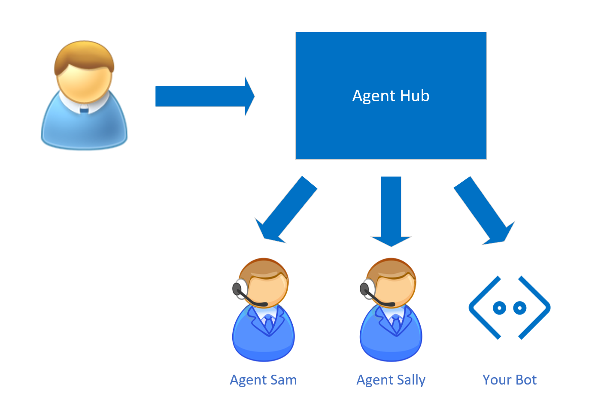

# Transition conversations from bot to human

Regardless of how much artificial intelligence a bot possesses, there may still be times when it needs to hand off the conversation to a human being. This can be necessary either because the bot does not understand the user (because of an AI limitation), or if the request cannot be automated and requires a human action. In such cases the bot should recognize when it needs to hand off and provide the user with a smooth transition.

Microsoft Bot Framework is an open platform that allows developers to integrate with a variety of agent engagement platforms. 

# Handoff protocol

When a bot detects the need to hand the conversation off to an agent, it signals its intent by sending a handoff initiation event, as demonstrated in the following C# code snippet.

```C#
var activities = GetRecentActivities();
var handoffContext = new { Skill = "credit cards" };
var handoffEvent =
    EventFactory.CreateHandoffInitiation(
        turnContext, handoffContext, new Transcript(activities));
await turnContext.SendActivityAsync(handoffEvent);
```

The event contains two components:
 
 - The context of the handoff request that is necessary to route the conversation to the right agent.
 - The transcript of the conversation. The agent can read the conversation that took place between the customer and the bot before the handoff was initiated.

You can read more about the Bot Framework handoff protocol <a href="https://aka.ms/bfhandoffprotocol" target="blank">here</a>. 

# Handoff integration models

Microsoft Bot Framework supports two models for integration with agent engagement platforms. The handoff protocol is identical for both models, however the onboarding details differ between the models and the agent engagement platforms.

## Bot as an agent

In the first model, known as "Bot as an agent", the bot joins the ranks of the live agents connected to the agent hub and responds to user requests as if the requests came from any other Bot Framework channel. The conversation between the user and the bot can be escalated to a human agent, at which point the bot disengages from the active conversation.

The main advantage of this mode is in its simplicity – an existing bot can be onboarded to the agent hub with minimal effort, with all of the complexity of message routing taken care of by the agent hub.



## Bot as a proxy

The second model is known as "Bot as a proxy". The user talks directly to the bot, until the bot decides that it needs help from a human agent. The message router component in the bot redirects the conversation to the agent hub, which dispatches it to the appropriate agent. The bot stays in the loop and can collect the transcript of the conversation, filter messages, or provide additional content to both the agent and the user.

Flexibility and control are the main advantages of this model. The bot can support a variety of channels and have control over how the conversations are escalated and routed between the user, the bot, and the agent hub.


# Natural language

Natural language understanding and sentiment analysis help the bot decide when to transfer control of the conversation to a human agent. This is particularly valuable when attempting to determine when the user is frustrated or wants to speak with a human agent. 
 
The bot analyzes the content of the user's messages 
by using the <a href="https://www.microsoft.com/cognitive-services/text-analytics-api" target="blank">Text Analytics API</a> 
to infer sentiment 
or by using the <a href="https://www.luis.ai" target="_blank">LUIS API</a>. 


> [!TIP]
> Natural language understanding may not always be the best method for determining when a bot 
> should transfer conversation control to a human being. Bots, like humans, don't always guess 
> correctly, and invalid responses will frustrate the user. If the user selects from a menu of 
> valid choices, however, the bot will always respond appropriately to that input. 


# Additional resources

- <a href="https://github.com/microsoft/BotBuilder-Samples/tree/master/experimental/handoff-library/csharp_dotnetcore/samples" target="blank">Integration with Microsoft Dynamics Omnichannel for Customer Service</a> 

- <a href="https://developers.liveperson.com/third-party-bots-microsoft-bot-framework.html" target="blank">Integration with LivePerson LiveEngage platform</a> 

::: moniker range="azure-bot-service-4.0"

- [Dialogs](v4sdk/bot-builder-dialog-manage-conversation-flow.md)
- <a href="https://www.microsoft.com/cognitive-services/text-analytics-api" target="blank">Text Analytics API</a>

::: moniker-end

::: moniker range="azure-bot-service-3.0"

- [Manage conversation flow with dialogs (.NET)](~/dotnet/bot-builder-dotnet-manage-conversation-flow.md)
- [Manage conversation flow with dialogs (Node.js)](~/nodejs/bot-builder-nodejs-manage-conversation-flow.md)
- <a href="https://www.microsoft.com/cognitive-services/text-analytics-api" target="blank">Text Analytics API</a>


::: moniker-end

