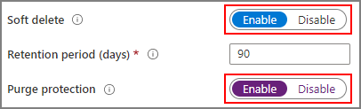
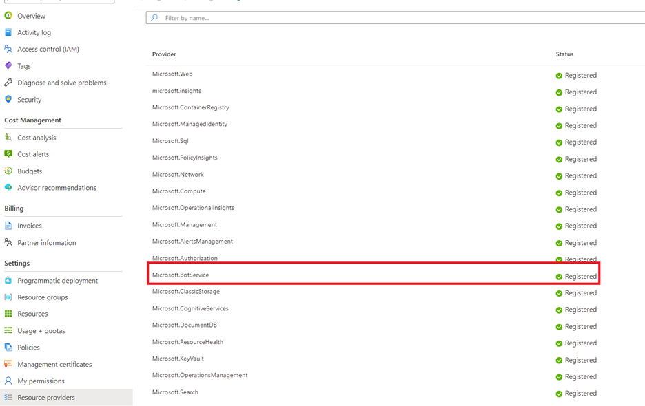
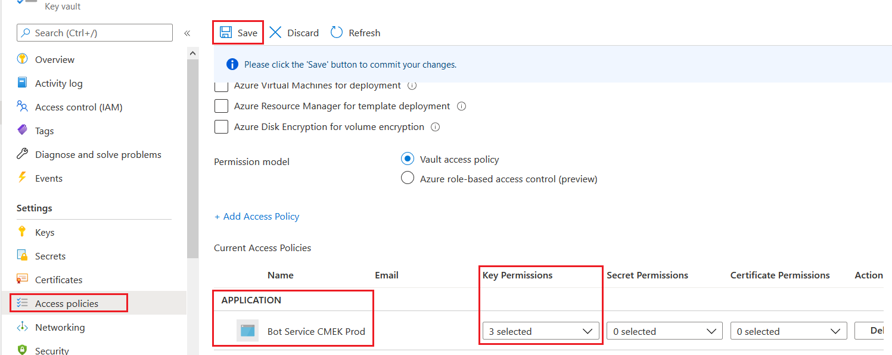
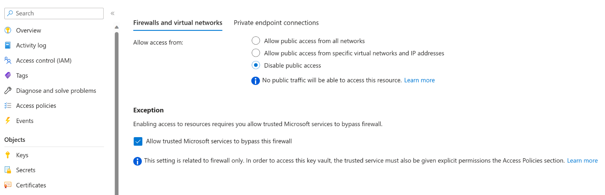
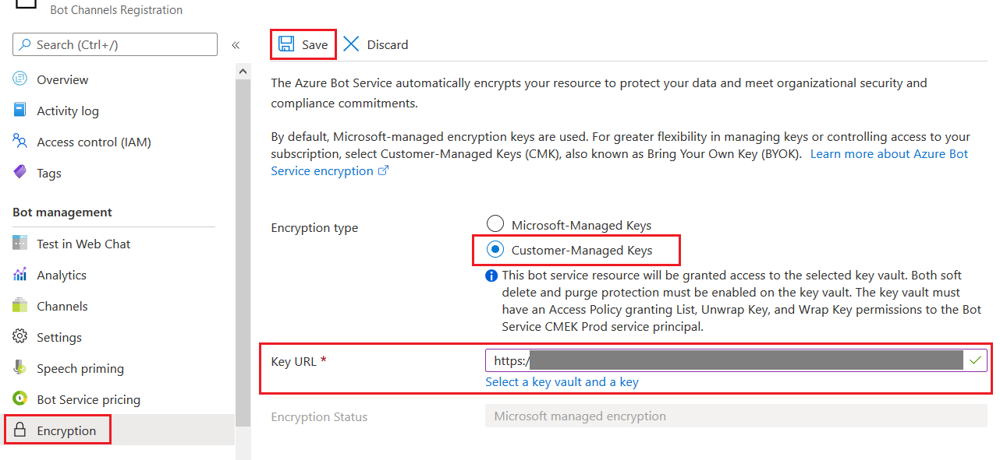

# Azure Bot Service encryption for data at rest

[!INCLUDE [applies-to-v4](includes/applies-to-v4-current.md)]

Azure Bot Service automatically encrypts your data when it's persisted to the cloud to protect your data and meet organizational security and compliance commitments.

Encryption and decryption are transparent, meaning encryption and access are managed for you. Your data is secure by default and you don't need to modify your code or applications to take advantage of encryption.

## About encryption key management

By default, your subscription uses Microsoft-managed encryption keys. We also provide the option to manage your bot resource with your own keys called customer-managed keys. Customer-managed keys offer greater flexibility to create, rotate, disable, and revoke access controls to the data Azure Bot Service stores. You can also audit the encryption keys used to protect your data.

When encrypting data, Azure Bot Service encrypts with two levels of encryption. In the case where customer-managed keys aren't enabled, both keys used are Microsoft-managed keys. When customer-managed keys are enabled, the data is encrypted with both the customer-managed key and a Microsoft-managed key.

## Customer-managed keys with Azure Key Vault

To utilize the customer-managed keys feature, you must store and manage keys in Azure Key Vault. You can either create your own keys and store them in a key vault, or you can use the Azure Key Vault APIs to generate keys. Your bot registration and the key vault must be in the same Azure Active Directory (Azure AD) tenant, but they can be in different subscriptions. For more information about Azure Key Vault, see [What is Azure Key Vault?](/azure/key-vault/key-vault-overview).

When using a customer-managed key, Azure Bot Service encrypts your data in our storage, such that if access to that key is revoked or the key is deleted, your bot won't be able to use Azure Bot Service to send or receive messages, and you won't be able to access or edit the configuration of your Bot registration in the Azure portal.

> [!IMPORTANT]
> The Azure Bot Service team cannot recover a customer-managed encryption key bot without access to the key.

## What data is encrypted?

Azure Bot Service stores customer data about the bot, the channels it uses, configuration settings the developer sets, and where necessary, a record of currently active conversations. It also transiently, for less than 24 hours, stores the messages sent over the Direct Line or Web Chat channels and any attachments uploaded.

All customer data is encrypted with two layers of encryption in Azure Bot Service; either with Microsoft managed encryption keys, or Microsoft and customer-managed encryption keys. Azure Bot Service encrypts transiently-stored data using the Microsoft-managed encryption keys, and, depending on the configuration of the bot registration, encrypts longer-term data using either the Microsoft or customer-managed encryption keys.

> [!NOTE]
> As Azure Bot Service exists to provide customers the ability to deliver messages to and from users on other services outside Azure Bot Service, our encryption doesn't extend to those services. This means that while under our control, data will be stored encrypted as per the guidance in this document; however, when leaving our service to deliver to another service, the data is decrypted and then sent using TLS 1.2 encryption to the target service.

## How to configure your Azure Key Vault instance

Using customer-managed keys with Azure Bot Service requires that you enable two properties on the Azure Key Vault instance you plan to use to host your encryption keys: **Soft delete** and **Purge protection**. These features ensure that if for some reason your key is accidentally deleted, you can recover it. For more information about soft delete and purge protection, see the [Azure Key Vault soft-delete overview](/azure/key-vault/general/soft-delete-overview).

> [!div class="mx-imgBorder"]
> 

If you're using an existing Azure Key Vault instance, you can verify that these properties are enabled by looking at the **Properties** section on the Azure portal. If any of these properties aren't enabled, see the **Key Vault** section in [How to enable soft delete and purge protection](/azure/key-vault/general/key-vault-recovery).

### Grant Azure Bot Service access to a key vault

For Azure Bot Service to have access to the key vault you created for this purpose, an access policy needs to be set which gives Azure Bot Service's service principal the current set of permissions. For more information about Azure Key Vault, including how to create a key vault, see [About Azure Key Vault](/azure/key-vault/general/overview).

1. Register the Azure Bot Service resource provider on your subscription containing the key vault.
    1. Go to the [Azure portal](https://ms.portal.azure.com).
    1. Open the **Subscriptions** blade and select the subscription that contains the key vault.
    1. Open the **Resource providers** blade and register the **Microsoft.BotService** resource provider.

    > [!div class="mx-imgBorder"]
    > 

1. Configure an access policy on your key vault, giving the **Bot Service CMEK Prod** service principal the **Get** (from the **Key Management Operations**) and **Unwrap Key** and **Wrap Key** (from the **Cryptographic Operations**) key permissions.
    1. Open the **Key vaults** blade and select your key vault.
    1. Make sure that the **Bot Service CMEK Prod** application is added as an access policy and has these 3 permissions. You may need to add the **Bot Service CMEK Prod** application as an access policy to your key vault.
    1. Select **Save** to save any changes you made.

    > [!div class="mx-imgBorder"]
    > 

1. Allow Key Vault to bypass your firewall.
    1. Open the **Key vaults** blade and select your key vault.
    1. Open the **Networking** blade and go to the **Firewalls and virtual networks** tab.
    1. If **Allow access from** is set to **Private endpoint and selected networks**, set **Allow trusted Microsoft services to bypass this firewall** to **Yes**.
    1. Click **Save** to save any changes you made.

    > [!div class="mx-imgBorder"]
    > 

### Enable customer-managed keys

To encrypt your Bot Registration with a customer-managed encryption key, follow these steps:

1. Open the resource blade for your bot.
1. Open the **Encryption** blade of your bot and select **Customer-Managed Keys** for the **Encryption type**.
1. Either input your key's complete URI, including version, or click **Select a key vault and a key** to find your key.
1. Click **Save** at the top of the blade.

> [!div class="mx-imgBorder"]
> 

Once these steps are completed, Azure Bot Service will start the encryption process. This can take some time to complete (up to 24 hours). Your bot will be completely functional during this time period.

### Rotate customer-managed keys

To rotate a customer-managed encryption key, you must update the Azure Bot Service resource to use the new URI for the new key (or new version of the existing key).

Because re-encryption with the new key occurs asynchronously, ensure the old key remains available so that data can continue to be decrypted; otherwise, your bot could stop working. You should retain the old key for at least one week.

### Revoke access to customer-managed keys

To revoke access, remove the access policy for the **Bot Service CMEK Prod** service principal from your key vault.

> [!NOTE]
> Revoking access will break most of the functionality associated with your bot. To disable the customer-managed keys feature, turn off the feature before revoking access to ensure the bot can continue working.

## Next steps

Learn more [About Azure Key Vault](/azure/key-vault/key-vault-overview)
