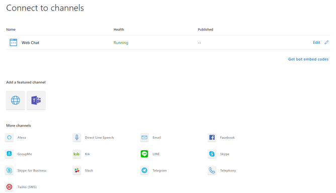

# Connect a bot to channels

A channel is a connection between the bot  and communication apps. You configure a bot to connect to the channels you want it to be available on. The Bot Framework Service, configured through the Azure portal, connects your bot to these channels and facilitates communication between your bot and the user. You can connect to many popular services, such as [Cortana](bot-service-channel-connect-cortana.md), [Facebook Messenger](bot-service-channel-connect-facebook.md), [Kik](bot-service-channel-connect-kik.md), and [Slack](bot-service-channel-connect-slack.md), as well as several others. The [Web Chat](bot-service-channel-connect-webchat.md) channel is pre-configured for you. In addition to standard channels provided with the Bot Connector Service, you can also connect your bot to your own client application using [Direct Line](bot-service-channel-connect-directline.md) as your channel.

The Bot Framework Service allows you to develop your bot in a channel-agnostic way by normalizing messages that the bot sends to a channel. This involves converting it from the bot framework schema into the channel’s schema. However, if the channel does not support all aspects of the bot framework schema, the service will try to convert the message to a format that the channel does support. For example, if the bot sends a message that contains a card with action buttons to the email channel, the connector may send the card as an image and include the actions as links in the message’s text.

For most channels, you must provide channel configuration information to run your bot on the channel. Most channels require that your bot have an account on the channel, and others, like Facebook Messenger, require your bot to have an application registered with the channel also.

To configure your bot to connect to a channel, complete the following steps:

1. Sign in to the <a href="https://portal.azure.com" target="_blank">Azure Portal</a>.
2. Select the bot that you want to configure.
3. In the Bot Service blade, click **Channels** under **Bot Management**.
4. Click the icon of the channel you want to add to your bot.

After you've configured the channel, users on that channel can start using your bot.

## Publish a bot

The publishing process is different for each channel.

[!INCLUDE [publishing](./includes/snippet-publish-to-channel.md)]

## Additional resources

The SDK includes samples that you can use to build bots. Visit the [Samples repo on GitHub](https://github.com/Microsoft/BotBuilder-samples) to see a list of samples.
