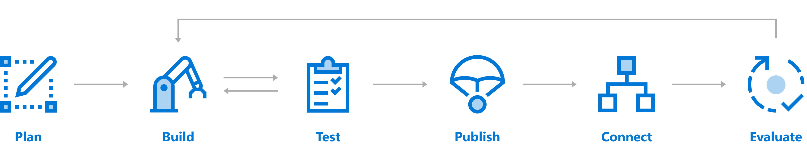

::: moniker range="azure-bot-service-3.0"

# Azure Bot Service Introduction

[!INCLUDE [pre-release-label](includes/pre-release-label-v3.md)]

Azure Bot Service provides tools to build, test, deploy, and manage intelligent bots all in one place. Through the modular and extensible framework provided by the SDK, developers can leverage templates to create bots that provide speech, language understanding, question and answer, and more.  

## What is a bot?
A bot is an app that users interact with in a conversational way using text, graphics (cards), or speech. It may be a simple question and answer dialog, or a sophisticated bot that allows people to interact with services in an intelligent manner using pattern matching, state tracking and artificial intelligence techniques well-integrated with existing business services. Check out [case studies](https://azure.microsoft.com/services/bot-service/) of bots.  

## Building a bot 
You can choose to use your favorite development environment or command line tools to create your bot in C# or Node.js. We provide tools for various stages of bot development that you can use to build your bot to get you started.    

 

## Plan 
Before writing code, review the bot [design guidelines](bot-service-design-principles.md) for best practices and identify the needs for your bot. You can create a simple bot or include more sophisticated capabilities, such as speech, language understanding, QnA, or the ability to extract knowledge from different sources and provide intelligent answers.  

> [!TIP] 
>
> Install the template you need:
>  - Bot builder .NET SDK v3 [VSIX template](https://marketplace.visualstudio.com/items?itemName=BotBuilder.BotBuilderV3) 
>  - Bot builder Node.js SDK v3 [Yeoman template](https://www.npmjs.com/package/generator-botbuilder) 
>
> Install tools:
> - Download [CLI tools](https://github.com/Microsoft/botbuilder-tools) to create and manage bot assests. These tools help you manage bot  configuration file, LUIS app, QnA knowledge base, and more from the command-line. You can find more details in the [readme](https://github.com/Microsoft/botbuilder-tools/blob/master/README.md).
> - [Emulator](https://github.com/Microsoft/BotFramework-Emulator/releases) to test your bot
>
> If needed, use bot components, such as:  
> - [LUIS](https://www.luis.ai/) to add language understanding to bots
> - [QnA Maker](https://qnamaker.ai/) to respond to user's questions in a more natural, conversational way
> - [Speech](https://azure.microsoft.com/services/cognitive-services/speech/) to convert audio to text, understand intent, and convert text back to speech  
> - [Spelling](https://azure.microsoft.com/services/cognitive-services/spell-check/) to correct spelling errors, recognize the difference among names, brand names, and slang 
> - [Cognitive Services](bot-service-concept-intelligence.md) for various other intelligent components 

## Build your bot 
Your bot is a web service that implements a conversational interface and communicates with the Bot Service. You can create this solution in any number of environments and languages and we offer easy getting started tools for Visual Studio or Yeoman or directly within the Azure portal. Look below for some of the tools and services you can use.

> [!TIP]
>
> Create a bot using [SDK](~/dotnet/bot-builder-dotnet-quickstart.md),  [Azure portal](bot-service-quickstart.md), or use [CLI tools](~/bot-builder-create-templates.md).
>
> Add components: 
> - Add language understanding model [LUIS](https://docs.microsoft.com/en-us/azure/cognitive-services/luis/home). 
> - Add [QnA Maker](https://docs.microsoft.com/en-us/azure/cognitive-services/qnamaker/home) knowledge base to answer questions users ask.  
> - Enhace user experience with cards, speech, or translation. 
> - Add logic to your bot using the Bot Builder SDK.   

## Test your bot 
Bots are complex apps, with a lot of different parts working together. Like any other complex app, this can lead to some interesting bugs or cause your bot to behave differently than expected. Before publishing, test your bot.

> [!TIP] 
>
> - [Test bot with the emulator](bot-service-debug-emulator.md)
> - [Test bot in Web Chat](bot-service-manage-test-webchat.md)

## Publish 
When you are ready, publish your bot to Azure or to your own web service or data center. You can set up continuous deployment that allows you to develop your bot locally and is useful if your bot is checked into a source control like GitHub or Visual Studio Team Services. As you check your changes back into your source repository, your changes will automatically be deployed to Azure.

> [!Tip]
>
> - [Deploy to Azure](bot-service-build-continuous-deployment.md)

## Connect          
Connect your bot to channels such as Facebook, Messenger, Kik, Skype, Slack, Microsoft Teams, Telegram, text/SMS, Twilio, Cortana, and Skype to increase interactions and reach more customers.  
  
> [!TIP]
>
> - [Choose the channels to be added](bot-service-manage-channels.md)

## Evaluate 
Use the data collected in Azure portal to identify opportunities to improve the capabilities and performance of your bot. You can get service-level and instrumentation data like traffic, latency, and integrations. Analytics also provides conversation-level reporting on user, message, and channel data.

> [!Tip]
>
> - [Gather analytics](bot-service-manage-analytics.md) 

::: moniker-end

::: moniker range="azure-bot-service-4.0"

# Azure Bot Service

[!INCLUDE [pre-release-label](includes/pre-release-label.md)]

Azure Bot Service provides tools to build, test, deploy, and manage intelligent bots all in one place. Through the modular and extensible framework provided by the SDK, developers can leverage templates to create bots that provide speech, understand natural language, handle questions and answers, and more.  

## What is a bot?

A bot is an app that can communicate through conversation with human users. The software can interact through text, speech, graphics, or menus, and perform tasks related to the conversation. It may be a simple question and answer exchange, or a sophisticated bot that allows people to interact with services in a natural way, while behind the scenes the bot is utilizing intelligent techniques well integrated with existing services.

Bots enable systems to gather information or provide an experience to users that feels less like a computer and more like an interaction. They also shift simple tasks, such as taking a dinner reservation or gathering profile information from the user, on to systems (or integration with other systems) when direct human interaction isn't necessary. 

## Building a bot 

You can choose to use your favorite development environment or command line tools to create your bot in [C#](~/dotnet/bot-builder-dotnet-sdk-quickstart.md), [JavaScript](~/javascript/bot-builder-javascript-quickstart.md), [Java](~/java/bot-builder-java-quickstart.md), and [Python](~/python/bot-builder-python-quickstart.md). We provide tools for various stages of bot development that you can use to build your bot to get you started.    

### Design

Before writing code, review the bot [design guidelines](bot-service-design-principles.md) for best practices and identify the needs for your bot. You can create a simple bot or include more sophisticated capabilities, such as speech, natural language understanding, or answer questions users ask. You can start your bot development either in the [Azure portal](bot-service-quickstart.md) or use templates provided for local development in the language of your choice.

| .NET Template | JavaScript Template | 
| --- | --- | 
| [VSIX template](https://marketplace.visualstudio.com/items?itemName=BotBuilder.botbuilderv4) | [Yeoman template](https://www.npmjs.com/package/generator-botbuilder). Use @preview to get v4 template. |

### Build

Your bot is a web service that implements a conversational interface and communicates with the Bot Service. You can create this solution in any number of environments and languages, and we offer easy getting started templates above. 

Here are a few features you can use; none of these components are required for your bot, but may be helpful. 

| Feature | Description | Link |
| --- | --- | --- |
| Add natural language understanding | Enable your bot to understand natural language, understand spelling errors, use speech, and recognize the user's intent | [How to use LUIS](~/v4sdk/bot-builder-howto-v4-luis.md)   [LUIS homepage](https://docs.microsoft.com/en-us/azure/cognitive-services/luis/home) |
| Question and answer | Add a knowledge base to answer questions users ask in a more natural, conversational way | [How to use QnA Maker](~/v4sdk/bot-builder-howto-qna.md)   [QnA Maker homepage](https://docs.microsoft.com/en-us/azure/cognitive-services/qnamaker/home) |
| Dispatch tool for multiple models | If using more than one model, such as for LUIS and QnA Maker, intelligently determine when to use which one during your bot's conversation | [Dispatch tool](~/v4sdk/bot-builder-tutorial-dispatch.md) |
| Add rich media | Enhance the user experience with media other than text, such as graphics, speech, menus, and cards | [Rich media](v4sdk/bot-builder-howto-add-media-attachments.md) |

> [!NOTE]
> The table above is not a comprehensive list. Explore the articles on the left, starting with [sending messages](~/v4sdk/bot-builder-howto-send-messages.md), for more bot functionality.

Additionally we provide [CLI tools](https://github.com/Microsoft/botbuilder-tools) help you to create, manage, and test bot assests. These tools can manage a bot configuration file, LUIS app, QnA knowledge base, mock a conversation, and more from the command-line. You can find more details in the [readme](https://github.com/Microsoft/botbuilder-tools/blob/master/README.md).

### Test 
Bots are complex apps, with a lot of different parts working together. Like any other complex app, this can lead to some interesting bugs or cause your bot to behave differently than expected. Before publishing, test your bot. 

[Test bot with the emulator](bot-service-debug-emulator.md) or [Test bot in Web Chat](bot-service-manage-test-webchat.md).

### Publish 
When you are ready, publish your bot to Azure or to your own web service or data center. You can set up continuous deployment that allows you to develop your bot locally and is useful if your bot is checked into a source control like GitHub or Visual Studio Team Services. As you check your changes back into your source repository, your changes will automatically be deployed to Azure.

[Deploy to Azure](bot-service-build-continuous-deployment.md) via continuous deployment.

### Connect          
Connect your bot to channels such as Facebook, Messenger, Kik, Skype, Slack, Microsoft Teams, Telegram, text/SMS, Twilio, Cortana, and Skype to increase interactions and reach more customers.

[Choose the channels to be added](bot-service-manage-channels.md).

### Evaluate 
Use the data collected in Azure portal to identify opportunities to improve the capabilities and performance of your bot. You can get service-level and instrumentation data like traffic, latency, and integrations. Analytics also provides conversation-level reporting on user, message, and channel data. 

Explore how to [Gather analytics](bot-service-manage-analytics.md).

::: moniker-end
