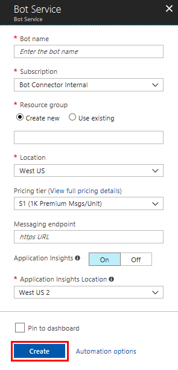
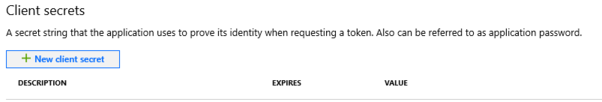
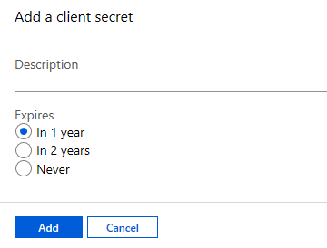

# Register a bot with Azure Bot Service

This topic shows you how to create an **Azure Bot Service** resource to register your bot. You need this if the bot is hosted elsewhere and you want to make it available in Azure and connect it to Azure Bot Service channels.

This allows you to build, connect, and manage your bot to interact with users, wherever they are, via Cortana, Skype, Messenger and many other services.

> [!IMPORTANT] 
> You only need to register your bot if it is not hosted in Azure. If you [created a bot](v4sdk/abs-quickstart.md) through the Azure portal then it is already registered with the service.

## Create a registration resource

1. In your browser, navigate to the [Azure portal](https://ms.portal.azure.com).

    > [!TIP]
    > If you do not have a subscription, you can register for a <a href="https://azure.microsoft.com/free/" target="_blank">free account</a>.

1. In the left pane, click **Create a resource**.
1. In the right pane selection box enter *bot*. And in the drop-down list, select **Bot Channels Registration** or **Web App Bot** depending on your application.
1. Click the **Create** button to start the process.
1. In the **Bot Service** blade, provide the requested information about your bot as specified in the table below the image.  

   

   |Setting |Suggested value|Description|
   |---|---|--|
   |**Bot name** |Your bot's display name|The display name for the bot that appears in channels and directories. This name can be changed at anytime.|
   |**Subscription**|Your subscription|Select the Azure subscription you want to use.|
   |**Resource Group**|myResourceGroup|You can create a new [resource group](/azure/azure-resource-manager/resource-group-overview#resource-groups) or choose from an existing one.|
   |**Location**|West US|Choose a location near where your bot is deployed or near other services your bot will access.|
   |**Pricing tier**|F0|Select a pricing tier. You may update the pricing tier at any time. For more information, see [Bot Service pricing](https://azure.microsoft.com/pricing/details/bot-service/).|
   |**Messaging endpoint**|URL|Enter the URL for your bot's messaging endpoint.|
   |**Application Insights**|On| Decide if you want to turn [Application Insights](bot-service-manage-analytics.md) **On** or **Off**. If you select **On**, you must also specify a regional location. |
   |**Microsoft App ID and password**| Auto create App ID and password |Use this option if you need to manually enter a Microsoft App ID and password. See the next section [Manual app registration](#manual-app-registration). Otherwise, a new Microsoft App ID and password will be created in registration process. |

    > [!IMPORTANT]
    > Do not forget to enter the URL for your bot's messaging endpoint.

1. Click the **Create** button. Wait for the resource to be created. It will show in your resources list.

### Get registration password

After the registration is completed, Azure Active Directory assigns a unique application ID to your registration, and you're taken to your application's *Overview* page.

To obtain the password follow the steps described next.

1. In resource list, click on the Azure App Service resource just created.
1. Im the right pane, in the resource blade, click  **Settings**. The resource *Settings* page is displayed.
1. In the Settings page copy the generated **Microsoft App ID** and save it to a file.
1. Click the **Manage** link by *Microsoft App ID*.

    

1. In the *Certificates & secrets* displayed page, click the **New client secret** button.

    

1. Add the description, select the expiration time, and click the **Add** button.

    

    This will generate a new password for your bot. Copy this password and save it to a file. This is the only time you will see this password. If you do not have the full password saved, you will need to repeat the process to create a new password should you need it later.

For the **Web Bot App**, follow the steps described in the article: [Create a bot with Azure Bot Service](v4sdk/abs-quickstart.md). You will create a bot in Azure that is automatically registered with the Azure Bot Service.

## Manual app registration

A manual registration is necessary for situations like:

- You are unable to make the registrations in your organization and need another party to create the App ID for the bot you're building.
- You need to manually create your own app ID (and password).

See [FAQ - App Registration](bot-service-resources-bot-framework-faq.md#app-registration).

> [!IMPORTANT]
> In the section *Supports account types*, you must choose one of the 2 multi-tenant types that is: *Accounts in any organizational directory (Any Azure AD - Multitenant)* or *Accounts in any organizational directory (Any Azure AD - Multitenant) and personal Microsoft accounts (e.g. Skype, Xbox, Outlook.com)*, when creating the app, otherwise the bot will not work. For more information, see [Register a new application using the Azure portal](https://docs.microsoft.com/en-us/azure/active-directory/develop/quickstart-register-app#register-a-new-application-using-the-azure-portal).

## Update the bot

If you're using the Bot Framework SDK for .NET, set the following key values in the web.config file:

- `MicrosoftAppId = <appId>`
- `MicrosoftAppPassword = <appSecret>`

If you're using the Bot Framework SDK for Node.js, set the following environment variables:

- `MICROSOFT_APP_ID = <appId>`
- `MICROSOFT_APP_PASSWORD = <appSecret>`

## Test the bot

Now that your bot service is created, [test it in Web Chat](bot-service-manage-test-webchat.md). Enter a message and your bot should respond.

## Next steps

In this topic, you learned how to register your hosted bot with the Bot Service. The next step is to learn how to manage your Bot Service.

> [!div class="nextstepaction"]
> [Manage a bot](bot-service-manage-overview.md)
