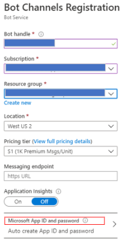

# Bot channels registration

This article shows how to register a bot with **Azure Bot Service**. If the bot is hosted elsewhere, this allows you to make it available in Azure and connect it to the supported channels.

> [!IMPORTANT]
> You only need to register a bot if it is not hosted in Azure.
Bots created using the Azure portal or the Command Line Interface (CLI) are already registered with the Azure Bot Service. For more information, see [Deploy your bot](bot-builder-deploy-az-cli.md) and [Create a bot with Azure Bot Service](v4sdk/abs-quickstart.md).

## Create a registration application

1. In your browser, navigate to the [Azure portal](https://ms.portal.azure.com). If you do not have a subscription, you can register for a <a href="https://azure.microsoft.com/free/" target="_blank">free account</a>.

1. In the left panel, click **Create a resource**.
1. In the right panel selection box enter *bot*. From the drop-down list select **Bot Channels Registration** or **Web App Bot** depending on your application.

    > [!WARNING]
    > If you picked **Web Bot App**, follow the steps described in the article [Create a bot with Azure Bot Service](v4sdk/abs-quickstart.md) . You will create a bot in Azure that is automatically registered with the Azure Bot Service.

1. Click the **Create** button.
1. In the **Bot Channels Registration** form, provide the requested information about your bot as specified in the table below.

    > [!div class="mx-tdBreakAll"]
    >   |Setting |Suggested value|Description|
    >   |---|---|--|
    >   |**Bot name** |\<Your bot display name>|Choose the display name for the bot that appears in channels and directories. This name can be changed at anytime.|
    >   |**Subscription**|\<Your subscription>|Select the Azure subscription you want to use.|
    >   |**Resource Group**|\<Your resource group name>|You can create a new [resource group](/azure/azure-resource-manager/resource-group-overview#resource-groups) or select an existing one.|
    >   |**Location**|West US|Choose the geographic location for your resource group. It's usually best to choose a location close to you. The location cannot be changed once the resource group is created.|
    >   |**Pricing tier**|F0|Select a pricing tier. You may update the pricing tier at any time. For more information, see [Bot Service pricing](https://azure.microsoft.com/pricing/details/bot-service/).|
    >   |**Messaging endpoint**|https://\<your bot name>.azurewebsites.net/api/messages|Enter the URL for your bot's messaging endpoint. You can leave this field empty, you will enter the required URL after deploying the bot.|
    >   |**Application Insights**|On| Decide if you want to turn [Application Insights](bot-service-manage-analytics.md) **On** or **Off**. If you select **On**, you must also specify a regional location. |
    >   |**App ID and password**| Create App ID and password |Use this option if you need to manually enter a Microsoft App ID and password. See the next section [Manual app registration](#manual-app-registration). Otherwise, a new Microsoft app ID will be created in the registration process. |

1. Leave the *Messaging endpoint* box empty for now, you will enter the required URL after deploying the bot.
1. Click **Microsoft App ID and password**, highlighted in the figure below.  The next steps allow you to create the registration application password and application ID to be used in your bot configuration files `appsettings.json` (.NET), `.env` (Javascript) and `config.py` (Python).

    

1. Click **Create New**.
1. Click **Create App ID in the App Registration Portal** link.
1. In the displayed *App registration* window, in the upper left, click the **New registration** tab.
1. Enter the name of the bot application you are registering.
1. For the Supported account types select the type based on your requirements. See also [Use bot credentials](bot-service-debug-emulator.md#use-bot-credentials).
1. Click the **Register** button. Once completed, Azure displays the overview page for the application.
1. Copy and save to a file the **Application (client) ID** value.
1. In the left panel, click **Certificate and secrets**.
1. Under *Client secrets*, click **New client secret**.
1. Add a description to identify this secret from others you might need to create for this app.
1. Set **Expires** to your choosing.
1. Click **Add**.
1. Copy the client secret and save it to a file. Make sure to keep the file in a secure place.
1. Go back to the Bot Channel Registration window and copy the App ID and the Client secret in the Microsoft App ID and Password boxes, respectively.
1. Click **OK**.
1. Click the **Create** button and wait for the resource to be created. It will show in your resources list.

> [!NOTE]
> The registration application will show the Global region even though you selected a different one. This is expected.

## Manual app registration

A manual registration is necessary for situations like:

- You are unable to make the registrations in your organization and need another party to create the App ID for the bot you're building.
- You need to manually create your own app ID and password.

> [!IMPORTANT]
> In the section *Supports account types*, you must choose one of the 2 multi-tenant types that is: *Accounts in any organizational directory (Any Azure AD - Multitenant)* or *Accounts in any organizational directory (Any Azure AD - Multitenant) and personal Microsoft accounts (e.g. Xbox, Outlook.com)*, when creating the app, otherwise the bot will not work. For more information, see [Register a new application using the Azure portal](https://docs.microsoft.com/azure/active-directory/develop/quickstart-register-app#register-a-new-application-using-the-azure-portal). See also [Register an application with the Microsoft identity platform](https://docs.microsoft.com/azure/active-directory/develop/quickstart-register-app#register-a-new-application-using-the-azure-portal).

## Update the bot

1. Bot Framework SDK for .NET. Set the following key values in the `appsettings.json` file:
    - `MicrosoftAppId = <appId>`
    - `MicrosoftAppPassword = <appSecret>`

1. Bot Framework SDK for Node.js. Set the following environment variables in the `.env` file:
    - `MICROSOFT_APP_ID = <appId>`
    - `MICROSOFT_APP_PASSWORD = <appSecret>`

1. Bot Framework SDK for Python. Set the following environment variables in the `config.py` file:
    - `APP_ID = os.environ.get("MicrosoftAppId", <appId>)`
    - `APP_PASSWORD = os.environ.get("MicrosoftAppPassword", <appSecret>)`

## Test the bot

Now that your bot service is created, [test it in Web Chat](v4sdk/abs-quickstart.md#test-the-bot).

## Next steps

In this topic, you learned how to register your hosted bot with the Bot Service. The next step is to learn how to manage your Bot Service.

> [!div class="nextstepaction"]
> [Manage a bot](bot-service-manage-overview.md)
