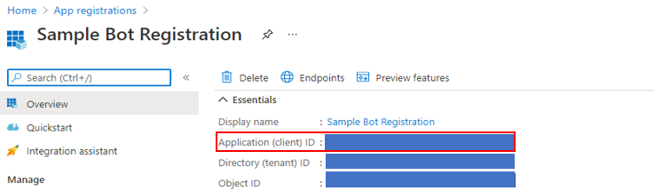

# Bot Framework Frequently Asked Questions

This article contains answers to some frequently asked questions about the Bot Framework.

## Background and availability
### Why did Microsoft develop the Bot Framework?

While the Conversation User Interface (CUI) is upon us, at this point few developers have the expertise and tools needed to create new conversational experiences or enable existing applications and services with a conversational interface their users can enjoy. We have created the Bot Framework to make it easier for developers to build and connect great bots to users, wherever they converse, including on Microsoft's premier channels.

### What is the v4 SDK?
Bot Framework v4 SDK builds on the feedback and learnings from the prior Bot Framework SDKs. It introduces the right levels of abstraction while enabling rich componentization of the bot building blocks. You can start with a simple bot and grow your bot in sophistication using a modular and extensible framework. You can find [FAQ](https://github.com/Microsoft/botbuilder-dotnet/wiki/FAQ) for the SDK on GitHub.

## Bot Framework SDK Version 3 Lifetime Support 
SDK V3 bots continue to run and be supported by Azure Bot Service.  Since the release of Bot Framework SDK V4, as with other frameworks, we continue supporting SDK V3 with security, high priority bug fixes, and connector / protocol layer updates.  Customers can expect v3 support to continue through 2019.

### What is Microsoft plan for supporting existing V3 bots? What happens to my V3 Bots? Will my V3 bots stop working?
SDK V3 bots continue to run and be supported by Azure Bot Service.  Since the release of Bot Framework SDK V4, as with other frameworks, we continue supporting SDK V3 with security, high priority bug fixes, and connector / protocol layer updates.  Customers can expect v3 support to continue through 2019.
- Azure Bot Service and Bot Framework V3 are both GA products and are fully supported. The underlying Bot Framework protocol and connector libraries have not changed and are shared between both V3 and V4 SDKs.  
- Bots created with Bot Framework (BotBuilder) V3 SDK continue to be supported through 2019. 
- Customers can continue creating V3 bots using Azure portal or Azure CLI tools.

### What happens to my bot written to REST & Bot Framework Protocol 3.1?
- Azure Bot Service and Bot Framework V3 are both GA products and are fully supported.
- The Bot Framework protocol has not changed and are shared between both V3 and V4 SDKs.  

### Will there be more updates, additional development for the V3 SDK or just bugfixes?  
- We will update V3 with minor enhancements, mainly at the connector layer, and with security and high priority bug fixes.  
- Updates to V3 will be released twice yearly and as needed, based on bug fixes and/or required protocol changes. 
- Current plan is to publish minor and patch versions of V3 to NuGet and NPM for our C# and JavaScript SDKs.

### Why V4 is not backwards compatible with V3?
- At the protocol level, communication between your conversational app (aka your bot) to different channels uses the Bot Framework Activity protocol which is identical between V3 and V4. The same underlying Azure Bot Service (AZURE BOT SERVICE) infrastructure supports both V3 and V4 bots.
- Bot Framework SDK V4 offers conversational centric development experience with an SDK architecture that is modular and extensible, empowering developers to create robust and sophisticated chat applications. V4 extendable design was based on customer feedback, suggesting SDK V3 dialog models and primitives are too ridged and constraining extendibility.  

### What is the general migration strategy? I have a V3 bot, how can I migrate it to V4/ Can I migrate my V3 bot to V4?

- See [Differences between the v3 and v4 .NET SDK](v4sdk/migration/migration-about.md) for information on migrating V3 bots to V4.
- At this time, migration help for bots created with SDK V3 to SDK V4 will come in the form of documentation and samples. We currently do not have plans to provide any SDK V3 compatibility layer in SDK V4 that would allow V3 build bots to work within a V4 bot.
- If you already have Bot Framework SDK V3 bots in production, don’t worry, they continue to work as is for the foreseeable future.
- Bot Framework SDK V4 is an evolution of the very successful V3 SDK. V4 is a major version release which includes breaking changes that prevent V3 bots from running on the newer V4 SDK.

### Should I build new a bot using V3 or V4?
- For new conversational experiences, we recommend you start a new bot using Bot Framework SDK V4.
- If you are already familiar with Bot Framework SDK V3, you should take the time to learn about the new version and features offered with the new [Bot Framework SDK V4](http://aka.ms/botframeowrkoverview).
- If you already have Bot Framework SDK V3 bots in production, don’t worry, they continue to work as is for the foreseeable future.
- You can create Bot Framework SDK V4 and older V3 bots via Azure portal and Azure Command Line. 

### How can I migrate Azure Bot Service from one region to another?

Azure Bot Service does not support region move. It’s a global service that is not tied to any specific region.

## Channels
### When will you add more conversation experiences to the Bot Framework?

We plan on making continuous improvements to the Bot Framework, including additional channels, but cannot provide a schedule at this time.  
If you would like a specific channel added to the framework, [let us know][Support].

### I have a communication channel I’d like to be configurable with Bot Framework. Can I work with Microsoft to do that?

We have not provided a general mechanism for developers to add new channels to Bot Framework, but you can connect your bot to your app via the [Direct Line API][DirectLineAPI]. If you are a developer of a communication channel and would like to work with us to enable your channel in the Bot Framework [we’d love to hear from you][Support].

### If I want to create a bot for Skype, what tools and services should I use?

The Bot Framework is designed to build, connect, and deploy high quality, responsive, performant and scalable bots for Skype and many other channels. The SDK can be used to create text/sms, image, button and card-capable bots (which constitute the majority of bot interactions today across conversation experiences) as well as bot interactions which are Skype-specific such as rich audio and video experiences.

If you already have a great bot and would like to reach the Skype audience, your bot can easily be connected to Skype (or any supported channel) via the Bot Framework for REST API (provided it has an internet-accessible REST endpoint).

## Security and Privacy
### Do the bots registered with the Bot Framework collect personal information? If yes, how can I be sure the data is safe and secure? What about privacy?

Each bot is its own service, and developers of these services are required to provide Terms of Service and Privacy Statements per their Developer Code of Conduct.  You can access this information from the bot’s card in the Bot Directory.

to provide the I/O service, the Bot Framework transmits your message and message content (including your ID), from the chat service you used to the bot.

### Can I host my bot on my own servers?
Yes. Your bot can be hosted anywhere on the Internet. On your own servers, in Azure, or in any other datacenter. The only requirement is that the bot must expose a publicly-accessible HTTPS endpoint.

### How do you ban or remove bots from the service?

Users have a way to report a misbehaving bot via the bot’s contact card in the directory. Developers must abide by Microsoft terms of service to participate in the service.

### Which specific URLs do I need to whitelist in my corporate firewall to access Bot Framework services?
If you have an outbound firewall blocking traffic from your bot to the Internet, you'll need to whitelist the following URLs in that firewall:
- login.botframework.com (Bot authentication)
- login.microsoftonline.com (Bot authentication)
- westus.api.cognitive.microsoft.com (for Luis.ai NLP integration)
- state.botframework.com (Bot state storage for prototyping)
- cortanabfchanneleastus.azurewebsites.net (Cortana channel)
- cortanabfchannelwestus.azurewebsites.net (Cortana Channel)
- *.botframework.com (channels)

### Can I block all traffic to my bot except traffic from the Bot Connector Service?
No. This sort of IP Address or DNS whitelisting is impractical. The Bot Framework Connector Service is hosted in Azure datacenters world-wide and the list of Azure IPs is constantly changing. Whitelisting certain IP addresses may work one day and break the next as the Azure IP Addresses change.
 
### What keeps my bot secure from clients impersonating the Bot Framework Connector Service?
1. The security token accompanying every request to your bot has the ServiceUrl encoded within it, which means that even if an attacker gains access to the token, they cannot redirect the conversation to a new ServiceUrl. This is enforced by all implementations of the SDK and documented in our authentication [reference](https://docs.microsoft.com/en-us/azure/bot-service/rest-api/bot-framework-rest-connector-authentication?view=azure-bot-service-3.0#bot-to-connector) materials.

2. If the incoming token is missing or malformed, the Bot Framework SDK will not generate a token in response. This limits how much damage can be done if the bot is incorrectly configured.
3. Inside the bot, you can manually check the ServiceUrl provided in the token. This makes the bot more fragile in the event of service topology changes so this is possible but not recommended.

Note that these are outbound connections from the bot to the Internet. There is not a list of IP Addresses or DNS names that the Bot Framework Connector Service will use to talk to the bot. Inbound IP Address whitelisting is not supported.

## Rate limiting
### What is rate limiting?
The Bot Framework service must protect itself and its customers against abusive call patterns (e.g., denial of service attack), so that no single bot can adversely affect the performance of other bots. To achieve this kind of protection, we’ve added rate limits (also known as throttling) to all endpoints. By enforcing a rate limit, we can restrict the frequency with which a bot can make a specific call. For example: with rate limiting enabled, if a bot wanted to post a large number of activities, it would have to space them out over a time period. Please note that the purpose of rate-limiting is not to cap the total volume for a bot. It is designed to prevent abuse of the conversational infrastructure that does not follow human conversation patterns.

### How will I know if I’m impacted?
It is unlikely you’ll experience rate limiting, even at high volume. Most rate limiting would only occur due to bulk sending of activities (from a bot or from a client), extreme load testing, or a bug. When a request is throttled, an HTTP 429 (Too Many Requests) response is returned along with a Retry-After header indicating the amount of time (in seconds) to wait before retrying the request would succeed. You can collect this information by enabling analytics for your bot via Azure Application Insights. Or, you can add code in your bot to log messages. 

### How does rate limiting occur?
It can happen if:
-	a bot sends messages too frequently
-	a client of a bot sends messages too frequently
-	Direct Line clients request a new Web Socket too frequently

### What are the rate limits?
We’re continuously tuning the rate limits to make them as lenient as possible while at the same time protecting our service and our users. Because thresholds will occasionally change, we aren’t publishing the numbers at this time. If you are impacted by rate limiting, feel free to reach out to us at [bf-reports@microsoft.com](mailto://bf-reports@microsoft.com).

## Related Services
### How does the Bot Framework relate to Cognitive Services?

Both the Bot Framework and [Cognitive Services](http://www.microsoft.com/cognitive) are new capabilities introduced at [Microsoft Build 2016](http://build.microsoft.com) that will also be integrated into Cortana Intelligence Suite at GA. Both these services are built from years of research and use in popular Microsoft products. These capabilities combined with ‘Cortana Intelligence’ enable every organization to take advantage of the power of data, the cloud and intelligence to build their own intelligent systems that unlock new opportunities, increase their speed of business and lead the industries in which they serve their customers.

### What is Cortana Intelligence?

Cortana Intelligence is a fully managed Big Data, Advanced Analytics and Intelligence suite that transforms your data into intelligent action.  
It is a comprehensive suite that brings together technologies founded upon years of research and innovation throughout Microsoft (spanning advanced analytics, machine learning, big data storage and processing in the cloud) and:

* Allows you to collect, manage and store all your data that can seamlessly and cost effectively grow over time in a scalable and secure way.
* Provides easy and actionable analytics powered by the cloud that allow you to predict, prescribe and automate decision making for the most demanding problems.
* Enables intelligent systems through cognitive services and agents that allow you to see, hear, interpret and understand the world around you in more contextual and natural ways.

With Cortana Intelligence, we hope to help our enterprise customers unlock new opportunities, increase their speed of business and be leaders in their industries.

### What is the Direct Line channel?

Direct Line is a REST API that allows you to add your bot into your service, mobile app, or webpage.

You can write a client for the Direct Line API in any language. Simply code to the [Direct Line protocol][DirectLineAPI], generate a secret in the Direct Line configuration page, and talk to your bot from wherever your code lives.

Direct Line is suitable for:

* Mobile apps on iOS, Android, and Windows Phone, and others
* Desktop applications on Windows, OSX, and more
* Webpages where you need more customization than the [embeddable Web Chat channel][WebChat] offers
* Service-to-service applications

## App Registration

### I need to manually create my App Registration. How do I create my own App Registration?

Creating your own App Registration will be necessary for situations like the following:

- You created your bot in the Bot Framework portal (such as https://dev.botframework.com/bots/new) 
- You are unable to make app registrations in your organization and need another party to create the App ID for the bot you're building
- You otherwise need to manually create your own App ID (and password)

To create your own App ID, follow the steps below.

1. Sign into your [Azure account](https://portal.azure.com). If you don't have an Azure account, you can [sign up for a free account](https://azure.microsoft.com/en-us/free/).
2. Go to [the app registrations blade](https://portal.azure.com/#blade/Microsoft_AAD_RegisteredApps/ApplicationsListBlade) and click **New registration** in the action bar at the top.

    

3. Enter a display name for the application registration in the *Name* field and select the supported account types. The name does not have to match the bot ID.

    > [!IMPORTANT]
    > In the *Supported account types*, select the *Accounts in any organizational directory and personal Microsoft accounts (e.g. Skype, Xbox, Outlook.com)* radio button. If any of the other options are selected, **bot creation will fail**.

    

4. Click **Register**

    After a few moments, the newly created app registration should open a blade. Copy the *Application (client) ID* in the Overview blade and paste it in to the App ID field.

    

If you’re creating your bot through the Bot Framework portal, then you’re done setting up your app registration; the secret will be generated automatically. 

If you’re making your bot in the Azure portal, you need to generate a secret for your app registration. 

1. Click on **Certificates & secrets** in the left navigation column of your app registration’s blade.
2. In that blade, click the **New client secret** button. In the dialog that pops up, enter an optional description for the secret and select **Never** from the Expires radio button group. 

    

3. Copy your secret’s value from the table under *Client secrets* and paste it into the *Password* field for your application, and click **OK** at the bottom of that blade. Then, proceed with the bot creation. 

    > [!NOTE]
    > The secret will only be visible while on this blade, and you won't be able to retreive it after you leave that page. Be sure to copy it somewhere safe.

    

[DirectLineAPI]: https://docs.microsoft.com/en-us/azure/bot-service/rest-api/bot-framework-rest-direct-line-3-0-concepts
[Support]: bot-service-resources-links-help.md
[WebChat]: bot-service-channel-connect-webchat.md

