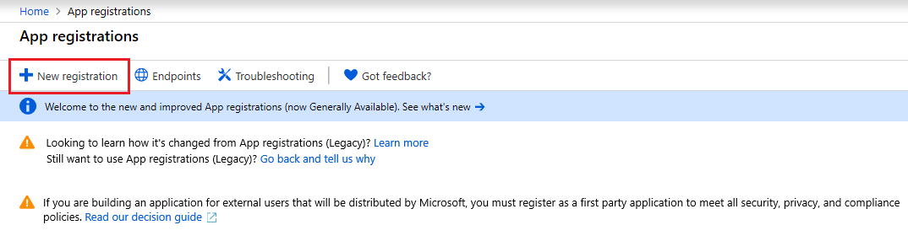
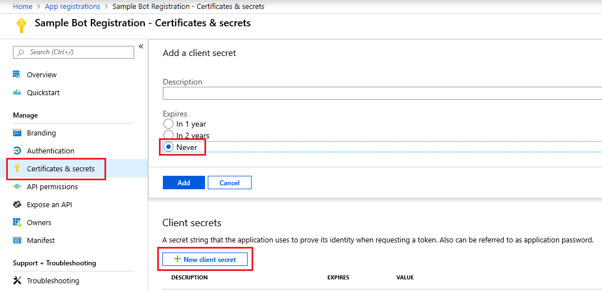
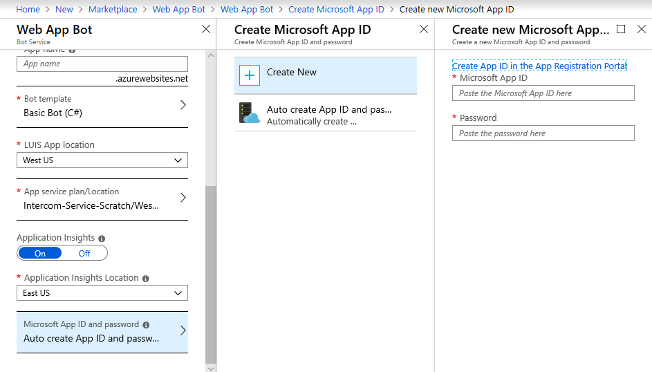
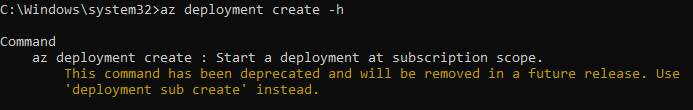

# Azure

## I need to manually create my App Registration. How do I create my own App Registration?

Creating your own App Registration will be necessary for situations like the following:

- You created your bot in the Bot Framework portal (such as https://dev.botframework.com/bots/new)
- You are unable to make app registrations in your organization and need another party to create the App ID for the bot you're building
- You otherwise need to manually create your own App ID (and password)

To create your own App ID, follow the steps below.

1. Sign into your [Azure account](https://portal.azure.com). If you don't have an Azure account, you can [sign up for a free account](https://azure.microsoft.com/free/).
1. Go to [the app registrations blade](https://portal.azure.com/#blade/Microsoft_AAD_RegisteredApps/ApplicationsListBlade) and click **New registration** in the action bar at the top.

    

1. Enter a display name for the application registration in the *Name* field and select the supported account types. The name does not have to match the bot ID.

    > [!IMPORTANT]
    > In the *Supported account types*, select the *Accounts in any organizational directory and personal Microsoft accounts (e.g. Xbox, Outlook.com)* radio button. If any of the other options are selected, **the bot will be unusable**.

    

1. Click **Register**

    After a few moments, the newly created app registration should open a blade. Copy the *Application (client) ID* in the Overview blade and paste it in to the App ID field.

    

If you're creating your bot through the Bot Framework portal, then you're done setting up your app registration; the secret will be generated automatically.

If you're making your bot in the Azure portal, you need to generate a secret for your app registration.

1. Click on **Certificates & secrets** in the left navigation column of your app registration's blade.
1. In that blade, click the **New client secret** button. In the dialog that pops up, enter an optional description for the secret and select **Never** from the Expires radio button group.

    

1. Copy your secret's value from the table under *Client secrets* and paste it into the *Password* field for your application, and click **OK** at the bottom of that blade. Then, proceed with the bot creation.

    > [!NOTE]
    > The secret will only be visible while on this blade, and you won't be able to retreive it after you leave that page. Be sure to copy it somewhere safe.

    

[DirectLineAPI]: https://docs.microsoft.com/azure/bot-service/rest-api/bot-framework-rest-direct-line-3-0-concepts
[Support]: bot-service-resources-links-help.md
[WebChat]: bot-service-channel-connect-webchat.md

## What files do I need to zip up for deployment?

You must manually create a zip archive with all the files in the project, as described in the step: [zip up the code directory manually step](https://docs.microsoft.com/azure/bot-service/bot-builder-deploy-az-cli?view=azure-bot-service-4.0&tabs=csharp#52-zip-up-the-code-directory-manually).

Please, make sure that you select all the files and folders in your bot's project folder. Then, while still in the project folder, zip up all the selected files and folders as shown in the picture below.

> [!div class="mx-imgBorder"]
> 

## What version of Azure CLI should I use to deploy a bot?

It is recommended that you use the most latest version of the [Azure CLI](https://docs.microsoft.com/cli/azure/install-azure-cli?view=azure-cli-latest) to complete the deployment process. If you are using older versions of Azure CLI, you will get deprecation errors in the process.

## What should I do when getting Azure CLI deployment deprecation errors?

You should upgrade to the latest version of the [Azure CLI](https://docs.microsoft.com/cli/azure/install-azure-cli?view=azure-cli-latest). For Azure CLI version [2.2.0](https://github.com/MicrosoftDocs/azure-docs-cli/blob/master/docs-ref-conceptual/release-notes-azure-cli.md#march-10-2020) or later, you must use `az deployment sub create` and `az deployment group create` instead of `az deployment create` and `az group deployment create` commands respectively.

**Change log of the Azure CLI commands used to deploy a bot to Azure**

|Azure ClI version | Command1 | Command 2|
|-------|-------|-------|
|Azure CLI 2.2.0 and later versions | `az deployment group create` | `az deployment sub create` |
|Azure CLI 2.1.0 and earlier versions | `az group deployment create` | `az deployment create` |

Read more in the [Azure CLI change log](https://github.com/MicrosoftDocs/azure-docs-cli/blob/master/docs-ref-conceptual/release-notes-azure-cli.md).

## What are the CLI deprecated commands related to `az deployment`?

The following are the `az deployment` deprecated commands:

> [!div class="mx-tdBreakAll"]
> |Deprecated|Replaced By|
> |-------------|----------|
> |`az deployment <create/list show/delete/validate/export/cancel>`|`az deployment **sub** <create/list/show/delete/validate/export/cancel>`|
>| `az deployment operation <list/show>` |`az deployment operation **sub** <list/show>`|
>| `az group deployment <create/list/show/delete/validate/export/cancel>` | `az deployment **group** <create/list/show/delete/validate/export/cancel>` |
> |`az group deployment operation <list/show>` |`az deployment operation **group** < list/show>` |

## How do I know whether the Azure CLI commands are deprecated?

To know if an Azure CLI command is deprecated, execute the the command with the `-h` (help) option as shown in the picture below.

### Azure CLI Change Log

Read more about [Azure CLI change log](https://github.com/MicrosoftDocs/azure-docs-cli/blob/master/docs-ref-conceptual/release-notes-azure-cli.md).

### Azure Resource Management (ARM)

The following is a consolidated list of the commands that fit the current Azure CLI design: `az {command group} {?sub-command-group} {operation} {parameters}`.

- `az resource`: Improve the examples of the resource module
- `az policy assignment list`: Support listing policy assignments at Management Group scope
- Add `az deployment group` and `az deploymnent operation group` for template deployment at resource groups. This is a duplicate of `az group deployment` and `az group deployment operation`.
- Add `az deployment sub` and `az deployment operation sub` for template deployment at subscription scope. This is a duplicate of `az deployment` and `az deployment operation`.
- Add `az deployment mg` and `az deployment operation mg` for template deployment at management groups
- Add `ad deployment tenant` and `az deployment operation tenant` for template deployment at tenant scope
- `az policy assignment create`: Add a description to the `--location` parameter
- `az group deployment create`: Add parameter `--aux-tenants` to support cross tenants.
