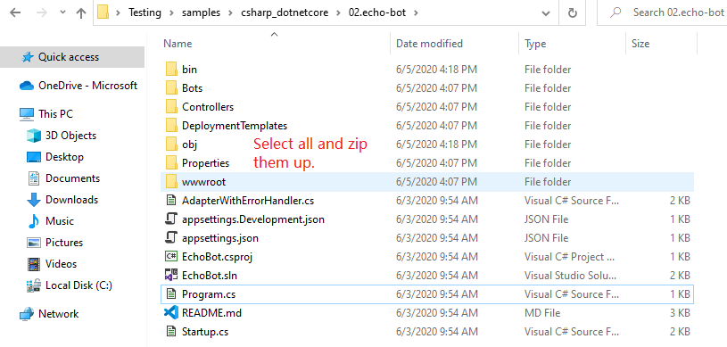

# Deployment Frequently Asked Questions

This article contains answers to frequently asked questions about Azure bot deployment that is described in the [Deploy your bot](https://docs.microsoft.com/azure/bot-service/bot-builder-deploy-az-cli?view=azure-bot-service-4.0) article.

## Zip up the code directory

### What files do we need to zip up?

You must manually create a zip archive with all the files in the project, as described in the step: [zip up the code directory manually step](https://docs.microsoft.com/azure/bot-service/bot-builder-deploy-az-cli?view=azure-bot-service-4.0&tabs=csharp#52-zip-up-the-code-directory-manually).

Please, make sure that you select all the files and folders in your bot's project folder. Then, while still in the project folder, zip up all the selected files and folders as shown in the picture below.

> [!div class="mx-imgBorder"]
> 

## Azure CLI deprecated commands

### What Azure CLI version should I use to deploy a bot?

It is recommended that you use the latest version of the Azure Command-Line Interface (CLI) otherwise you will get deprecated commands errors. See [Install the Azure CLI](https://docs.microsoft.com/cli/azure/install-azure-cli?view=azure-cli-latest).

### What should I do if I get Azure CLI deprecation errors?

You should upgrade to the latest version of the [Azure CLI](https://docs.microsoft.com/cli/azure/install-azure-cli?view=azure-cli-latest). For Azure CLI version [2.2.0](https://github.com/MicrosoftDocs/azure-docs-cli/blob/master/docs-ref-conceptual/release-notes-azure-cli.md#march-10-2020) or later, you must use `az deployment sub create` and `az deployment group create` instead of `az deployment create` and `az group deployment create` commands respectively.

#### Change log of the Azure CLI commands used to deploy a bot to Azure

|Azure ClI version | Command1 | Command 2|
|-------|-------|-------|
|Azure CLI 2.2.0 and later versions | `az deployment group create` | `az deployment sub create` |
|Azure CLI 2.1.0 and earlier versions | `az group deployment create` | `az deployment create` |

Read more in the [Azure CLI change log](https://github.com/MicrosoftDocs/azure-docs-cli/blob/master/docs-ref-conceptual/release-notes-azure-cli.md).

### What are the `az deployment` deprecated commands?

The following are the `az deployment` deprecated commands:

> [!div class="mx-tdBreakAll"]
> |Deprecated|Replaced By|
> |-------------|----------|
> |`az deployment <create/list show/delete/validate/export/cancel>`|`az deployment **sub** <create/list/show/delete/validate/export/cancel>`|
>| `az deployment operation <list/show>` |`az deployment operation **sub** <list/show>`|
>| `az group deployment <create/list/show/delete/validate/export/cancel>` | `az deployment **group** <create/list/show/delete/validate/export/cancel>` |
> |`az group deployment operation <list/show>` |`az deployment operation **group** < list/show>` |

### How do I know whether the Azure CLI commands are deprecated?

To know if an Azure CLI command is deprecated, execute the the command with the `-h` (help) option as shown in the picture below.  

## Additional information

### Azure CLI Change Log

Read more about [Azure CLI change log](https://github.com/MicrosoftDocs/azure-docs-cli/blob/master/docs-ref-conceptual/release-notes-azure-cli.md).

### Azure Resource Management (ARM)

The following is a consolidated list of the commands that fit the current Azure CLI design: az {command group} {?sub-command-group} {operation} {parameters}.

* `az resource`: Improve the examples of the resource module
* `az policy assignment list`: Support listing policy assignments at Management Group scope
* Add `az deployment group` and `az deploymnent operation group` for template deployment at resource groups. This is a duplicate of `az group deployment` and `az group deployment operation`. 
* Add `az deployment sub` and `az deployment operation sub` for template deployment at subscription scope. This is a duplicate of `az deployment` and `az deployment operation`.
* Add `az deployment mg` and `az deployment operation mg` for template deployment at management groups 
* Add `ad deployment tenant` and `az deployment operation tenant` for template deployment at tenant scope 
* az policy assignment create: Add a description to the `--location` parameter
* `az group deployment create`: Add parameter `--aux-tenants` to support cross tenants. 
