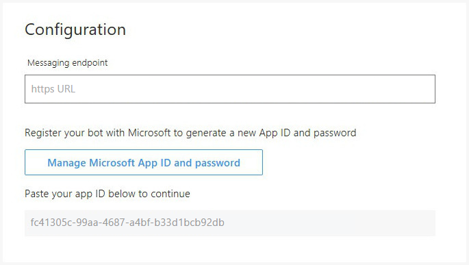
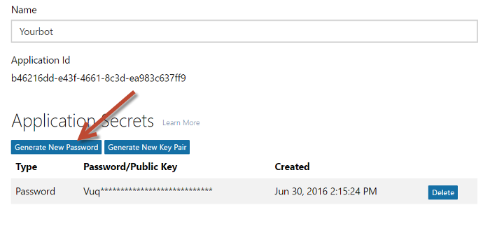
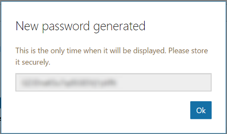

# Upgrade your bot to Bot Framework API v3

At Build 2016 Microsoft announced the Microsoft Bot Framework and its initial iteration of the Bot Connector API, along with Bot Builder and Bot Connector SDKs. Since then, we've been collecting your feedback and actively working to improve the REST API and SDKs.

In July 2016, Bot Framework API v3 was released and Bot Framework API v1 was deprecated. Bots that use API v1 ceased to function on Skype in December 2016 and on all remaining channels on February 23, 2017. If you created a bot using API v1 and want to make it functional again, you must upgrade it to API v3 by following the instructions in this article. To ensure that you understand the upgrade process from end-to-end, read through this article completely before you begin. 

## Step 1: Get your App ID and password from the Bot Framework Portal

Sign in to the [Bot Framework Portal](https://dev.botframework.com/), click **My bots**, then select your bot to open its dashboard. Next, click the **SETTINGS** link that is located left side of the page under **Bot Management**. 

Within the **Configuration** section of the settings page, examine the contents of the **Microsoft App ID** field and proceed with next steps.

<!-- TODO: Remove this 
### Case 1: App ID field is already populated

If the **App ID** field is already populated, complete these steps:
-->

1. Click **Manage Microsoft App ID and password**.  

2. Click **Generate New Password**.  

3. Copy and save the new password along with the MSA App ID; you will need these values in the future.  

Another method of retrieving your **Microsoft App ID and Password** can be done following these [instructions](https://blog.botframework.com/2018/07/03/find-your-azure-bots-appid-and-appsecret/).

<!-- TODO: These steps are no longer valid. AppID will always be generated, confirmed with Support Engineers
### Case 2: App ID field is empty

If the **App ID** field is empty, complete these steps:

1. Click **Create Microsoft App ID and password**.  
   
   > [!IMPORTANT]
   > Do not select the **Version 3.0** radio button yet. You will do this later, after you have [updated your bot code](#update-code).

2. Click **Generate a password to continue**.  
   

3. Copy and save the new password along with the MSA App Id; you will need these values in the future.  
   

4. Click **Finish and go back to Bot Framework**.  
   

5. Back on the bot settings page in the Bot Framework Portal, scroll to the bottom of the page and click **Save changes**.  
   
-->

##  Step 2: Update your bot code to version 4.0

V1 bots are no longer compatible. To update your bot you will need to create a new bot under V3 instead. If you want to preserve any of your old code you will have to migrate your code manually.

The easiest solution is to recreate your bot with the new [SDK](https://docs.microsoft.com/en-us/azure/bot-service/?view=azure-bot-service-4.0) and deploy it. 

If you wish to preserve your old code, follow the steps below:

1. Create a new Bot application.
2. Copy over your old code to your new Bot application.
3. Upgrade the SDK to the latest version via the Nuget package manager.
4. Fix any errors that appear, reference the new [SDK](https://docs.microsoft.com/en-us/azure/bot-service/?view=azure-bot-service-4.0).
5. Deploy your bot to Azure by following these [instructions](https://docs.microsoft.com/en-us/azure/bot-service/bot-builder-howto-deploy-azure?view=azure-bot-service-4.0)

<!-- TODO: Remove outdated code 
To update your bot code to version 3.0, complete these steps:

1. Update to the latest version of the [Bot Framework SDK](https://github.com/Microsoft/BotBuilder) for your bot's language.
2. Update your code to apply the necessary changes, according the guidance below.
3. Use the [Bot Framework Emulator](~/bot-service-debug-emulator.md) to test your bot locally and then in the cloud.

The following sections describe the key differences between API v1 and API v3. After you have updated your code to API v3, you can finish the upgrade process by [updating your bot settings](#step-3) in the Bot Framework Portal.
-->

### BotBuilder and Connector are now one SDK

Instead of having to install separate SDKs for the Builder and Connector by using multiple NuGet packages (or NPM modules), you can now get both libraries in a single Bot Framework SDK:

- Bot Framework SDK for .NET: `Microsoft.Bot.Builder` NuGet package
- Bot Framework SDK for Node.js: `botbuilder` NPM module

The standalone `Microsoft.Bot.Connector` SDK is now obsolete and is no longer being maintained.

### Message is now Activity

The `Message` object has been replaced with the `Activity` object in API v3. The most common type of activity is **message**, but there are other activity types that can be used to communicate various types of information to a bot or channel. For more information about messages, see [Create messages](~/dotnet/bot-builder-dotnet-create-messages.md) and [Send and receive activities](~/dotnet/bot-builder-dotnet-connector.md).

### Activity types & events

Some events have been renamed and/or refactored in API v3. In addition, a new `ActivityTypes` enumeration has been added to the Connector to eliminate the need to remember specific activity types.

- The `conversationUpdate` Activity type replaces Bot/User Added/Removed To/From Conversation with a single method.
- The new `typing` Activity type enables your bot to indicate that it is compiling a response and to know when the user is typing a response.
- The new `contactRelationUpdate` Activity type enables your bot to know if it has been added to or removed from user's contact list.

When your bot receives a `conversationUpdate` activity, the `MembersRemoved` property and `MembersAdded` property will indicate who was added to or removed from the conversation. When your bot receives a `contactRelationUpdate` activity, the `Action` property will indicate whether the user added the bot to or removed the bot from their contact list. For more information about activity types, see [Activities overview](~/dotnet/bot-builder-dotnet-activities.md).

### Addressing messages

Where the sender, recipient, and channel information is specified within a message has changed slightly in API v3:

|API v1 field | API v3 field|
|--------|--------|
| `From` object | `From` object |
| `To` object |	`Recipient` object |
| `ChannelConversationID` property | `Conversation` object|
| `ChannelId` property | `ChannelId` property |

For more information about addressing messages, see [Send and receive activities](~/dotnet/bot-builder-dotnet-connector.md).

### Sending replies

In Bot Framework API v3, all replies to the user will be sent asynchronously over a separately initiated HTTP request rather than inline with the HTTP POST for the incoming message to the bot. Since no message will be returned inline to the user through the Connector, the return type of your bot's post method will be `HttpResponseMessage`. This means that your bot does not synchronously "return" the string that you wish to send to the user, but instead sends a reply message at any point in your code instead of having to reply back as a response to the incoming POST. These two methods will both send a message to a conversation:

- `SendToConversation`
- `ReplyToConversation`

The `SendToConversation` method will append the specified message to the end of the conversation, while the `ReplyToConversation` method will (for conversations that support it) add the specified message as a direct reply to a prior message in the conversation. For more information about these methods, see [Send and receive activities](~/dotnet/bot-builder-dotnet-connector.md).

### Starting conversations

In Bot Framework API v3, you can start a conversation by either using the new method `CreateDirectConversation` to start a private conversation with a single user or by using the new method `CreateConversation` to start a group conversation with multiple users. For more information about starting conversations, see [Send and receive activities](~/dotnet/bot-builder-dotnet-connector.md#start-a-conversation).

### Attachments and options

Bot Framework API v3 introduces a more robust implementation of attachments and cards. The `Options` type is no longer supported in API v3 and has instead been replaced by cards. For more information about adding attachments to messages using .NET, see [Add media attachments to messages](~/dotnet/bot-builder-dotnet-add-media-attachments.md) and [Add rich card attachments to messages](~/dotnet/bot-builder-dotnet-add-rich-card-attachments.md).

### Bot data storage (bot state)

In Bot Framework API v1, the API for managing bot state data was folded into the messaging API. In Bot Framework API v3, these APIs are separate. Now, you must use the Bot State service to get state data (instead of assuming that it will be included within the `Message` object) and to store state data (instead of passing it as part of the `Message` object). For information about managing bot state data using the Bot State service, [Manage state data](~/dotnet/bot-builder-dotnet-state.md).

> [!IMPORTANT]
> The Bot Framework State Service API is not recommended for production environments, and may be deprecated in a future release. It is recommended that you update your bot code to use the in-memory storage for testing purposes or use one of the **Azure Extensions** for production bots. For more information, see the **Manage state data** topic for [.NET](~/dotnet/bot-builder-dotnet-state.md) or [Node](~/nodejs/bot-builder-nodejs-state.md) implementation.

### Web.config changes

Bot Framework API v1 stored the authentication properties with these keys in **Web.Config**:

- `AppID`
- `AppSecret`

Bot Framework API v3 stores the authentication properties with these keys in **Web.Config**:

- `MicrosoftAppID`
- `MicrosoftAppPassword`

##  Step 3: Deploy your Update Bot to Azure.

After you have upgraded your bot code to API v3 simply deploy the bot to Azure following these [instructions](https://docs.microsoft.com/en-us/azure/bot-service/bot-builder-howto-deploy-azure?view=azure-bot-service-4.0). Since V1 is no longer supported, all bots will automatically use the V3 API when deployed to the Azure services.

<!-- TODO: Documentation set for removal 
1. Sign in to the [Bot Framework Portal](https://dev.botframework.com/).

2. Click **My bots** and select your bot to open its dashboard. 

3. Click the **SETTINGS** link that is located near the top-right corner of the page. 

4. Under **Version 3.0** within the **Configuration** section, paste your bot's endpoint into the **Messaging endpoint** field.  

5. Select the **Version 3.0** radio button.  

6. Scroll to the bottom of the page and click **Save changes**.  

-->