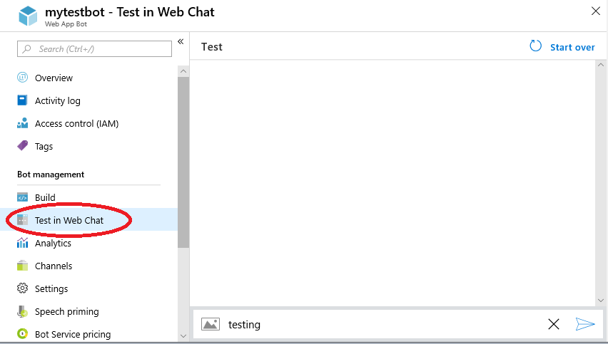

# Troubleshoot bot configuration issues

The first step in troubleshooting a bot is to test it in Web Chat. This will allow you to determine if the problem is specific to your bot (bot doesn't work in any channel) or to a particular channel (bot works in some channels but not others).

## Test in Web Chat

1. Open your bot resource in the [Azure Portal](http://portal.azure.com/).
1. Open the **Test in Web Chat** pane.
1. Send your bot a message.

If the bot does not respond with the expected output, go to [Bot does not work in Web Chat](#bot-does-not-work-in-web-chat). Otherwise, go to [Bot works in Web Chat but not in other channels](#bot-works-in-web-chat-but-not-in-other-channels).

## Bot does not work in Web Chat

There could be a number of reasons why a bot doesn't work. Most likely, the bot application is down and cannot receive messages, or the bot receives the messages but fails to respond.

To see if the bot is running:

1. Open the **Overview** pane.
1. Copy the **Messaging endpoint** and paste it into your browser.

If the endpoint returns HTTP Error 405, that means the bot is reachable and the bot is able to respond to messages. You should investigate whether your bot [times out](https://github.com/daveta/analytics/blob/master/troubleshooting_timeout.md) or [fails with an HTTP 5xx error](bot-service-troubleshoot-500-errors.md).

If the endpoint returns an error "This site can't be reached" or "can't reach this page", that means that your bot is down and you need to redeploy it.

## Bot works in Web Chat but not in other channels

If the bot works as expected in Web Chat but fails in some other channel, possible reasons are:

- [Channel configuration issues](#channel-configuration-issues)
- [Channel-specific behavior](#channel-specific-behavior)
- [Channel outage](#channel-outage)

### Channel configuration issues

It's possible that channel configuration parameters have been set incorrectly or have changed externally. For example, a bot has configured the Facebook channel for a particular page and the page was later deleted. The simplest solution is remove the channel and redo the channel configuration anew.

The links below provide instructions for configuring channels supported by the Bot Framework:

- [Cortana](bot-service-channel-connect-cortana.md)
- [DirectLine](bot-service-channel-connect-directline.md)
- [Email](bot-service-channel-connect-email.md)
- [Facebook](bot-service-channel-connect-facebook.md)
- [GroupMe](bot-service-channel-connect-groupme.md)
- [Kik](bot-service-channel-connect-kik.md)
- [Microsoft Teams](https://docs.microsoft.com/microsoftteams/platform/concepts/bots/bots-overview)
- [Skype](bot-service-channel-connect-skype.md)
- [Skype for Business](bot-service-channel-connect-skypeforbusiness.md)
- [Slack](bot-service-channel-connect-slack.md)
- [Telegram](bot-service-channel-connect-telegram.md)
- [Twilio](bot-service-channel-connect-twilio.md)

### Channel-specific behavior

Implementation of some features can differ by channel. For example, not all channels support Adaptive Cards. Most channels support Buttons, but they are rendered in a channel-specific way. If you see differences in how some message types work in different channels, consult the [channel reference](bot-service-channels-reference.md).

Below are some additional links that can help with individual channels:

- [Add bots to Microsoft Teams apps](https://docs.microsoft.com/microsoftteams/platform/concepts/bots/bots-overview)
- [Facebook: Introduction to the Messenger Platform](https://developers.facebook.com/docs/messenger-platform/introduction)
- [Principles of Cortana Skills design](https://docs.microsoft.com/cortana/skills/design-principles)
- [Skype for Developers](https://dev.skype.com/bots)
- [Slack: Enabling interactions with bots](https://api.slack.com/bot-users)

### Channel outage

Occasionally, some channels might have an interruption of service. Usually, such outages don't last long. However, if you suspect an outage, consult a channel web site or social media.

Another way to determine if a channel has an outage is to create a test bot (such as a simple Echo Bot) and add a channel. If the test bot works with some channels but not others, that would indicate that the problem is not in your production bot.

## Additional resources

See how-to [debug a bot](bot-service-debug-bot.md) and the other debugging articles in that section.