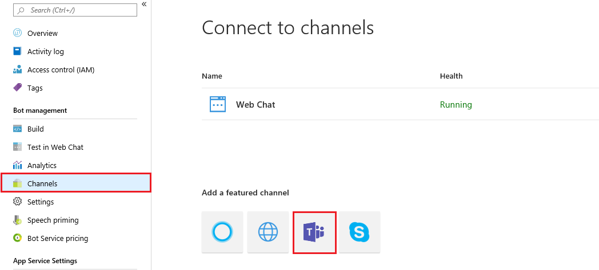
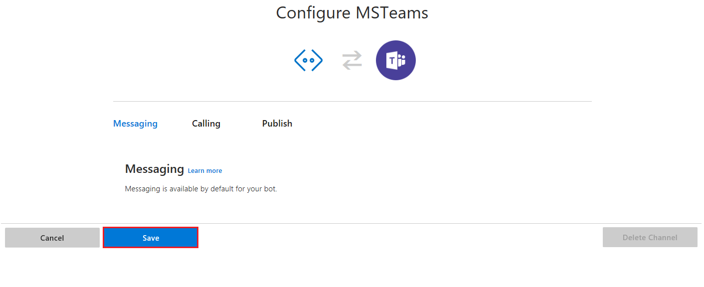
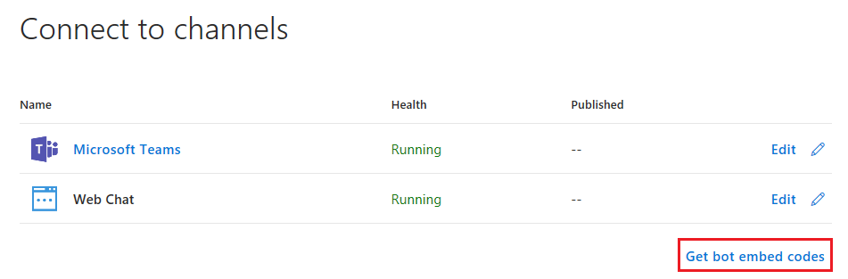

# Connect a bot to Teams

To add the Microsoft Teams channel, open the bot in the [Azure portal](https://portal.azure.com), click the **Channels** blade, and then 
click **Teams**.

Next, click **Save**.

After adding the Teams channel, go to the **Channels** page and click on **Get bot embed code**.

Only copy the **https** part of the code. For example, `https://teams.microsoft.com/l/chat/0/0?users=28:b8a22302e-9303-4e54-b348-343232`. In the browser, paste this address. You'll be prompted to use the Microsoft Teams client app or the web version. Choose the version that you use, and after the bot is added to Teams, you should be able to see the bot listed as a contact that you can send messages to and recieves messages from. 

## Additional information
For Microsoft Teams specific information, see [Teams documentations](https://docs.microsoft.com/en-us/microsoftteams/platform/overview). 
