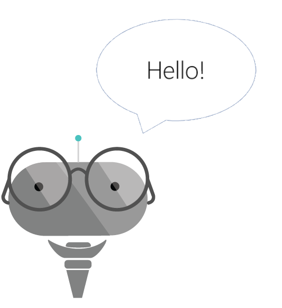

# Bot Design Center - Saying Hello

##First impressions matter

The first interaction between the user and bot is critical to the user experience. Developers should keep in mind that there is more to that first message than just saying “hi”. When you build an app, the first screen is usually where the key navigation cues are given: Your will tell the user where the menu is, maybe give some cues on how it works, where to go for help, information about its privacy policy and so on. Now switch from app to a bot and we still have the same user hoping to get access to the same kind of information. In other words, just saying “Hi user” won’t be enough.

So what is that a bot needs to tell the user upfront?

Let us compare these two designs:

Example 1:

Example 2:

Starting the bot with an open ended question such as “How can I help you?” is usually a bad idea. If your bot has a hundred different things it can do, chances are users won’t be able to guess the vast majority of them. Your bot didn’t tell them what it can do, so how can they possibly guess? 

For decades, developers have used a simple solution to that problem: Menus. Turns out, breaking down the available options into some sort of menu is still a great idea. First, it mitigates the basic discoverability problem. Second, it spares the user from having to type too much: They can just click which is always faster. As an additional benefit, it can significantly simplify your natural language models.

	Tip: Menus are your friend. Don’t dismiss them as not being “smart enough”

Beyond the basic navigation, there are things you should tell the user. Again, no different than an app or a website, if your bot collects personal data from the user, that is something you should be telling them about. This is where your bot should have some information about terms and privacy on web pages and offer the user a link to that data. In fact, the [Bot Framework registration portal](https://dev.botframework.com/) already offers a place for you to add links to your terms and conditions to be associated with your bot. 

	Tip: Tell the user upfront about your policies and what you will be doing with their personal information

