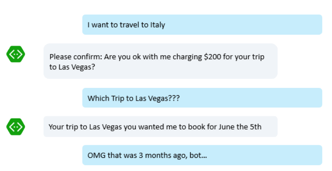

# Bot Design Center - Navigation

##Where am I?

Great navigation is all about making it easy for users to discover and navigate to and from the features of your app, whether your app is a website, mobile app, or a bot. 

Websites have links, navigation headers, breadcrumbs, and the back button built into every browser. Mobile apps have content you can tap to navigate and back buttons to navigate back. These known paradigms help navigation by helping users with:
* Discoverability - On screen content communicates the features of the website or app.
* Wayfinding - Users know that if they click on something, they can always get back easily, so they feel so they feel free to explore.

Enter bots and we're now in a whole new world where those simple, tested and validated design elements for keeping the user aware of what they can do, where they are, how they got there, and how they get back haven't been widely established. Yet. 

With bots, there is no UI unless the bot adds it to the conversation. How is discoverability and navigation accomplished in the conversation? How do we ensure that a user doesn't get lost in the conversation? Can a user navigate "back" in a chat? How does the user go to the "main menu"? How do we "cancel" an operation?

Let's look at some common design elements that provide great bot navigation by promoting discoverability and wayfinding. We'll also look at common traps of conversational interfaces (bot "personality disorders") and how these design elements overcome them.

##Navigation Menu

From the Saying Hello topic, a Root Dialog can show a dialog with buttons for your bot's top level feature areas. These buttons drive discoverability by making it clear what features your bot supports. 

Your bot might have more features than what can fit on this initial dialog, but you can provide more features in dialogs later on in the conversation. The Root Dialog will give your users an idea where to start.

Let's look at the bot "personality disorder" this solves.

###The "Mysterious Bot"

Imagine this scenario:

This bot starts off the conversation by asking an open ended question from the Root Dialog. The user doesn't know what features the bot supports (or doesn't support) and is left guessing what to say in the conversation to use the bot. No cue is being given, at all. 

##Navigation Global Handlers

From the Global Handlers topic, bots can provide global messages that the bot can react to from any dialog anywhere in the conversation. These global message handlers are a great way to promote navigation via wayfinding. Introducing these global messages in your Root Dialog make it easy for users to understand how they can use them to navigate your bot. For example, a 'Cancel' message can cancel the current dialog and return the user to the Root Dialog. A 'Help' command could show you a dialog with buttons for canceling the current dialog and navigating to another in your bot.

	TODO: Add image of dialog above with description of cancel command.

In this bot, the user can use the simple 'Cancel' command to return back to the Root Dialog and start over.

	TODO: Add an image of the user using the cancel command.

Let's look at some of the bot "personality disorders" these global message handlers can solve.

###The "clueless bot"

Imagine this scenario:

In this scenario, the user doesn't know what code the bot is asking for and needs help. The users's reply, "Help?", is a valid string. The prompt doesn't know the difference so it can't reject it. Now of course we could simply code a check for a few keywords after that and see whether the user is asking for things like "help", "cancel" or one of those basic navigation operations.

But the problem would be having to do this for every little question in every single dialog everywhere in the bot. Trust us on this one: You just don't want to have to do that.

Global Message Handlers provide a way to add these global messages to every dialog in the bot in a single place. 

##Back Commands and Buttons

Often, your bot will ask the user to make decisions that will control the flow of the conversation and future dialogs. When this is part of your design, provide a button or global message handler ('Back') that allows the user the opportunity to go back and change a previous decision to take the conversation in another direction.

	TODO: Image of user making a choice, seeing a new dialog with back button, going back, changing choice, seeing a different new dialog. One way vs. round trip flight?

Let's look at the bot "personality disorder" this can solve can solve.

###The "Stubborn Bot"

Imagine this scenario...

	TODO: Image of bot asking question, one way vs. round trip, user trying to go back to change to round trip. Can only cancel, can't go back.

In this situation...

##End of Navigation

##The "stubborn bot" - Doesn't this belong in the dialogs section?

Imagine this scenario:

It is easy to imagine how an user could get very frustrated with this scenario. Users change their minds, they cancel things. They want to start over. It is a common mistake to build a dialog in such a way that it doesn't take into account that possibility and instead just keeps retrying the same question, over and over again.

Of course there are many ways to overcome this problem, but we will focus on the simplest one. The next topics further in this page will discuss more advanced solutions that may also be applied here. 

So the simplest way to stop a bot from ending in a loop asking the same question over and over again is simply to use prompts with specific retry attempt numbers:

In C#:

	PromptDialog.Choice(context, this.OnOptionSelected, new List<string>() { 
		FlightsOption, HotelsOption 
	}, "Are you looking for a flight or a hotel?", "Not a valid option", 3);

In Node:

	builder.Prompts.choice(session,'Are you looking for a flight or a hotel?',
		[Flights.Label, Hotels.Label],
        {
        	maxRetries: 3,
            retryPrompt: 'Not a valid option'	
		});

In this case we are not trying to do anything smart in terms of detecting whether the user is asking us explicitly to stop, but at least we will give up on retrying the same question after a given number of attempts. So the "stubbornness" is healed!

##The "captain obvious bot" - Does this belong in proactive messages topic?

Imagine this scenario:

	TODO: describe this one

##The "bot that can't forget" - Does this belong in the state topic? If user provides updated state, replace it in the query/dialog?

Imagine this scenario:

	TODO: describe this one

