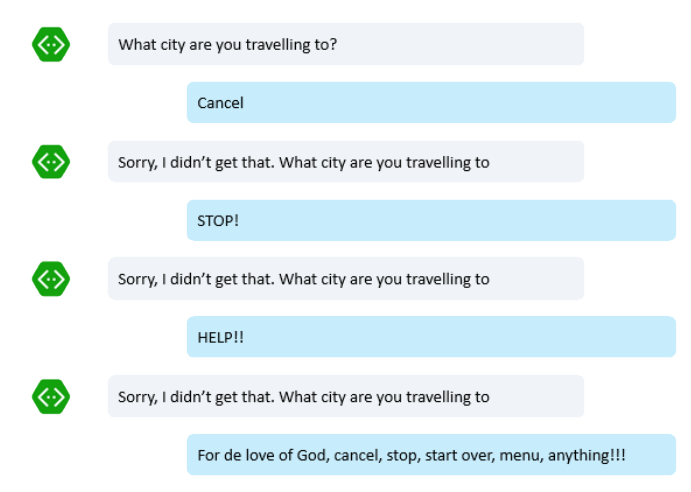
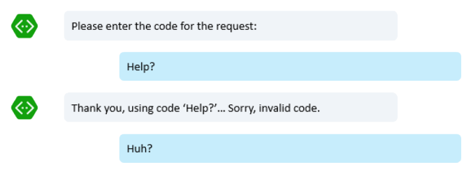

# Bot Design Center - Navigations

##Where am I?

Websites have breadcrumbs, apps have menus, web browsers offer buttons to navigate forward and back and so on. Enter bots and we are now in a whole new world where those simple, tested and validated solutions for keeping the user aware of where they are haven't been widely established yet.

How do we ensure that a user doesn't get lost in a conversation with a bot? Can a user navigate "back" when using a bot? How to go back to the "main menu"?

Let us look at some common traps of conversational interfaces and how to overcome them. We will do that by describing some "personality disorders" that bots often display:

##The "stubborn bot"

Imagine this scenario:

It is easy to imagine how an user could get very frustrated with this scenario. Users change their minds, they cancel things. They want to start over. It is a common mistake to build a dialog in such a way that it doesn't take into account that possibility and just retries, over and over again.

Of course there are many ways to overcome this problem, but we will focus on the simplest way. The next issues will discuss more advanced solutions that can also be applied here. So the simplest way to stop a bot from end in a loop asking the same question over and over again is simply by using prompts with specific retry attempt numbers:

In C#:

	PromptDialog.Choice(context, this.OnOptionSelected, new List<string>() { 
		FlightsOption, HotelsOption 
	}, "Are you looking for a flight or a hotel?", "Not a valid option", 3);

In Node:

	builder.Prompts.choice(session,'Are you looking for a flight or a hotel?',
		[Flights.Label, Hotels.Label],
        {
        	maxRetries: 3,
            retryPrompt: 'Not a valid option'	
		});

In this case we are not trying to do anything smart in terms of detecting whether the user is asking us explicitly to stop, but at least we will give up on retrying the same question after a given number of attempts. So the "stubbornness" is healed!

##The "clueless bot"

Imagine this scenario:

This scenarios is similar to the previous one, but a little more complex: In this case "Help!" is a valid string. The prompt doesn't know the difference so it can't reject it. Now of course we could simply code a check for a few keywords after that and see whether the user is asking for help, cancel or one of those basic navigation operations.

But the problem would be having to do this for every little question in every single dialog everywhere in the bot. You just don't want to have to do that.

In such cases we would add "catch all" handlers that will intercept those key phrases and words such as "cancel", "help", "start over" and whatever else you feel appropriate - or even more complex natural language phrases if that applies to your scenario - and then individual dialogs and prompts could just safely ignore these. In a typical web application it isn't uncommon to use global http filters that would handle, for example, requests for specific sub-folders or file extensions. A similar concept here applies:

	TODO: Add code from Chris

##The "mysterious bot"

Imagine this scenario:

Now it is difficult to guess what is happening with this bot. Maybe it is having an outage. It may be "stuck" somewhere. Or and perfectly common, it might just be taking a while to answer. But not replying to the user is still not a great idea. The user in this case has no idea what is going on, whether they need to repeat the same question, how to cancel/start over... No cue is being given, at all.

There are a few things we can do to help here. 

(to be continued, I'm tired...)