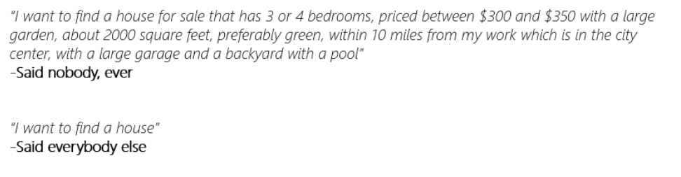
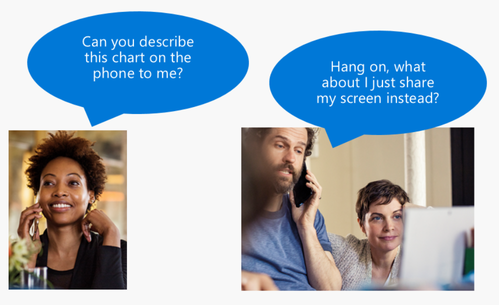
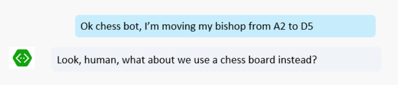
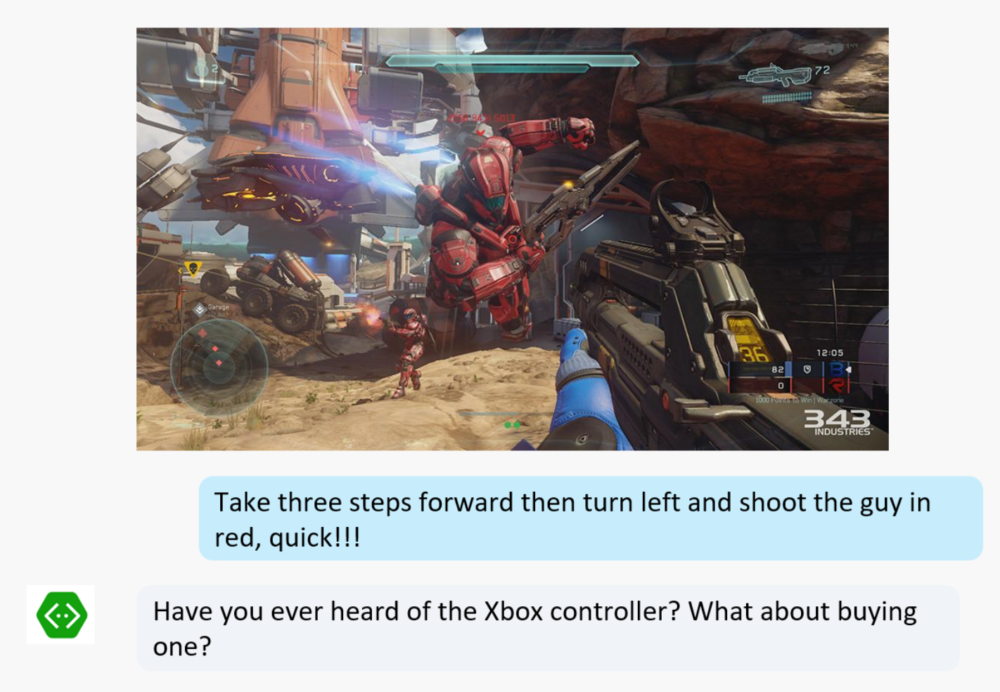
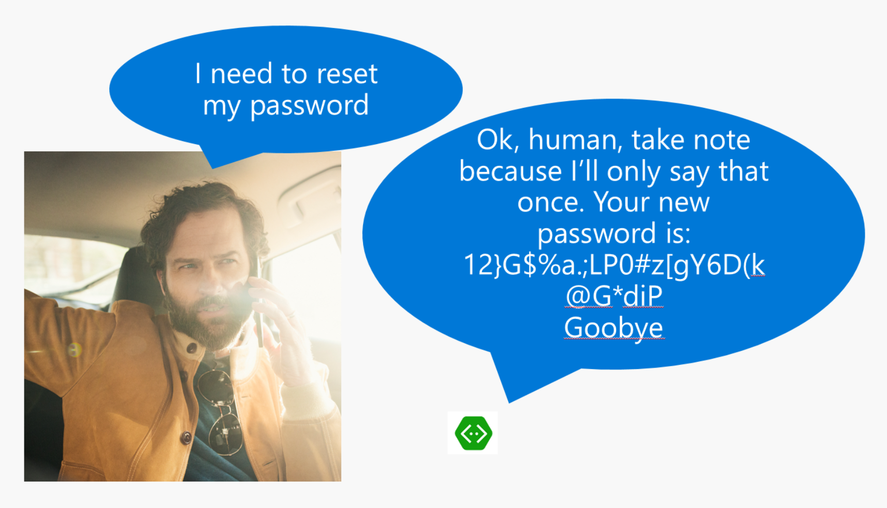

# Bot Design Center - UX Elements

##Buttons, language and speech

Bots typically rely on one or more of these 3 elements as their way of exchanging information with users:

- Rich user controls: Often named "cards" (but not necessarily restricted to just cards), bots can mimic apps (or even run embedded in those apps) by using well-known controls such as buttons, images, carousels and menus. When embedded in a custom app or website they can even go further and represent virtually any UI control by leveraging the power of the app hosting them.
- Text and often, natural language: Bots can allow free text input from users and use natural language understanding APIs such as [LUIS.ai](https://www.luis.ai) to understand what the user is asking for. Note that not all text input has to be a natural language input: Many bots accept commands instead and use simple mechanisms such as regex in order to parse them. This is perfectly acceptable in many scenarios.
- Speech: Some bots leverage speech input and/or output as part of their experience. They may even run on devices that won't have a keyboard or a monitor, which leaves them with speech as the only option for communicating with the user.

##Rich user controls

For decades application and website developers have relied on UI controls in order to enable users to interact with their applications. These UI controls, it turns out, work very well. A very common mistake by beginner bot developers is to dismiss the value of these elements as not being "AI enough". Again, let us recap [what we discussed earlier](../#what-makes-a-bot-great): Success for your bot is not to beat the Touring Test, but instead solve your user's needs in the best/quickest possible way. Whether such solution uses AI or a simple button isn't relevant at all. 

Skype, Slack, Microsoft Teams, Facebook Messenger, Slack and other channels are all investing in different ways developers can inject visual controls into the conversation. Buttons are probably the most common case: Whenever a simple choice is presented to a user, buttons tend to work great: Clicking at a button named "Hotels" is easier and quicker than making the user type "Hotels" instead. This becomes even more relevant on mobile devices: Typing a lot on a mobile device isn't what we can consider a very low friction experience. 

Because of that, when designing a bot we typically recommend developers to start with UI controls where they can solve the problem. Add other elements later where just those controls aren't enough anymore. Interestingly, developers at first tend to start with natural language. In our experience, this typically does not work very well, because it leads to over-complexity in some areas. 

##Text and natural language

Text and natural language are very common elements used by bots. In fact, they may be the most popular elements, which is a problem: It isn't uncommon to see developers relying on natural language for solving problems that can be better solved in other ways. We will discuss examples of that along these articles in different areas.

The first important aspect to highlight is that text input is not necessarily natural language input: We may or may not want users to type free form text that needs to be parsed by a natural language API, or even if they do type free form text, a natural language API may not be the right tool to use in that particular scenario for handling such input.

As far as text input goes, there are many different types of input we can expect from an user:

- Users may be just answering a very specific question, such as "What is your name?". The answer may be just the name, such as "John" or a sentence, such as "My name is John". The more guided the question is, the less free form text we are to expect in the answer. An example would be asking the user "How are you feeling?". This is a very broad, open ended question. Understanding all the permutations of answers a user can give to such a question is a very complex task. By the other hand, the bot could ask very specific questions such as "Are you feeling pain, yes/no?", "Where are you feeling pain, chest/head/members?". Those lead to more specific answers and therefore less need for actual natural language understanding. This is a common strategy bots use to get the answer they need. Remember: Users don't know what specific information your bot needs unless your bot if very clear about what it needs to know. 
- Users may be typing specific commands. For example, an operations bot that helps developers to manage virtual machines could have a very simple command based syntax. Commands such as "/STOP VM XYZ" or "/START VM XYZ" would not only be easy to learn by such users but actually preferred over natural language forms such as "Could you please start the virtual machine XYZ?". Hardly this sort of technical user would prefer to type so much in order to get the same desired result. 
- User may be asking general questions in a knowledge base or questions and answers bot. Again, these are likely not going to be solved by natural language or at least not by natural language alone. Imagine a bot that looks at thousands of documents and is able to answer questions based on the content of such documents. Trying to train a natural language API for all the permutations of possible questions users could come up with in such a scenario is a task deemed to failure. You will never be able to realistically predict all these questions and the amount of time required to train any natural language API that way is just unpractical. Instead, there are technologies built with search in mind, capable of handling that in a much better way. Two of these technologies are [QnA Maker](https://qnamaker.ai) and [Azure Search](https://azure.microsoft.com/en-us/services/search/). We discuss these in details in our [Knowledge Base section](../capabilities/kb.md). So if you are building a bot that is supposed to answer questions based on structured or unstructured data from databases, web pages or documents, you should definitely take a look at that session before trying to solve the problem with natural language.
- Users may actually be typing simple requests based on natural language. Anything from "I want a pepperoni pizza" to "Are there any vegetarian restaurants within 3 miles from my house open now?" are examples of that. This is where natural language APIs such as [LUIS.ai](https://www.luis.ai) shine: They will extract the key components of that text and give it to your bot. So your bot will know that the "intent" of the question is "FindRestaurant", the "Entity" named "distance" is "3 miles", the "Entity" named "reference" is "my house" and the "Entity" named "condition" is "open now". It is important though to be careful with expectations:

A common mistake when bot developers build natural language models is assuming users will just magically tell the bot every little thing it needs to know, right away. Unfortunately this isn't how humans communicate: They will give us fragments of information. "I want to buy a house", which is a very broad question, far from enough for us to narrow down to a specific criteria. The solution to this problem is to ask follow up questions, guide the user. Again, users won't guess what your bot needs to know if you bot doesn't specifically ask for it. 

##Speech

Speech recognition and text to speech are fascinating technologies. It is natural to expect bot developers wanting to leverage them in their scenarios. Speech allows bots to exist where traditional applications wouldn't stand a chance: From a phone line call to hardware devices with no screens or keyboards. Speech can truly be everywhere.

But as discussed before, it is absolutely critical to think about user experience first and consider whether speech does or does not make sense. Understanding the strengths and weaknesses of speech as an option for bots is very important.

Benefits of speech:

- It can be everywhere: Users without even smart phones can dial a number that is answered by a bot, via voice. Hardware devices without screens can all become devices where speech just works
- It can feel "natural": There is no menu, no setup, no buttons.
- It can assist other UI elements: A bot may be displaying a chart, but also explaining the key points of that chart via speech.
- Sometimes, speech is the only option: A user who is driving a car simply can't type. This is why bots have been so widely discussed in automotive scenarios. Speech is also fundamental for users who are visually impaired: Applications that work seamlessly with a UI or purely with speech are fantastic ways of democratizing technology for those who can't make sure of traditional user interfaces.

Weaknesses of speech:

- There is only so much information you can send/receive via speech: Try to describe a detailed chart or deliver most game interfaces and this becomes obvious. Speech forces the bot to keep the communication to a minimum with the user.
- Is the bot going to work on a noisy environment? Will there be many other users around talking at the same time? Careful: This can easily become a frustrating experience.
- Speech is more prone to error than typing. Typing is more prone to error than clicking at buttons. Assume users will need to correct what they said more often with speech.
- A surprisingly large number of users are just not going to use speech. Many users just don't feel comfortable with it.
- Speech is not the ideal channel for sensitive data. Let's say you need to reset your password by calling a bot which will verify your identity asking a few questions. Maybe you are around other people and don't want to speak out lout your PIN or social security number. Also, once your bot resets your password, how is it supposed to tell you your new one? Surely that won't work via voice only...
- Speech is not necessarily faster: Quite the opposite actually, users may end up spending more time rephrasing and retrying their asks compared to other options

##Which one should I choose?

That is the wrong question :)

Remember: In many cases bots can use these 3 elements combined. You don't need to pick one over another. Imagine a "cooking bot" that helps users with cooking recipes. Users may have their hands busy while cooking, in which case, speech becomes a key element. They can flip pages and ask questions without having to touch the device. But that may not be the case at all and they may actually prefer to touch the screen of a device instead of talking. They may not even be comfortable with speech. Think about it: Your user may not even be able to speak and listen at all. Likewise, as the bot instructs the user about how to cook a given recipe, it would be even better to display a video or some pictures to help explaining what needs to be done.

##Which one is more "natural"

That is also the wrong question :)

None of these communication elements, when isolated from others, can be truly considered "natural". Look at the world around you and how you communicate with others: You likely use gestures, voice and symbols. If you are playing chess with someone, using a chess board is very useful. Playing chess without a board, via voice only, is far from a natural experience to most of us. 

Many people just aren't comfortable talking on the phone. They prefer typing. 

To illustrate this with some humor, imagine these scenarios:

	Tip: There is only so much information you can send via voice only. It is a low bandwidth channel

	Tip: Just natural language doesn't magically make every experience "natural". 
	In many cases, a natural experience requires a combination of inputs, including visual cues,
	buttons, text and maybe speech.

	Tip: Speech implies latency. Don't underestimate how much quicker just pressing a button is in 
	comparison. 
	Users gravitate to the experience that does what they want in the quickest possible way. 

	Tip: Speech may not be a convenient channel when sensitive information is being transmitted.
	Users might not be comfortable with sending and receiving complex and sensitive information 
	such as passwords via speech.  

##OK, which ones would prefer in which scenarios?

Now that is a much better question to ask ourselves: How do users actually behave when presented to these 3 elements and how does that change given different scenarios?

In our experience observing how users end up using different types of bots in different scenarios, there are some patterns to note:

1. Users prefer buttons and rich controls first. They are, by far, the quickest ways to get things done and the most discoverable ones. They tend to start there.
2. As a second option, they will prefer text. Typing isn't as practical as pressing a button, but still useful in many cases. But be careful with the conditions: Typing on a mobile device is harder than on a keyboard. Some users will abbreviate a lot of expressions, which makes it harder to use natural language APIs to parse what they are saying
3. Speech is typically preferred when typing is just not an option: The user may be using a "personal trainer bot" with buttons and text, but if such user decides to go for a run, then all they will be willing to use is the bluetooth earbud to communicate with the bot. They may have a weather bot they typically type with, but when driving their car they would rather just use voice. 

Again, these 3 options aren't mutually exclusive. They can all be used together and we tend to prefer when that is possible. Still, even when the 3 options are all available, we observe the pattern above to repeat itself often.

 

