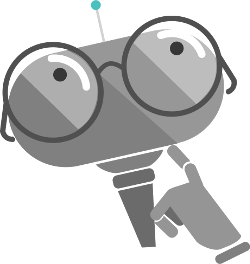

# Bot Design Center

##So you want to build a bot…

There is a great momentum around bots. Developers from all kinds of companies are looking at how to build great, compelling bot experiences to solve a variety of business problems.

While both in the web and app worlds there are many well-established best practices around design principles such as navigation and how content should be presented, the whole bot industry is relatively young and many of these best practices are being defined as things evolve. Therefore this section shouldn’t be seen as a single truth of how to design bots but rather an informal, always evolving discussion. We are basically saying: “Hey, here’s what we’ve learned so far doing these things. Come back tomorrow and we might have some new learnings to share”. We hope that, by sharing what developers tell us about what does or doesn't work in this space, we will be helping other developers who are starting to explore this path and save them a significant amount of time in their early stages of bot building.

##What makes a bot “great”?

If you are building a bot, regardless of the scenario you have at hand, it is safe to assume that you are expecting users to use it. It is also safe to assume that you are hoping that these users will prefer this experience over the alternatives, whether they are apps, websites, making phone calls or whatever other possible way they could use to solve that particular problem. In other words, your bot is competing for that user’s time against things like apps or websites (it can also, of course, be part of those apps and websites in the hope that it will improve these existing experiences).

But how can we tell if a bot has great chances of succeeding at that ultimate goal of bringing/keeping users?

###Factors that <u>do not</u> guarantee successful bots:

- How “smart” a bot is: Unless the specific goal of your bot is to beat the [Turing Test](https://en.wikipedia.org/wiki/Turing_test "Turing Test"), it is unlikely that just making it smarter will guarantee happy users and adoption of your platform. In reality, many bots have little advanced machine learning or natural language capabilities. They may, of course, have those if it is necessary for solving the problems they are supposed to solve. But make no assumptions: How “smart” the bot is does not guarantee user adoption by any means.

- How much natural language it supports: Your bot can be great at conversations. It can have a vast vocabulary and can even make great jokes. But unless it is solving the problems your users need to get solved, this may do very little to make your bot successful. In fact, some bots have no conversational capability at all. And that may be perfectly fine.

- Voice: Many developers assume that enabling bots for speech will lead to great experiences. This isn’t always the case. Actually, forcing users to use voice can very easily turn into a frustrating experience. As you design a bot, always ask if voice is really the right channel for the given problem. Is there going to be a noisy environment? Is voice going to be enough for the kind of information that needs to be shared with the user? It may be, but in many cases, it won’t.

###Ok, so what does make a bot great?

If you ask any experienced app or website developer what makes their apps and websites great, it usually comes down to one thing: User experience.
It turns out that didn’t change because of bots. The key factor, the only thing we should be laser focused on when designing and building any bot is this: What is the user experience going to be?

Examples:

- Does the bot easily solve the user’s problem with the minimum number of steps?

- Does the bot solve the user’s problem better/easier/faster than any of the alternative experiences?

- Does the bot run on the devices and platforms the user cares about?

- Is the bot discoverable? Do the users naturally know what to do when using it?

Note that none of these things directly relates to how smart, how much natural language, whether the bot uses machine learning or which programming language was used. Simply put: Users won’t care. They will, though, care a lot if your bot makes them type too much, talk too much, repeat what they want several times or have to explain things the bot should automatically know already.

> [!TIP]
>User experience is everything. That doesn't change whether you are building a bot, an app or both.

Whenever you are not sure about the right design approach, we suggest you to step back and forget that you are building a bot: How would you solve that problem in an app or a website?

Likely the answer won’t be far from that, simply because decades of learned lessons around building great UX aren’t going to be thrown away simply because we are now building bots instead. If you are a developer with plenty of experience designing great user experiences on web or apps, here’s the great news: That experience does count, a lot, when building bots.

Trust your instincts. If something feels like it doesn’t make sense, then it probably doesn’t.
