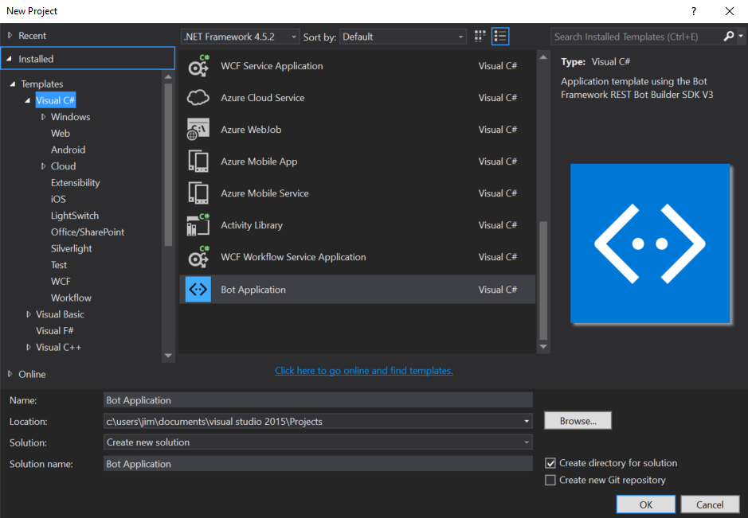
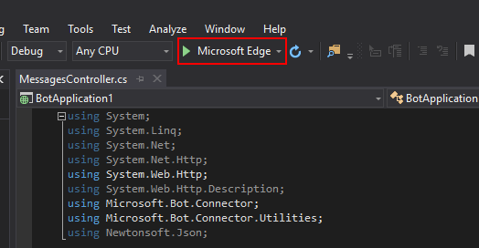
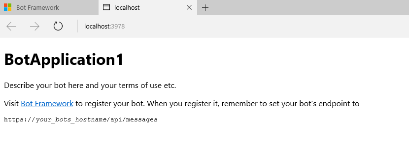

# Create a bot with the Bot Builder SDK for .NET
> [!div class="op_single_selector"]
> - [.NET](../dotnet/bot-builder-dotnet-quickstart.md)
> - [Node.js](../nodejs/bot-builder-nodejs-quickstart.md)
> - [Bot Service](../bot-service-quickstart.md)
> - [REST](../rest-api/bot-framework-rest-connector-quickstart.md)

The <a href="https://github.com/Microsoft/BotBuilder" target="_blank">Bot Builder SDK for .NET</a> is an easy-to-use framework for developing bots using Visual Studio and Windows. The SDK leverages C# to provide a familiar way for .NET developers to create powerful bots.

This tutorial walks you through building a bot by using
the Bot Application template and the Bot Builder SDK for .NET,
and then testing it with the Bot Framework Emulator.

> [!IMPORTANT]
> The Bot Builder SDK for .NET currently supports C#. Visual Studio for Mac is not supported.

## Prerequisites

Get started by completing the following prerequisite tasks:

1. Install <a href="https://www.visualstudio.com/downloads/" target="_blank">Visual Studio 2017</a> for Windows. 

2. In Visual Studio, <a href="/visualstudio/extensibility/how-to-update-a-visual-studio-extension" target="_blank">update all extensions</a> to their latest versions.

4. Download the [Bot Application](http://aka.ms/bf-bc-vstemplate), [Bot Controller](http://aka.ms/bf-bc-vscontrollertemplate), and [Bot Dialog](http://aka.ms/bf-bc-vsdialogtemplate) .zip files. Install the project template by copying `Bot Application.zip` to your Visual Studio 2017 project templates directory. Install the item templates by copying `Bot Controller.zip` and `Bot Dialog.zip` to your Visual Studio 2017 item templates directory.

> [!TIP]
> The Visual Studio 2017 project templates directory is typically located at `%USERPROFILE%\Documents\Visual Studio 2017\Templates\ProjectTemplates\Visual C#\` and the item templates directory is at `%USERPROFILE%\Documents\Visual Studio 2017\Templates\ItemTemplates\Visual C#\`

## Create your bot

Next, open Visual Studio and create a new C# project. Choose the Bot Application template for your new project.

> [!NOTE]
> Visual Studio might say you need to [download and install IIS Express](https://www.microsoft.com/en-us/download/details.aspx?id=48264). 

By using the Bot Application template, you're creating a project that already contains all of the
components that are required to build a simple bot, including a reference to
the Bot Builder SDK for .NET, `Microsoft.Bot.Builder`. Verify that your project
references the latest version of the SDK:

1. Right-click on the project and select **Manage NuGet Packages**.
2. In the **Browse** tab, type "Microsoft.Bot.Builder".
3. Locate the `Microsoft.Bot.Builder` package in the list of search results, and click the **Update** button for that package.
4. Follow the prompts to accept the changes and update the package.

Thanks to the Bot Application template,
your project contains all of the code that's necessary to create the bot in this tutorial. You won't actually need to write any additional code.
However, before we move on to testing your bot,
take a quick look at some of the code that the Bot Application template provided.

## Explore the code

First, the `Post` method within **Controllers\MessagesController.cs** receives the message from the user and invokes the root dialog.

[!code-csharp[MessagesController code sample C#](../includes/code/dotnet-getstarted.cs#MessagesController)]

The root dialog processes the message and generates a response. The `MessageReceivedAsync` method within **Dialogs\RootDialog.cs** sends a reply that echos back the user's message, prefixed with the text 'You sent' and ending in the text 'which was *##* characters', where *##* represents the number of characters in the user's message.

[!code-csharp[RootDialog code sample C#](../includes/code/dotnet-getstarted.cs#RootDialog)]

## Test your bot

[!include[Get started test your bot](../includes/snippet-getstarted-test-bot.md)]

### Start your bot

After installing the emulator, start your bot in Visual Studio by using a browser as the application host.
This Visual Studio screenshot shows that the bot will launch in Microsoft Edge when the run button is clicked.

When you click the run button, Visual Studio will build the application, deploy it to localhost,
and launch the web browser to display the application's **default.htm** page.
For example, here's the application's **default.htm** page shown in Microsoft Edge:

> [!NOTE]
> You can modify the **default.htm** file within your project
> to specify the name and description of your bot application.

### Start the emulator and connect your bot

At this point, your bot is running locally.
Next, start the emulator and then connect to your bot in the emulator:

1. Type `http://localhost:port-number/api/messages` into the address bar, where **port-number** matches the port number shown in the browser where your application is running.

2. Click **Connect**. You won't need to specify **Microsoft App ID** and **Microsoft App Password**. You can leave these fields blank for now. You'll get this information later when you [register your bot](~/bot-service-quickstart-registration.md).

> [!TIP]
> In the example shown above, the application is running on port number **3979**, so the emulator address would be set to: `http://localhost:3979/api/messages`.

### Test your bot

Now that your bot is running locally and is connected to the emulator, test your bot by typing a few messages in the emulator.
You should see that the bot responds to each message you send by echoing back your message prefixed with the text 'You sent'
and ending with the text 'which was *##* characters', where *##* is the total number of characters in the message that you sent.

> [!TIP]
> In the emulator, click on any speech bubble in your conversation. Details about the message will appear in the Details pane, in JSON format.

You've successfully created a bot by using the Bot Application template Bot Builder SDK for .NET!

## Next steps

In this quickstart, you created a simple bot by using the Bot Application template and the Bot Builder SDK for .NET and verified the bot's functionality by using the Bot Framework Emulator.

Next, learn about the key concepts of the Bot Builder SDK for .NET.

> [!div class="nextstepaction"]
> [Key concepts in the Bot Builder SDK for .NET](bot-builder-dotnet-concepts.md)
