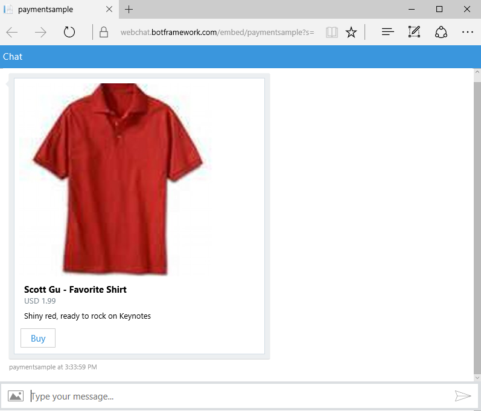
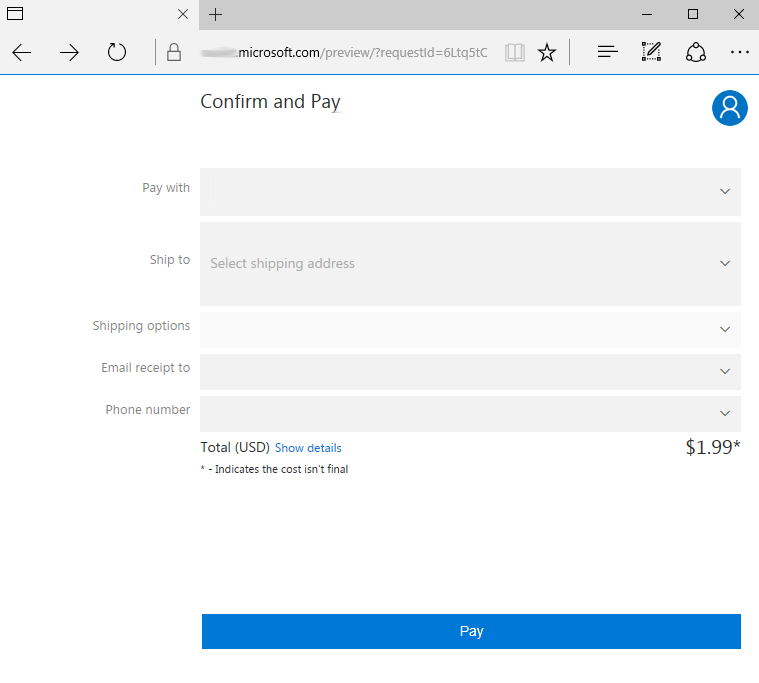

# Request payment

[!INCLUDE [pre-release-label](../includes/pre-release-label-v3.md)]

> [!div class="op_single_selector"]
> - [.NET](../dotnet/bot-builder-dotnet-request-payment.md)
> - [Node.js](../nodejs/bot-builder-nodejs-request-payment.md)

If your bot enables users to purchase items, it can request payment by including 
a special type of button within a [rich card](bot-builder-dotnet-add-rich-card-attachments.md). 
This article describes how to send a payment request using the Bot Framework SDK for .NET.

## Prerequisites

Before you can send a payment request using the Bot Framework SDK for .NET, you must complete these prerequisite tasks.

### Update Web.config

Update your bot's **Web.config** file to set `MicrosoftAppId` and `MicrosoftAppPassword` to the app ID and password values that were generated for your bot during the [registration](~/bot-service-quickstart-registration.md) process. 

> [!NOTE]
> To find your bot's **AppID** and **AppPassword**, see [MicrosoftAppID and MicrosoftAppPassword](~/bot-service-manage-overview.md#microsoftappid-and-microsoftapppassword).

### Create and configure merchant account

1. <a href="https://dashboard.stripe.com/register" target="_blank">Create and activate a Stripe account if you don't have one already.</a>

2. <a href="https://seller.microsoft.com/en-us/dashboard/registration/seller/?accountprogram=botframework" target="_blank">Sign in to Seller Center with your Microsoft account.</a>

3. Within Seller Center, connect your account with Stripe.

4. Within Seller Center, navigate to the Dashboard and copy the value of **MerchantID**.

5. Update your bot's **Web.config** file to set `MerchantId` to the value that you copied from the Seller Center Dashboard. 

[!INCLUDE [Payment process overview](../includes/snippet-payment-process-overview.md)]

## Payment Bot sample

The <a href="https://github.com/Microsoft/BotBuilder-Samples/tree/master/CSharp/sample-payments" target="_blank">Payment Bot</a> sample provides an example of a bot that sends a payment request 
using .NET. 
To see this sample bot in action, you can 
<a href="https://webchat.botframework.com/embed/paymentsample?s=d39Bk7JOMzQ.cwA.Rig.dumLki9bs3uqfWFMjXPn5PFnQVmT2VAVR1Zl1iPi07k" target="_blank">try it out in web chat</a>,
<a href="https://join.skype.com/bot/9fbc0f17-43eb-40fe-bf3b-af151e6ce45e" target="_blank">add it as a Skype 
contact</a> or download the payment bot sample and run it locally using the Bot Framework Emulator. 

> [!NOTE]
> To complete the end-to-end payment process using the **Payment Bot** sample in web chat or Skype, 
> you must specify a valid credit card or debit card within your Microsoft account 
> (i.e., a valid card from a U.S. card issuer). 
> Your card will not be charged and the card's CVV will not be verified, 
> because the **Payment Bot** sample runs in test mode (i.e., `LiveMode` is set to `false` in **Web.config**).

The next few sections of this article describe the three parts of the payment process, 
in the context of the **Payment Bot** sample.

##  Requesting payment

Your bot can request payment from a user by sending a message that contains a 
[rich card attachment](bot-builder-dotnet-add-rich-card-attachments.md) with a button that specifies 
`CardAction.Type` of "payment". 
This code snippet from the **Payment Bot** sample creates a message that contains a Hero card with a **Buy** button that the user can click (or tap) to initiate the payment process. 

[!code-csharp[Request payment](../includes/code/dotnet-request-payment.cs#requestPayment)]

In this example, the button's type is specified as `PaymentRequest.PaymentActionType`, which 
the Bot Builder library defines as "payment". 
The button's value is populated by the `BuildPaymentRequest` method, which returns 
a `PaymentRequest` object that contains information about supported payment methods, details, 
and options. 
For more information about implementation details, see **Dialogs/RootDialog.cs** within the 
<a href="https://github.com/Microsoft/BotBuilder-Samples/tree/master/CSharp/sample-payments" target="_blank">Payment Bot</a> sample.

This screenshot shows the Hero card (with **Buy** button) that's generated by the code snippet above. 
 
 

> [!IMPORTANT]
> Any user that has access to the **Buy** button may use it to initiate the payment process. 
> Within the context of a group conversation, it is not possible to designate a button for use by only 
> a specific user. 

##  User experience

When a user clicks the **Buy** button, he or she is directed to a payment web experience to provide all required payment, shipping, and contact information via their Microsoft account. 

### HTTP callbacks

HTTP callbacks will be sent to your bot to indicate that it should perform certain operations. 
Each callback will be an [activity](bot-builder-dotnet-activities.md) 
that contains these property values: 

| Property | Value |
|----|----|
| `Activity.Type` | invoke | 
| `Activity.Name` | Indicates the type of operation that the bot should perform (e.g., shipping address update, shipping option update, payment complete). | 
| `Activity.Value` | The request payload in JSON format. | 
| `Activity.RelatesTo` |  Describes the channel and user that are associated with the payment request. | 

> [!NOTE]
> `invoke` is a special activity type that is reserved for use by the Microsoft Bot Framework. 
> The sender of an `invoke` activity will expect your bot to acknowledge the callback by sending an HTTP response.

##  Processing callbacks

[!INCLUDE [Process callbacks overview](../includes/snippet-payment-process-callbacks-overview.md)]

### Shipping Address Update and Shipping Option Update callbacks

[!INCLUDE [Process shipping address and shipping option callbacks](../includes/snippet-payment-process-callbacks-1.md)]

### Payment Complete callbacks

When receiving a Payment Complete callback, your bot will be provided with a copy of the initial, unmodified payment request as 
well as the payment response objects in the `Activity.Value` property. The payment response object will contain the final selections 
made by the customer along with a payment token. Your bot should take the opportunity to recalculate the final payment request based on
the initial payment request and the customer's final selections. Assuming the customer's selections are determined to be valid, the bot
should verify the amount and currency in the payment token header to ensure that they match the final payment request.  If the bot 
decides to charge the customer it should only charge the amount in the payment token header as this is the price the customer confirmed. 
If there is a mismatch between the values that the bot expects and the values that it received in the Payment Complete callback, it can 
fail the payment request by sending HTTP status code `200 OK` along with setting the result field to `failure`.   

In addition to verifying payment details, the bot should also verify that the order can be fulfilled, before it initiates payment 
processing. For example, it may want to verify that the item(s) being purchased are still available in stock. 
If the values are correct and your payment processor has successfully charged the payment token, then the bot should respond with HTTP 
status code `200 OK` along with setting the result field to `success` in order for the payment web experience to display the payment 
confirmation. The payment token that the bot receives can only be used once, by the merchant that requested it, and must be submitted to 
Stripe (the only payment processor that the Bot Framework currently supports). Sending any HTTP status code in the `400` or `500` range 
to will result in a generic error for the customer.

The `OnInvoke` method in the **Payment Bot** sample processes the callbacks that the bot receives. 

[!code-csharp[Request payment](../includes/code/dotnet-request-payment.cs#processCallback)]

In this example, the bot examines the `Name` property of the incoming activity to identify the type of 
operation it needs to perform, and then calls the appropriate method to process the callback. 
For more information about implementation details, see **Controllers/MessagesControllers.cs** 
within the <a href="https://github.com/Microsoft/BotBuilder-Samples/tree/master/CSharp/sample-payments" target="_blank">Payment Bot</a> sample.

## Testing a payment bot

[!INCLUDE [Test a payment bot](../includes/snippet-payment-test-bot.md)]

In the <a href="https://github.com/Microsoft/BotBuilder-Samples/tree/master/CSharp/sample-payments" target="_blank">Payment Bot</a> sample, the `LiveMode` configuration setting in **Web.config** determines whether 
Payment Complete callbacks will contain emulated payment tokens or real payment tokens. If `LiveMode` is set to `false`, a header is added to the bot's outbound payment request to indicate that the bot is in test mode, and the Payment Complete callback will contain an emulated payment token that cannot be charged. If `LiveMode` is set to `true`, the header which indicates that the bot is in test mode is omitted from the bot's outbound payment request, and the Payment Complete callback will contain a real payment token that the bot will submit to Stripe for payment processing. This will be a real transaction that results in charges to the specified payment instrument. 

## Additional resources

- <a href="https://github.com/Microsoft/BotBuilder-Samples/tree/master/CSharp/sample-payments" target="_blank">Payment Bot sample</a>
- [Activities overview](bot-builder-dotnet-activities.md)
- [Add rich cards to messages](bot-builder-dotnet-add-rich-card-attachments.md)
- <a href="http://www.w3.org/Payments/" target="_blank">Web Payments at W3C</a> 
- <a href="/dotnet/api/?view=botbuilder-3.11.0" target="_blank">Bot Framework SDK for .NET Reference</a>
